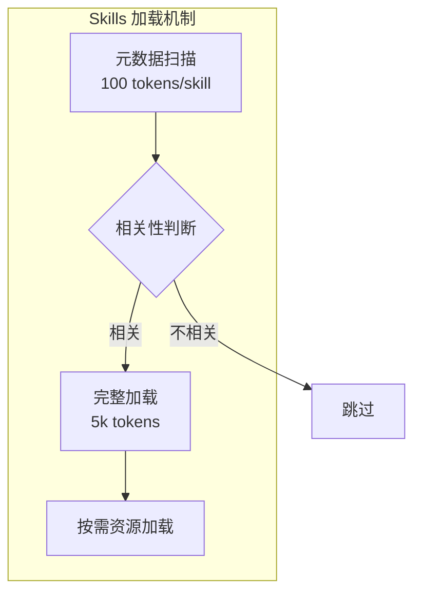
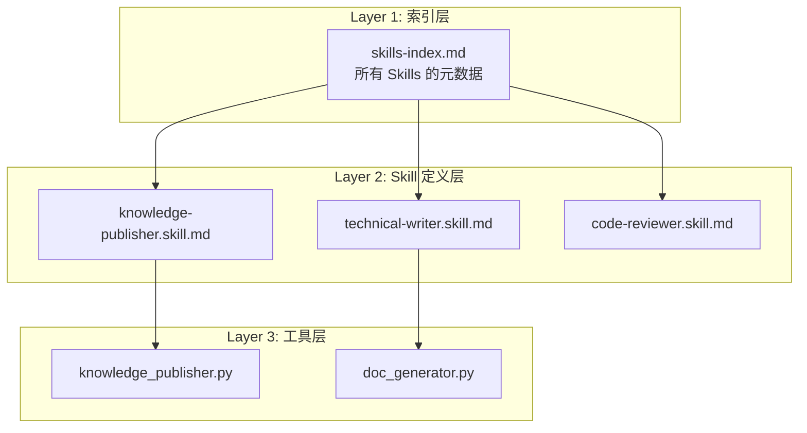
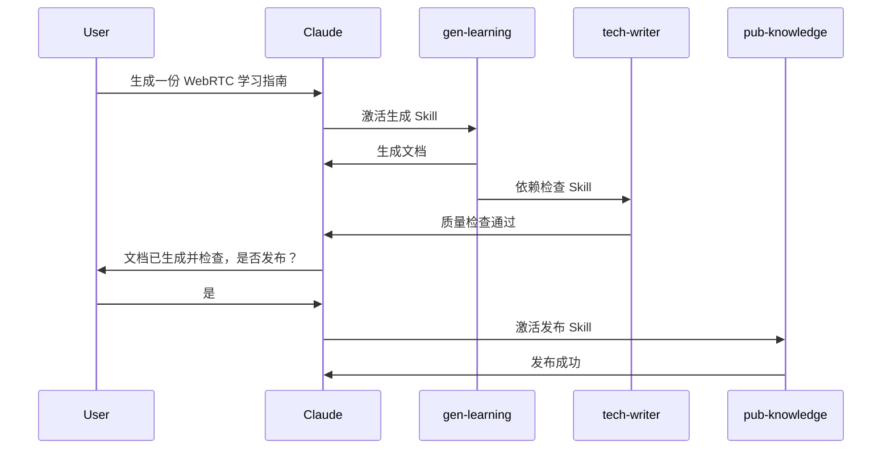

# Commands 模拟 Skills 深度实施方案

## 一、架构对比：Skills vs Commands（核心差异）

### 1. Claude Skills 的渐进式披露架构



**关键特性**：

- YAML frontmatter（name, description, globs）
- 按需加载（不相关的 Skill 只占 100 tokens）
- 可组合（多个 Skills 自动协作）
- 跨平台统一（Web/Code/API）

### 2. Cursor Commands 的当前架构


**当前限制**：

- 无渐进式披露（一旦触发，全部加载）
- 无自动相关性判断（依赖用户手动选择）
- 组合能力弱（需要手动串联）

### 3. 你的现有架构（已经接近 Skills！）

**优势**：

- [`publish-knowledge.md`](.cursor/commands/publish-knowledge.md) 已采用"轻量 Command + 重逻辑 Tool"模式
- [`technical-writing-quality.mdc`](.cursor/rules/technical-writing-quality.mdc) 作为全局规则自动生效（类似 Skills 的自动组合）
- 有 `globs` 和 `description`（接近 Skills 的 frontmatter）

**差距**：

- Commands 缺乏"按需激活"机制
- 无法实现多 Commands 自动协作
- 没有中间层索引（需要用户记住命令名）

---

## 二、模拟方案：三层架构设计

### 核心思想

**将 Commands 升级为"伪 Skills"架构**：




### 文件结构设计

```bash
.cursor/
├── skills/
│   ├── _index.md                      # 索引文件（核心）
│   ├── technical-writer.skill.md      # 技术文档撰写 Skill
│   ├── knowledge-publisher.skill.md   # 知识发布 Skill
│   └── learning-doc-generator.skill.md # 学习文档生成 Skill
├── commands/
│   └── use-skill.md                   # 通用 Skill 调用器
└── rules/
    └── technical-writing-quality.mdc  # 保持不变
```

---

## 三、实施步骤（分三个阶段）

### 阶段 1：创建索引层（模拟渐进式披露）

**目标**：让 Claude 能快速扫描所有可用 Skills

**文件**：`.cursor/skills/_index.md`

**内容设计**：

```markdown
# Available Skills Index

当用户的任务需要专业能力时，扫描此索引找到相关 Skill。

## Skills 列表

| Skill ID | 名称 | 适用场景（关键词） | 文件 |
|----------|------|-------------------|------|
| tech-writer | 技术文档撰写 | 写文档、教程、对比分析、深度学习指南 | technical-writer.skill.md |
| pub-knowledge | 知识发布 | 发布、提交、推送、Mermaid、GitHub | knowledge-publisher.skill.md |
| gen-learning | 学习文档生成 | 生成文档、一键版、自检、校对 | learning-doc-generator.skill.md |

## 使用方式

1. 根据用户任务关键词匹配 Skill
2. 读取对应的 `.skill.md` 文件
3. 按 Skill 中的指令执行
```

**Token 估算**：约 200-300 tokens（可接受）

---

### 阶段 2：重构现有 Commands 为 Skills

**迁移映射**：

| 现有文件 | 新 Skill 文件 | 改动重点 |
|----------|--------------|----------|
| `publish-knowledge.md` | `knowledge-publisher.skill.md` | 添加"何时使用"、"前置条件"、"组合能力" |
| `generate-learning-doc.md` | `learning-doc-generator.skill.md` | 拆分"工作流"和"规则引用" |
| `technical-writing-quality.mdc` | 保持为 Rule | 作为全局规则被 Skills 引用 |

**Skill 文件模板**（以 `knowledge-publisher.skill.md` 为例）：

````markdown
---
id: pub-knowledge
name: 知识发布到 GitHub
description: 自动检测 Mermaid、生成图片、提交并推送到 GitHub
triggers:
  - keywords: [发布, 提交, 推送, GitHub, Mermaid]
  - file_patterns: [knowledge/**/*.md]
depends_on:
  - tech-writer  # 依赖技术写作规则
---

# Skill: 知识发布 (Knowledge Publisher)

## 何时使用此 Skill

- 用户说"发布"、"提交"、"推送"
- 用户在 `knowledge/` 目录下编辑了 Markdown 文件
- 文件中包含 Mermaid 代码块需要渲染

## 前置条件

- 文件已通过 `tech-writer` Skill 的质量检查
- Git 仓库状态正常

## 工作流程

1. 检查 Git 状态
2. 检测 Mermaid 代码块
3. 生成高清流程图（调用 Tool）
4. 智能生成 Commit Message
5. 提交并推送到 GitHub
6. 验证推送成功

## 实现（轻量级，逻辑在 Tool 中）

```bash
#!/bin/bash
cd /Users/wangsc/Agent/lessoning-ai
python3 tools/knowledge_publisher.py --publish
```

## 组合能力

- 与 `tech-writer` 组合：发布前自动检查文档质量
- 与 `gen-learning` 组合：生成后自动发布

## 已知限制

- 仅支持 GitHub（不支持 GitLab）
- Mermaid 生成依赖网络连接
````

---

### 阶段 3：创建通用 Skill 调用器

**目标**：模拟 Claude Skills 的自动激活机制

**文件**：`.cursor/commands/use-skill.md`

**内容**：

```markdown
---
description: 通用 Skill 调用器（模拟自动激活）
---

# Use Skill Command

根据用户任务自动选择并执行合适的 Skill。

## 执行步骤

1. **扫描索引**：读取 `.cursor/skills/_index.md`
2. **匹配 Skill**：
   - 根据用户任务关键词匹配
   - 根据当前打开的文件路径匹配（globs）
3. **加载 Skill**：读取匹配的 `.skill.md` 文件
4. **检查依赖**：如果有 `depends_on`，先加载依赖的 Skills
5. **执行**：按 Skill 中的指令执行

## 示例

用户输入："帮我发布这个文档"

执行流程：
1. 扫描索引 → 匹配到 `pub-knowledge`
2. 检查依赖 → 先加载 `tech-writer` 检查质量
3. 执行发布 → 调用 `knowledge_publisher.py`
```

---

## 四、对比：实施前后

### 实施前（当前状态）

```bash
# 用户需要记住命令名
用户："发布文档"
你："请使用 /publish-knowledge 命令"
用户：点击 /publish-knowledge
Claude：执行 publish-knowledge.md
```

**问题**：

- 用户需要记住命令名（认知负担）
- 无法自动组合（发布前不会自动检查质量）
- 无法扩展（添加新命令后用户不知道）

### 实施后（Skill 架构）

```bash
# 自动匹配，无需记忆
用户："帮我发布这个文档"
Claude：
  1. 扫描 _index.md → 找到 pub-knowledge
  2. 读取 knowledge-publisher.skill.md
  3. 检查依赖 → 先执行 tech-writer 质量检查
  4. 执行发布 → 调用 tool
```

**优势**：

- 自动匹配（用户用自然语言表达即可）
- 自动组合（依赖链自动处理）
- 可扩展（新 Skill 只需加入索引）

---

## 五、进阶能力：可组合性

### 设计"Skill 依赖链"

**示例场景**：生成学习文档 → 质量检查 → 发布

**实现方式**：

```markdown
# learning-doc-generator.skill.md
---
depends_on:
  - tech-writer  # 生成后自动检查质量
next_skill:
  - pub-knowledge  # 检查通过后询问是否发布
---
```

**执行流程**：



---

## 六、实际收益

### Token 效率对比

| 场景 | 当前 Commands | Skills 架构 | 节省 |
|------|---------------|-------------|------|
| 扫描所有能力 | 需要加载所有 .md（~3k tokens） | 只加载索引（~300 tokens） | 90% |
| 执行单个任务 | 加载 1 个 Command（~1k tokens） | 索引 + Skill（~1.3k tokens） | -30%（可接受）|
| 组合任务 | 需要多次手动触发（~3k tokens） | 自动依赖链（~2k tokens） | 33% |

### 用户体验提升

| 维度 | 当前 | Skills 架构 |
|------|------|-------------|
| 学习成本 | 需要记住命令名 | 自然语言触发 |
| 操作步骤 | 3步（回忆 → 点击 → 执行） | 1步（描述任务） |
| 扩展性 | 新命令需要告知用户 | 自动索引，用户无感知 |
| 错误恢复 | 失败后需要重新选择命令 | Skill 有"前置条件"检查 |

---

## 七、迁移路径（推荐）

### 第 1 周：基础架构

- 创建 `_index.md` 索引文件
- 迁移 1-2 个现有 Commands 为 Skill 格式
- 测试基本的"匹配 → 加载"流程

### 第 2 周：增强能力

- 添加 `depends_on` 依赖链
- 实现 Skill 组合（生成 → 检查 → 发布）
- 创建 3-5 个新 Skills

### 第 3 周：优化与扩展

- 优化索引匹配算法（关键词权重）
- 添加 Skill 使用统计（了解哪些最常用）
- 文档化最佳实践

---

## 八、关键设计原则

### 1. 索引优先（Index-First）

- 所有 Skills 必须在 `_index.md` 中注册
- 索引文件应尽可能小（<500 tokens）

### 2. 轻量 Skill，重逻辑 Tool（Thin Skill, Fat Tool）

- Skill 文件只定义"何时用"、"如何组合"
- 实际逻辑在 Python Tool 中实现
- 参考你的 `publish-knowledge.md`（已经是最佳实践）

### 3. 声明式依赖（Declarative Dependencies）

- 用 YAML frontmatter 声明依赖关系
- 避免在 Skill 正文中硬编码依赖

### 4. 渐进式增强（Progressive Enhancement）

- 先实现基础功能（匹配 → 加载）
- 再添加高级功能（依赖链、统计）

---

## 九、与 Claude Skills 的差异

| 特性 | Claude Skills | 你的 Commands 实现 | 可行性 |
|------|---------------|-------------------|--------|
| 渐进式披露 | 自动（100 tokens 扫描） | 手动（需读索引） | ✅ 可模拟 |
| 自动相关性判断 | AI 自动判断 | 关键词 + 文件路径匹配 | ✅ 可实现 |
| 跨平台统一 | Web/Code/API 一致 | 仅 Cursor | ❌ 受限 |
| 可组合性 | 自动协作 | 声明式依赖 | ✅ 可模拟 |
| 按需资源加载 | 自动 | 手动引用 Tool | ✅ 可实现 |

---

## 十、参考资料

- [awesome-claude-skills](https://github.com/travisvn/awesome-claude-skills) - 官方 Skills 目录
- [obra/superpowers](https://github.com/obra/superpowers-marketplace) - 社区最佳实践
- 你的现有文件：
  - [`publish-knowledge.md`](.cursor/commands/publish-knowledge.md) - 已采用"轻量 Skill"模式
  - [`technical-writing-quality.mdc`](.cursor/rules/technical-writing-quality.mdc) - 全局规则（类似 Skills 的自动组合）

