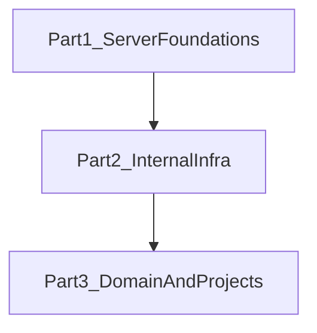
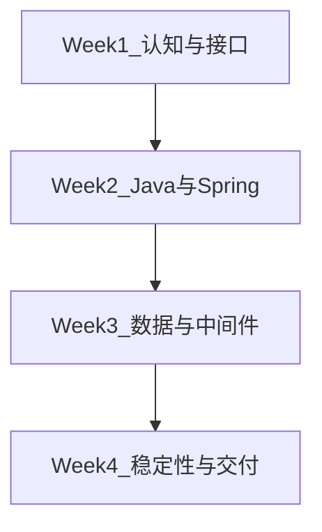

# Agent 化全栈转型学习文档

> **TL;DR**：这套文档不是“后端知识百科”，而是给偏客户端/前端的研发同学准备的一条 **1 个月可完成的服务端上手路径**。第一阶段先把“能直接参与 Java 服务端开发”的能力补齐；第二阶段再补公司内部基础设施；第三阶段再把通用能力落到具体领域和项目。

## 这套文档解决什么问题

团队准备做 Agent 化全栈转型，但如果一开始就把重点放在 Agent 概念、Prompt 技巧或者工具编排上，最后很容易出现一个问题：

- 大家会聊 Agent
- 但对服务端的真实约束不敏感
- 结果是代码能跑，系统不稳，出了问题也不会查

所以这套文档的顺序是刻意设计过的：

1. 先补服务端基础能力
2. 再补公司内部交付环境
3. 最后再补领域知识和项目经验

这背后的核心判断是：**Agent 工程不是绕开服务端工程，而是把服务端工程的约束推到更前面。**

## 总体结构

### Part 1：脱离业务的服务端基础与 Java 工程体系

- 目录：`agent-client/part1-server-foundations/README.md`
- 定位：1 个月内必须学完的必修部分
- 目标：学完后能直接参与 Java 服务端开发
- 建议篇数：`8` 篇必修 + `2` 篇扩展

### Part 2：公司内部基础设施

- 目录：`agent-client/part2-internal-infra/README.md`
- 定位：把“懂通用服务端”过渡到“能在公司环境里稳定交付”
- 篇数：`1` 篇前言 + `6` 篇实操手册
- 能力链：环境搭建 → 工程规范 → 运行时接入 → CI/CD 发布 → 线上观测 → 故障处理

### Part 3：业务领域导航与工程入口

- 目录：`agent-client/part3-domain-and-projects/README.md`
- 定位：不重写领域知识，而是做领域知识的**索引层 + 工程桥接层**
- 与"零一说"的关系：零一说讲"业务是什么"，Part 3 补"作为工程师怎么进入这个领域"
- 三层结构：业务全景地图（1 篇）→ 领域工程入口卡片（每团队 1 页）→ 跨领域共性认知（1-2 篇）

## 1 个月学习节奏

- 第 1 周：建立服务端认知，理解请求链路与接口契约
- 第 2 周：补齐 Java 与 Spring / Spring Boot 核心能力
- 第 3 周：补齐数据、中间件、异步系统的最小闭环
- 第 4 周：补齐稳定性、测试、观测、上线与回顾串联

## 阅读原则

- 先读必修，再看扩展
- 每篇先看 TL;DR，再看机制，再看边界条件
- 不追求一次学全，而要追求“学完可用”
- 每篇都应最终回到一个问题：**我明天能不能拿这部分知识去做服务端需求、看服务端代码、排服务端问题**

## 为什么不把 Agent 放在最前面

一个常见误区是：既然目标是 Agent 化全栈转型，那是不是应该一开始就先学 Agent？

我的判断是否定的。更合理的顺序是：

- 先理解接口、状态、失败、一致性、运行时
- 再理解 Agent 为什么更依赖这些东西

因为对工程团队来说，Agent 不是“更聪明的脚本”，而是一个更依赖契约、观测、测试和边界控制的系统。没有服务端基础，后面的 Agent 工程很容易只剩“会调模型”，却没有稳定交付能力。

## 当前进度

- 总索引：当前文件
- Part 1 目录：`agent-client/part1-server-foundations/README.md`
- Part 1 正文：`agent-client/part1-server-foundations/`（8 篇必修，已完成）
- Part 2 正文：`agent-client/part2-internal-infra/`（1 篇前言 + 6 篇手册，已完成）
- Part 3 结构：`agent-client/part3-domain-and-projects/`（进行中）

## 下一步

- 按“地图 + 卡片 + 共性认知”三层结构，逐步补全 Part 3 各领域内容
- 每个领域的工程入口卡片需要对应团队参与校准
