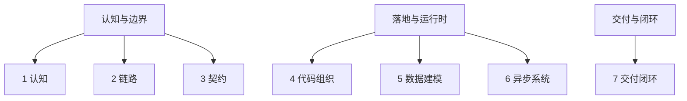

# 服务端工程的方法论：为什么这 7 篇要这样组织

这 7 篇文章放在一起，想回答的不是“Java 服务端要学哪些知识点”，而是一个更底层的问题：**服务端工程为什么天然比功能开发更复杂，而这种复杂性又该如何被管理。**

前 3 篇先讲认知、链路、契约，不是为了绕远路，而是先回答：服务端到底在管理什么，边界到底在哪里。没有这层视角，后面的 `Java`、`MySQL`、`Redis` 都只会变成零散知识点。

中间 3 篇再讲代码组织、数据建模和异步系统，是在回答：这些复杂性最终会落到哪里。它不会停在概念层，而一定会沉淀到代码分层、事务边界、缓存结构和运行时链路里。

最后 1 篇把问题收束到交付闭环：为什么“能跑”并不等于“能交付”。如果没有测试、可观测性、稳定性保护和安全上线，前面的能力都还不完整。

所以，Part 1 不是 7 个技术主题的并列清单，而是一套递进的方法论：先看见复杂性，再理解复杂性落在哪里，最后学会怎样把它稳定地交付出去。服务端工程师真正成熟的标志，也不是会多少组件，而是能不能看见复杂性、承认复杂性，并有能力把它组织起来。
