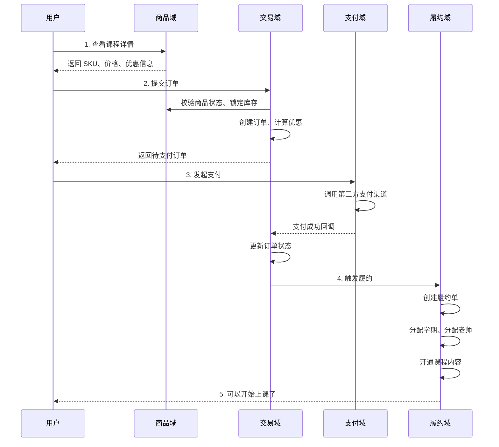
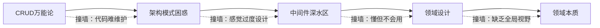
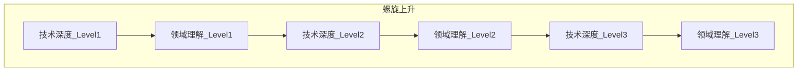

# 服务端认知的五层觉醒：从 CRUD 到领域

> **TL;DR**：服务端不是技术栈的堆砌，而是对业务领域的深度建模。大多数工程师会经历"CRUD 万能论 → 架构模式困惑 → 中间件深水区 → 领域设计 → 领域本质"五个认知阶段。最终你会发现：**领域才是服务端工程师需要掌握的最核心技术**。

---

## 你是不是也这样想过

"服务端不就是 CRUD 吗？Controller 接请求，Service 写逻辑，Storage 存数据，三层架构搞定一切。"

如果你刚开始做服务端，大概率会有这种感觉。

然后你会经历一段迷茫期：技术面试让你背 JVM 调优、Redis 数据结构、MySQL 索引原理，你花了大量时间研究这些"底层知识"，却发现回到项目里，好像也没什么机会用上。

再后来，你开始接触各种架构规范：BO、PO、DO、DTO、VO……一个数据要在不同层之间转来转去，你忍不住想："这不是自找麻烦吗？直接用一个对象不好吗？"

如果你有过这些困惑，说明你正在经历服务端认知的必经之路。

这篇文章不讲具体技术，而是聊聊我这些年对服务端的理解是如何一步步演进的。希望能帮你少走一些弯路，或者至少让你知道——你现在的困惑，每个服务端工程师都经历过。

---

## 第一层：CRUD 万能论

### 核心认知

服务端就是增删改查。Controller + Service + Storage，三层架构搞一切。

```
Controller  →  接收请求，返回响应
Service     →  写业务逻辑
Storage     →  操作数据库
```

### 典型心态

"服务端真简单，不就是把前端传过来的数据存到数据库，再查出来返回吗？"

这个阶段你能快速产出功能，老板很满意，你也觉得自己上手很快。

### 什么时候会撞墙

当项目规模还小、业务逻辑还简单的时候，CRUD 确实够用。但随着业务复杂度上升，你会发现：

- 一个 Service 方法越写越长，几百行代码塞在一起
- 改一个功能要动好几个地方，牵一发而动全身
- 不同的接口在重复写类似的逻辑，但又不完全一样
- 出了问题很难定位，因为代码都糊在一起

这时候你开始意识到：**三层架构只是代码的物理分层，并不能帮你管理业务复杂度**。

---

## 第二层：架构模式的困惑期

### 核心认知

开始接触项目架构规范，了解不同的领域模型，被各种 O 搞得眼花缭乱。

- **PO（Persistent Object）**：数据库表的映射对象
- **DO（Domain Object）**：领域对象，承载业务逻辑
- **DTO（Data Transfer Object）**：数据传输对象，跨层传递
- **BO（Business Object）**：业务对象，Service 层使用
- **VO（View Object）**：视图对象，返回给前端

### 典型心态

"为什么需要这么多层转换？一个数据从数据库查出来，要转成 PO，再转成 DO，再转成 DTO，最后转成 VO 返回……这不是脱裤子放屁吗？"

如果你严格按照这套规范来，确实会觉得开发流程极其繁琐。每加一个字段，要改好几个类。

### 这些"繁琐"在解决什么问题

等你维护过一个运行了三五年的系统，你就会理解这些分层的价值：

**边界隔离**：数据库结构变了，只需要改 PO 和转换层，不会影响上层业务逻辑。接口返回格式变了，只需要改 VO，不会影响底层数据模型。

**职责清晰**：每一层只关心自己该做的事。Controller 不应该知道数据库长什么样，Storage 不应该知道接口返回什么格式。

**变更可控**：当你需要重构某一层的时候，只要接口不变，其他层可以完全不动。

### 真实案例：为什么需要这些 O

来看一个真实的存储层接口定义：

```java
public interface UserApplicationStorage {
    // 创建时用领域对象
    int create(UserApplication userApplication);
    // 也支持用持久化对象
    int create(UserApplicationPO userApplication);
    
    // 查询返回领域对象
    Optional<UserApplication> getById(int id);
    // 也可以返回持久化对象
    Optional<UserApplicationPO> getUserApplicationPOById(int id);
    
    // 复杂查询用请求对象封装参数
    List<UserApplicationPO> getApplicationPOsByCondition(UserApplicationRequestBO request);
    List<UserApplication> getUserApplicationsByRequestFromReader(UserApplicationParam param);
}
```

为什么要这样设计？

- **UserApplication**：领域对象，包含业务逻辑，Service 层使用
- **UserApplicationPO**：持久化对象，和数据库表一一对应，Storage 层使用
- **UserApplicationRequestBO**：业务请求对象，封装复杂查询条件
- **UserApplicationParam**：查询参数对象，简化接口签名

当数据库表结构需要调整时，你只需要改 PO 和转换层；当业务逻辑需要变化时，你只需要改领域对象。它们互不影响。

### 反直觉的认知

这些分层规范**不是为了让开发更复杂，而是为了让长期维护更简单**。

当然，这不意味着所有项目都要严格按这套来。小项目、原型验证、生命周期短的系统，完全可以简化。关键是你要理解这些规范存在的原因，然后根据实际情况做取舍，而不是机械地照搬或者一概拒绝。

---

## 第三层：中间件深水区

### 核心认知

开始研究各种"术"：JVM 内存模型、垃圾回收算法、Redis 数据结构、MySQL 索引原理、MQ 消息模型、RPC 通信协议……

你买了一堆技术书籍，刷了大量技术博客，能说出 Redis 的五种数据结构、MySQL 的 B+ 树索引原理、JVM 的 CMS 和 G1 垃圾回收器的区别。

### 典型心态

"技术能力 = 懂得多 + 记得住。我知道的底层原理越多，技术就越强。"

### 这个阶段的陷阱

我在这个阶段待了很长时间，后来才意识到几个问题：

**懂原理不等于会用好**。你知道 Redis 有五种数据结构，但面对具体业务场景，什么时候用 String、什么时候用 Hash、什么时候用 ZSet，这需要的是场景判断能力，不是背诵能力。

**技术深度容易偏离业务**。你花一周时间研究 JVM 调优，可能在实际项目里一年都用不上一次。但你花同样的时间理解业务领域，收益是立竿见影的。

**过度学习的边际收益递减**。Redis 底层的跳表实现、MySQL 的 MVCC 细节、JVM 的字节码指令……这些知识对于 99% 的业务开发来说，属于"知道更好，不知道也不影响工作"。

### 什么是真正的技术能力

不是你知道多少技术细节，而是你能不能**在合适的场景选择合适的技术方案，并清楚地知道这个选择的代价和收益**。

比如：
- 这个场景该用缓存吗？用了之后数据一致性怎么保证？
- 这个操作该同步还是异步？异步之后失败了怎么补偿？
- 这个服务该拆分吗？拆了之后分布式事务怎么处理？

这些问题的答案不在技术书籍里，而在你对业务场景的理解里。

---

## 第四层：领域设计初见端倪

### 核心认知

开始从业务视角设计系统，思考商品域、库存域、交易域、支付域这些概念。

这个阶段，你的问题从"这个技术怎么用"变成了"这个业务需要什么能力"。

### 关键转变

**从技术驱动到业务驱动**。以前你想的是"我学了 Redis，看看能用在哪"。现在你想的是"这个业务场景的核心约束是什么，哪个技术方案能最好地满足它"。

**开始理解"基础领域"**。你发现有些能力是可以复用的：

- 商品域：管理商品的基础信息、SKU、价格、上下架状态
- 库存域：管理库存数量、库存预占、库存扣减
- 交易域：管理订单生命周期、订单状态流转
- 支付域：管理支付渠道、支付状态、退款

这些领域相对稳定，一旦建设好，可以支撑多种上层业务。

### 真实案例：从项目结构看领域划分

以斑马的项目为例，你会看到这样的目录结构：

```
Conan/
├── conan-commerce-order/      # 交易域：订单管理
├── conan-commerce-product/    # 商品域：商品、SKU、价格
├── conan-fulfill/             # 履约域：发货、发老师、发内容
├── conan-third-pay/           # 支付域：支付渠道、支付状态
├── conan-user-center/         # 用户域：用户信息、登录态
└── conan-growth-*/            # 增长域：营销、转介绍、活动
```

每个项目内部，又会按业务组件进一步划分。比如履约域的组件结构：

```
conan-fulfill/backend/component/
├── fulfill/          # 履约核心流程
├── lesson/           # 课程/课节管理
├── term/             # 学期管理
├── receipt/          # 收据/凭证
├── refund/           # 退款处理
├── vacation/         # 假期管理
└── recommend/        # 学期推荐
```

这种结构不是技术框架决定的，而是**业务边界决定的**。每个组件对应一个相对独立的业务能力。

### 真实案例：领域对象不只是数据容器

来看一个订单领域对象的片段：

```java
@Data
public class Order {
    private long id;
    private long userId;
    private int status;
    private BigDecimal price;
    private BigDecimal paidFee;
    private BigDecimal refundedFee;
    // ... 更多字段

    // 不只是 getter/setter，还有业务方法
    
    /** 校验支付价格是否合法 */
    @JsonIgnore
    public boolean isInValidPaidFee() {
        if (this.postFree) {
            return this.paidFee.compareTo(this.price) > 0;
        }
        return this.paidFee.compareTo(this.price.add(this.getRealPostage())) > 0;
    }

    /** 订单是否有支付行为 */
    public boolean hasPayAction(Payment payment) {
        if (type == OrderTypeEnum.AGENT_API.toInt()) return true;
        if (payment != null && payment.getPayChannel() == PayChannel.CHANNEL_THIRD_PAY.toInt()) {
            return false;  // 分销无支付行为
        }
        return this.paidFee.compareTo(BigDecimal.ZERO) != 0 
            || this.balanceFee.compareTo(BigDecimal.ZERO) != 0;
    }

    /** 是否允许执行退款操作 */
    @JsonIgnore
    public boolean isAllowToRefund(List<Refundment> refundmentRecords) {
        if (CollectionUtils.isEmpty(refundmentRecords)) return true;
        return !refundmentRecords.stream()
            .anyMatch(r -> r.getStatus() == RefundmentStatus.IN_PROGRESS.getValue());
    }
}
```

这就是"充血模型"——领域对象不只是数据的容器，还包含业务逻辑。

`isInValidPaidFee()`、`hasPayAction()`、`isAllowToRefund()` 这些方法封装了订单相关的业务规则。当你需要判断"这个订单能不能退款"时，不用去 Service 层找逻辑，直接问订单对象自己就行。

这和第一阶段的"贫血模型"形成对比——贫血模型里，领域对象只有数据，所有逻辑都写在 Service 层，导致 Service 越来越臃肿。

### 深刻认知

**技术是手段，支撑业务运转才是目的**。

一个技术方案的好坏，不在于它用了多高级的技术，而在于它是否能有效地解决业务问题，并且在可接受的成本范围内。

有时候一个"简单粗暴"的方案，反而是最好的方案——因为它足够简单，容易理解、容易维护、容易扩展。

---

## 第五层：领域本质

### 核心认知

开始理解整个公司的业务全貌，从售前售卖到售后履约的完整链路。

以我所在的斑马为例，业务链路大概是这样的：

```
售前 → 售卖 → 下单 → 支付 → 履约 → 发货/发老师/发内容
```

每一个环节都有自己的领域逻辑，环节之间又有复杂的协作关系。

### 真实案例：一个订单的完整生命周期

让我用一个具体例子来说明"理解整个业务全貌"是什么意思。

当一个家长在斑马 App 上为孩子购买英语系统课时，背后发生了这些事情：



**这里面每个领域都有自己的核心职责：**

| 领域 | 核心职责 | 典型问题 |
|---|---|---|
| 商品域 | 管理"卖什么" | SKU 怎么设计？价格策略怎么配置？ |
| 交易域 | 管理"怎么买" | 优惠怎么计算？订单状态怎么流转？ |
| 支付域 | 管理"怎么付" | 支付渠道怎么对接？支付状态怎么同步？ |
| 履约域 | 管理"怎么交付" | 学期怎么分配？老师怎么匹配？内容怎么开通？ |

**领域之间的协作也有明确的边界：**

- 交易域不关心商品的具体内容，只关心"这个 SKU 能不能卖、卖多少钱"
- 支付域不关心用户买了什么，只关心"这笔钱收没收到"
- 履约域不关心订单是怎么创建的，只关心"支付成功后我该交付什么"

当你理解了这个全貌，你就会明白为什么"领域设计"比"技术选型"更重要——因为技术方案是服务于领域边界的，而不是反过来。

### 没有领域意识时容易犯的错误

如果你还停留在"CRUD 思维"或者"技术驱动"阶段，很容易犯这些错误：

**错误 1：在错误的地方加缓存**

```
❌ 错误做法：
"这个接口慢，加个 Redis 缓存吧"
→ 结果：数据不一致、缓存穿透、维护成本飙升

✅ 正确思路：
"这个接口为什么慢？是查询复杂还是调用链路长？"
→ 可能根本不需要缓存，而是需要优化查询或者调整领域边界
```

**错误 2：业务逻辑放错位置**

```
❌ 错误做法：
订单能不能退款的判断逻辑写在 Controller 里
→ 结果：多个入口重复写、逻辑不一致、难以测试

✅ 正确思路：
退款规则属于订单领域的业务逻辑，应该封装在 Order 领域对象里
→ 任何地方需要判断都调用 order.isAllowToRefund()
```

**错误 3：跨域直接访问数据**

```
❌ 错误做法：
履约服务直接查订单表来获取订单信息
→ 结果：领域边界被打破、数据模型耦合、改一个表影响多个服务

✅ 正确思路：
履约服务通过订单服务的接口获取订单信息
→ 订单内部怎么存储是订单域的事，履约域只依赖接口契约
```

**错误 4：用技术方案代替领域设计**

```
❌ 错误做法：
"用户购买后要发短信、发 Push、更新积分、触发履约……用 MQ 解耦吧！"
→ 结果：消息满天飞、处理顺序不可控、出问题难以排查

✅ 正确思路：
先想清楚这些操作属于哪个领域、谁来负责编排
→ 可能需要的是一个"订单完成"的领域事件，而不是一堆零散的消息
```

这些错误的共同点是：**只关注技术实现，不关注业务本质**。

### 什么是真正的服务端能力

当你理解了整个业务链路，你会发现：

**技术可以学，框架会过时，但领域理解是你的护城河**。

Redis 今天用 Redis，明天可能换成别的缓存方案。Java 今天写 Java，明天可能换成 Go 或者 Rust。但"一个教育公司的履约流程是怎么运转的""一个电商的库存系统需要考虑哪些边界情况"——这些领域知识是长期积累的，不会因为技术栈的变化而失效。

**领域专家比技术专家更稀缺**。会写 Redis 代码的人很多，但真正理解"为什么这个业务场景需要这样设计缓存策略"的人很少。后者才是真正有议价能力的。

### 这不是否定技术深度

领域是核心，不意味着技术不重要。而是说：

- 技术深度应该服务于领域理解，而不是脱离业务自嗨
- 在业务需要的地方深入，比在所有地方都浅尝辄止更有价值
- 最强的服务端工程师，是既懂技术又懂领域的人

---

## 五层认知对比

| 阶段 | 核心认知 | 典型问题 | 突破点 |
|---|---|---|---|
| 1. CRUD 万能论 | 三层架构搞一切 | 项目复杂后难以维护 | 开始接触架构规范 |
| 2. 架构模式困惑 | 各种 O 眼花缭乱 | 感觉过度设计 | 理解边界隔离的价值 |
| 3. 中间件深水区 | 技术深度 = 技术能力 | 懂原理但不会场景化应用 | 开始思考"为什么用" |
| 4. 领域设计 | 从业务视角设计系统 | 缺乏全局业务理解 | 参与跨域协作 |
| 5. 领域本质 | 领域是核心竞争力 | — | 持续深耕 |



---

## 对初学者的几点建议

### 先判断自己在哪个阶段

问自己这几个问题：

| 问题 | 如果答案是"否" |
|---|---|
| 我能解释为什么项目要用这种分层结构吗？ | 可能还在第一层 |
| 我能说清各种 O 存在的价值，而不只是"规范要求"吗？ | 可能还在第二层 |
| 当需要用 Redis/MQ 时，我能说出"为什么用"而不只是"怎么用"吗？ | 可能还在第三层 |
| 我能画出自己负责的业务涉及哪些领域、它们如何协作吗？ | 可能还在第四层 |
| 我能解释公司业务的完整链路、以及自己在其中的位置吗？ | 正在走向第五层 |

### 针对不同阶段的建议

**如果你在第一层：CRUD 舒适区**

- 主动去接触更复杂的项目，别只做"增删改查"
- 遇到"代码难维护"的问题时，别只想着重构，先想想是不是分层有问题
- 找一个架构清晰的项目，读懂它的目录结构和模块划分

**如果你在第二层：被各种规范困扰**

- 不要机械地遵守规范，而是理解每条规范在解决什么问题
- 维护一个运行超过 2 年的系统，你会体会到分层的价值
- 尝试在一个模块里故意不分层，感受一下后果

**如果你在第三层：沉迷技术深度**

- 每学一个技术点，都问自己：这在什么业务场景下会用到？
- 如果答案是"面试的时候"，优先级往后放
- 花同样的时间去理解业务，收益更大

**如果你在第四层：开始有领域意识**

- 主动参与跨域的需求，理解领域之间如何协作
- 画出你负责的业务的领域地图，标注每个领域的职责边界
- 多和产品、业务聊，理解"为什么要这样设计"

**如果你在第五层：持续深耕**

- 领域理解是护城河，但也要保持技术敏感度
- 尝试把领域知识沉淀成文档、培训、或者系统设计
- 帮助团队里的新人建立领域意识

### 核心原则

**技术深度和领域宽度需要交替螺旋上升**

不是先把技术学完再学业务，也不是先把业务搞懂再学技术。而是在做业务的过程中遇到技术瓶颈，再针对性地深入；在深入技术的过程中想到业务场景，再回过头来应用。



每一次技术深入，都应该是为了解决当前领域问题；每一次领域拓展，都会暴露新的技术瓶颈。这样的循环才是真正的成长。

---

## 这篇文章之后

后续的文章会从技术闭环讲起：请求链路、接口设计、Java 基础、Spring 框架、数据库、中间件、稳定性……

但在学习这些具体技术的时候，请始终记住这篇开篇的核心观点：

**服务端的本质不是技术，而是领域**。

技术是你实现领域逻辑的工具。工具可以换，但对领域的理解是你真正的核心竞争力。

带着这个认知去学后面的内容，你会更清楚每个技术点存在的意义，也更容易把学到的东西真正用起来。

---

## 延伸阅读

- 《领域驱动设计》Eric Evans —— DDD 的开山之作，理解领域建模的底层思想
- 《实现领域驱动设计》Vaughn Vernon —— DDD 的落地实践指南
- 《凤凰架构》周志明 —— 从单体到微服务的架构演进，有大量实战案例
