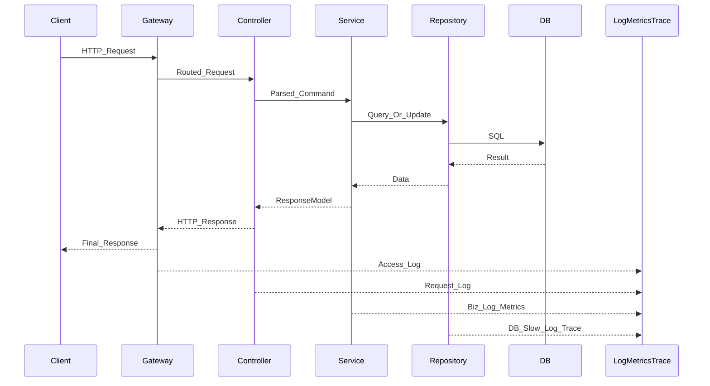
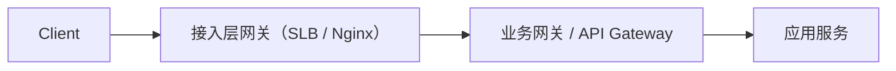
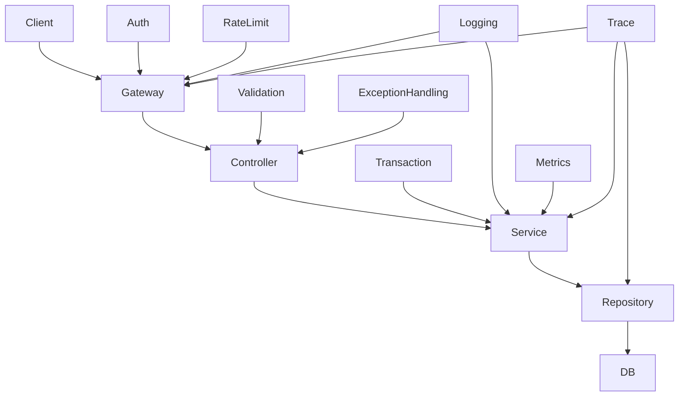

# 服务端链路地图：一次请求到底经历了什么

> **TL;DR**：服务端知识之所以容易学散，通常不是因为知识点太多，而是因为脑子里没有一张“请求链路地图”。这篇文章的目标，就是把一次请求从发出到返回走通，让你先知道每个角色在整条链路中的位置，再去学 HTTP、Java、Spring、MySQL、Redis、MQ，才不容易把知识点学成一盘散沙。

---

## 为什么很多人学服务端会越学越乱

我见过很多刚转服务端的同学，学习路径大概是这样的：

- 今天学一点 Spring 注解
- 明天看一点 MySQL 索引
- 后天补一点 Redis
- 再过两天去背一背 HTTP 状态码

每个知识点单独看都能理解，但一回到真实项目里，还是会有一种很强的割裂感：

- 为什么这个逻辑写在 Controller，不写在 Service？
- 为什么有的问题在网关层就被拦住了？
- 为什么有些查询走缓存，有些却一定要查库？
- 为什么接口明明返回了，研发还说“这条链路不可观测”？

这背后的根因通常不是“技术没学够”，而是**缺少一张请求链路地图**。

服务端的很多知识点，本质上都在回答同一个问题：

**一个请求从外部进入系统之后，到底经过了谁；每一层分别解决什么问题；出了问题应该在哪一层看。**

如果这张图不清楚，你学到的所有框架、组件、规范，都会像散装零件。  
如果这张图清楚了，后面的很多东西都会自动归位。

所以这一篇不先讲框架细节，也不先讲数据库原理，而是先讲最重要的骨架：**一次请求的一生**。

---

## 先看全景：一条请求到底经过谁

先不要一上来就陷进代码细节。先把主干链路放在眼前：



先强调几个关键点：

- 这是一条**主干链路**，不是所有系统都一模一样。
- 有些系统前面会有 CDN、SLB、Nginx、API Gateway。
- 有些系统中间还会调用 RPC、缓存、消息队列、搜索引擎。
- 有些系统的 `Service` 层在代码里可能叫 `Logic`、`Manager`、`DomainService`。

但这些命名差异不会改变一个事实：

**请求一定会经历“入口治理 -> 协议适配 -> 业务编排 -> 数据访问 -> 响应返回”这几个基本阶段。**

真正重要的不是目录名字，而是职责边界。

这也是第一个反直觉点：

**请求链路图不是目录结构图，而是职责流转图。**

---

## 第 0 站：请求发出之前，客户端到底带来了什么

刚学服务端时，很容易把请求理解成“前端丢过来几个参数，我处理一下再返回”。这个理解太薄了。

从服务端角度看，一个请求至少带来四类信息：

- `URL`：你要访问哪个资源
- `Method`：你要读取、创建、更新，还是删除
- `Headers`：身份、版本、设备、链路追踪等上下文
- `Body / Query`：真正的业务参数

这四类信息之所以重要，不是因为它们是 HTTP 协议字段，而是因为它们决定了服务端后续如何处理这个请求。

比如：

- 没有身份信息，可能在入口层就被拦住
- 参数格式不对，可能在 Controller 层就直接返回错误
- 资源不存在，可能返回 `404`
- 业务状态不允许，可能是业务错误而不是 HTTP 协议错误

所以服务端不是“拿到参数就写逻辑”，而是先判断：

- 这个请求是谁发来的
- 它想操作什么资源
- 它有没有资格操作
- 这些参数是不是合法
- 这个动作在当前状态下是否允许

后面专门讲 HTTP 与 API 契约的时候，会细讲这些语义。  
这一篇先记住一句话：

**服务端处理的从来不是一坨参数，而是一个带着上下文的请求。**

---

## 第 1 站：入口层为什么经常是网关

很多服务端新人第一次看到“网关”这个词，会自然以为它只是个转发器。

这个理解只能覆盖它的一部分职责。

在真实工程里，网关往往是入口层的治理中心，它常见会承担这些职责：

- 路由：把请求转发到正确服务
- 鉴权：先判断请求是否具备访问资格
- 限流：在流量过大时保护后端服务
- 统一日志：记录入口请求的基础信息
- 灰度与流量策略：在不同版本或不同实例间做流量分配

这里还要补一个很容易混淆的点：

**“网关”不是单一物种。`Nginx` 这类接入层网关，和业务网关/API Gateway，解决的问题并不完全一样。**

可以先粗略这样理解：

- `Nginx`、SLB、七层代理，更偏**通用接入层能力**
- 业务网关、API Gateway，更偏**面向业务/API 的统一治理能力**

两者都可能出现在请求入口，但关注点不同：

| 类型 | 更关心什么 | 常见职责 |
|---|---|---|
| 接入层网关（如 `Nginx`） | 流量接入与转发效率 | 反向代理、负载均衡、TLS 终止、静态资源转发、基础路由 |
| 业务网关 / API Gateway | API 入口治理 | 鉴权、限流、灰度、统一日志、统一错误包装、路由到具体业务服务 |

为什么这个区别重要？

因为一听“网关”，很容易把所有入口能力混成一层，最后出现两个误解：

- 误以为 `Nginx` 已经做了转发，所以业务网关就没有价值
- 误以为所有入口问题都该丢给 `Nginx` 配置解决

实际上，二者经常是叠在一起的：



在这条链路里：

- 接入层网关更像“总入口的交通枢纽”
- 业务网关更像“面向 API 的治理中台”

当然，现实系统里这两层有时会合并部署，有时能力也会部分重叠。  
但对初学者来说，先把它们在**职责侧重点**上分开，理解会清晰很多。

为什么这些能力经常前置在网关，而不是每个服务自己写一遍？

因为这些能力的本质不是业务逻辑，而是**入口治理**。  
它们越靠近入口，越容易统一，也越容易控制成本。

比如鉴权。如果每个业务接口都自己手写一层判断：

- 规则容易不一致
- 漏配风险更高
- 出问题时难统一排查

而当鉴权在入口层或统一过滤器中完成时，业务代码就可以更专注于“业务到底该怎么处理”。

同样地，限流也不是稳定性专题里才会出现的“高级能力”。  
它其实天然属于请求链路的一部分，因为它回答的是：

**这个请求是否应该继续往后走。**

这里要单独强调一个边界：

**网关负责入口治理，但不应该承载具体业务决策。**

也就是说，网关可以判断“你有没有资格访问这个接口”，但不该在网关里写“你能不能退款”“你今天能不能报名”“这个订单是否允许变更”。

前者是入口规则，后者是业务规则。

这两个如果混在一起，系统会很快变得混乱。

---

## 第 2 站：Controller 到底该做什么，不该做什么

请求通过入口层之后，通常会来到 Web 服务里的 `Controller`。

对 `Controller` 的理解，常见会走向两个极端：

- 一种觉得它只不过是“转发调用”，不重要
- 另一种觉得反正它最接近请求，业务逻辑写这里也挺方便

这两种理解都会把 `Controller` 的职责看偏。

`Controller` 真正的职责，是**协议适配层**。

它通常负责这些事情：

- 接收路径参数、查询参数、请求体
- 做基础参数校验
- 调用应用层/业务层
- 把结果转换成统一响应结构

它不应该做这些事情：

- 承载大量业务判断
- 编排多个下游依赖
- 控制事务边界
- 直接拼复杂 SQL 或直接操作数据库

看一个真实项目里非常典型的入口层写法：

```java
@RestController
@RequestMapping("/api")
public class VersionInfoController {

    @Autowired
    private VersionInfoLogic versionInfoLogic;

    @GetMapping("/version-info")
    public RestResp<VersionInfoVO> get() {
        return versionInfoLogic.get();
    }
}
```

这段代码的价值，不在于它短，而在于它**克制**。

它做了两件事：

- 声明这个请求映射到哪个接口
- 把处理动作交给后面的业务层

它没有在 Controller 里判断业务状态，也没有直接访问数据库。

你在 `~/Conan` 里也会看到很多类似结构。  
比如 `UserMissionController` 里，入口方法往往就是“接参数 -> 调 Logic”：

```15:16:/Users/wangsc/Conan/conan-mission-oral/conan-mission-oral-web/src/main/java/com/yuanfudao/conan/missionoral/web/ctrl/UserMissionController.java
    private UserReadStatusLogic userReadStatusLogic;
```

```112:116:/Users/wangsc/Conan/conan-mission-oral/conan-mission-oral-web/src/main/java/com/yuanfudao/conan/missionoral/web/ctrl/UserMissionController.java
    @PostMapping(value = "/users/{userId:[\\d]+}/userMission/click-redPoint")
    public RestResp<Void> clickRedPoint(@PathVariable(value = "userId") long userId,
                                        @RequestParam(name = "businessType") int businessType) {
        return userReadStatusLogic.clickRedPoint(userId, businessType);
    }
```

这就是入口层该有的样子：**离请求近，但离业务细节远。**

---

## 第 3 站：Service 为什么是链路的业务中枢

请求离开 Controller 之后，通常会进入 `Service`。  
有些项目里不叫 `Service`，而叫 `Logic`。名字不重要，职责重要。

这一层通常才是业务的中枢。

它最常负责三类事：

- 参数与上下文进一步校验
- 业务规则判断与流程编排
- 协调多个依赖并收束结果

比如在 `~/Conan` 里的一个真实逻辑实现中，你会看到类似代码：

```java
@Service
public class UserReadStatusLogicImpl extends BaseLogic {

    @Resource
    private ReadStatusService readStatusService;

    public RestResp<Void> clickRedPoint(long userId, int businessType) {
        if (userId <= 0) {
            return RestResp.error("userId is invalid");
        }
        if (userId != getUserId()) {
            return RestResp.error("userId is not equal to current user");
        }

        ReadStatusCondition condition = new ReadStatusCondition();
        condition.setUserId(userId);
        condition.setBusinessType(businessType);
        readStatusService.markReadStatusAsReadByCondition(condition);
        return RestResp.success();
    }
}
```

这里有几个很典型的服务端动作：

- 校验请求是否和当前用户上下文一致
- 组装业务条件对象
- 调用后端服务完成状态变更
- 把结果收束成统一响应

这一层为什么常常最复杂？

因为系统里的复杂度，本来就主要聚集在这里：

- 什么时候允许这个动作发生
- 需要改哪些状态
- 调用顺序是什么
- 哪一步失败应该回滚，哪一步失败应该补偿

这也是为什么很多项目里，最容易膨胀的恰恰是这一层。

但要注意一个常见误区：

**Service 是业务中枢，不是万能垃圾桶。**

如果什么都往里塞，它很快就会变成几百行、上千行的大方法，最后虽然“逻辑都在 Service”，但维护成本仍然很高。

换句话说，正确的分层并不自动保证系统清晰；它只是给了你一个管理复杂度的机会。

---

## 第 4 站：Repository / Storage 为什么只该关心数据访问

当业务层决定要查数据、写数据时，请求通常会继续往下走到 `Repository` 或 `Storage`。

这一层最常见的职责非常朴素：

- 根据条件查询数据
- 插入、更新、删除数据
- 隔离数据库访问细节

它不应该承载什么？

- 接口返回结构
- 页面展示逻辑
- 复杂业务决策

看一个真实的存储层实现：

```java
@Repository
public class ReadStatusStorageImpl implements ReadStatusStorage {

    @Override
    public List<ReadStatusDO> queryByConditionFromReader(ReadStatusCondition condition) {
        return queryByConditionWithSpecificDB(condition, dbClient.getNamedReader());
    }

    @Override
    public boolean updateReadStatusAsRead(ReadStatusCondition condition) {
        String sql = "UPDATE user_read_status_info SET `readStatus` = 1 ...";
        MapSqlParameterSource source = createSourceFromCondition(condition);
        return dbClient.getNamedWriter().update(sql, source) > 0;
    }
}
```

这段代码里最重要的不是 SQL，而是边界：

- 它知道怎么访问数据库
- 它知道该走读库还是写库
- 它知道如何把条件转成 SQL 参数

但它不知道：

- 这个动作是从哪个页面来的
- 这个接口返回给前端什么文案
- 为什么业务上要把这个状态标记成已读

这就是数据访问层存在的意义。

很多初学者会问：“直接在 Service 里写 SQL，不也能跑吗？”

当然能跑。  
问题从来不是“能不能跑”，而是“变化来了之后，系统还能不能稳”。

把数据访问细节收在一层里，真正保护的是后续变化：

- 表结构调整时，影响更可控
- 读写策略调整时，影响更可控
- 缓存、分库分表、索引优化介入时，影响更可控

所以 `Repository / Storage` 不是为了形式上的分层，而是为了**隔离变化**。

---

## 横切关注点：为什么日志、异常、事务、Trace 不是附属品

到这里为止，你已经看到了链路的“主干”：

- 入口层
- Controller
- Service
- Repository
- DB

但如果你把服务端理解成“主干代码 + 一些可有可无的配件”，这个理解还是太薄了。

因为在真实工程里，很多决定系统质量的能力，并不属于某一层独占，而是横切在整条链路上的：

- 参数校验
- 异常处理
- 事务控制
- 日志
- 指标
- Trace

这些能力之所以重要，是因为它们决定了请求不只是“被执行”，还决定它是否：

- 可验证
- 可观测
- 可定位
- 可恢复

可以把它们理解成链路的“基础设施神经系统”：



下面分别看。

### 参数校验：越靠前越好，但要区分层次

参数校验不是只有一种。

大体上至少有两层：

- 协议层校验：字段缺不缺、类型对不对、格式合不合法
- 业务层校验：这个动作在当前状态下是否允许

前者更适合在 Controller 或更早的位置挡住。  
后者通常要在 Service 中结合业务上下文判断。

如果你把所有校验都塞在 Controller：

- 业务规则会泄漏到入口层
- 很难复用
- 测试也更别扭

如果你把所有校验都拖到最底层：

- 无效请求会走过更长链路
- 资源浪费更大
- 错误定位也更慢

所以好的校验，不是“都放一层”，而是**按职责分层**。

### 异常处理：异常不是坏事，混乱的异常才是

服务端不可能没有异常。

核心在于：

- 哪些异常应该继续往上抛
- 哪些异常应该转成业务错误
- 最终用什么方式返回给调用方

很多项目里都会做统一异常处理，原因很简单：

- 不想每个接口都手写一套 `try-catch`
- 不想让错误返回格式失控
- 不想把异常栈直接暴露给调用方

这里要有一个认知升级：

**异常处理不是为了“把报错藏起来”，而是为了让错误表达稳定、可理解、可排查。**

### 事务：不是哪里更新数据就把事务写哪里

事务最容易被误用。

很多初学者会形成一种简单规则：

“只要改数据库，就加事务。”

这句话不算错，但太粗。

事务真正保护的是一组必须一起成功或一起失败的状态变更。  
因此它更适合放在业务流程被编排的地方，也就是常见的 `Service` 层边界。

如果把事务打在太底层：

- 只能保护局部
- 上层流程仍可能出现一半成功一半失败

如果把事务边界拉得过大：

- 锁持有时间更长
- 并发能力更差
- 回滚范围可能过重

所以事务不是“数据库功能”，它其实属于业务一致性设计的一部分。

### 日志：不是出了错才打

对日志的第一反应，往往是：报错了打个 `error`。

这是必要动作，但日志的价值显然不止于此。

真正有价值的日志，至少要回答：

- 请求来了没有
- 关键业务动作做了什么
- 结果是什么
- 如果失败，失败在什么环节

日志也不是越多越好。

日志级别本身就在表达工程判断：

- 哪些是正常但值得记录的
- 哪些是异常但不影响主流程的
- 哪些是必须立刻关注的问题

所以日志不是“后补的排障工具”，而是系统对自身行为的一种结构化表达。

### Trace / Metrics：请求返回了，不代表链路结束了

这是很多客户端同学刚转服务端时最容易忽略的地方。

在客户端，一个功能经常到“页面对了”就告一段落。  
在服务端，一个功能常常到“链路可观测了”才算真正完成。

为什么？

因为服务端要长期运行，要面对：

- 偶发超时
- 下游波动
- 流量高峰
- 线上脏数据
- 环境差异

这时候如果你只能知道“接口有人报错了”，却看不到：

- 错在哪一跳
- 哪一跳最慢
- 是不是某个依赖挂了
- 是不是数据库抖了

那这条链路实际上仍然不可控。

这也是第二个反直觉点：

**一条请求真正结束，不是它返回响应的时候，而是它被系统可靠记录、可被解释、可被定位的时候。**

---

## 用一个最小案例走完整条链路

抽象说到这里，还是容易飘。我们用一个极小案例把整条链路串起来：

**“用户点击红点，服务端把该状态标记为已读。”**

这个例子不复杂，但它已经足够覆盖一条典型链路。

### 第一步：请求进入系统

客户端发起请求，带上：

- 路径：哪个用户、哪个动作
- 参数：业务类型
- 身份：当前是谁在发请求

这时候入口层可能先做几件事：

- 路由到正确服务
- 鉴权或身份识别
- 记录入口日志
- 在需要时做限流

### 第二步：Controller 接住请求

Controller 负责把协议层信息转成方法调用：

- 从路径里拿 `userId`
- 从查询参数里拿 `businessType`
- 调用业务层

它本身不判断“这个用户是否真的能点这个红点”，也不负责数据库更新。

### 第三步：Service / Logic 做业务判断

业务层会继续判断：

- `userId` 是否有效
- 当前请求用户是否和目标用户一致
- `businessType` 是否合法

然后组装出一个条件对象，交给后端服务继续处理。

注意，这一步就已经不是单纯的“参数转发”了，而是在做业务规则判断。

### 第四步：Storage 更新数据

数据访问层把条件转成 SQL，真正执行：

- 查状态
- 更新状态
- 返回结果

这里它只关心“怎么更新”，不关心“为什么要更新”。

### 第五步：结果返回给客户端

如果整个过程顺利：

- Service 收到成功结果
- Controller 组装统一响应
- 网关或服务端记录日志
- Trace 把这一条链路串起来

如果过程失败：

- 参数问题可能直接返回错误
- 业务问题可能返回业务错误码
- 底层异常可能被统一异常处理转换成稳定输出

这就是一条很典型的服务端链路。

看起来只是一个“点红点”的小动作，背后仍然经过了：

- 入口治理
- 协议适配
- 业务判断
- 数据访问
- 统一响应
- 日志与观测

所以服务端真正复杂的地方，通常不在某一层“特别高级”，而在于**整条链路必须职责清楚地接起来**。

---

## 常见误区：为什么接口通了，系统却仍然可能是错的

学到这里，可以回头看几个非常典型的误区。

### 误区 1：接口能返回，就说明功能做完了

接口能返回，只能说明主路径可能走通了。  
它不代表：

- 参数校验合理
- 错误表达稳定
- 日志足够定位
- 链路具备观测能力
- 边界划分长期可维护

### 误区 2：Controller、Service、Repository 只是套路

这种看法会低估分层真正解决的问题。

这些层当然可能被形式化使用，但它们存在的根本原因不是“业界都这么写”，而是：

**不同层在隔离不同类型的变化。**

- Controller 隔离协议变化
- Service 隔离业务编排变化
- Repository 隔离数据访问变化

如果这层理解不到位，你就会觉得所有分层都像样板戏。

### 误区 3：日志、监控、Trace 是后补的

这会直接拉高后续定位问题的成本。

这些能力不是上线后补丁，而是链路设计的一部分。  
如果你在设计时没有想清楚：

- 关键日志打在哪里
- 需要哪些指标
- Trace 如何串起来

那后面定位问题的成本会非常高。

### 误区 4：网关、鉴权、限流不属于主链路

这尤其常见。

主链路很容易被理解成“业务代码从 Controller 到 DB”。  
但真实系统里，入口治理本来就是主链路的一部分。

请求不是从 Controller 开始的。  
很多请求甚至根本到不了 Controller。

所以如果只会画“Controller -> Service -> Repository”，你的链路图还是残缺的。

---

## 这篇文章最想让你记住什么

如果你只记住一句话，我希望是这句：

**大多数服务端问题，不是出在某一行代码写错了，而是出在链路中某个职责放错了位置。**

比如：

- 本该在入口层做的拦截，拖到了业务层
- 本该在业务层做的判断，塞进了 Controller
- 本该在数据层封装的访问细节，散落在 Service
- 本该前置考虑的日志和 Trace，被当成上线后再补的事情

这些问题单看都不一定致命，但一旦系统长期演进，它们就会不断放大维护成本。

所以真正理解“一次请求的一生”，学到的不是一条调用链，而是一种判断力：

- 这段逻辑应该放在哪一层？
- 这类错误应该在哪一层处理？
- 这个能力属于业务逻辑，还是入口治理，还是数据访问？
- 当线上出问题时，我应该先去哪一层看？

当你有了这张链路地图，后面去学：

- HTTP 与 API 契约
- Java 代码风格与异常表达
- Spring 的分层与自动装配
- MySQL、Redis、MQ
- 日志、指标、Trace、发布

你就不会觉得它们是在讲不同世界的事情。

它们其实都在服务于同一件事：

**让一条请求，能够正确地进入系统、正确地流经系统、正确地离开系统。**

---

## 下一篇怎么接

这一篇解决的是“请求链路地图”问题。  
下一篇最自然要解决的问题是：

**这条链路里，对外的接口契约到底该怎么设计？**

所以接下来建议读：

**《HTTP 与 API 契约：状态码、错误码、幂等与兼容》**

届时我们会继续回答几个关键问题：

- 为什么状态码不能乱用
- 为什么业务错误码和 HTTP 状态码不是一回事
- 为什么幂等是服务端思维的核心组成部分
- 为什么接口一旦发布，就不只是“能跑”这么简单
