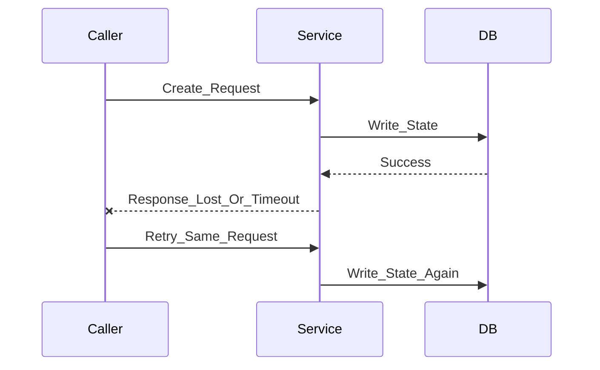

# 接口契约：HTTP、RPC 与服务端协作边界

> **TL;DR**：第三篇真正要讲的，不是 `HTTP` 语法，也不是某个 `RPC` 框架，而是**接口之间的约束与边界**。`HTTP` 和 `RPC` 只是两种不同的承载形式，真正决定协作成本的，是成功与失败如何表达、超时与重试如何处理、幂等如何保护状态、接口如何兼容演进。

---

## 接口为什么是服务端能力的分水岭

刚开始做服务端时，很容易把接口理解成“把数据吐出去”。

这个理解在最简单的场景下能用，但很快就会撞墙。因为一旦接口开始被别人依赖，它就不再只是你本地代码的一部分，而会变成一个协作边界。

比如：

- 前端依赖某个字段去渲染页面
- 客户端依赖某个错误码做弹窗分流
- 下游服务依赖某个 `RPC` 方法完成自己的业务流程
- 调用方根据你的超时和异常行为决定是否自动重试

接口一旦被依赖，难点就不再是“先写出来”，而是：

- 别人能不能正确理解它
- 它失败时是否容易判断原因
- 它被重试时会不会把状态打坏
- 它后续演进时会不会破坏旧调用方

这里有一个很反直觉的结论：

**接口最难的部分，通常不是第一次发布，而是第二次修改。**

第一次写接口时，工程师通常会聚焦在“先让它跑起来”。  
真正的复杂度，往往在第二次、第三次修改时才出现：

- 旧客户端还在不在
- 下游服务有没有跟进
- 字段改语义后谁会被 silently break
- 错误码改了以后谁的降级逻辑会失效

所以，接口能力不在于“会定义 JSON”或者“会写 thrift 文件”，而在于：

**会设计长期可协作的边界。**

---

## 先搭框架：协议约束、调用约束、业务约束

要把 `HTTP` 和 `RPC` 放在同一个框架里理解，最简单的方法是先把接口约束拆成三层：

1. 协议约束
2. 调用约束
3. 业务约束

| 层次 | 在回答什么问题 | HTTP 里常见表现 | RPC 里常见表现 |
|---|---|---|---|
| 协议约束 | 这个请求/调用在协议层怎么表达 | Method、状态码、Header、Content-Type | 服务名、方法名、请求/响应模型、异常定义 |
| 调用约束 | 调用方失败时会看到什么，是否会重试 | 超时、重试、错误响应、幂等要求 | 超时、重试、异常传播、回源/主从调用约定 |
| 业务约束 | 业务上到底在承诺什么 | 业务错误码、分页结构、字段语义 | 业务异常、结构体字段语义、返回值约定 |

这三层一旦混在一起，接口就会很快变得难维护。

比如一个典型混乱场景：

- `HTTP` 层永远返回 `200`
- 真正错误全塞进业务码
- 但业务码又同时承载“系统异常”和“业务不允许”
- 调用方只好靠文案或日志去猜到底发生了什么

或者另一个常见的 `RPC` 场景：

- 方法签名看起来很简单
- 但超时、重试、异常传播完全没有明确约定
- 调用方把它当成本地方法来用
- 出问题时才发现“网络调用根本不是本地调用”

这也是为什么这一篇先讲约束分层，而不是先讲某个协议细节。

---

## HTTP 作为一种接口承载形式，在约束什么

`HTTP` 不是“浏览器能发请求”这么简单。  
它本质上是一套协议层语义，帮助调用方理解：

- 你在操作什么资源
- 你在对这个资源做什么动作
- 这个动作成功还是失败
- 失败属于哪一层

最常用的几个语义点：

### 1. Method 在表达动作语义

- `GET` 更接近读取
- `POST` 更接近创建或提交动作
- `PUT` 更接近整体更新
- `DELETE` 更接近删除

这不是宗教，也不是为了背规范，而是为了降低协作歧义。

如果所有动作都塞进 `POST`，短期内也能跑，但调用方会失去很多判断能力：

- 这个接口是不是读操作
- 这个动作是否应该天然幂等
- 浏览器、代理、SDK 对它会采用什么默认行为

### 2. 状态码在表达协议层结果

服务端工程里最常用的几个状态码，重点不在“背下来”，而在理解边界：

- `200`：请求被正常处理
- `400`：请求格式或参数不合法
- `401`：身份未通过认证
- `403`：身份通过了，但没有权限
- `404`：资源不存在
- `500`：服务端内部异常

状态码不是给面试官看的，它会直接影响：

- 调用方如何分流错误
- 监控如何聚合异常
- 网关和客户端如何做降级
- 联调时如何快速判断问题落在哪一层

### 3. 一个简单反例

最典型的坏味道之一，就是：

- 所有请求都返回 `200`
- 错误全靠 `code != 0` 表示

这样做表面上统一，实际上把协议层失败和业务层失败全抹平了。  
结果就是：

- 调用方需要自己额外约定一套解释逻辑
- 观测系统很难快速看出协议层故障
- 网关层和客户端层的默认行为也失去依据

所以 `HTTP` 的价值，不是“能发请求”，而是**提供一层所有人都能理解的协议语义**。

看一个典型的 `HTTP` 入口，在 `~/Conan` 里就能看到这种风格：

```java
@RestController
@RequestMapping(value = ConanMissionOralConstant.API)
public class VersionInfoController {

    @Autowired
    private VersionInfoLogic versionInfoLogic;

    @GetMapping(value = "/version-info")
    public RestResp<VersionInfoVO> get() {
        return versionInfoLogic.get();
    }
}
```

这个例子虽然短，但它至少明确了三件事：

- 这是一个 `HTTP` 入口
- 它是 `GET` 语义
- 它对外暴露的是一个稳定的响应模型

---

## RPC 作为另一种接口承载形式，在约束什么

`RPC` 的最大误导性在于：它太像本地方法调用了。

方法签名一摆出来，很容易让人下意识觉得：

- 这不就是调个函数吗
- 传个对象进去，拿个对象出来
- 真失败了抛异常就行

但问题在于，`RPC` 从来不是本地调用。

它背后依然是一次网络交互，所以它天然带着这些额外问题：

- 网络超时
- 重试行为
- 异常传播
- 序列化兼容
- 服务端和调用方版本不一致

所以 `RPC` 这一层的约束不能只看方法名，还要看：

- 请求结构体如何定义
- 返回结构体如何定义
- 哪些失败会通过业务异常表达
- 哪些失败会通过系统异常表达
- 调用方是否允许重试

看一个 `Thrift` 定义的例子：

```thrift
exception TConanMissionOralBizException {
    1: i32 code;
    2: string msg;
}

struct TCreateLessonUserMissionRequest {
    1: required i64 oralLessonMissionId;
    2: required i64 userId;
    3: required i32 displayDate;
    4: optional i32 expireDate;
    5: optional string ext;
}
```

这里已经不只是“传几个参数”了，而是在表达：

- 哪些字段是必需的
- 哪些字段是可选的
- 业务异常如何单独建模

再看一个 `RPC Handler` 的实现片段：

```java
public class ConanMissionOralRpcHandler implements ConanMissionOralThrift.Iface {

    @Override
    public long createLessonMission(TCreateLessonMissionRequest request)
            throws TConanMissionOralBizException, TException {
        log.info("createLessonMission request ={}", JsonUtils.writeValue(request));
        return lessonMissionService.createLessonMission(
                tLessonMissionWrapper.tCreateLessonMissionRequest2MissionBO(request));
    }
}
```

这个例子最值得关注的不是具体业务，而是它已经在表达一套清晰约束：

- 调用入口是一个 `Iface` 方法
- 请求体是强类型结构体
- 业务异常和系统异常是分开的
- 调用方需要根据异常类型判断后续动作

`RPC` 这一层的核心是：  
**它不是把网络调用伪装成没有代价的本地调用，而是用更强类型的方式表达服务间协作。**

---

## 两者共通的问题一：成功与失败如何分层

这是接口设计里最容易混乱、也最容易长期积累债务的地方。

一个成熟的接口，一般至少要把三类结果分开：

1. 协议层结果
2. 调用层结果
3. 业务层结果

| 层次 | HTTP 常见表现 | RPC 常见表现 | 典型含义 |
|---|---|---|---|
| 协议层 | 200 / 400 / 401 / 403 / 404 / 500 | 方法是否调用成功、序列化是否正常 | 请求有没有被正确接收和处理 |
| 调用层 | 超时、连接失败、网关失败 | `TException`、超时、下游不可用 | 这次远程调用本身是否可靠完成 |
| 业务层 | `bizCode`、业务 message | 业务异常、业务返回结构 | 业务是否允许、状态是否合法 |

这里最重要的一个认知是：

**HTTP 成功，不代表业务成功。RPC 抛异常，也不一定都代表系统故障。**

比如：

- 一个下单接口返回 `200`，但业务码提示“库存不足”
- 一个 `RPC` 方法调用成功返回了结构体，但业务字段提示“当前状态不允许操作”
- 另一个 `RPC` 方法抛出了框架级异常，那可能是超时或网络故障，而不是业务拒绝

如果这三层不分开，调用方就很难做正确的决策：

- 该提示用户重试，还是提示业务不允许
- 该自动重试，还是立即熔断
- 该看业务日志，还是先排查网络和下游服务

所以失败分层不是“文档写清楚就行”的细节，而是接口是否可协作的核心。

---

## 两者共通的问题二：超时、重试与幂等

这三个词最好一起理解，因为它们常常连在一起出现。

先看一个常见的服务端现实：

- 调用方发起请求
- 服务端其实已经开始执行
- 调用方因为超时，没有等到结果
- 调用方自动重试
- 同一个动作再次打到服务端

如果接口没有幂等保护，就会出现重复执行问题。

这也是为什么我会把“幂等”看成服务端基本素养，而不是高级分布式专题。



这里要保护的是：

**系统状态不能因为一次超时和一次重试而被重复修改。**

所以设计接口时，必须提前想清楚：

- 调用方会不会重试
- 超时后服务端有没有可能已经成功
- 相同请求再次到来时，是重复创建、重复扣款，还是安全返回旧结果

这里放一个更像工程现场的例子。

在 `Conan` 里有一个 `RPC` 接口，语义是：

- `createLessonUserMission`
- **无则创建，有则跳过**

这其实就是一种很典型的幂等约定。调用方关心的不是“你内部有没有撞到唯一键”，而是“我重复调一次，会不会把状态再改坏一遍”。

对应的处理代码大致是这样：

```java
public TCreateLessonUserMissionResponse createLessonUserMission(TCreateLessonUserMissionRequest request)
        throws TConanMissionOralBizException, TException {
    TCreateLessonUserMissionResponse response = new TCreateLessonUserMissionResponse();
    try {
        lessonUserMissionService.createOrUpdateStatusToValidIfExist(...);
    } catch (DuplicateKeyException e) {
        response.setSuccess(false);
        response.setExisted(true);
        return response;
    } catch (Exception e) {
        response.setSuccess(false);
        return response;
    }
    response.setSuccess(true);
    return response;
}
```

这个例子最值得注意的，不是 `DuplicateKeyException` 本身，而是接口对“重复请求”的处理语义：

- 第一次请求：正常创建，返回成功
- 重复请求：不是再创建一次，也不是直接当系统失败处理
- 服务端识别出“它已经存在”，然后返回一个**可解释的结果**

这比一句“要做幂等”更重要。  
因为对调用方来说，真正有价值的不是服务端内部用了什么技巧，而是：

- 重试后状态会不会被破坏
- 如果对象已经存在，我能不能拿到一个稳定结果
- 这个结果是业务语义上的“已处理”，还是系统语义上的“失败”

几个高风险的幂等场景：

- 下单
- 支付回调
- 创建资源
- 消息消费后的状态更新

边界上也要讲清楚：

- 不是所有接口都天然幂等
- 查询类接口通常更接近幂等
- 写接口往往需要显式设计幂等键、业务唯一键或状态判断

深一点的认知是：

**幂等保护的不是“代码优雅”，而是“系统状态不被调用方行为污染”。**

---

## 两者共通的问题三：兼容性与演进

接口一旦发布，最危险的时刻通常不是第一次上线，而是第一次修改。

因为从这一刻开始，你面对的就不是“代码能不能编译通过”，而是：

- 旧调用方还在不在
- 新旧版本会不会并存
- 字段变化会不会造成静默错误
- 默认值变化会不会改变旧逻辑

这一点在 `HTTP` 和 `RPC` 里是一样的：

- `HTTP` 会遇到响应字段变化、枚举变化、默认值变化
- `RPC` 会遇到请求结构体变化、返回结构体变化、异常模型变化

最常见的几类兼容风险：

- 删除字段
- 改字段语义
- 改默认值
- 改枚举含义
- 改异常表达方式

一个很容易被低估的问题是：

**改语义，往往比改名字更危险。**

因为改名字很容易在编译期或联调期被发现，  
但语义变化往往会“悄悄错”，直到线上行为异常才暴露。

一个最小兼容性 checklist：

- 新增字段通常比删除字段安全
- 改语义比改名字更危险
- 默认值变化要非常谨慎
- 枚举扩展要考虑旧调用方如何处理未知值
- 异常或错误码变化要考虑老逻辑是否还认识它

所以兼容性不是“发布时顺手看一下”的事情，而是接口设计第一天就该带着的约束。

---

## 返回结构、分页、字段语义：为什么数据结构本身也是约束

一说接口设计，最先想到的往往是：

- `HTTP` 状态码
- `RPC` 方法名
- 错误码

但长期影响协作成本的，往往还有另一半：

- 返回结构是否稳定
- 分页约定是否统一
- 排序和筛选语义是否一致
- 字段含义是否清晰

这部分的问题通常不是“接口不能用”，而是“接口很难长期舒服地用”。

比如同一个系统里：

- 有的分页用 `page/pageSize`
- 有的用 `offset/limit`
- 有的返回 `total`
- 有的只返回 `hasMore`
- 有的字段叫 `status`
- 有的叫 `state`
- 但表达的是同一件事

这种接口不是完全错，但会持续抬高调用方的理解成本。

所以接口约束不只包含“调用入口”，也包含“数据结构本身”。

一个成熟接口至少应该让调用方做到：

- 能预期返回结构
- 能理解字段含义
- 能稳定处理分页和排序
- 不需要每个接口都重新猜一遍风格

---

## 一个坏接口是怎么长出来的

坏接口通常不是一开始就坏到不能用，而是一步步长出来的。

最典型的坏味道包括：

### 1. 协议层和业务层混在一起

- 所有 `HTTP` 错误都返回 `200`
- 所有 `RPC` 失败都只抛一个笼统异常
- 业务错误和系统错误没有分层

### 2. 短期需求不断推着接口漂移

- 所有动作都先用 `POST`
- `RPC` 方法签名跟着业务短期诉求频繁变化
- 字段名和字段语义不断加历史包袱

### 3. 返回结构风格不统一

- 分页结构每个接口都不一样
- 同一个概念在不同接口里叫法不同
- 同样的失败，在不同接口里表达方式不同

### 4. 只通知当前调用方，不考虑其他依赖

这是最危险的一种。

因为接口一旦有多个调用方，“我已经通知到前端了”并不代表真的安全。

坏接口最典型的生长方式就是：

**每次改动都觉得只是小改一点点，最后整个接口体系变成只有维护者自己才懂。**

---

## 一个好接口的最小检查清单

如果第三篇只留一个可落地的东西，我希望是这个检查清单。

在设计一个接口时，至少问自己这几个问题：

1. 这个接口的资源或方法语义清楚吗？
2. `HTTP` 方法或 `RPC` 方法名是否准确表达动作？
3. 协议层成功/失败、调用层成功/失败、业务层成功/失败是否分层？
4. 调用方超时后会不会重试？如果重试，状态会不会被重复修改？
5. 这个接口是否考虑了幂等？
6. 字段、默认值、枚举、异常模型后续如何兼容演进？
7. 返回结构是否稳定、一致、可预期？

如果这些问题里有两三个你回答不清楚，那大概率不是“文档没补齐”，而是接口设计本身还不够稳。

---

## 学完这一篇后，你应该获得什么判断力

如果这一篇真的起作用，读完后你带走的，不应该只是几条接口规范，而是一套更稳定的判断力。

至少有三点：

### 1. 看接口时，不再只盯字段

你会开始区分：

- 这是 `HTTP` 约束问题，还是 `RPC` 约束问题
- 这是协议层失败，还是业务层失败
- 这是调用行为问题，还是数据结构问题

### 2. 设计接口时，会先想调用方接下来会做什么

你会习惯先问：

- 对方会不会重试
- 超时后有没有可能重复调用
- 失败之后，对方该看到什么信息

### 3. 判断接口质量时，不再只看“能不能联调”

你会更关注：

- 这个接口是不是长期可维护
- 它有没有把协作成本前置设计进去
- 它后续演进时会不会轻易把旧调用方搞崩

如果能形成这三点判断力，这一篇就不只是讲了几个概念，而是真的把接口思维补进去了。

---

## 这篇文章最后想收束到哪里

如果这一篇只留下一个结论，我希望是：

**接口设计，本质上是在设计协作成本。**

`HTTP` 和 `RPC` 的外形不同，但它们承担的是同一类角色：

- 给调用方稳定预期
- 给系统划清边界
- 给后续演进留出余地

所以第三篇真正想收束的，不是“会不会背状态码”或者“会不会写 thrift”，而是：

**你能不能把协议、调用、业务这三层约束拆清楚，并提前替调用方想清楚失败、重试和演进时会发生什么。**

---

## 下一篇怎么接

这一篇解决的是“接口约束与协作边界”问题。  
下一篇最自然要解决的问题是：

**这些约束，如何在 Java 代码里表达得足够清楚？**

所以接下来建议写：

**《服务端代码表达与工程组织：Java、Spring 与分层边界》**

届时重点就不再是“接口是什么”，而是：

- Java 代码如何把输入输出、返回值和异常路径表达清楚
- Spring 分层如何把入口、流程、规则和存储组织清楚
- 什么叫“代码能跑”和“代码表达清楚、职责清楚”之间的差别
