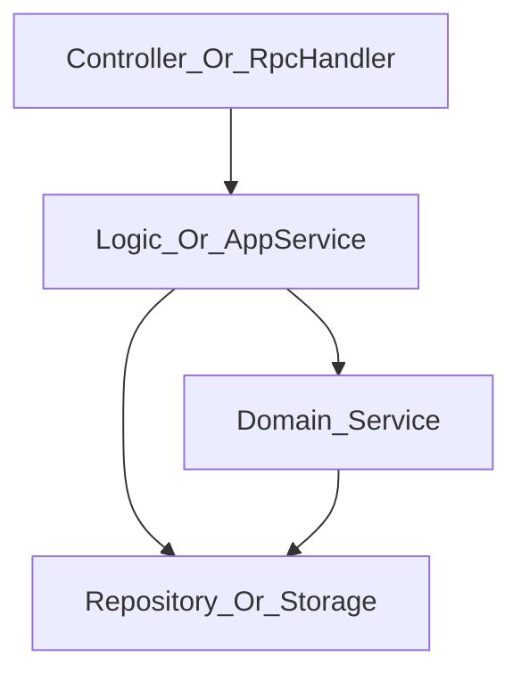

# 服务端代码表达与工程组织：Java、Spring 与分层边界

> **TL;DR**：这一篇把 `Java` 和 `Spring` 放在同一个工程语境里讲。`Java` 负责把类型、输入输出、异常路径和业务意图说清楚，`Spring` 负责把入口层、流程层、存储层和依赖方向组织清楚。重点不是语法点和注解名，而是**代码有没有把边界和职责表达清楚**。

---

## 先把边界划清楚：第三篇讲对外，这一篇讲对内

第三篇讲的是跨业务边界的接口，也就是：

- `HTTP`
- `RPC`

它们对于某个业务来说，都是**对外暴露的协作边界**。

这一篇往里走一步，讲的是项目内部、进程内部的表达与组织，也就是：

- `Controller`
- `RPC Handler`
- `Logic / Application Service`
- `Domain Service`
- `Repository / Storage`
- `DTO / VO / BO / PO`
- 返回值、异常、依赖方向

这两个视角经常被混在一起。结果就是：

- 讲接口时，开始讨论 `Service` 该不该拆
- 讲分层时，又跳回 `HTTP status code`

这样会让认知始终打不稳。

我更建议这样理解：

- 第三篇解决的是：**系统对外怎么协作**
- 这一篇解决的是：**系统对内怎么组织**

这里有一个很重要的判断：

**对外接口设计得再清楚，如果进程内代码表达混乱，系统还是会很快腐化。**

因为调用方看到的只是边界，真正每天都在积累成本的，是你们团队自己维护的内部代码。

---

## 我的理解是：Java 是表达工具，Spring 是组织工具

写服务端代码时，我会先看两个问题：

1. 这段代码到底在表达什么？
2. 这段代码到底应该放在哪里？

这两个问题，分别对应：

- `Java`：表达工具
- `Spring`：组织工具

我会这样粗暴但有效地概括：

| 维度 | Java 主要解决什么 | Spring 主要解决什么 |
|---|---|---|
| 类型 | 输入输出是什么 | 这些对象怎么被装配 |
| 方法签名 | 调用方能传什么、拿到什么 | 这些职责落在哪一层 |
| 异常 | 什么是正常分支，什么是异常分支 | 异常和依赖如何沿分层流动 |
| 集合 / Optional | “没有”该如何表达 | 哪一层负责解释这个“没有” |
| 代码组织 | 逻辑有没有说清楚 | 系统有没有组织清楚 |

这一篇的主线也很简单：

**如何用 Java 把意图写清楚，再用 Spring 把这些意图组织成一个可维护的系统。**

---

## 第一部分：先把“表达”写清楚

### 1. 类型不是搬运工，而是边界说明书

很多服务端代码之所以读起来累，不是因为业务难，而是因为类型全糊在一起。

最常见的几类对象：

| 类型 | 主要职责 | 常见出现位置 |
|---|---|---|
| `DTO` / 请求响应模型 | 表达对外输入输出 | Controller / RPC Handler |
| `VO` | 面向展示或接口返回 | Web 返回层 |
| `BO` | 表达业务语义和领域状态 | Service / Domain |
| `PO` | 表达持久化结构 | Storage / Repository |

这几类对象最怕的不是“类多”，而是**同一个对象从入口一路传到数据库，再一路传回来**。

那样做短期快，长期代价很高：

- 对外字段改了，内部逻辑跟着抖
- 数据库存储结构泄漏到业务层
- 业务语义和展示语义混在一起

在 `Conan` 里也能看到这种分层意识。比如 `RPC request` 进入后，不是直接拿去写库，而是先转成业务对象：

```java
lessonUserMissionService.createOrUpdateStatusToValidIfExist(
        tLessonUserMissionWrapper.tCreateLessonUserMission2UserMissionBO(request, lessonMissionBO));
```

这个动作本身就在表达一件事：

**入口模型不等于内部业务模型。**

很多项目代码里会把持久化对象命名成 `DO`，`Conan` 的代码也是这样；但如果从职责上区分，我更愿意把这类对象理解成 `PO`，也就是面向持久化结构的对象。

边界条件也要讲清楚：

- 小项目里不一定每层都要造很多对象
- 但只要接口模型和数据库模型开始分化，就要及时拆开
- 一旦对象跨层复用太久，后面再拆的成本通常更高

给新手的解释是：

**类型不是为了显得专业，而是为了减少“这个字段到底代表什么”的猜测。**

给更熟悉服务端的人，一个更深的判断是：

**类型系统不是附属品，它本身就是业务边界的一部分。**

### 2. 方法签名不是形式主义，它在提前声明调用约定

很多代码的问题，不是实现细节，而是签名一开始就把意思写糊了。

看 `Conan` 里一个比较有代表性的接口定义：

```java
public interface LessonUserMissionService {

    void createOrUpdateStatusToValidIfExist(LessonUserMissionBO userMission)
            throws DuplicateKeyException;

    Optional<LessonUserMissionBO> getValidUserMissionByUserIdAndMissionIdFromReader(
            long userId, long missionId);

    List<LessonUserMissionBO> getValidUserMissionByUserIdAndMissionIdsFromReader(
            long userId, List<Long> missionIds);
}
```

这三个签名其实分别在表达三种不同语义：

- `void + exception`：调用的重点是“做这个动作”，失败时走异常路径
- `Optional<T>`：查询单个对象，结果可能不存在
- `List<T>`：查询多个对象，没有结果时应返回空集合，而不是异常

这背后对应的是服务端很重要的一套判断标准：

| 场景 | 更合适的表达 |
|---|---|
| 查询单个对象，可能不存在 | `Optional<T>` |
| 查询多个对象，可能没有数据 | 空集合 |
| 参数非法、状态非法、系统执行失败 | 异常 |
| 正常成功但有业务分支差异 | 明确返回值或响应结构 |

这里最容易踩的坑有两个：

1. 什么都返回 `null`
2. 什么都靠异常表达

前者的问题是语义太弱，后者的问题是异常路径会被滥用成普通分支。

我更建议这样记：

- `null`：尽量限制在遗留代码或框架边界
- `Optional<T>`：只用于“单对象可能不存在”
- 空集合：用于“批量查询没数据”
- 异常：用于“这条路径不该被当作普通成功分支继续”

这不是教条，而是为了让调用方在读签名时就有稳定预期。

### 3. `Optional`、空集合、异常，分别在保护什么

这三个东西经常被混用，但它们保护的其实不是同一种问题。

| 表达方式 | 主要保护什么 |
|---|---|
| `Optional<T>` | “没有这个对象”这件事是正常情况 |
| 空集合 | “没有这些数据”这件事是正常情况 |
| 异常 | 继续往下执行已经不合理，或者至少不安全 |

比如 `VersionInfoLogicImpl` 里有一段代码：

```java
try {
    product = PlanetConst.Product.fromId(productId);
} catch (IllegalArgumentException e) {
    log.warn("illegal productId {}", productId);
    throw new BadRequestException();
}
```

这里就不是“查不到一个正常对象”，而是“请求本身已经不合法”，所以它更适合走异常路径。

这个区分很重要，因为一旦混了，调用方就会不断猜：

- 这是正常没数据，还是系统出错
- 这是应该兜底，还是应该直接失败
- 这是业务分支，还是接口使用方式不对

服务端代码一旦让人持续猜，它的维护成本就会快速上升。

### 4. `for` 循环和 `Stream`，重点不是新旧，而是读者能不能一眼看懂

很多人一学到 `Stream`，就会很想把所有集合处理都改成链式调用。

这当然不一定错，但判断标准不该是“够不够现代”，而应该是：

**这段代码到底是在表达规则，还是在炫操作。**

我自己的判断标准很简单：

| 场景 | 更推荐 |
|---|---|
| 简单映射、过滤、收集 | `Stream` |
| 中间有多步条件分支、日志、副作用 | 普通 `for` 循环 |
| 需要短路退出、错误处理、分阶段命名 | 普通 `for` 循环 |
| 一眼就能看懂的数据变换 | `Stream` |

比如下面这种就很合适：

```java
return lessonMissionService.getByIdsFromReader(oralLessonMissionIds).values().stream()
        .map(tLessonMissionWrapper::wrap)
        .collect(Collectors.toMap(TLessonMission::getId, Function.identity()));
```

因为它只做三件事：

- 取值
- 转换
- 收集

但如果一段逻辑里开始出现：

- 多次 `filter`
- 多层 `map`
- 分支判断
- 日志
- 状态更新

那通常就该收回到更朴素的写法。

一个很实际的标准是：

**如果你需要停下来从左到右解码这条链，它就可能已经不够清楚了。**

---

## 第二部分：再把“组织”理清楚

### 1. 入口层的职责，是接协议，不是接全部业务

无论是 `Controller` 还是 `RPC Handler`，入口层都应该尽量只做这几类事：

- 接收请求
- 提取上下文
- 做轻量校验
- 调用下层
- 把结果翻译成外部协议可理解的形式

最不应该在入口层堆的，是这些内容：

- 复杂业务规则
- 多步状态流转
- SQL 拼接
- 跨多个存储对象的编排

因为入口层一旦承担了太多业务，后面通常会出现两个后果：

1. 同一个逻辑在 `HTTP` 和 `RPC` 入口各写一遍
2. 入口层和业务层的异常语义开始互相污染

这也是为什么我会强调：

**名字可以不同，但职责要稳定。**

有的项目叫：

- `Controller -> Service -> Repository`

有的项目叫：

- `Controller -> Logic -> Storage`

还有的项目会区分：

- `Controller -> ApplicationService -> DomainService -> Repository`

这些名字都不是最关键的。最关键的是：

- 谁负责接协议
- 谁负责编排流程
- 谁负责业务规则
- 谁负责持久化

### 2. 流程层负责“组织事情发生”，不是把所有代码堆在一起

`Conan` 的 `VersionInfoLogicImpl` 就是一个比较容易理解的例子：

```java
@Service
public class VersionInfoLogicImpl extends BaseLogic implements VersionInfoLogic {

    @Resource
    private ConanPlanetProxy conanPlanetProxy;

    @Override
    public RestResp<VersionInfoVO> get() {
        int productId = getProductId();
        PlanetConst.Product product = PlanetConst.Product.fromId(productId);
        VersionInfoVO versionInfoVO = new VersionInfoVO();
        versionInfoVO.setPlatform(product.getPlatform().name());
        versionInfoVO.setMinVersion(
                conanPlanetProxy.getOralOrientedConfigMinVersionByUserIdAndProductId(getUserId(), productId));
        return RestResp.success(versionInfoVO);
    }
}
```

这个层次的价值在于，它不是协议层，也不是数据库层，而是在做：

- 组织调用顺序
- 把上下文装成对业务有意义的数据
- 把下游结果装成返回对象

这类层我通常会把它理解成“流程层”或“应用服务层”。

要注意一个边界：

**流程层负责编排，不代表所有业务规则都应该堆在这里。**

如果某段规则：

- 会被多个入口复用
- 本身有明确业务语义
- 不应该依赖 `HTTP` / `RPC` 上下文

那它通常更适合下沉到领域服务或核心服务层。

### 3. 业务层负责收住规则，存储层负责收住数据

看 `LessonUserMissionServiceImpl` 里的这一段：

```java
public void createOrUpdateStatusToValidIfExist(LessonUserMissionBO lessonUserMissionBO) {
    if (Objects.isNull(lessonUserMissionBO)) {
        throw new IllegalArgumentException("lessonUserMissionBO is null, skip create");
    }
    String redisKey = "lessonUserMission:create:" + lessonUserMissionBO.getUserId()
            + ":" + lessonUserMissionBO.getLessonMissionId();
    distributeLockHelper.doInLock(redisKey, () -> {
        try {
            long id = this.create(lessonUserMissionBO);
            applicationEventPublisher.publishEvent(...);
            return id;
        } catch (DuplicateKeyException e) {
            lessonUserMissionBO.setStatus(StatusType.VALID);
            updateStatus(lessonUserMissionBO);
            applicationEventPublisher.publishEvent(...);
            return true;
        }
    });
}
```

这段代码有几个很值得学的点：

- 先做入参保护
- 用分布式锁保护并发修改
- 把“创建或恢复有效状态”作为一个完整业务动作来表达
- 在业务动作完成后发布事件

也就是说，它表达的不是“调用几次存储方法”，而是：

**在某种业务语义下，系统状态应该怎样被安全地推进。**

再对比存储层的 `create`：

```java
@Override
public long create(LessonUserMissionDO userMission) throws DuplicateKeyException {
    SqlParameterSource source = createSourceFromLessonCondition(userMission);
    KeyHolder keyHolder = new GeneratedKeyHolder();

    dbClient.getNamedWriter().update(
            "INSERT INTO `lesson_user_mission` ...",
            source, keyHolder);

    return Objects.requireNonNull(keyHolder.getKey()).longValue();
}
```

存储层的职责就单纯很多：

- 接收持久化对象
- 发 SQL
- 返回结果

它不该知道：

- 为什么这次写库是“创建”
- 为什么撞唯一键后要恢复状态
- 为什么成功后要发事件

这些都应该被收在业务层。

一句话概括这两层的区别：

- 业务层负责定义“发生什么才算业务上成立”
- 存储层负责执行“把数据怎么存进去”

### 4. Spring 的真正价值，不是注解多，而是把依赖方向固定下来

很多人说 Spring 好用，第一反应是：

- 自动注入方便
- 配置少
- 注解省事

这些当然都成立，但更长期的价值其实是：

**Spring 能把依赖关系显式组织成一套稳定结构。**

理想情况下，依赖方向应该像这样：



这张图里最重要的不是层数，而是方向。

比如通常不希望出现：

- `Storage` 反过来依赖 `Service`
- `Controller` 直接操作数据库
- `ServiceA` 和 `ServiceB` 双向互调

为什么？

因为一旦依赖方向乱了，你很快会失去这些能力：

- 看目录就理解职责
- 替换某层实现而不牵连全局
- 在代码评审时快速判断“这段逻辑放错层了”

这也是为什么我会说：

**Spring 真正厉害的地方，不是帮你把对象 new 出来，而是帮你把系统结构固定下来。**

### 5. 什么时候该抽接口，什么时候不要为了接口而接口

这是 Java 服务端里最容易形式化的地方之一。

很多项目喜欢默认写成：

- `FooService`
- `FooServiceImpl`
- `BarLogic`
- `BarLogicImpl`

这样做不一定错，但也不应该自动变成规定动作。

更合适的问题是：

**这个接口到底在隔离什么变化？**

适合抽接口的常见场景：

- 确实存在多种实现
- 对外暴露的是稳定能力，不想让调用方依赖具体实现
- 某层需要以接口作为边界，便于替换、扩展或隔离

不必急着抽接口的常见场景：

- 目前只有一个实现，而且短期没有替换需求
- 这个类本身就是局部细节，不承担稳定边界
- 抽出来以后，除了多一层跳转，没有额外收益

所以我更赞成一种更克制的判断：

**接口是边界工具，不是排版工具。**

如果抽象没有隔离变化、没有澄清职责、没有稳定调用约定，那它通常只是增加阅读成本。

---

## 一个最小工程案例：同一个动作，在不同层分别表达什么

还是用 `Conan` 的 `createLessonUserMission` 这条链路，把前面的抽象收一下。

### 1. 入口层表达“怎么接这个调用”

- `RPC` 方法签名定义请求和响应
- 判断任务是否存在
- 把结果翻译成调用方可理解的响应结构

### 2. 业务层表达“这个动作业务上算什么”

- 这是一次创建用户任务的动作
- 如果已存在，不是简单报错，而是恢复到有效状态
- 这个动作完成后，还要发布后续事件

### 3. 存储层表达“这批数据怎么落库”

- 插入哪张表
- 用哪些字段
- 撞唯一键会抛什么异常

这三层放在一起看，就会很容易明白一件事：

**同一个需求，不是只写一段代码，而是在不同层分别表达不同类型的信息。**

这也是为什么我更想把第四篇写成“表达与组织”，而不是“Java 一篇、Spring 一篇”。

因为真实项目里，语言和框架不是分开工作的。

---

## 常见误区

### 1. 会写注解，就以为分层已经完成了

不是加了：

- `@RestController`
- `@Service`
- `@Repository`

系统就自动变得清楚了。

分层真正要看的是：

- 职责有没有分开
- 依赖方向有没有守住
- 异常语义有没有在正确层被解释

### 2. 入口层越来越胖

如果一个 `Controller` / `RPC Handler` 开始承担：

- 参数组装
- 业务分支判断
- 多次下游调用
- 数据库存取

那它通常已经在侵占下层职责。

### 3. 什么都返回 `null`，什么都用异常兜

这是最常见、也最隐蔽的表达退化。

因为短期看起来都能跑，长期却会把调用方训练成：

- 先猜
- 再试
- 最后靠日志定位

### 4. `Stream` 用得很现代，但代码读不清楚

服务端代码不是比赛谁更函数式。

如果一段链式操作已经让读者看不出“这段逻辑到底在做什么”，那它就该回到更直接的表达。

### 5. 抽象很多，但没有一个真正在隔离变化

接口、包装类、转换器越来越多，不一定说明设计更好。  
也可能只是说明：

- 没有真正想清楚边界
- 只能靠多一层类来缓冲不确定感

---

## 读到这里，希望你开始形成的感觉

如果这一篇起作用，我希望最后留下来的，不是几条规定动作，而是一种更稳定的感觉。

以后你再看一个服务端需求，脑子里会开始自然分层：

- 入口层负责接协议，别把业务全塞进去
- 流程层负责组织调用顺序，别和协议细节缠在一起
- 业务层负责把规则收住，别只是机械调用几个方法
- 存储层负责和数据打交道，别偷带业务判断

再看一个方法签名时，你也会更在意这些问题：

- 这里表达的是正常分支，还是异常分支
- 这里适合用 `Optional`、空集合，还是明确失败
- 这个对象到底是在表达接口、业务，还是持久化结构

到这一步，`Java` 和 `Spring` 才算真正连在一起了。

`Java` 不是单纯把代码写出来，而是在表达输入输出、状态和异常路径。  
`Spring` 也不只是把对象装配起来，而是在帮你把入口、流程、规则和存储组织成一个长期还能维护的系统。

我更希望这一篇最后留下的感觉是：

**服务端代码不只是能跑，还应该让后来的人看得懂、改得动，也知道风险在哪里。**

---

## 下一篇怎么接

这一篇解决的是：

**进程内代码该如何表达和组织。**

下一篇最自然要进入的，就是：

**这些分层和业务动作，最终如何落到数据与事务边界上。**

所以接下来建议写：

**《MySQL、事务与数据建模基础》**

届时重点就会从“代码如何组织”继续收敛到：

- 状态到底存在哪里
- 事务到底保护什么
- 表结构和索引为什么会反过来影响接口和业务代码
