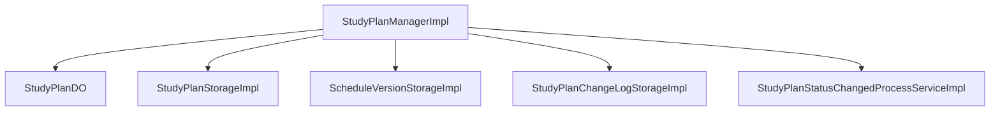

# MySQL、事务与数据建模基础

> **TL;DR**：这一篇不把数据库当成一个孤立技术点，而是把它放回服务端主线里理解。先分清领域建模和数据建模，再去理解事务、一致性边界、表结构和索引，这样更容易看清为什么很多服务端问题最后都会落到数据层。

---

## 这一篇要解决什么问题

写到数据库这一层，很多人会下意识地把主题理解成：

- 表怎么建
- SQL 怎么写
- 索引怎么加

这些当然都重要，但如果第五篇只停在这里，它就会很像一篇数据库入门课，和前面四篇的主线断开。

这篇更想解决的是另外几个问题：

- 为什么很多服务端复杂度最后都会落到数据层
- 为什么会写 CRUD，不等于理解了状态、一致性和建模
- 为什么表结构、唯一键、索引、状态字段这些“看起来偏底层”的东西，会直接影响接口设计和业务实现

前四篇已经分别讲了：

- 服务端到底在解决什么问题
- 一次请求在系统里怎么流动
- 对外接口如何设计协作边界
- 进程内代码如何表达和组织

第五篇自然要继续往下收：

**这些业务动作、状态变化和分层职责，最后到底落在哪里？**

答案通常就是：  
**落在数据库，落在数据模型，落在一致性边界。**

---

## 先分清两层建模：领域建模和数据建模

我觉得这里先把“建模”拆开，是第五篇能不能讲顺的关键。

| 维度 | 领域建模 | 数据建模 |
|---|---|---|
| 它在回答什么 | 业务上到底有什么对象、状态、动作、约束 | 这些东西最后怎么落成表、字段、唯一键、索引、查询结构 |
| 它更关心什么 | 业务语义是否清楚 | 存储和查询是否可靠、高效、可约束 |
| 常见产物 | 业务对象、状态机、业务动作、规则边界 | 表结构、主键、唯一键、状态字段、时间字段、索引 |
| 最容易犯的错 | 对象和状态没想清楚就急着写代码 | 先把表建出来，再回头硬贴业务语义 |

两者经常相关，但不一一对应。

比如：

- 一个业务对象不一定只对应一张表
- 一张表也不一定只服务一个业务动作
- 一个业务动作可能会改多条数据
- 一个查询页面为了“好查、好排、好分页”，可能会反过来要求你增加派生数据或索引结构

所以第五篇不该一上来就问“表怎么设计”，而应该先问：

- 业务里到底有什么对象
- 这些对象有哪些状态
- 状态怎么变化
- 哪些约束属于业务本身

然后再问：

- 这些东西怎么存
- 靠什么防重
- 靠什么保证查询代价可接受

---

## 第一部分：先讲领域建模

### 1. 先想清楚业务里到底有什么对象

领域建模最怕的，不是抽象得少，而是对象还没想清楚，就已经开始写表和接口。

一个更实用的切入方式是先问：

- 这个业务里真正被管理的“东西”是什么
- 它是长期存在的，还是一次性的过程数据
- 调用方关心的是对象本身，还是对象的某种状态

比如在 `Oral/conan-mission-oral` 的学习计划场景里，一个很直观的业务对象是：

- 学习计划

但如果继续往下追，就会发现还不止这一层：

- 学习计划本身
- 计划状态是 `PENDING`、`CONFIRMED` 还是 `INTERRUPTED`
- 学习进度走到了哪一层、哪一周、哪一节
- 周计划版本在什么时候生效
- 这次变更有没有留下变更日志

这时候你就会发现，所谓“一个功能”，实际往往不是一个对象，而是一组相关状态。

### 2. 再想清楚对象有哪些状态

领域建模里很容易被低估的，是状态设计。

因为很多工程代码看起来都只是：

- 创建
- 更新
- 查询

但如果往业务语义上看，真正重要的通常是：

- 有效 / 无效
- 已进入 / 未进入
- 已读 / 未读
- 已存在 / 不存在

这些状态并不是数据库顺手带上的，它们本身就是业务的一部分。

例如在 `StudyPlanDO` 里，就能看到这种味道：

```java
public static StudyPlanDO createConfirmed(long userId, long lessonId, int level, WeeklySchedule schedule,
                                          int effectiveDate, OperatorTypeEnum operator) {
    StudyPlanDO plan = new StudyPlanDO()
            .setUserId(userId)
            .setLessonId(lessonId)
            .setStatus(PlanStatusEnum.CONFIRMED)
            .setProgress(LearningProgress.createInitial(level));
    plan.addScheduleVersion(schedule, effectiveDate, operator, ScheduleEventType.SCHEDULE);
    return plan;
}
```

这里最值得关注的，不只是“造一个对象”，而是：

- 这个对象进入了什么状态
- 学习进度和周计划版本是不是这个对象的一部分
- 一个学习计划的确认，业务上到底算哪些状态同时成立

### 3. 业务动作往往比单张表更重要

如果只盯着表，很容易把服务端写成：

- 更新 `study_plan`
- 插入 `schedule_version`
- 记录一条 `change_log`

但站在领域建模角度，更重要的其实是：

**这个业务动作到底是什么。**

比如学习计划这条链上，真正的动作更像是：

- 创建一个待确认或已确认的学习计划
- 确认学习计划
- 修改长期计划，并追加一个新版本
- 中断计划，并留下终止版本
- 更新学习进度

这些动作才是应该先被理解、先被命名、先被保护的东西。

所以领域建模这一层，重点不是 DDD 术语，而是先把这些最朴素的问题想明白：

- 你到底在管理什么对象
- 这些对象处于什么状态
- 什么动作会推动状态变化

---

## 第二部分：再讲数据建模

### 1. 数据建模不是存字段，而是在承接业务对象和状态变化

如果说领域建模关心的是“业务上这是什么”，那数据建模关心的就是：

**数据库里到底怎么承接它。**

这时候要看的就不只是字段名，而是这些设计分别在保护什么：

| 元素 | 常见作用 |
|---|---|
| 主键 | 标识一条记录 |
| 唯一键 | 防重、幂等、避免重复创建 |
| 状态字段 | 承接业务状态变化 |
| 时间字段 | 表达创建、更新时间，支持排序和排查 |
| 索引 | 控制查询代价和访问路径 |

在 `StudyPlanStorageImpl` 里，能看到比较典型的承接方式：

```java
dbClient.getNamedWriter().update(
        "INSERT INTO study_plan (userId, lessonId, status, currentLevel, currentWeek, currentEp) "
                + "VALUES (:userId, :lessonId, :status, :currentLevel, :currentWeek, :currentEp)",
        source, keyHolder);
```

这里最值得看的不是 SQL 语法，而是：

- `userId`
- `lessonId`
- `status`
- `currentLevel`
- `currentWeek`
- `currentEp`

这些字段放在一起，已经在表达一套业务承接关系：计划属于谁、属于哪门课、当前处于什么状态、当前学到哪里。

### 2. 一个业务对象不一定等于一张表

这是服务端初学者很容易默认成立、但很快会撞墙的一点。

业务上你以为自己在处理“一个学习计划”，但落到数据层时，可能会出现：

- 主表：`study_plan`
- 版本表：`study_plan_schedule_version`
- 日志表：`study_plan_change_log`

也就是说，一个业务对象的完整语义，未必都在一张表里。

这也是为什么第五篇要把领域建模和数据建模拆开讲。  
如果不拆，读者很容易误以为：

- 业务对象 = 表
- 建模 = 建表

这两个等号在真实工程里都经常不成立。

### 3. 条件更新、唯一约束、本质上都在表达数据层约束

数据建模真正有价值的地方，不只是“能存”，而是“能约束”。

例如在 `ScheduleVersionStorageImpl` 里，有一段很适合讲查询约束：

```java
String sql = "SELECT " + COLUMNS + " FROM " + TABLE +
        " WHERE userId = :userId AND effectiveDate <= :date " +
        " ORDER BY effectiveDate DESC, id DESC LIMIT 1";
```

这里最值得看的不是 `LIMIT 1`，而是：

- 为什么要按 `effectiveDate DESC, id DESC` 双字段排序
- 为什么同一天可能会有多条版本记录
- 为什么“当前有效版本”本身就是一个业务查询语义，而不只是简单查最新一条数据

这类写法很适合拿来讲一个很关键的认知：

**数据建模不仅在存状态，也在为查询语义留出结构。**

### 4. 查询方式会反过来塑造数据模型

很多人先建表，后写查询。

但真实项目里，经常反过来：

**你要支持怎样的查询，最后会倒逼你怎样建模。**

学习计划这里也有一个很典型的“查询方式反过来塑造模型”的例子，就是版本查询。

```java
Map<Long, ScheduleVersion> effectiveVersionMap =
        scheduleVersionStorage.getEffectiveVersionsByUserIds(planUserIds, date);
Map<Long, List<ScheduleVersion>> pendingVersionMap =
        scheduleVersionStorage.getPendingVersionsByUserIds(planUserIds, date);
```

这段代码说明了：

- 读接口时，调用方要的不只是一个计划主表
- 还要拿到当前有效版本和未来待生效版本
- 所以“版本表怎么查”会反过来决定 service 层的填充逻辑

所以索引、分页、排序不是“性能差了再补”的末尾问题，而是数据建模阶段就应该一起考虑的约束。

---

## 第三部分：最后讲事务与一致性边界

### 1. 事务到底在保护什么

事务最容易被误解成一个抽象定义题。

但在工程里，它更像是在回答：

**这个业务动作，最少要保护到什么程度，才不至于把系统状态写坏。**

所以我更愿意把事务和“业务动作”放在一起理解，而不是单独背概念。

比如学习计划这条链上，就至少会遇到这些动作：

- 确认学习计划
- 修改长期计划并追加版本
- 中断计划并追加终止版本
- 状态变化后触发补推或读状态更新

这些动作里，哪些必须一起成功，哪些允许稍后补上，哪些可以靠幂等重试兜住，才是事务真正要回答的问题。

### 2. 数据库事务、应用层锁、条件更新、最终一致性，不是在解决同一个问题

这一篇里我会把几种常见手段拆开讲：

| 手段 | 更适合保护什么 |
|---|---|
| 数据库事务 | 同一个本地数据库边界里的原子性 |
| 应用层锁 | 并发竞争下的串行化执行 |
| 条件更新 | 防止状态被错误覆盖 |
| 事件驱动后的最终一致性 | 主数据写完后再推进派生数据 |

比如 `StudyPlanManagerImpl` 里的 `confirmPlan(...)`：

```java
boolean success = studyPlanService.update(userId, updateParam);
if (success) {
    plan.confirm();
    ScheduleVersion version = plan.addScheduleVersion(schedule, effectiveDate, operator, ScheduleEventType.SCHEDULE);
    studyPlanService.addScheduleVersion(userId, version);
    changeLogService.logLongTermChange(userId, beforeSnapshot, afterSnapshot, operator);
    publishLongTermPlanStatusChanged(userId, plan.getLessonId());
}
```

这段代码很适合拿来讲事务边界，因为它把一个明确业务动作串成了几步：

- 更新主计划状态
- 追加版本事件
- 记录变更日志
- 发布状态变更事件

这时事务真正要保护的，不是“几条 SQL”，而是“确认计划”这个动作本身。

再比如状态变化后的后续处理：

```java
if (status == PlanStatusEnum.PENDING) {
    readStatusService.addStudyPlanNoticeUnreadStatus(userId);
} else if (status == PlanStatusEnum.CONFIRMED) {
    readStatusService.markStudyPlanNoticeAsRead(userId);
    triggerTodayPushIfConfirmed(userId, lessonId);
}
```

这时关注点又变成了：

- 计划状态已经变了
- 读状态和当天补推要不要跟着推进
- 这部分应该放在本地事务里，还是作为后续处理来理解

这已经不只是数据库事务问题，而是更大的“一致性边界”问题。

### 3. 为什么不是“包大事务”就更安全

服务端工程里，一个很常见的误区是：

只要担心不一致，就想把更多事情塞进一个事务里。

这通常会带来新的问题：

- 边界过大，锁持有时间变长
- 可恢复性变差
- 错误原因更难定位
- 派生动作和主写入绑得太死

我更愿意把这里的经验写成一句更朴素的话：

**事务边界通常应该贴着一个明确业务动作，而不是把所有相关动作都一把包进去。**

---

## 一个最小工程案例：从学习计划到版本、日志和状态变化

这一篇最适合用 `~/Oral/conan-mission-oral` 里学习计划这条链来贯穿：



可以把它拆成四层来看：

### 1. 业务动作层

看 [StudyPlanManagerImpl]( /Users/wangsc/Oral/conan-mission-oral/conan-mission-oral-backend/src/main/java/com/yuanfudao/conan/missionoral/backend/component/lessonmanage/biz/impl/StudyPlanManagerImpl.java )：

- `createPlan`
- `confirmPlan`
- `modifyLongTermPlan`

这一层适合讲：

- 业务动作先于表操作
- 为什么“确认计划”“修改长期计划”这种动作，比单条 SQL 更值得先被理解
- 为什么事务边界通常要贴着这个动作来定

### 2. 主数据落库层

看 [StudyPlanStorageImpl]( /Users/wangsc/Oral/conan-mission-oral/conan-mission-oral-backend/src/main/java/com/yuanfudao/conan/missionoral/backend/component/lessonmanage/studyplan/storage/impl/StudyPlanStorageImpl.java )：

- `create`
- `update`
- `getByStatusWithCursor`

这一层适合讲：

- 主表如何承接学习计划本身
- 状态字段和进度字段分别在承接什么
- 游标分页查询为什么会反过来塑造表结构和索引思路

### 3. 版本表与变更日志层

看这两个文件：

- [ScheduleVersionStorageImpl]( /Users/wangsc/Oral/conan-mission-oral/conan-mission-oral-backend/src/main/java/com/yuanfudao/conan/missionoral/backend/component/lessonmanage/studyplan/storage/impl/ScheduleVersionStorageImpl.java )
- [StudyPlanChangeLogStorageImpl]( /Users/wangsc/Oral/conan-mission-oral/conan-mission-oral-backend/src/main/java/com/yuanfudao/conan/missionoral/backend/component/lessonmanage/studyplan/storage/impl/StudyPlanChangeLogStorageImpl.java )

这一层适合讲：

- 为什么一个业务对象不一定只靠主表承接
- 版本表为什么适合承接“同一计划多次变更”
- 变更日志为什么是数据模型的一部分，而不是可有可无的审计附属品

### 4. 状态变化后的后续处理层

看 [StudyPlanStatusChangedProcessServiceImpl]( /Users/wangsc/Oral/conan-mission-oral/conan-mission-oral-backend/src/main/java/com/yuanfudao/conan/missionoral/backend/component/lessonmanage/studyplan/service/impl/StudyPlanStatusChangedProcessServiceImpl.java )：

- `process`

这一层适合讲：

- 主状态变更后，哪些后续动作要跟上
- 数据库内一致性和后续流程一致性不是一回事
- 为什么这类逻辑很适合拿来讲“一致性边界”

---

## 常见误区

### 1. 把建模理解成“先把表建出来”

这会导致后面所有语义都只能往表上硬贴。

### 2. 把事务理解成“能包就都包进去”

这样通常不是更安全，而是更难维护。

### 3. 把索引理解成“性能差了再补”

很多查询代价，其实在接口和列表设计刚出来时就已经注定了一半。

### 4. 把状态字段、唯一键、软删当成实现细节

这些往往正是业务约束落地的地方。

### 5. 把领域建模和数据建模混成一件事

一旦混在一起，就很容易出现两种坏结果：

- 业务对象被表结构牵着走
- 表结构又承接不了真实业务动作

---

## 读完后，希望开始形成的感觉

如果这一篇起作用，我希望读者最后留下来的，不是几条数据库规范，而是一种更稳定的感觉：

- 写服务端需求时，不只看接口和代码，还会先想业务对象和状态
- 设计表结构时，不只想字段怎么存，还会想唯一约束、状态字段、索引和查询代价
- 设计事务边界时，不只想“包没包起来”，还会想它到底在保护哪个业务动作

到这一步，数据库就不再只是“最后存一下”的地方，而会真正回到它在服务端里的位置：

**系统状态的最终落点。**

---

## 下一篇怎么接

这一篇解决的是：

**数据库内的一致性、建模和状态落点。**

下一篇最自然要进入的，就是：

**当数据库已经承接了主状态之后，缓存、消息队列和异步系统如何进一步解决性能、解耦、削峰和补偿问题。**

所以接下来建议写：

**《Redis、MQ 与异步系统的最小必备认知》**
