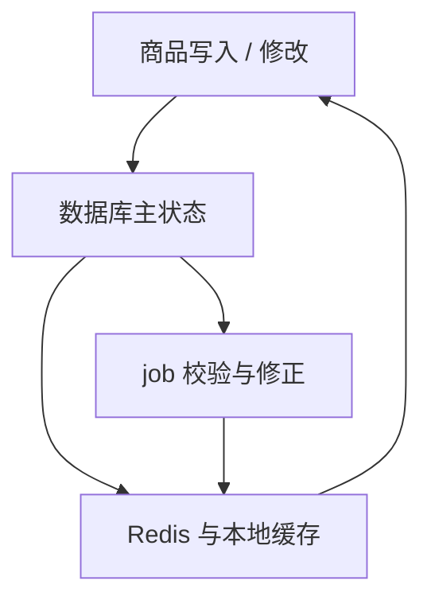

# Redis、MQ 与异步系统的最小必备认知

> **TL;DR**：这一篇不把 `Redis`、`consumer`、`job` 当成三块平行知识，而是把它们放回中台商品服务的同一套系统里理解。数据库仍然承接主状态，但 Redis 已经不只是简单缓存，而是在承接大量读路径数据和运行时结构。正因为如此，系统一边需要 consumer 去持续同步 Redis 和本地缓存，一边也必须靠 job 去主动校验、回填、修复和删脏数据。

---

## 数据库接住主状态之后，问题为什么还没有结束

第五篇已经把一件事讲清楚了：

- 主状态最终要落在数据库里
- 事务和一致性边界通常贴着一个明确业务动作
- 建模不是单纯设计表，而是在承接业务对象、状态和查询方式

但到这里，系统问题还没有结束。  
数据库把主状态接住了，不等于系统就会自然变简单。很多运行时复杂度，恰恰是从这里开始继续长出来的。

因为真实服务端很快会继续碰到这些问题：

- 同一个热点数据被反复读，数据库扛不住
- 一个主动作之后，还有很多后续责任，但继续同步做下去会让链路越来越长
- 有些问题不是"事件来了就处理"，而是"过一段时间还得再看一眼"

所以第六篇真正要解决的是：

- 为什么数据库承接了主状态之后，系统还会继续变复杂
- 为什么会出现 Redis、consumer 和 job
- 为什么这些东西不是在替代数据库，而是在重新分配运行时压力

### 用商品案例看这条链路

上面这些问题，放到商品服务里就是下面这张图：

- **怎么写进去**：商品的创建和修改首先落在数据库里，数据库承接的是商品的主状态，事务边界和一致性保证都收在这一步。
- **怎么缓存**：系统不会只靠数据库扛住所有查询。Redis 会把热点数据、映射关系、读路径上常用的结构重新组织起来；本地缓存则把一部分更近、更快的数据留在进程内。
- **修改后怎么同步**：主状态变了之后，系统不会把写库和刷新缓存全部塞进同一个同步链路。更常见的做法是先把主状态写对，再通过消息和 consumer 把变化尽量实时扩散到 Redis 和本地缓存。
- **job 怎么验证**：即使有实时同步，系统也还是可能出现层间不一致。所以 job 定期拿数据库主状态去对照 Redis 和缓存层，发现偏差后做回填、修正和清理。

一句话压实：**主状态以数据库为准，但系统不可能所有问题都靠数据库硬扛。**

把这条主线记住，后面再分别看 Redis、consumer、job，就不会觉得它们是在讲三个孤立组件，而是在共同维护同一条商品状态链路。第六篇后面几节，就是沿着这条链路展开三个问题：

- 高频读压力为什么会把系统推向 Redis
- 多层数据为什么会把系统推向 consumer
- 层间数据偏差为什么会把系统推向 job

---

## 第一部分：先讲 Redis

### 1. Redis 最常见到底在解决什么问题

刚接触 Redis 时，人们常把它理解成"缓存"或者"更快的数据库"。

但在中台商品服务里，这两种理解都只抓住了表象。  
如果只把 Redis 理解成"快一点的缓存"，就会低估它在系统里的分量。  
因为它承接的已经不只是一个缓存层，而是一整套读路径和中间结构。

表层最容易看到的是这些角色：

- 缓存热点商品数据
- 承接 `skuId -> spuId` 这类映射
- 承接价格、类目属性这类读路径数据
- 承接库存待处理集合这类运行时结构

这些角色放在一起看，会更容易明白 Redis 为什么会出现：

**它通常不是为了替代数据库，而是为了保护数据库和同步链路。**

### 2. 先分清商品的存储模型和 Redis 的存储模型

很多人一说 Redis，就会习惯性想到缓存。  
但在中台商品服务里，更关键的问题不是"有没有缓存"，而是：

- 数据库保存的到底是什么
- Redis 重新组织的又是什么
- 两套结构之间靠谁来转换

这里最容易混淆的是"存储模型"三个字。  
数据库里的模型，首先是为**主状态落库**服务的；它关心的是一条记录怎么存、一条记录怎么改、事务边界怎么收住。  
Redis 里的模型，则更多是为**读取路径和运行时处理**服务的；它关心的是一次查询要不要少拼装几次、一个映射要不要直接命中、一个待处理集合要不要快速拿出来。

所以，数据库和 Redis 并不是在保存同一种东西的两份拷贝。  
更准确地说：

- 数据库保存的是主状态
- Redis 保存的是围绕主状态展开的读模型和中间结构
- service / consumer 负责把前者转换成后者

一旦这样理解，很多现象就会立刻变清楚。  
系统引入 Redis，不只是为了"查得更快"，而是为了把一部分高频读取、映射关系和运行时结构从数据库侧拆出去。  
但代价也随之出现了：问题不再只是"缓存要不要更新"，而会变成：

**数据库、Redis、本地缓存这几层数据，怎么长期保持一致。**

### 3. 真正麻烦的不是缓存更新，而是多层数据一致性

一旦 Redis 承担的职责越来越重，系统就不得不补同步链、广播失效链、对账和回填 job，复杂度会明显上升。

如果 Redis 只是简单缓存，那你大概还会把问题表述成：

- 数据库更新了，缓存有没有一起更新

但在中台商品服务里，这个表述已经不够了。  
因为这里的系统更像是：

- DB 主状态
- Redis 共享数据层
- JVM 本地缓存

一旦变成这三层，真正麻烦的就是：

- 主库更新了，Redis 里的数据有没有跟上
- Redis 跟上了，本地缓存有没有失效
- 某次消息没消费成功，哪一层开始出现偏差
- Redis 里多出来的脏 key 和脏 field，谁来收

所以这里真正增加的复杂度，不只是"缓存一致性"，而是：

**多层数据一致性。**

---

## 第二部分：consumer 在这里承担什么责任

### 1. 这里的 consumer 不是在做业务，而是在追赶数据库里的最新状态

如果只看 consumer 的外形，很容易把它理解成"收到一条消息，做一点后续处理"。  
但在中台商品服务里，更准确的说法是：

**consumer 在做的不是业务主动作，而是在把数据库里的最新状态，尽量实时地同步到 Redis 和本地缓存。**

### 2. 为什么写库成功后，还要继续发消息

主库写成功，只代表**主状态已经落对**，并不代表 Redis 和本地缓存已经同步完成。

在这种架构里，一次写操作通常会被拆成两段责任：

- 事务内完成主状态变更
- 事务提交后，把"同步 Redis / 失效本地缓存"的后续责任交给异步链路

所以这里的消息不是"顺手发个通知"，而是在做职责切分：

- 写库链路先保证主状态正确提交
- consumer 再尽快把变化扩散到 Redis 和本地缓存
- 如果同步失败，问题也能明确落在异步层，而不是混在主事务里

换句话说，消息的作用不是增加一个花哨步骤，而是把"写对主状态"和"同步其他层"拆开处理。

### 3. 真正的复杂度是：不止一层数据

如果系统里只有 DB 和 Redis 两层，问题还相对简单。  
但中台商品服务里还明显有第三层：JVM 本地缓存。

这说明同一个主状态变更之后，系统里至少要做三件事：

- 主库写对
- Redis 数据跟上
- 本地缓存失效

这时 consumer 的职责就很清楚了：

- 不是"把业务办完"
- 而是"把主状态尽快扩散到其他层"

### 4. 即使有 consumer，系统仍然可能出现层间不一致

这一点是第六篇真正该往下讲透的地方。

即使你有：

- afterCommit 发消息
- consumer 刷 Redis
- broadcast 失效本地缓存

系统也仍然可能出现层间不一致。  
原因并不神秘：

- 消息可能漏投、延迟或者重复
- 消费可能失败或长时间重试
- 某一层写成功，另一层没有及时跟上
- Redis 里可能残留历史脏数据

所以 consumer 负责的是：

**实时追赶。**

而不是单独保证长期一致性。

---

## 第三部分：job 为什么不是附属任务，而是主动补完整性

### 1. 有了 consumer，为什么系统还需要 job

如果 consumer 已经能实时刷新 Redis 和本地缓存，一个自然的问题就是：

**为什么还要 job？**

答案其实就藏在前面那条逻辑里：  
consumer 负责尽量追赶，但它不负责证明系统长期绝对正确。

一旦系统里有多层数据，就总会有这些残留问题：

- 某条消息漏了
- 某次消费失败了
- 某个 Redis key 多出来了
- 某个 field 旧了，但实时链路再也不会碰到它

这些问题不会自己消失。  
所以系统需要一条完全不依赖"刚刚发生了什么事件"的主动修复链。

### 2. job 在这里做的，其实是对账、回填、修复、删脏数据

在中台商品服务里，job 的角色非常明确，而且不是"最后扫一下"那么轻。

如果只从职责上理解，这类 job 通常在做三件事：

- 先以数据库里的主状态为准
- 主动把 Redis 里的数据拿出来对比
- 一旦不一致，就直接回填修正

但工程里真正麻烦的，往往还不只是"回填正确值"，而是还要处理另一类问题：

- 清理 Redis 里多出来的整块脏数据
- 删除单个多余 field

这已经不是"缓存没命中回源一下"能解决的问题了。  
它说明 Redis 里承接的不是纯临时结果，而是需要被长期治理的一层数据。

所以这一节里，job 最值得强调的不是"定时跑"，而是：

**系统主动把已经出现偏差的数据拉回正确状态。**

### 3. 为什么这些问题不能只靠实时链路

只靠实时链路，最多能解决"现在发生了什么，就尽快同步什么"。  
但中台商品服务里的 job 说明，系统还必须解决另一类问题：

- 现在没有事件了，但 Redis 还是错的
- 现在没人再改这个类目属性了，但缓存里还留着历史脏 field
- 某次消费链断过一次，实时同步已经错过了

这也是为什么系统里一定会出现"数据检查""一致性扫描"这一类 job。

这类 job 最值得讲的，不是某段扫描实现，而是它背后的承认：

- 实时链路并不能保证系统长期没有层间偏差
- 所以系统必须接受一件事：

**除了实时同步，还要有周期性自查。**

### 4. job 和 MQ 的关系：不是替代，而是互补

很多团队讨论异步时，会下意识变成：

- 到底该 MQ 还是 job

但真实工程里，很多时候不是二选一，而是搭配：

- 平时靠 consumer 做实时同步
- 漏了、挂了、晚了，再靠 job 做对账、修复和清理

也就是说：

- consumer 更像实时同步 Redis 和本地缓存
- job 更像周期性主动修复

把它们放在一起看，异步系统才会完整。

---

## 最后把数据库、Redis、consumer、job 放在一起看

我觉得这一篇最后一定要把这四种机制放到同一个框架里比较，不然很容易只记住组件，不记得约束。

| 层次 / 机制 | 更适合什么 | 主要优点 | 主要代价 |
|---|---|---|---|
| 数据库 | 承接主状态 | 状态集中、事务边界清楚 | 扛不住所有高频读和多层数据需求 |
| Redis | 承接读路径数据和运行时结构 | 读快、共享数据灵活 | 一致性维护成本明显上升 |
| consumer | 实时同步 Redis 和本地缓存 | 让多层数据尽量跟上数据库里的最新状态 | 可能漏、可能失败、可能只跟上一部分 |
| job | 对账、回填、修复、删脏数据 | 能把长期积累的数据偏差拉回正确状态 | 时效性较差，系统治理成本更高 |

第六篇最重要的不是给出"标准答案"，而是形成一个更实际的习惯：

看到一个系统问题时，先问：

- 这是主状态问题，还是 Redis / 本地缓存这层数据问题
- 这件事需要实时追上，还是允许周期性修正
- 这里增加的复杂度，到底换来了什么收益

### 还要一起看的几类代价

一旦进入异步系统，常见问题就会变成另外一组：

- Redis 同步漏掉
- Redis 多出脏数据
- 本地缓存失效不及时
- 回填与修复链路复杂
- 时间窗口里的状态不一致

所以异步不是"更高级"，而是把局部简单换成全局复杂。

---

## 常见误区

### 1. 把 Redis 当成万能数据库

这样通常只会把主状态和短期状态混在一起。

### 2. 把 MQ 当成"发出去就算完成"

发消息只是把后续动作交给了另一个推进机制，不代表它已经完成。

### 3. 把 job 当成"最后兜底随便扫一下"

job 如果没有明确边界、扫描策略和幂等设计，往往会成为新的风险源。

### 4. 把异步理解成天然更快、更简单

异步通常只是让当前链路轻一点，但会把复杂度转移到运行时。

### 5. 只会从组件名选型，不会从约束选型

这是最常见的问题。  
真正应该先判断的不是"上 Redis 还是 MQ"，而是：

- 这是热点问题、并发问题，还是后续推进问题
- 这件事要实时做、事件做，还是定时补

---

## 写在最后

这一篇从头到尾都在讲一个事实：**系统的复杂度不是一次设计出来的，而是在解决真实问题的过程中一层一层长出来的。**

数据库扛不住高频读，于是引入 Redis；Redis 和数据库之间需要同步，于是引入 consumer；consumer 不能保证长期正确，于是引入 job。每一步都有合理的理由，但每一步也都在给系统增加新的代价。

这才是服务端工程最值得反复体会的地方：  
不存在一个"加了就变好"的组件，只存在"当下这个约束，用哪种方式换来最小代价"的权衡。能看到这一层，才算真正理解了为什么同样是写后端，有人只是在堆功能，有人却在做系统设计。

---

## 下一篇怎么接

这一篇解决的是系统运行时的复杂度是怎么出现的。  
但复杂度出现之后，紧接着就是另一个问题：**一旦这些层间关系出了问题，怎么验证、怎么观测、怎么定位、怎么安全上线。**

所以接下来建议写：

**《稳定性、测试、可观测性与上线基本功》**
