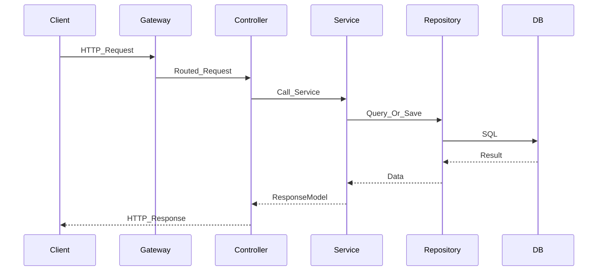

# Part 1：服务端基础与 Java 工程体系

> **TL;DR**：这一部分是整套学习文档的核心，目标不是“知道很多后端名词”，而是 **1 个月内具备参与 Java 服务端开发的最低可用能力**。我把内容压缩成 `8` 篇必修文，外加 `2` 篇可选扩展，优先保证“学完能用”，而不是“覆盖得全”。

## 为什么是这 8 篇

如果要让偏客户端/前端的同学在 1 个月内真正具备服务端开发能力，最重要的不是追求知识点最多，而是先打通一个最小闭环：

1. 知道服务端到底在解决什么问题
2. 知道一次请求在系统里怎么流动
3. 知道接口应该如何设计和约束
4. 知道 Java 和 Spring 如何承载这些约束
5. 知道数据和中间件为什么存在
6. 知道功能做完后怎么验证、观测、上线

这 8 篇就是围绕这个闭环组织的。

## 阅读顺序

| 顺序 | 标题 | 角色 |
|---|---|---|
| 1 | 服务端认知切换：从页面正确到系统正确 | 建立心智模型 |
| 2 | 一次请求的一生：从入口到返回的完整链路 | 建立链路地图 |
| 3 | HTTP 与 API 契约：状态码、错误码、幂等与兼容 | 建立接口思维 |
| 4 | 现代 Java 服务端够用指南 | 补齐语言基础 |
| 5 | Spring / Spring Boot 核心机制与标准分层 | 补齐主流框架骨架 |
| 6 | MySQL、事务与数据建模基础 | 补齐数据闭环 |
| 7 | Redis、MQ 与异步系统的最小必备认知 | 补齐中间件闭环 |
| 8 | 稳定性、测试、可观测性与上线基本功 | 补齐交付闭环 |

## 学习节奏

| 周次 | 目标 | 对应文章 |
|---|---|---|
| 第 1 周 | 先建立服务端心智模型和接口意识 | 1-3 |
| 第 2 周 | 补齐 Java 与 Spring 框架主线 | 4-5 |
| 第 3 周 | 补齐数据与中间件 | 6-7 |
| 第 4 周 | 补齐稳定性、测试、观测、上线 | 8 |

## 必修 8 篇详解

### 1. 服务端认知切换：从页面正确到系统正确

**目标读者**：刚开始从客户端/前端转服务端的研发同学。  
**TL;DR**：客户端更容易先关注“页面是不是对的”，服务端更需要先关注“系统长期是不是对的”。服务端设计的底层约束，不是组件怎么写，而是状态、一致性、失败和成本怎么控制。

**核心问题**
- 服务端到底在解决什么问题？
- 为什么“接口通了”不等于事情做完了？
- 为什么服务端更强调边界、失败、资源占用和长期维护？

**建议篇幅**
- `2500-3500` 字

**建议图表**
- “客户端心智 vs 服务端心智”对比图
- “功能成功 vs 系统成功”对比表

**验收标准**
- 读者能解释服务端的四个核心约束：状态、一致性、失败、成本
- 读者能说清为什么服务端问题经常发生在“功能之外”

### 2. 一次请求的一生：从入口到返回的完整链路

**目标读者**：已经知道接口是什么，但对服务端整体链路没有地图的同学。  
**TL;DR**：多数服务端知识点之所以学起来零散，是因为缺少一张“请求链路地图”。把一次请求从入口到返回走通，Java、Spring、DB、缓存、日志、异常处理就都能串起来。

**核心问题**
- 浏览器、客户端或前端发起请求后，服务端到底发生了什么？
- 网关、Controller、Service、Repository 分别在做什么？
- 日志、缓存、数据库、异常、返回值是在链路哪个位置发挥作用？

**建议篇幅**
- `3000-4000` 字

**建议图表**
- 一次请求的一生时序图

**验收标准**
- 读者能手画出一条典型请求链路
- 读者知道常见代码分层大致落在哪个环节

### 3. HTTP 与 API 契约：状态码、错误码、幂等与兼容

**目标读者**：已经开始接触接口开发，但对“接口设计好坏”没有清晰判断标准的同学。  
**TL;DR**：HTTP 不只是“发请求”，API 也不只是“把字段吐出来”。对服务端来说，接口是协作契约，是兼容性承诺，也是后续测试、联调、排障、自动化的基础。

**核心问题**
- HTTP 语义为什么不能随便用？
- 状态码、业务错误码、分页、版本兼容分别解决什么问题？
- 幂等为什么是服务端思维的核心组成部分？

**建议篇幅**
- `3000-4000` 字

**建议图表**
- HTTP 层错误与业务层错误分层图
- 幂等请求处理流程图

**验收标准**
- 读者能判断一个接口设计是不是“只可运行，不可维护”
- 读者能解释幂等、兼容性、错误码分层这些概念的实际工程价值

### 4. 现代 Java 服务端够用指南

**目标读者**：已经会写一点 Java，但离“能读项目代码、写业务代码”还差一段距离的同学。  
**TL;DR**：这里不做 Java 语法百科，而是只讲服务端开发里高频、真正会用到的部分。重点不是语法炫技，而是如何用 Java 更清楚地表达边界、意图和异常路径。

**核心问题**
- JDK 17/21 里哪些能力最值得服务端工程师优先掌握？
- Optional、集合、Stream、异常处理在工程里应该怎么用？
- 什么叫“表达意图”，而不只是“把代码写出来”？

**建议篇幅**
- `3000-4000` 字

**明确不展开**
- 不系统展开 JVM 调优
- 不展开并发底层实现细节
- 不做 Java 语法大全

**建议图表**
- “常见旧写法 vs 现代够用写法”对比表

**验收标准**
- 读者能看懂主流 Java 服务端项目里的基础语法和常见风格
- 读者能避免最常见的“语法会了但代码表达很糟糕”的问题

### 5. Spring / Spring Boot 核心机制与标准分层

**目标读者**：已经具备基础 Java 能力，准备进入主流 Java 服务端项目的同学。  
**TL;DR**：Spring 的价值不是“注解多”，而是提供了一套可管理依赖、组织分层、收拢配置和运行时行为的工程框架。理解 IoC、自动配置和分层职责，比背注解名字更重要。

**核心问题**
- IoC / DI 为什么会成为 Java 服务端主流范式？
- Spring Boot 自动配置到底在帮我们做什么？
- Controller、Service、Repository 为什么要分层，边界该怎么划？

**建议篇幅**
- `3500-4500` 字

**建议图表**
- Spring Bean 装配示意图
- Web 服务标准分层示意图

**验收标准**
- 读者能看懂主流 Spring Boot 项目的目录和基础配置
- 读者能解释一个功能应该落在哪一层，以及为什么

### 6. MySQL、事务与数据建模基础

**目标读者**：已经能看懂服务端代码，但对数据层理解还停留在 CRUD 的同学。  
**TL;DR**：服务端的很多复杂度，本质来自数据。表结构、索引、事务和一致性边界，决定了系统是不是能长期跑得稳，而不只是“当下能查出来”。

**核心问题**
- 表结构和索引为什么会直接决定接口性能和维护成本？
- 事务到底在保护什么？什么时候该收边界，什么时候别硬包？
- ORM、MyBatis、手写 SQL 各自适合什么场景？

**建议篇幅**
- `3500-4500` 字

**建议图表**
- 查询路径示意图
- 事务边界与一致性边界关系图

**验收标准**
- 读者能理解日常服务端开发里的基本表设计和索引思路
- 读者能看懂简单 SQL 性能问题和事务边界问题

### 7. Redis、MQ 与异步系统的最小必备认知

**目标读者**：开始接触缓存、消息队列，但容易把它们当成“高级组件”的同学。  
**TL;DR**：Redis 和 MQ 的价值不在于“技术更高级”，而在于帮助系统处理性能、解耦、削峰和失败恢复问题。真正要学的不是组件名字，而是它们分别在解决什么系统约束。

**核心问题**
- 为什么有了数据库还要有缓存？
- Redis 带来的收益和风险分别是什么？
- MQ 为什么会出现？同步和异步各自的代价是什么？

**建议篇幅**
- `3500-4500` 字

**建议图表**
- 缓存读写路径图
- 同步流程 vs 异步流程对比图

**验收标准**
- 读者能解释缓存一致性、消息重复消费、补偿这些概念
- 读者能判断一个问题更适合同步还是异步

### 8. 稳定性、测试、可观测性与上线基本功

**目标读者**：已经理解基本开发流程，但还没有形成“工程交付闭环”的同学。  
**TL;DR**：会写功能，只是服务端能力的一半。另一半是知道怎么防失败、怎么验证、怎么定位、怎么上线、怎么回滚。这部分是把“会开发”真正变成“能交付”的关键。

**核心问题**
- 为什么超时、重试、限流、降级要前置考虑？
- 日志、指标、Trace 各自解决什么问题？
- 单测、集成测试、回归、灰度、回滚应该如何分工？

**建议篇幅**
- `4000-5000` 字

**明确不展开**
- 不深入具体平台实现细节
- 不展开大型组织级发布体系
- 只保留普通研发完成需求所需的最小闭环

**建议图表**
- 日志 / 指标 / Trace 的观测分工图
- 发布、灰度、回滚的基本流程图

**验收标准**
- 读者知道功能做完后至少该如何验证和观测
- 读者理解服务端上线不只是“合并代码”这一个动作

## 2 篇可选扩展

### 9. 认证、鉴权与服务端安全边界

**适合什么时候加入**
- 团队的业务对权限、身份、审计、安全要求比较高
- 读者已经开始接触登录态、权限模型、接口安全边界

**为什么不放进首轮 8 篇**
- 重要，但不是所有团队在第一个月里都必须优先消化的主题
- 更适合作为首轮完成后的增强篇

### 10. 为什么 Agent 工程仍然要先补服务端基础

**适合什么时候加入**
- 团队准备从“会做服务端”进一步进入“会做 Agent 工程”
- 需要解释为什么 Agent 反而更依赖契约、观测、测试、运行时

**为什么不放进首轮 8 篇**
- 这篇更适合作为收束篇，帮助团队把服务端基础和后续 Agent 化转型连接起来
- 但如果放得太早，容易让首轮学习目标失焦

## 什么内容被刻意延后

为了严格控制 1 个月的学习负担，下面这些内容暂时不放进首轮必修：

- JVM 深水区与 GC 调优
- 复杂分布式事务
- 微服务治理大全
- WebFlux / 响应式编程
- DDD 全家桶
- K8s 深度运维
- 生产级 Agent 工程体系

这不是说它们不重要，而是当前阶段的目标不是“成为服务端专家”，而是“先能稳定参与服务端开发”。

## 单篇写作模板

为了让后续正文保持一致，我建议每篇都按这个顺序展开：

1. TL;DR
2. 这个主题解决什么问题
3. 底层机制 / 思维模型
4. 边界条件与常见误区
5. 一个最小工程案例
6. 学完后能做到什么
7. 延伸阅读 / 下一篇怎么衔接

## 写作边界提醒

- 第 4 篇只讲“服务端够用 Java”，不讲 Java 全家桶
- 第 8 篇只讲“普通研发可执行的最小交付闭环”，不讲平台治理大全
- 如果某个主题一旦写到“团队平台怎么实现”，优先挪到 Part 2
- 如果某个主题一旦写到“具体业务规则怎么变化”，优先挪到 Part 3
