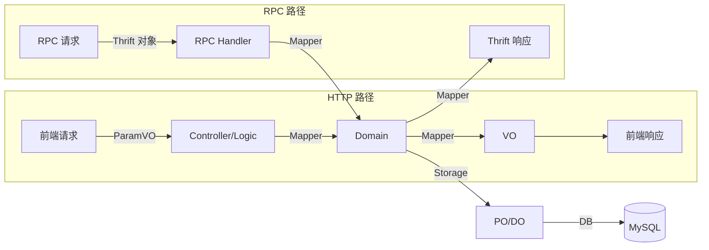
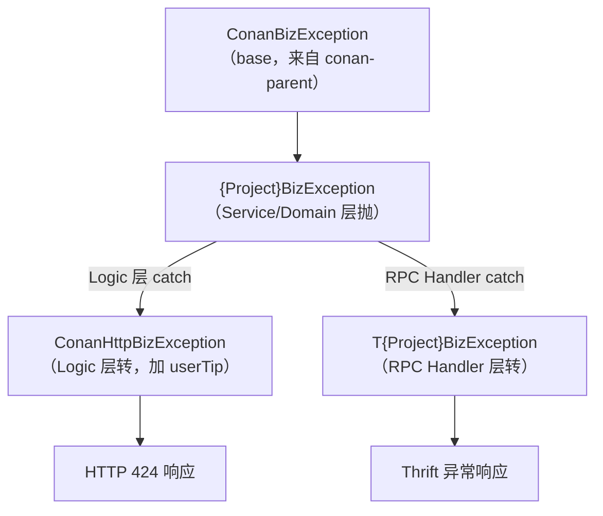
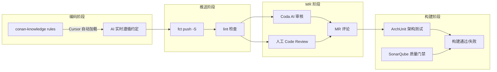

# 工程规范与编码约定速查手册

> **TL;DR**：这篇是"在公司项目里写代码"的约定速查手册。覆盖代码组织、命名、数据模型、接口层、异常、日志和 Storage 层的编码约定。写代码时遇到"该怎么写"的问题，回来翻对应章节。DB/Redis/MQ 的接入配置不在这篇，见第三篇。

---

## 1. 约定的三个层次

开始写代码前，先搞清楚一件事：公司里的约定不是一视同仁的，有的不遵守会编译失败，有的不遵守会被 Code Review 打回，有的只是"大家都这么写"。

| 层次 | 含义 | 后果 | 举例 |
|---|---|---|---|
| **工具强制** | 违反就编译/构建失败 | 代码推不上去 | conan-parent 版本锁定、ArchUnit 分层依赖检查、SonarQube 门禁 |
| **Review 守住** | 通过了工具，但 reviewer 会打回 | MR 被退回修改 | 接口设计不合理、异常处理模式不对、命名不规范 |
| **团队文化** | 不遵守不会挂，但建议对齐 | 代码风格不一致 | 注释风格、日志格式、代码组织习惯 |

后续各章的核心约定属于哪个层次：

| 约定 | 层次 |
|---|---|
| 组件包结构（service/storage/domain/proxy） | Review 守住 |
| 类命名后缀（Controller/Service/Storage） | Review 守住 |
| 数据模型分层（VO/Domain/PO） | Review 守住 |
| HTTP 路径映射规范 | Review 守住 |
| RPC Handler 异常转换模式 | 工具强制（不转会运行时报错） |
| 异常体系和错误码 | 工具强制 + Review |
| 日志级别使用 | 团队文化 |
| Storage 层 @Repository + COLUMNS | Review 守住 |

---

## 2. 组件内部的包结构

打开 `{project}-backend` 的一个 component，代码该放哪个包？标准结构如下：

```
component/{name}/
  service/        -- 业务服务（组件对外能力入口）
  storage/        -- 存储实现
    db/           -- MySQL 操作
    redis/        -- Redis 操作
    es/           -- Elasticsearch 操作
  domain/         -- 领域模型（业务实体、枚举、业务方法）
  proxy/          -- 外部服务代理（调其他服务的 RPC）
  producer/       -- 消息生产
```

### 速查：你的代码该放哪个包

| 你在做什么 | 放哪个包 |
|---|---|
| 写业务逻辑、组合多个 storage 调用 | `service/` |
| 写 SQL 查询、数据库操作 | `storage/db/` |
| 写 Redis 缓存操作 | `storage/redis/` |
| 定义业务实体、枚举、业务方法 | `domain/` |
| 调用其他服务的 RPC 接口 | `proxy/` |
| 发送 MQ 消息 | `producer/` |

### 常见踩坑

- **业务逻辑写在 storage 里**：storage 只做数据存取，不做业务判断
- **数据库操作写在 service 里**：SQL 应该收在 storage 中，service 调 storage 接口
- **proxy 里做了业务判断**：proxy 只负责调用和转换，业务决策在 service 层

---

## 3. 命名约定

### 类命名后缀对照表

| 位置 | 后缀 | 示例 |
|---|---|---|
| Controller | `Controller` | `LessonController` |
| Logic | `Logic` | `LessonLogic` |
| Service | `Service` | `LessonService` |
| Storage 接口 | `Storage` | `LessonStorage` |
| Storage 实现 | `Db{Name}Storage` | `DbLessonStorage` |
| Mapper | `Mapper` | `LessonMapper` |
| RPC Handler | `RpcHandler` | `LessonRpcHandler` |
| VO | `VO` | `LessonVO` |
| ParamVO | `ParamVO` | `CreateLessonParamVO` |
| Domain | 业务实体名 | `Lesson` |
| Thrift 对象 | `T` 前缀 | `TLessonQueryRequest` |

### 方法命名规则

| HTTP Method | 方法名前缀 | 示例 |
|---|---|---|
| GET | `get*` / `query*` / `list*` | `getLessonById` / `listLessons` |
| POST | `create*` / `update*` / `delete*` / `batch*` | `createLesson` |
| PUT | `update*` | `updateLesson` |
| DELETE | `delete*` / `remove*` | `deleteLesson` |

### 包命名

- 全小写，`component.{业务域名}`
- 例如：`component.lesson`、`component.order`、`component.pay`

### 常见踩坑

- Thrift 对象忘了 `T` 前缀 → 和 Domain 对象撞名
- VO 和 ParamVO 混用 → 返回值和入参共用一个类，后期改不动
- 方法名和 HTTP method 不匹配 → `@GetMapping` 配了个 `createXxx` 方法

---

## 4. 数据模型分层：VO、Domain、PO、Param、Thrift

公司里有这么多种对象，各自是什么、放在哪、什么时候用？

### 五种对象速查表

| 对象 | 位置 | 职责 | 关键注解 |
|---|---|---|---|
| **VO** | `{module}/web/data/` | HTTP 数据传输（给前端） | `@Data` `@ApiModel` `@ApiModelProperty` |
| **ParamVO** | `{module}/web/data/` | HTTP 请求参数 | `@Data` `@ApiModel` `@NotNull` `@NotBlank` |
| **Domain** | `backend/component/domain/` | 业务逻辑核心 | `@Data`，**不用** `@ApiModel` |
| **PO/DO** | `storage/db/entity/` | 数据库映射 | `@Data` |
| **Thrift** | `{project}-common/thrift/` | RPC 数据传输 | `.thrift` 文件定义 |

### 数据流转



### 简单场景 vs 复杂场景

**简单场景**（单表 CRUD，Domain 和表结构一一对应）：可以省略 PO，直接用 Domain 持久化。

**复杂场景**（Domain 是多个表的聚合体）：PO 必须独立存在。例如"订单"Domain 聚合了订单基础信息、订单商品、支付信息三张表的数据。

### MapStruct 映射标准写法

```java
@Mapper(componentModel = "spring")
public interface LessonMapper {

    @Mapping(target = "status", expression = "java(lesson.getStatus().toInt())")
    LessonVO toLessonVO(Lesson lesson);

    List<LessonVO> toLessonVOs(List<Lesson> lessons);

    Lesson toDomain(CreateLessonParamVO paramVO);
}
```

### 常见踩坑

- Domain 里加了 `@ApiModel` → Domain 不该暴露给前端
- PO 直接返回给前端 → 数据库字段变动会直接影响接口
- Thrift 对象和 VO 结构不一致 → 同一业务的 HTTP 和 RPC 输出应保持一致

---

## 5. HTTP 接口约定

写一个 Controller 方法，该遵循什么约定？

### Controller 基本要求

- 类注解：`@RestController` + `@RequestMapping` + `@Slf4j`
- 方法注解：`@Function`（描述接口语义和适用场景）
- VO 字段注解：`@Parameter`（标注语义和值范围）

### 路径映射规范

- Admin 模块：`/{project}/admin/{resource}`
- Web 模块：`/{project}/{client}/{resource}`

### Controller 最小模板

```java
@RestController
@RequestMapping("/api/{resource}")
@Slf4j
public class {Name}Controller {
    @Autowired
    private {Name}Logic {name}Logic;

    @GetMapping("/{id:[\\d]+}")
    @Function(semantic = "查询{Name}")
    public ResponseEntity<{Name}VO> get{Name}(@PathVariable Long id) {
        return ResponseEntity.ok({name}Logic.get{Name}(id));
    }
    @GetMapping("")
    @Function(semantic = "查询{Name}列表")
    public ResponseEntity<List<{Name}VO>> list{Name}(
            @RequestParam(defaultValue = "0") Integer page,
            @RequestParam(defaultValue = "20") Integer pageSize) {
        return ResponseEntity.ok({name}Logic.list{Name}(page, pageSize));
    }
    @PostMapping("")
    @Function(semantic = "创建{Name}")
    public ResponseEntity<Long> create{Name}(@RequestBody @Valid Create{Name}ParamVO param) {
        return ResponseEntity.ok({name}Logic.create{Name}(param));
    }
}
```

### 参数规范速查

| 参数类型 | 注解 | 格式要求 |
|---|---|---|
| 路径参数 | `@PathVariable` | `/{id:[\\d]+}` |
| 查询参数 | `@RequestParam` | 分页默认 `page=0, pageSize=20` |
| 请求体 | `@RequestBody @Valid` | 对象以 `ParamVO` 结尾 |

### 返回值规范

- 分页查询：`Page<*VO>`
- 列表查询：`List<*VO>`
- 单个对象：`*VO`
- 无返回值：`void`
- 统一使用 `ResponseEntity` 包装

### 权限控制

Admin 接口需要加 `@SupervisorSecure` 注解：

```java
@SupervisorSecure(
    project = SupervisorResourceConstant.PROJECT_{PROJECT},
    resource = SupervisorResourceConstant.RESOURCE_{NAME},
    operation = SupervisorOperationConstant.READ
)
```

### 常见踩坑

- 路由不以项目名开头 → 多服务部署时路径冲突
- 返回裸 `Map` → 缺少类型约束，前端无法生成 TypeScript 类型
- 缺少 `@Function` → 接口文档缺失语义描述
- `@RequestBody` 没加 `@Valid` → 参数验证注解不生效

---

## 6. RPC 接口约定

### Thrift 文件位置和命名

- 位置：`{project}-common/src/main/thrift/`
- 命名空间：`namespace java com.fenbi.conan.{project}.thrift`
- 请求结构体：`T{Name}Request`
- 响应结构体：`T{Name}Response`
- 异常：`T{Project}BizException`

### Thrift 定义最小模板

```thrift
namespace java com.fenbi.conan.{project}.thrift

struct T{Name}QueryRequest {
    1: optional i64 {name}Id,
    2: optional i32 pageSize = 20,
    3: optional i32 pageNum = 1
}

struct T{Name}QueryResponse {
    1: required list<T{Name}> {name}List,
    2: required i32 total
}

service T{Project}Service {
    T{Name}QueryResponse query{Name}(1: T{Name}QueryRequest request)
}
```

字段规则：所有字段默认 `optional`，编号一旦定义不可更改和删除，新增字段使用新编号。

### RPC Handler 标准写法

```java
@Service
@Slf4j
public class {Name}RpcHandler implements {Project}Thrift.Iface {
    @Autowired
    private {Name}Service {name}Service;

    @Override @LogObject
    public T{Name}Response get{Name}(@LogObject T{Name}Request request)
            throws T{Project}BizException, TException {
        try {
            // 参数转换 + 业务逻辑 + 结果转换
            return response;
        } catch ({Project}BizException e) {
            log.warn("业务异常: bizCode={}", e.getBizCode(), e);
            throw new T{Project}BizException()
                .setCode(e.getBizCode()).setMsg(e.getMessage());
        } catch (Exception e) {
            log.error("系统异常", e);
            throw new T{Project}BizException()
                .setCode({Project}BizErrCodeEnum.SYS_ERROR.toInt())
                .setMsg(e.getMessage());
        }
    }
}
```

### Proxy 层（调用方）标准写法

```java
@Component
@Slf4j
public class {Name}RpcProxy {

    @Autowired
    private {Name}ThriftClient client;

    public {Name} get{Name}(Long id) {
        try {
            T{Name}Response resp = client.get{Name}(new T{Name}Request().setId(id));
            return mapper.toDomain(resp);
        } catch (T{Project}BizException e) {
            log.warn("RPC业务异常: bizCode={}", e.getBizCode(), e);
            throw new {Project}BizException(
                {Project}BizErrCodeEnum.RPC_REQUEST_ERR, e.getMessage());
        } catch (TException e) {
            log.error("RPC调用异常", e);
            throw new {Project}BizException(
                {Project}BizErrCodeEnum.RPC_REQUEST_ERR, "RPC调用失败");
        }
    }
}
```

### 常见踩坑

- 异常没转成 `T{Project}BizException` → 调用方收到的是裸 TException，没有业务错误码
- Thrift 字段改了没重新编译 → `fct ct --private-field --proxy` 重新生成

---

## 7. 异常体系与错误码

### 异常体系全貌



### 各层异常处理模式

| 层 | 做什么 | 代码模式 |
|---|---|---|
| **Service** | 抛业务异常 | `throw new {Project}BizException(errCode)` |
| **Logic** | catch → 转 HTTP 异常 + userTip | `throw new ConanHttpBizException(e, "提示文案")` |
| **Controller** | 不处理，全局异常处理器兜底 | 框架自动返回 424 |
| **RPC Handler** | catch → 转 Thrift 异常 | `throw new T{Project}BizException().setCode(...).setMsg(...)` |
| **RPC Proxy** | catch → 按 bizCode 决策 | 根据错误码决定重试、降级或抛出 |

### 错误码分段规则

| 段 | 含义 | 示例 |
|---|---|---|
| 4000-4999 | 请求错误（参数非法、数据不存在等） | `PARAM_INVALID(4002)` |
| 5000-5999 | 系统错误（DB异常、内部错误等） | `SERVICE_ERR(5000)` |
| 6000-6999 | RPC 错误（调用超时、第三方异常等） | `RPC_TIMEOUT(6001)` |

### HTTP 424 返回格式

```json
{
    "timestamp": 1581296409619,
    "status": 424,
    "message": "请求失败，请稍后重试",
    "businessStatus": 4001
}
```

- `status`：统一 424（未占用的 HTTP 状态码，4xx 不触发运维报警）
- `message`：userTip，暴露给客户端的用户友好提示
- `businessStatus`：bizCode，调用方根据这个值做业务判断

### 常见踩坑

- Service 层直接抛 `RuntimeException` → 应使用 `{Project}BizException`
- Logic 层没提供 userTip → 前端展示了内部错误信息
- RPC Handler 的 catch 块丢了日志 → 异常被转换但没留下排查线索

---

## 8. 日志规范

### 日志级别速查

| 级别 | 什么时候用 | 示例 |
|---|---|---|
| **ERROR** | 系统异常，需要立即处理 | 数据库连接失败、第三方服务不可用 |
| **WARN** | 业务异常，需要关注 | 参数校验失败、数据不存在 |
| **INFO** | 重要业务操作的开始/结束 | "创建订单成功: orderId={}" |
| **DEBUG** | 调试信息，线上一般不开 | 中间计算结果 |

### 标准日志模式

```java
public void createOrder(CreateOrderParam param) {
    log.info("创建订单开始, userId={}", param.getUserId());
    try {
        Long orderId = orderService.createOrder(param);
        log.info("创建订单成功, userId={}, orderId={}", param.getUserId(), orderId);
    } catch ({Project}BizException e) {
        log.warn("创建订单失败(业务异常), userId={}, error={}",
                param.getUserId(), e.getMessage());
        throw e;
    } catch (Exception e) {
        log.error("创建订单失败(系统异常), userId={}", param.getUserId(), e);
        throw new {Project}BizException({Project}BizErrCodeEnum.SERVICE_ERR);
    }
}
```

要点：

- `log.warn` 业务异常 → 不用传 `e` 对象（避免刷屏），记 `e.getMessage()`
- `log.error` 系统异常 → **必须**传 `e` 对象打完整堆栈
- 使用占位符 `{}`，不要用字符串拼接

### traceId 自动串联

框架会自动在每条日志中注入 traceId，不需要手动处理。在 Octopus 上查日志时，用 traceId 可以串联一次请求的所有日志。

### @LogObject 注解

RPC Handler 的入口方法加 `@LogObject`，自动记录入参和出参，不用手动打日志。

### 常见踩坑

- catch 里只打 `e.getMessage()` 不打堆栈 → `log.error("失败", e)` 最后一个参数是异常对象
- 循环体里打 INFO 日志 → 1000 次循环刷 1000 条日志，改用 DEBUG 或批量汇总
- 敏感信息没脱敏 → 手机号、身份证必须脱敏后再打印

---

## 9. Storage 层编码约定

> 这一节只覆盖代码层约定（类怎么写、注解怎么用）。DB/Redis/MQ 的接入配置和多环境管理见第三篇。

### Storage 实现类基本要求

| 注解 | 用途 |
|---|---|
| `@Repository` | 标识为 Spring 数据访问组件 |
| `@ActuatorAnalysis` | 数据库操作监控 |
| `@Qualifier` | 指定具体的 DbClient |

### Storage 最小模板

```java
@Repository @Slf4j
@ActuatorAnalysis("db.conan_{project}.{entity}")
public class Db{Entity}Storage implements {Entity}Storage {
    private static final String COLUMNS = " id, name, type, status, dbctime, dbutime ";
    private static final RowMapper<{Entity}DO> ROW_MAPPER = (rs, i) -> {
        // 逐字段映射：rs.getLong("id"), rs.getString("name"), ...
    };
    @Autowired @Qualifier("conan_{project}DbClient")
    private DbClient dbClient;

    public {Entity}DO getById(long id) {
        String sql = "SELECT" + COLUMNS + "FROM {table} WHERE id = :id";
        return dbClient.query(sql,
            new MapSqlParameterSource("id", id), ROW_MAPPER)
            .stream().findFirst().orElse(null);
    }
    public long insert({Entity}DO entity) {
        String sql = "INSERT INTO {table} (name, type, status, dbctime, dbutime) "
            + "VALUES (:name, :type, :status, :dbctime, :dbutime)";
        GeneratedKeyHolder keyHolder = new GeneratedKeyHolder();
        dbClient.update(sql, toParams(entity), keyHolder);
        return keyHolder.getKey().longValue();
    }
}
```

### 表结构约定

| 约定 | 说明 |
|---|---|
| 主键 | `id BIGINT`，有序增长 |
| 时间字段 | 必须有 `dbctime`（创建时间）和 `dbutime`（修改时间） |
| NULL | 字段不允许 NULL |
| ENUM | 禁止使用 MySQL ENUM 类型，用 `TINYINT` / `SMALLINT` |
| 命名 | 表名小写下划线，字段名驼峰 |

### 常见踩坑

- `SELECT *` 代替具体列名 → 改为 `COLUMNS` 常量列出字段
- 忘记加索引字段条件 → 查询必须包含至少一个索引前缀字段
- 主库上用 `LIKE` 模糊查询 → 禁止在主库做模糊查询
- 循环内逐条查 DB → 改为批量查询接口

---

## 10. 这些约定是怎么被守住的

公司不是靠人记住所有规则，而是有一条完整的工具链在兜底。

### 工具链全景



### 各工具职责

| 工具 | 阶段 | 检查什么 |
|---|---|---|
| **conan-knowledge** | 编码 | Cursor 自动加载 rules，写代码时 AI 自动遵循约定 |
| **fct push -S** | 推送 | 自动跑 lint 检查，不过不让推 |
| **Coda** | MR | AI 代码审核，集成 Claude/Codex/Gemini，自动审查安全/逻辑/性能，在 MR 上发布总结报告和行内评论。[详细文档](https://confluence.zhenguanyu.com/pages/viewpage.action?pageId=1045774532) |
| **人工 Review** | MR | 接口设计合理性、异常处理模式、命名规范 |
| **ArchUnit** | 构建 | 分层依赖（Controller 不能调 Storage）、禁止循环依赖、注解使用规范 |
| **SonarQube** | 构建 | 代码质量门禁（重复代码、复杂度、潜在 bug） |

### 推代码前自查清单

- [ ] 类名后缀对不对（Controller/Service/Storage/RpcHandler）
- [ ] VO 有 `@ApiModel` 和 `@ApiModelProperty`，Domain 没有
- [ ] HTTP 接口有 `@Function` 描述
- [ ] RPC Handler 有 `@LogObject`，异常转成了 `T{Project}BizException`
- [ ] 异常码用了枚举，不是裸数字
- [ ] `log.error` 传了异常对象（不只是 `e.getMessage()`）
- [ ] Storage 用了 `COLUMNS` 常量，没有 `SELECT *`

---

## 11. 这篇之后

环境跑起来了、约定也知道了，下一步是把服务连上公司的真实基础设施：配置中心、多环境、DB/Redis/MQ 接入。这些内容在第三篇展开。
