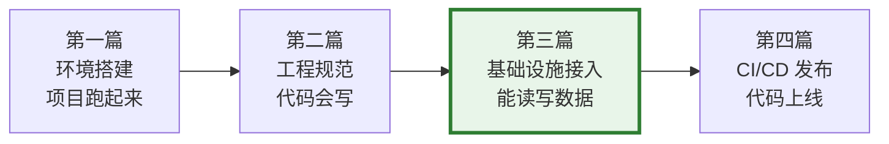
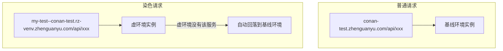

# 从配置到连接：运行时基础设施接入实操手册

> **TL;DR**：项目能跑起来了，代码也知道怎么写了，但还差最关键一步：连上公司的真实基础设施。这篇从 FDC 配置中心讲起，逐项走通 MySQL、Redis、MQ、xxl-job 定时任务的接入，每项都给"从申请到验证"的完整路径。读完之后，你的服务应该能在测试环境里真正读写数据、收发消息、跑定时任务。

---

## 在交付闭环里的位置

回顾 Part 2 的整体路径，这一篇处于从"能启动"到"能工作"的跃迁点：



第二篇讲的是"代码层约定"——Storage 类怎么写、注解怎么用。这一篇讲的是"基础设施层"——YAML 怎么配、资源去哪申请、DBKEY 是什么。

---

## 1. 核心认知：Key 托管模式

在展开具体接入之前，先理解公司基础设施接入的核心设计模式。

> 公司基础设施接入的统一模式是 **Key 托管** —— 你不直接在 YAML 里写连接串，而是通过一个 Key（DBKEY / esKey / redisKey）委托给 FDC 配置中心管理。这让运维能在不重启服务的情况下切换底层实例、做读写分离、做故障转移。

理解了这个模式，所有基础设施的接入都是同一个套路：

**申请资源 → 拿到 Key → YAML 里填 Key → 代码里注入 Client**

这也是为什么 FDC 必须第一个讲——它是所有 Key 托管的底座。

---

## 2. 公司运行时底座全景图

| 基础设施 | 公司组件 | 托管 Key | 申请入口 | 本篇覆盖 |
|---|---|---|---|---|
| 动态配置 | fenbi-dynamic-config-client | - | FDC 控制台 | 详细 |
| MySQL | commons-db / commons-datasource | DBKEY | [DBPaaS](https://dbpaas.zhenguanyu.com) | 详细 |
| Redis | commons-kv（推荐）/ commons-redis（旧） | redisKey | [DBPaaS](https://dbpaas.zhenguanyu.com) | 详细 |
| MQ | commons-alimq | - | [yone 工单](https://yone.zhenguanyu.com/process/ticket/create) | 详细 |
| 定时任务 | xxl-job（common-xxl-job-admin） | - | [xxl-job 管控台](https://commonxxl.zhenguanyu.com/common-xxl-job-admin) | 详细 |
| ES | commons-elastic6 / commons-elasticsearch | esKey | [DBPaaS](https://dbpaas.zhenguanyu.com) | 速查 |
| OSS | commons-oss / fenbi-oss-server | - | 工单 | 速查 |
| 鉴权 | commons-security | - | Console | 速查 |

---

## 3. FDC：动态配置中心

### 3.1 FDC 是什么

FDC（Fenbi Dynamic Config）是公司基于 Nacos 封装的动态配置中心，替代旧版 Captain。

它和 `application.yml` 的区别：YAML 是"编译时配置"，改了要重新部署；FDC 是"运行时配置"，在控制台改完立即生效，服务不用重启。典型用途：开关、限流阈值、白名单、灰度比例。

### 3.2 接入步骤

**Step 1: Maven 依赖**

```xml
<dependency>
    <artifactId>fenbi-dynamic-config-client</artifactId>
    <groupId>com.fenbi</groupId>
</dependency>
```

版本由 `conan-parent` 管理，不需要指定 version。同时确保 pom 中没有旧的 `captain-client`、`captain-spi` 依赖。

**Step 2: YAML 配置**

```yaml
fdc.projectIdentity: {project-name}    # gerrit/gitlab 中的项目名
captain.enabled: false                  # 关闭旧版 captain
spring.profiles.active: local,soho-test # 本地开发 profile
```

**Step 3: 使用 @DynamicConfig**

```java
@Service
public class {Project}DynamicConfig {
    @DynamicConfig(name = "enabledTypes", defaultConfig = "[1, 2, 3]")
    public static List<Integer> enabledTypes;

    @DynamicConfig(name = "timeout", defaultConfig = "1000")
    public static int timeout;
}
```

使用时直接通过类名访问：`{Project}DynamicConfig.timeout`。字段必须用 `public static` 修饰。

**Step 4: 回调（需要时才用）**

当配置变更后需要执行副作用操作（刷新缓存、重建连接池等），用 `@DynamicConfigCallback`：

```java
@DynamicConfigCallback
public void onChanged(
        @DynamicConfig(name = "businessConfig") Optional<String> config) {
    if (config.isPresent()) {
        // 有副作用的操作，如刷新缓存
    }
}
```

回调方法参数类型必须为 `Optional`，回调可能重复触发，需做幂等处理。

### 3.3 控制台操作

在 [Console 平台](https://console.zhenguanyu.com) 搜索项目 → 动态配置页面，可以：新建配置、编辑配置、查看历史和回滚。权限和 Console 项目权限一致。

### 3.4 常见坑

- **FDC 不支持空字符串**：空字符串会被当作 null，如果业务需要空字符串做标记，改用特殊占位符
- **无默认值且 FDC 上没配**：启动时会报错，`defaultConfig` 一定要给
- **Captain 迁移遗留**：如果项目是从 Captain 迁过来的，用 [diff 工具](https://infra-api.zhenguanyu.com/fdc-console/api/migrate/diff?projectIdentity=xxx&env=test&idc=soho) 确认配置一致

### 3.5 验证方法

启动日志中搜索 `DynamicConfig`，确认看到配置加载成功的日志。在控制台修改一个值，确认代码中读到的值已变化。

---

## 4. 多环境与虚环境

### 4.1 环境模型

| 环境 | Profile | 用途 | 基础设施隔离 |
|---|---|---|---|
| 本地 | `local,soho-test` | 本机开发调试 | 连测试环境的 DB/Redis |
| 测试 | `test` | 联调、集成测试 | 独立实例（物理隔离） |
| 线上 | `online` | 生产环境 | 独立实例（物理隔离） |

不同基础环境的 DB、Redis、MQ 实例**物理隔离**——测试环境的 DBKEY 和线上的 DBKEY 指向不同数据库。

在基础环境之上，公司还提供**虚环境（venv）**：一种弱隔离环境，通过**流量染色**让多人在测试环境上独立联调，不用排队往 deploy-test 合代码。虚环境共享基线的 DB/Redis，但 HTTP/RPC 请求链路独立。

### 4.2 虚环境与流量染色



染色流量优先路由到虚环境实例，该服务没有部署虚环境则回落基线。RPC 调用链遵循同样规则。

### 4.3 快速上手

```bash
fct venv deploy --name=my-feature --changeId=xxx   # 创建 + 关联 + 部署
fct venv -s                                         # 查看状态和拼接好的域名
fct venv -D my-feature                              # 用完销毁
```

更多命令见 `fct venv -h`。也可以在 [Console 虚环境页面](https://console.zhenguanyu.com/#/venv/venvs) 通过 GUI 操作。

**域名拼接规则**（仅支持三级域名）：`{标签名}--{三级域名}.{env}.{二级+一级域名}`

| 场景 | 原始域名 | 虚环境域名 |
|---|---|---|
| 测试 | `conan-test.zhenguanyu.com` | `my-feature--conan-test.rz-venv.zhenguanyu.com` |
| 线上 | `conan.zhenguanyu.com` | `my-feature--conan.online-venv.zhenguanyu.com` |

### 4.4 虚环境中的基础设施行为

| 基础设施 | 虚环境行为 | 注意事项 |
|---|---|---|
| HTTP/RPC | 流量染色隔离 | 虚环境没有的服务自动回落基线 |
| DB / Redis | **共享**基线实例 | 虚环境改了数据，基线也会受影响 |
| MQ | 需额外配置 | commons-alimq >= 2024.04.10 + Console 服务治理开启"分布式应用运行时"。详见 [MQ 虚环境 3.0 手册](https://confluence.zhenguanyu.com/pages/viewpage.action?pageId=505153377) |
| xxl-job | **不会自动触发** | 需在管控台手动指定虚环境机器 `ip:port` 执行 |

### 4.5 常见坑

- **虚环境默认 72 小时自动销毁**，超期需重建
- **标签名只允许 `a-z`、`0-9`、`-`**，禁止双横线（`--` 是 URL 分隔符）和 `stress` 前缀（压测保留）
- **本地调虚环境 RPC**：启动前设 `export FENBI_VENV=my-feature`，或 `fct venv -e my-feature && fct run <profile> --venv`
- **Profile 别混用环境**：本地 YAML 不要出现线上连接串

### 4.6 参考文档

- [虚环境接入步骤与管理平台使用](https://confluence.zhenguanyu.com/pages/viewpage.action?pageId=84545016)
- [MQ 虚环境 3.0 用户手册](https://confluence.zhenguanyu.com/pages/viewpage.action?pageId=505153377)
- [Console 虚环境入口](https://console.zhenguanyu.com/#/venv/venvs)

---

## 5. MySQL 接入

### 5.1 申请数据库

1. 去 [DBPaaS 平台](https://dbpaas.zhenguanyu.com) 提工单申请数据库
2. 测试环境和线上环境需要**分别申请**
3. 审批通过后拿到 **DBKEY**（如 `op_conan_{project}_test`）

### 5.2 项目配置（DBKEY 模式，推荐）

```yaml
db.datasource.conan_{project}:
    dynamicConfigEnabled: true
    dynamicConfigKey: ${your-dbkey}
    dynamicConfigGroup: op-dba-mysql-conf
    readWriteSplit: false

commons.db.forceWriter.enabled: true
```

自动装配会生成以下 Bean，注入时用 `@Qualifier` 指定：

```java
@Autowired
@Qualifier("conan_{project}.DbClient")
private DbClient dbClient;
```

Bean 命名规则：`{dataSourceName}.DbClient`、`{dataSourceName}.JdbcTemplate`、`{dataSourceName}.DataSourceTransactionManager`。

### 5.3 读写分离

当从库查询能分担主库压力时开启。配置只需一行：

```yaml
db.datasource.conan_{project}:
    readWriteSplit: true      # 开启读写分离
```

开启后，`DbClient#query` 默认走从库，`DbClient#update` 走主库。从库有秒级延迟，需要强一致性读时加 `@ForceWriter`：

```java
@ForceWriter
public void methodNeedConsistentRead() {
    // 该方法内所有 DB 操作强制走主库
}
```

### 5.4 最小验证

启动日志中搜索 `dynamicConfigKey`，确认看到连接成功。然后写一个简单的 Storage 类验证读写（Storage 类的代码规范见第二篇）。

### 5.5 常见坑

- **DBKEY 模式下连接池参数只能在 DBPaaS 上配，本地 YAML 中的连接池参数无效**
- **DBKEY 和本地配置不要混用**：一个数据源只能选一种模式
- **@Transactional 在读写分离下**：事务内所有操作自动走主库，这是正确行为
- **commons-db 和 commons-datasource 必须版本一致**：如果项目同时用了两个，对齐版本号

详见：[commons-db / commons-datasource 文档](https://confluence.zhenguanyu.com/pages/viewpage.action?pageId=480202626)

---

## 6. Redis 接入

### 6.1 申请 Redis 集群

1. 去 [DBPaaS 平台](https://dbpaas.zhenguanyu.com) 申请 Redis 集群
2. 自建 Redis 集群：审批后 DBA 通过邮件发送 **redisKey**
3. 阿里云 Redis：在 [DBPaaS 页面](https://dbpaas.zhenguanyu.com/#/ticket/createRedis/generateRedisKey) 自助生成 redisKey

### 6.2 项目配置

新项目用 **commons-kv**（推荐），旧项目可能还在用 commons-redis。

**Maven 依赖（版本由 commons-parent 管理）：**

```xml
<dependency>
    <groupId>com.fenbi</groupId>
    <artifactId>commons-kv-client-spring</artifactId>
</dependency>
```

**配置类（根据用途选择 Cache 或 Store）：**

```java
@Configuration
@ConfigurationProperties(prefix = "{project}Redis")
public class {Project}RedisConfig extends BaseCacheRedisConfiguration {
    @Override
    @Bean(name = "{project}RedisClient")
    public IRedisClient createRedisClient() throws RedisException {
        return super.createRedisClient();
    }
}
```

**YAML 配置：**

```yaml
{project}Redis:
    redisKey: ${your-redis-key}
    # timeoutMillis: 2000  # 默认 500ms，0.1.2+ 默认 2s
```

**注入使用：**

```java
@Autowired
@Qualifier("{project}RedisClient")
private IRedisClient redisClient;
```

### 6.3 常用操作速查

```java
// 基础读写
redisClient.set(key, value, expireSeconds, TimeUnit.SECONDS);
String val = redisClient.get(key);
redisClient.del(key);

// 分布式锁（用 DistributeLockHelper）
boolean locked = distributeLockHelper.tryLock(lockKey, 10, TimeUnit.SECONDS);
// ... 业务逻辑 ...
distributeLockHelper.unlock(lockKey);
```

Key 命名规范：`conan:{project}:{module}:{业务键}`，用冒号分隔命名空间。

### 6.4 常见坑

- **禁止使用 keys、flushall、flushdb 命令**：线上会阻塞 Redis
- **大 Key 问题**：单个 key 不超过 10KB
- **批量操作限制**：commons-kv 限制批量 keys 数量为 500
- **不要在异步方法的 thenRun 里执行 Redis 命令**：会阻塞 Redis IO 线程
- **不要用 redisson**：公司内部无人维护，监控报警基于 commons-kv 采样

详见：[commons-kv 文档](https://confluence.zhenguanyu.com/pages/viewpage.action?pageId=480202634)

---

## 7. MQ（RocketMQ）接入

### 7.1 申请 Topic 和 GID

在 [yone 工单平台](https://yone.zhenguanyu.com/process/ticket/create) 提工单申请。

**命名规范：**

| 资源 | 格式 | 示例 |
|---|---|---|
| Topic | `YFD_{TEAM}_{NAME}_{ENV}` | `YFD_CONAN_ORDER_TEST` |
| Producer GID | `GID_PID_{name}` | `GID_PID_CONAN_ORDER` |
| Consumer GID | `GID_CID_YFD_{PROJECT}_{NAME}_{ENV}` | `GID_CID_YFD_CONAN_ORDER_TEST` |

注意：**同一个 GID 不能订阅多个 Topic**，但一个 Topic 可以被多个 GID 订阅。

### 7.2 项目配置

**Maven 依赖（版本由 conan-parent 管理）：**

```xml
<dependency>
    <groupId>com.fenbi</groupId>
    <artifactId>commons-alimq</artifactId>
</dependency>
```

**YAML 配置：**

```yaml
aliMq:
  biz: conan
  producer:
    enabled: true
    topics:
      order_event:
        name: YFD_CONAN_ORDER_TEST
        tags: order_created
        cluster: standard
  consumer:
    enabled: true
    autoStart: true
    order_event:
      consumer:
        topic: YFD_CONAN_ORDER_TEST
        tags: order_created
        group: GID_CID_YFD_CONAN_ORDER_TEST
        cluster: standard
```

### 7.3 最小 Producer / Consumer

**Producer（发送普通消息）：**

```java
@Component
public class OrderMessageProducer {
    @Autowired
    private AlimqProducer alimqProducer;

    public void send(OrderEvent event) {
        alimqProducer.send(
            AlimqCluster.STANDARD,
            "YFD_CONAN_ORDER_TEST",
            event.getOrderId().toString(),  // messageKey
            event                            // body
        );
    }
}
```

**Consumer（消费普通消息）：**

```java
@Service
public class OrderConsumer extends AbstractSingleNormalConsumer<OrderEvent> {
    @Autowired
    private OrderService orderService;

    @Override
    protected ObjectTransformer<OrderEvent> createObjectTransformer() {
        return new JsonTransformer<>(OrderEvent.class);
    }
    @Override
    protected boolean doProcess(OrderEvent msg, MessageContext ctx) {
        try {
            orderService.handleOrderEvent(msg);
            return true;
        } catch (Exception e) {
            log.error("消费失败: orderId={}", msg.getOrderId(), e);
            return false;  // 返回 false 会触发重试
        }
    }
    @Override protected String topic() { return "YFD_CONAN_ORDER_TEST"; }
    @Override protected String consumerId() { return "GID_CID_YFD_CONAN_ORDER_TEST"; }
    @Override protected AlimqCluster aliMqCluster() { return AlimqCluster.STANDARD; }
    @Override protected String tags() { return "*"; }
}
```

延时消息和顺序消息的用法参见 [commons-alimq 完整文档](https://confluence.zhenguanyu.com/pages/viewpage.action?pageId=480202630)。

### 7.4 常见坑

- **消费者必须保证幂等**：MQ 是"至少投递一次"，同一条消息可能收到多次
- **重试机制**：普通消息默认重试 16 次，间隔递增；顺序消息失败后不断重试（间隔 1s），会阻塞同分区
- **版本要求**：强烈建议 commons-alimq 2022.12.1+，低版本可能产生消息分裂
- **蓝绿部署切流**：commons-parent 2023.09.0+ 支持 MQ Consumer 按实例切流

---

## 8. xxl-job：定时任务

### 8.1 公司的定时任务体系

公司统一使用 xxl-job 作为定时任务调度平台，对应 `{project}-job` 模块（与 `{project}-consumer` 并列，都属于异步处理层）。

管控台地址：
- 测试环境：`https://commonxxl-test.zhenguanyu.com/common-xxl-job-admin`
- 线上环境：`https://commonxxl.zhenguanyu.com/common-xxl-job-admin`

### 8.2 代码实现

在 `{project}-job` 模块下创建 JobHandler。四条强制规则：

1. **实现 `IJobHandler` 接口**
2. **使用 `@JobHandler(value = "...")` 注册**
3. **日志用 `XxlJobLogger`**（不用 `log.info`，否则管控台看不到日志）
4. **任务参数用 JSON 格式解析**

**最小 JobHandler 模板：**

```java
@JobHandler(value = "{Project}CleanupJobHandler")
@Component
public class {Project}CleanupJobHandler implements IJobHandler {
    @Autowired
    private {Project}Service service;

    @Override
    public ReturnT<String> execute(String param) throws Exception {
        XxlJobLogger.log("开始执行, param: {}", param);
        try {
            JobParam jobParam = JSON.parseObject(
                param == null ? "{}" : param, JobParam.class);
            int count = service.cleanup(jobParam);
            XxlJobLogger.log("执行成功, 处理: {} 条", count);
            return ReturnT.SUCCESS;
        } catch (Exception e) {
            XxlJobLogger.log("执行失败: {}", e.getMessage(), e);
            return ReturnT.FAIL;
        }
    }
}
```

### 8.3 管控台配置

代码部署到测试环境后，在 xxl-job 管控台完成任务注册：

1. **选择执行器**：找到项目对应的 executor
2. **新增任务**：运行模式选 `BEAN`，JobHandler 填代码中 `@JobHandler` 的 value（如 `{Project}CleanupJobHandler`），Cron 表达式填调度周期
3. **手动触发**：一次性任务可以在管控台直接"执行一次"
4. **查看日志**：点击任务的"日志"按钮，查看 `XxlJobLogger` 打印的内容

### 8.4 常见坑

- **大事务陷阱**：不要在 Job 内直接开大事务，用 Service 层分批处理
- **任务超时**：默认超时时间可能不够长跑批用，在管控台调大
- **虚环境中的 xxl-job**：虚环境的 Job 不会自动触发调度，需在管控台手动指定 `ip:port` 执行
- **JobHandler 命名重复**：不同类用了相同的 `@JobHandler(value = "...")`，后注册的会覆盖前一个

### 8.5 验证方法

1. 部署到测试环境后，在管控台确认执行器中有你的项目
2. 手动"执行一次"，查看日志确认 `XxlJobLogger` 输出正常
3. 确认返回 `ReturnT.SUCCESS`

---

## 9. 其他基础设施速查

以下每项给最小接入路径和关键链接，不展开讲。

### 9.1 ES（Elasticsearch）

| 项 | 内容 |
|---|---|
| 组件 | commons-elastic6（ES 6.x）/ commons-elasticsearch（ES 7.x） |
| 接入模式 | esKey（类似 DBKEY，通过 FDC 托管连接信息） |
| YAML | `es: { enabled: true, esKey: ${your-esKey} }` |
| 注入 | `@Autowired private FenbiEsClient fenbiEsClient;` |
| 申请 | [DBPaaS](https://dbpaas.zhenguanyu.com) 提工单 |
| 文档 | [commons-elastic6 接入文档](https://confluence.zhenguanyu.com/pages/viewpage.action?pageId=490343276) |

### 9.2 OSS（对象存储）

| 项 | 内容 |
|---|---|
| 组件 | commons-oss（直接调阿里云）/ fenbi-oss-server（STS 临时凭证） |
| 接入模式 | YAML 配置 + YKMS 密钥管理（不在代码里写 AK/SK） |
| 前端上传 | 通过 fenbi-oss-server 获取 STS 临时凭证后直传 OSS |
| 申请 | yone 工单申请 bucket |
| 文档 | 参见 oss-usage skill 或联系基础架构 |

### 9.3 鉴权（commons-security）

| 项 | 内容 |
|---|---|
| B 端鉴权 | `@SupervisorSecure(project=..., resource=..., operation=...)` |
| 服务间调用 | OpenAPI RefreshToken/AccessToken 机制 |
| 用户登录 | account 单点登录系统，cookie 自动解析 |
| 文档 | [接入 Security 鉴权](https://confluence.zhenguanyu.com/pages/viewpage.action?pageId=987548987) |

---

## 10. 接入综合自查清单

- [ ] FDC 依赖已添加，`fdc.projectIdentity` 配好了
- [ ] 测试环境 DBKEY 已申请，YAML 里填了 `dynamicConfigKey` 而不是 `url`
- [ ] Redis 集群已申请，commons-kv 配置就绪，`redisKey` 已填写
- [ ] MQ Topic / GID 已申请，命名符合 `YFD_{TEAM}_{NAME}_{ENV}` 规范
- [ ] xxl-job JobHandler 已注册，管控台能看到执行器
- [ ] 启动日志无连接异常
- [ ] 测试环境和线上环境使用不同的基础设施实例
- [ ] 敏感信息（密码、密钥）放在 FDC 而不是 YAML 里

---

## 11. 这篇之后

基础设施连上了，下一步是把代码从仓库真正发到测试环境和生产环境。第四篇讲 CI/CD、发布、灰度与回滚。

## 参考文档

- [FDC 动态配置文档](https://confluence.zhenguanyu.com/pages/viewpage.action?pageId=181244110)
- [commons-db / commons-datasource 文档](https://confluence.zhenguanyu.com/pages/viewpage.action?pageId=480202626)
- [基于配置中心的单体/读写分离接入文档](https://confluence.zhenguanyu.com/pages/viewpage.action?pageId=487462470)
- [commons-kv 文档](https://confluence.zhenguanyu.com/pages/viewpage.action?pageId=480202634)
- [commons-kv 分布式锁使用](https://confluence.zhenguanyu.com/pages/viewpage.action?pageId=328514276)
- [commons-alimq 文档](https://confluence.zhenguanyu.com/pages/viewpage.action?pageId=480202630)
- [commons-elastic6 接入文档](https://confluence.zhenguanyu.com/pages/viewpage.action?pageId=490343276)
- [接入 Security 鉴权](https://confluence.zhenguanyu.com/pages/viewpage.action?pageId=987548987)
- [Console 虚环境使用](https://console.zhenguanyu.com/#/venv/venvs)
- [xxl-job 管控台](https://commonxxl.zhenguanyu.com/common-xxl-job-admin)
- [DBPaaS 数据库平台](https://dbpaas.zhenguanyu.com)
