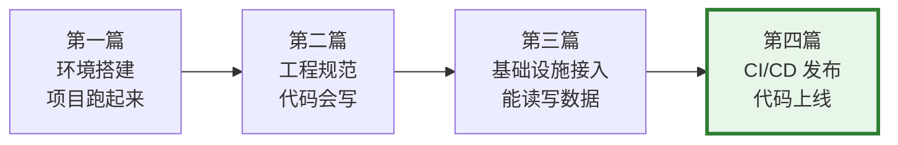
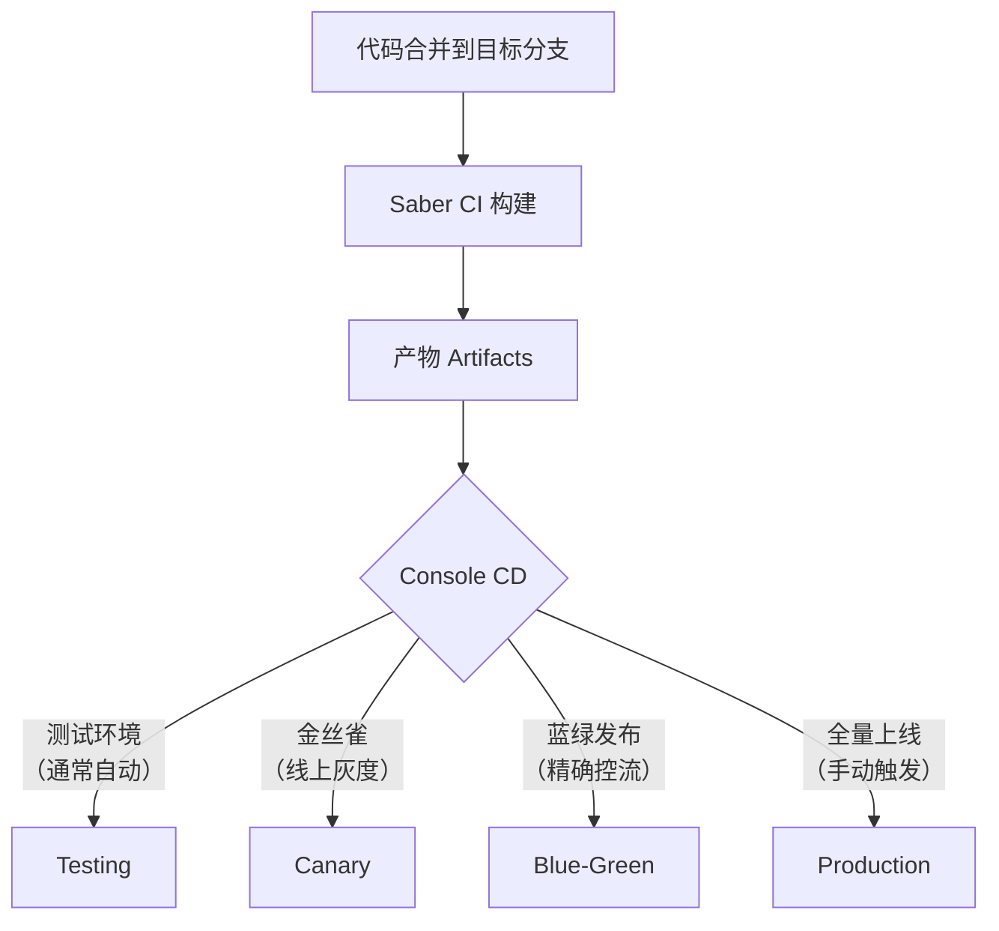
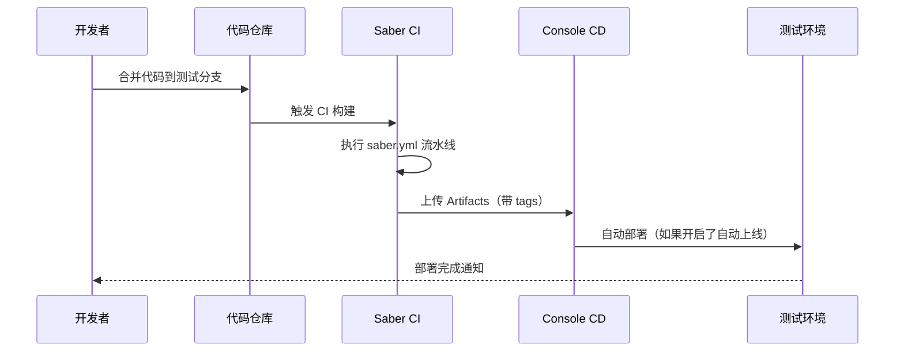
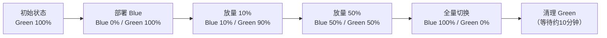

# 从代码到生产：CI/CD、发布与上线实操手册

> **TL;DR**：基础设施接好了，接下来是让代码真正跑到测试和生产环境。这篇分两部分：先 walkthrough 一遍 saber.yml 配置和 Console 部署设置，让你的第一次发布能成功；然后给一份上线 checklist，涵盖金丝雀/蓝绿灰度、观察要点和回滚决策，每次上线对照执行。

---

## 在交付闭环里的位置

回顾 Part 2 的整体路径，这一篇处于从"能工作"到"能上线"的跃迁点：



上线有三板斧：**可灰度、可观测、可回滚**。这是公司发布的核心信条——每次上线都必须能灰度验证、能看到监控指标、出问题能立即回滚。这三点贯穿这篇的所有内容。

---

## 1. 全景：代码从提交到上线经过了什么



核心概念速查：

| 概念 | 是什么 | 在哪操作 |
|---|---|---|
| Saber CI | 基于 Jenkins 的 CI 系统，通过项目根目录的 `saber.yml` 配置流水线 | Console 内嵌 |
| Console CD | 部署系统，管理测试/预发/生产环境的部署、灰度和回滚 | [console.zhenguanyu.com](https://console.zhenguanyu.com) |
| Pipeline | 一次 CI 构建的完整流程，由多个 Stage 组成，每个 Stage 包含若干 Job | Saber |
| Artifacts | CI 构建产物——Docker 镜像或 zip 包，通过 `tags` 映射到 Console CD 的部署环境 | Saber |
| 金丝雀 | 线上加一个新代码实例，和现有实例均匀接收流量，小流量验证 | Console |
| 蓝绿发布 | 新旧版本并行部署，通过流量权重逐步切换（0% → 10% → 50% → 100%） | Console |

---

## 2. 读懂你的流水线配置（saber.yml）

> 脚手架项目已经帮你配好了 `saber.yml`，通常**不需要从零编写**。这一节的目的是帮你读懂它，知道每段在做什么，以及少数需要改动的场景。

### 2.1 saber.yml 在哪里

`saber.yml` 放在**项目根目录**，Console 自动识别这个文件并触发 CI 构建。打开你项目的 `saber.yml`，你会看到类似这样的结构：

```yaml
version: 2.0
project_type: java
stages: [lint, build, sonar]

java-lint:
  image: .../yfd_lint:latest
  stage: lint
  script: [checkstyle]

java-build:
  image: .../yfd_java:latest
  stage: build
  script: [mvn package -U]
  artifacts:
    docker: true           # 打成 Docker 镜像交给 CD
    path: ["**/*"]
    tags: [default]        # 映射到 Console CD 的部署环境
```

核心三元素：**Stage**（执行顺序）→ **Job**（执行动作）→ **Artifacts**（构建产物）。同一 stage 内的多个 job 并行执行，前一个 stage 成功后才执行下一个。

### 2.2 你需要理解的关键字段

| 字段 | 含义 | 为什么重要 |
|---|---|---|
| `artifacts.docker` | 是否打成 Docker 镜像 | 设为 `true` 才能在 Console CD 中看到产物，Java 后端必须开启 |
| `artifacts.tags` | 产物标签 | 决定产物部署到哪个环境（见下表） |
| `only` / `except` | 触发条件 | 控制 job 在代码审查阶段还是合并后才执行 |

**tags 与部署环境的映射**：

| tags 值 | Console CD 环境 |
|---|---|
| `default` / `test` | 测试环境 |
| `online` | 生产环境 |
| `staging` | 预发环境（如果开启了预发布） |

### 2.3 触发规则：only / except

脚手架里默认配置了合理的触发策略：lint 每次提交都跑，build 只在合并后执行（避免代码审查阶段产生不必要的构建产物）。如果你需要了解细节：

| 目的 | 配置方式 |
|---|---|
| 每次提交都跑（如 lint） | 不加 only/except |
| 只在合并后执行（如 build） | `except: { events: [patchset-created] }` |
| 只在代码审查跑（如 sonar） | `only: { events: [patchset-created] }` |
| 只在特定分支构建 | `only: { branch: [master, test] }` |

### 2.4 虚环境构建

脚手架通常也配好了 `venv` 节点。需要注意：venv 节点**不能使用 `dependencies`**，它有独立的构建流程。关于虚环境的使用，见第三篇。

### 2.5 什么时候需要改 saber.yml

大部分情况下不用动。以下场景可能需要调整：

| 场景 | 改什么 |
|---|---|
| 新增一个需要独立部署的 module | 新增一个 build job + artifacts |
| 需要线上部署产物 | 确认 artifacts.tags 包含 `online` |
| 构建成功但 Console 无产物 | 检查 `docker: true` 或 `upload: true` 是否设置 |
| 代码审查阶段看到"无产物" | 正常行为——合并后才生成部署产物，不用处理 |

---

## 3. Walkthrough：Console 部署设置

### 3.1 项目在 Console 上长什么样

打开 [Console 平台](https://console.zhenguanyu.com)，搜索你的项目，首页主要包含：

- **概览**：项目基本信息、部署状态
- **流水线**：CI 构建历史和部署进度
- **容器状态**：各环境的运行实例和健康状况
- **设置**：部署配置、分支映射、自动上线等

**分支与环境的关系**：

| 分支类型 | 支持的环境 | 说明 |
|---|---|---|
| 主干分支（如 master） | 测试 + 预发 + 生产 | 在项目设置中指定主干分支 |
| 非主干分支（如 test） | 测试 + 预发 | 不支持直接部署到生产 |

### 3.2 测试环境自动部署

大部分团队会对测试环境开启自动部署，流程如下：



**开启方法**：Console → 项目设置 → 部署设置 → 开启"自动上线阶段" → 选择 Testing

**查看部署状态**：Console → 流水线列表 → 点击对应构建 → 查看各阶段进度和日志

### 3.3 线上部署（手动触发）

线上部署一般不开自动上线，需要手动触发：

1. 代码合并到主干分支
2. 等待 Saber CI 构建完成（Console 流水线列表出现新记录）
3. 在流水线中点击 Production 阶段的部署按钮
4. 等待部署完成，查看容器状态确认实例健康

> 等等——直接全量上线？不是说好了"可灰度"吗？接下来就讲灰度发布。

---

## 4. 灰度发布：金丝雀与蓝绿

### 4.1 金丝雀发布

金丝雀是最常用的灰度手段，适合大多数常规发布。

**原理**：在保持线上实例数不变的前提下，**额外增加 1 个新代码实例**（带 `canary` 标志），和现有实例均匀接收 HTTP、RPC、MQ 流量。

```
线上状态：10 个 A 版本实例
         ↓ 部署金丝雀
         10 个 A 版本 + 1 个 canary B 版本 = 11 个实例均匀接流量
```

**操作步骤**：

1. **开启金丝雀阶段**：Console → 项目设置 → 部署设置 → 开启 Canary 阶段
2. **部署金丝雀**：测试环境发布成功后，在流水线中点击 CANARY 阶段部署
3. **等待自动分析**：Console 自动执行金丝雀分析（默认 3 分钟），对比金丝雀实例与线上实例的关键指标
4. **查看金丝雀大盘**：在流水线详情页查看"金丝雀监控指标对比"

**金丝雀大盘中的三条线**：

| 线条 | 颜色 | 含义 |
|---|---|---|
| baseline-all | 绿色 | 服务集群整体指标 |
| baseline-(podName) | 黄色 | 线上单个 pod 的指标 |
| canary-(podName) | 青色 | 金丝雀 pod 的指标 |

**判断规则**：黄线与青线近似重合 → 金丝雀正常，继续全量上线；差别大 → 销毁金丝雀，暂停上线。

**销毁金丝雀的三种方式**：

1. 流水线列表页直接点"销毁"按钮
2. 容器状态 → Production → 找到带 `canary` 标志的容器销毁
3. 全量上线时自动销毁

### 4.2 蓝绿发布

蓝绿发布适合需要**精确控制流量比例**的场景，比金丝雀更精细。

**核心思想**：将"部署"和"发布"分离。



**流量控制机制**：

| 流量类型 | 控制方式 | 说明 |
|---|---|---|
| HTTP | Ingress 权重 | 通过 `nginx.ingress.kubernetes.io/service-weight` 控制两个 deployment 的流量比 |
| RPC | Naming 注册屏蔽 | 部署阶段屏蔽新版本的 Naming 注册，放量时逐步解除屏蔽 |

**回滚方式**：流量直接切回旧版本（权重归零），新版本实例立即清理。这比传统的"重新部署旧版本"快得多。

**注意事项**：

- 蓝绿版本是交替轮换的——蓝版本不等于新版本，下次发布可能是 green 变成新版本
- 发布状态成功后无法再切流量，需要重新发起蓝绿发布
- 销毁阶段老版本会等待约 10 分钟，期间无法发起新的蓝绿发布
- MQ 和 xxl-job 在蓝绿发布中的行为需要额外关注（MQ Consumer 按实例切流需 commons-parent 2023.09.0+）

### 4.3 金丝雀 vs 蓝绿：怎么选

| 维度 | 金丝雀 | 蓝绿 |
|---|---|---|
| 流量控制粒度 | 均匀分配（按实例数，约 1/N） | 精确比例（10%/50%/100%） |
| 操作复杂度 | 低（开启即用） | 中（需关注放量节奏和清理） |
| 回滚速度 | 销毁金丝雀实例 | 流量权重切回旧版本（秒级） |
| 资源开销 | +1 实例 | +N 实例（新版本完整副本数） |
| 适用场景 | **常规发布**，绝大多数情况用这个 | 大变更、性能敏感、需要精确控流 |

> **建议**：90% 的场景用金丝雀就够了。蓝绿发布在核心链路大变更、性能调优等场景才需要。

---

## 5. Checklist：上线发布流程规范

这一节对标公司《服务端上线发布流程规范》，格式化为可打勾的 checklist。每次上线前打印或复制这段对照执行。

### 5.1 准备阶段

- [ ] 代码 review 完成
- [ ] 整理上线计划（涉及的服务、表结构变更、配置变更、MQ 等资源）
- [ ] 梳理上线顺序和服务依赖关系
- [ ] 准备上线后回测用例
- [ ] 准备回滚方案（含数据回滚，如有表结构变更）
- [ ] 确认不在业务高峰期和节假日

### 5.2 灰度阶段

- [ ] **上线周知**：在项目群通知相关方

```
【通知】
【内容】xxx 服务即将开始发布
【预计发布时间】：
【预计影响】：
```

- [ ] **部署灰度**：金丝雀或蓝绿发布
- [ ] **观察监控指标**（异常则**立即终止上线**）：

| 指标 | 异常判断 |
|---|---|
| 服务流量 | 流量异常或无流量（新服务/接口除外） |
| 错误日志 | 持续有 ERROR 日志 |
| 接口 RT | 改动接口的 RT 超出预期 |
| 堆内存 | 使用率超过 90% |
| FullGC | 出现 FullGC |
| CPU | 使用率飙升不下降，或超过 40% |
| 慢 SQL | 稳定出现大量慢 SQL |
| Console 告警 | 有新增告警触发 |

### 5.3 全量阶段

- [ ] 灰度无异常后全量部署
- [ ] 全量后**持续观测不少于 5 分钟**（同上方指标）
- [ ] 线上功能回测
- [ ] **异常 → 立即回滚，不排查**

---

## 6. 回滚

### 6.1 回滚原则

> **出异常第一时间回滚发布！第一时间回滚发布！第一时间回滚发布！**
>
> 不要浪费时间排查问题，**恢复服务是第一要义**。

### 6.2 回滚操作

| 场景 | 操作 | 速度 |
|---|---|---|
| 金丝雀阶段 | 销毁金丝雀实例 | 秒级 |
| 蓝绿发布阶段 | 流量权重切回旧版本，清理新版本 | 秒级 |
| 全量部署后 | Console 流水线 → 选择上一个成功版本 → 重新部署 | 分钟级 |

回滚后务必确认：

- [ ] 服务已恢复（容器状态健康、流量正常）
- [ ] 错误日志停止增长
- [ ] 在项目群通知回滚结果

### 6.3 数据回滚注意事项

- 如果上线涉及**表结构变更**（DDL）或**数据刷写**（DML），需要同步回滚数据
- 回滚方案**应在准备阶段就写好**，不要等出问题再临时想
- 不可逆的数据操作（如删除数据、改字段类型）需格外谨慎，最好先备份

---

## 7. 构建排障速查

| 问题 | 检查点 |
|---|---|
| Console 没有构建记录 | `saber.yml` 是否在项目根目录；分支名是否正确 |
| 构建成功但 Console 无产物 | artifacts 是否配了 `docker: true` 或 `upload: true` |
| 测试环境没自动部署 | Console 设置是否开启了 Testing 自动上线 |
| 金丝雀部署后没流量 | 检查金丝雀实例是否启动成功（容器状态页面查看） |
| 蓝绿放量后部分请求异常 | 检查 RPC Naming 屏蔽配置是否正确解除 |
| 线上部署后服务异常 | **第一时间回滚**，然后看第五篇排障 |
| 构建失败日志在哪看 | Console → 流水线 → Build 环节 → Jenkins 日志链接 |
| 部署成功但服务没启动 | 容器状态页面查看实例日志，检查启动报错 |

---

## 8. 这篇之后

代码上线了，下一步是"线上出问题去哪看、怎么查"。第五篇讲日志、指标、Trace、告警与排障入口。

## 参考文档

- [Console 平台](https://console.zhenguanyu.com)
- [服务端上线发布流程规范](https://confluence.zhenguanyu.com/pages/viewpage.action?pageId=974934668)
- [Saber CI 配置文件格式说明 V2](https://confluence.zhenguanyu.com/pages/viewpage.action?pageId=75847946)
- [Saber CI 与 Phoenix CD 关系说明](https://confluence.zhenguanyu.com/pages/viewpage.action?pageId=102809222)
- [RFC - 蓝绿发布功能](https://confluence.zhenguanyu.com/pages/viewpage.action?pageId=303463468)
- [金丝雀发布使用指南](https://console.zhenguanyu.com) （Console 内嵌文档）
