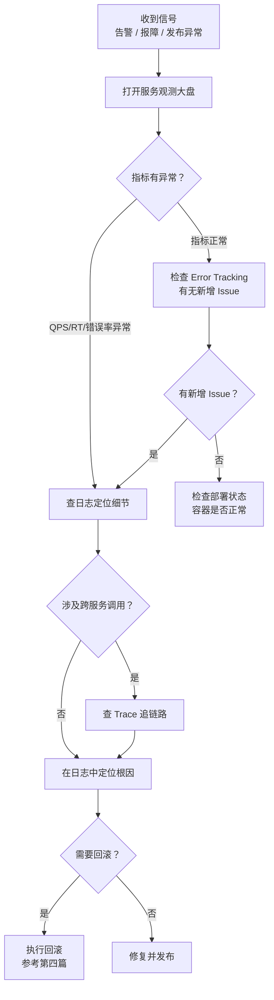

# 线上观测与排障实操手册

> **TL;DR**：Octopus 是公司统一的观测平台——**日志查细节、指标看趋势、Trace 追链路、告警做预警**。这篇给你一套从"收到异常信号"到"定位根因"的标准排障路径，所有查询示例都基于真实服务 `conan-commerce-course`，你可以直接在 Octopus 上复现。

---

## 在交付闭环里的位置


第四篇的上线 checklist 列了要观察的指标（流量/RT/错误率/CPU/GC/慢SQL），**这篇教你在 Octopus 里怎么找到它们、怎么判读、出了问题怎么一步步查到根因**。

---

## 全景：Octopus 的五个观测维度

先用一张表建立全景认知，后面各节逐一展开：

| 维度 | 解决什么问题 | 什么时候用 | Octopus 入口 |
|---|---|---|---|
| 服务观测（大盘） | 服务整体健康吗？ | 发布后第一眼、日常巡检 | 左侧导航 → 服务观测 |
| 日志 | 具体发生了什么？ | 排障最常用 | 左侧导航 → 日志搜索 |
| Trace | 一条请求经过了哪些服务？ | 跨服务问题、定位慢在哪 | 左侧导航 → Trace 搜索 |
| 错误追踪 | 有哪些错误在持续发生？ | 错误巡检、版本上线后检查 | 左侧导航 → Error Tracking |
| 告警 | 异常时主动通知 | 被动发现 → 主动预警 | 左侧导航 → 告警规则 |

> 💡 **Octopus 入口**：[https://octopus.zhenguanyu.com](https://octopus.zhenguanyu.com)，登录后左侧导航即可找到以上所有功能。

---

## 排障起点：服务观测大盘

### 怎么打开

在 Octopus 左侧导航选择「服务观测」，搜索你的服务名（如 `conan-commerce-course`），进入服务详情页。你会看到一组核心指标的时序图。

### 核心指标速查

| 指标 | 含义 | 正常参考 | 需关注信号 |
|---|---|---|---|
| QPS | 每秒请求量 | 有日夜波动，与业务节奏一致 | 突然归零、或异常尖刺 |
| RT（P99/P95/Avg） | 响应耗时 | 稳定在个位数 ms 到几十 ms | 突然翻倍或出现台阶式上升 |
| 错误率 | 错误请求占比 | < 0.1% | 超过 1% 或趋势上升 |
| CPU 使用率 | 容器 CPU 用量 | < 60% | > 80% 持续不降 |
| 内存使用率 | 堆内存 / 容器内存 | 稳定，无持续上升趋势 | 持续爬升（可能是内存泄漏） |
| GC | 垃圾回收频率和耗时 | Young GC 频繁但快，Full GC 极少 | Full GC 频繁或单次 > 500ms |

### 怎么读一张指标图

以 `conan-commerce-course` 的真实数据为例说明判读方法：

**QPS 图**：该服务 QPS 呈现典型的日夜波形——高峰期（上课时段）约 1200+ req/s，凌晨低谷约 70 req/s。如果你在高峰期看到 QPS 突然下跌到个位数，大概率是服务挂了或者流量被切走了。

**RT 图**：P99 稳定在 ~4ms，但某个时段跳到 ~8ms。这种"尖刺"值得关注——虽然 8ms 本身不算慢，但翻倍意味着可能有慢查询或下游超时。接下来的动作是去日志或 Trace 里查那个时段的具体请求。

**关键原则**：大盘告诉你 **"是否有问题"** 和 **"问题大概在哪个时间段"**，但不告诉你具体原因。定位细节需要切到日志和 Trace。

---

## 日志搜索：定位具体问题

日志是排障最常用的工具。Octopus 的日志搜索支持字段搜索、全文搜索、逻辑运算和模糊匹配。

### 搜索语法速查

**字段搜索**（key=value 形式，严格区分大小写）：

| 匹配符 | 含义 | 示例 |
|---|---|---|
| `=` | 等于 | `service=conan-commerce-course` |
| `!=` | 不等于 | `env!=test` |
| `>` / `>=` | 大于 / 大于等于 | `duration>1000` |
| `<` / `<=` | 小于 / 小于等于 | `duration<=500` |
| `in` | 包含多值 | `host in (host1, host2)` |
| `not in` | 排除多值 | `level not in (DEBUG, INFO)` |

> 注意：`>` `>=` `<` `<=` 仅支持分析字段（如 duration），不适用于普通文本字段。

**全文搜索**（直接输入关键词，大小写敏感）：

```
addCart                     -- 包含 addCart 的日志
"order creation failed"     -- 精确匹配整个短语（双引号）
```

**逻辑运算**（优先级：NOT > AND > OR，可用括号调整）：

| 运算符 | 说明 | 示例 |
|---|---|---|
| `AND` | 满足所有条件 | `service=conan-commerce-course AND level=ERROR` |
| `OR` | 满足任一条件 | `level=ERROR OR level=WARN` |
| `NOT` | 排除条件 | `NOT "health check"` |

**模糊匹配**（仅字段搜索，`*` 匹配任意字符）：

```
service=conan-commerce*     -- 匹配所有 conan-commerce 开头的服务
```

### 常见查询场景

**场景一：查某时段的 ERROR 日志**

```
service=conan-commerce-course AND level=ERROR
```

在时间选择器里选择你关注的时间范围（如发布后的 10 分钟）即可。

**场景二：通过 traceId 追踪一条请求的所有日志**

```
trace_id=c4773167d08718b2619718556185f75a
```

当你从 Trace 里拿到一个 traceId 后，用这个查询可以看到该请求在所有服务上打的日志。

**场景三：查某个用户的请求日志**

```
service=conan-commerce-course AND user_id=733750801
```

**场景四：查慢请求**

```
service=conan-commerce-course AND duration>1000
```

### 日志分析（绘图）

日志搜索不只能看列表，还能做分析统计。在搜索结果页点击「绘图分析」，可以对命中的日志做聚合计算：

| 能力 | 说明 |
|---|---|
| `count(*)` | 统计日志条数 |
| `avg(duration)` | 计算平均耗时 |
| `p99(duration)` | 计算 P99 耗时 |
| `count(*) group by host` | 按实例分组统计 |

例如，你想看每台实例上 ERROR 日志的分布：搜索条件填 `service=conan-commerce-course AND level=ERROR`，绘图选 `count(*) group by host`。如果某台实例的 ERROR 数远高于其他实例，大概率是该实例本身出了问题（磁盘满、GC 等）。

### 注意事项

- **日志保留期**：默认 **30 天**，超过后自动清理
- **两种搜索模式**：基础模式（图形化，有输入提示，不支持 OR）和高级模式（文本输入，支持完整语法）。推荐新手先用基础模式
- **特殊字符**：值中包含 `= > < * " ( )` 等特殊字符时，需用双引号包裹，如 `message="customCode=123"`

---

## Trace：追踪一条请求的完整链路

### 什么时候用 Trace（vs 日志）

- **日志**：看"单个服务内发生了什么"——某条请求的入参、出参、异常堆栈
- **Trace**：看"一条请求跨了哪些服务、每段耗时多少"——定位慢在哪、断在哪

### Trace 搜索语法

Trace 搜索**仅支持字段搜索**（key=value），语法与日志类似：

```
service=conan-commerce-course AND duration>500
```

常用字段：`service`、`operation`、`duration`（毫秒）、`status`（ok / error）、`trace_id`。

### 实战：从"接口 RT 高"到"定位慢 SQL"

以 `conan-commerce-course` 的真实 Trace 数据为例，走一遍排查路径：

**第一步：在 Trace 搜索中找到慢请求**

```
service=conan-commerce-course AND duration>500
```

**第二步：点击进入 Trace 详情，展开 Span 树**

你会看到类似这样的层级结构：

```
[入口] thrift.server - queryCourses        耗时 520ms
  └─ [内部] fenbi-thread-pool.internal     耗时 154ms
  └─ [出口] Mysql.query                    耗时 350ms
       SELECT * FROM course_lesson WHERE courseId IN (...)
```

**第三步：定位根因**

Span 树清晰地告诉你：520ms 的总耗时中，350ms 花在了 MySQL 查询上。下一步去检查这条 SQL 是否缺索引、数据量是否过大。

### 注意事项

- **Trace 保留期**：默认 **7 天**，比日志短得多
- **采样**：Trace 可能是采样的（非 100% 采集），如果找不到特定请求的 Trace，可以回到日志搜索用 traceId 查

---

## 错误追踪：哪些异常在持续发生

### 核心概念

Error Tracking 自动将**同类异常聚合为 Issue**——你不需要在海量日志中逐条翻找，它帮你归类好了。

| 概念 | 说明 |
|---|---|
| Issue | 一类错误的聚合，包含错误消息、堆栈、出现次数 |
| logCount | 该 Issue 在时间范围内出现的日志条数 |
| firstSeen | 该 Issue 第一次出现的时间 |
| 状态 | `unresolved`（待处理）/ `resolved`（已解决）/ `ignored`（忽略） |

### 怎么用

在 Octopus 左侧导航进入「Error Tracking」，选择服务和时间范围：

- **按 logCount 排序**：找到高频错误，优先处理影响面大的
- **按 firstSeen 排序**：找到新增错误，特别适合版本上线后检查"这次发布引入了什么新问题"
- **点击 Issue 详情**：可以看到典型的错误堆栈和关联日志，跳转到具体日志继续排查

### 适合场景

- **版本上线后**：立即检查 Error Tracking，看是否有 firstSeen 在发布时间之后的新 Issue
- **每周错误巡检**：团队定期过一遍 unresolved 的 Issue，分配负责人处理或标记为 ignored

> 💡 以 `conan-commerce-course` 为例，截至当前该服务在线上没有 unresolved 的 Issue——这就是一个健康服务的正常状态。大部分时候你看到的就是这样的"空列表"，说明一切正常。

---

## 告警：让问题主动找你

### 服务端项目的默认告警

服务接入 Octopus 后，通常已经有一些基础告警（如错误率突增、RT 突变）。你的第一步不是创建告警，而是确认**告警通知渠道**是否配置正确——一般是飞书群机器人。

### 告警规则的两种方式

| 方式 | 推荐度 | 原理 | 优点 | 缺点 |
|---|---|---|---|---|
| 基于指标（Metrics 打点） | ⭐ 推荐 | 代码中埋 Counter/Histogram，在 Octopus 上配告警规则 | 精确，不受日志内容变化影响 | 需要改代码埋点 |
| 基于日志 | 备选 | Octopus 从日志中生成 Metrics，再配告警规则 | 灵活，不用改代码 | 日志内容修改后告警规则可能失效 |

> 📖 **深入了解**：[配置告警规则时使用日志还是打点](https://confluence.zhenguanyu.com/pages/viewpage.action?pageId=757104932)——推荐使用指标打点，本质上两者都是通过 Prometheus Metrics 实现，但指标打点更稳定可靠。

### 告警静默

值班时遇到已知噪声告警（比如已在修复中的问题），可以在告警详情页点击「静默」临时屏蔽，避免干扰。静默有时间范围，到期自动恢复。

### Checklist：告警配置要点

- [ ] 确认服务的飞书告警群已正确配置
- [ ] 勾选「恢复时通知」——告警恢复了也要知道
- [ ] 核心业务链路配置独立的指标打点告警
- [ ] 定期检查告警规则是否仍然有效（特别是基于日志的告警）

---

## 排障 SOP：从信号到根因

### 决策流程



### 常见场景速查表

| 场景 | 先看什么 | 再查什么 | 关键搜索条件 |
|---|---|---|---|
| 接口 RT 飙升 | 服务观测 RT 图 | Trace（找慢 span） | `service=conan-commerce-course AND duration>1000` |
| 错误率突增 | 服务观测错误率图 | 日志（查 ERROR） | `service=conan-commerce-course AND level=ERROR` |
| CPU/内存飙高 | 服务观测资源图 | 日志（查 FullGC / 线程数） | 结合 GC 日志 + 容器监控 |
| 慢 SQL | 服务观测 DB 图 | Trace（找 MySQL span） | `service=conan-commerce-course AND duration>500` |
| MQ 消费堆积 | Consumer 服务观测 | 日志（查消费异常） | `service=xxx-consumer AND level=ERROR` |
| 服务无流量 | 服务观测 QPS 图 | 检查部署状态 | Console 容器状态 + 健康检查 |

---

## 这篇之后

到这里你已经掌握了"**看得到**"（服务大盘 + 告警）和"**查得清**"（日志 + Trace + 错误追踪）的全部技能。但线上问题不只是技术定位——还有止血决策、团队协作、值班轮转和故障复盘。这些内容将在后续的"故障处理与应急机制"中展开。

---

## 参考文档

| 资源 | 链接 |
|---|---|
| Octopus 平台 | [octopus.zhenguanyu.com](https://octopus.zhenguanyu.com) |
| Octopus 文档站 | [octopus-docs.zhenguanyu.com](https://octopus-docs.zhenguanyu.com) |
| 告警规则：日志 vs 打点 | [Confluence](https://confluence.zhenguanyu.com/pages/viewpage.action?pageId=757104932) |
| 创建日志/RUM/错误追踪告警 | [Confluence](https://confluence.zhenguanyu.com/pages/viewpage.action?pageId=923865947) |
| 服务接入 octopus-otel-java | [Confluence](https://confluence.zhenguanyu.com/pages/viewpage.action?pageId=831291554) |
