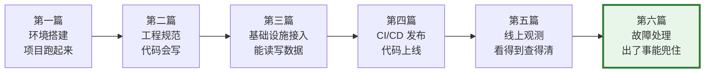
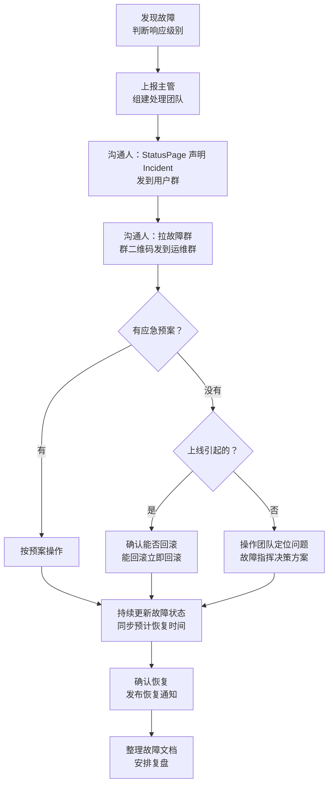

# 故障处理、值班协作与应急机制

> **TL;DR**：故障处理的核心原则——**恢复服务优先于确定原因**。值班不是"等出事"，而是主动巡检 + 快速响应。这篇给你一套从"收到告警"到"复盘改进"的完整闭环，案例基于口语课团队的真实故障。

---

## 在交付闭环里的位置



第五篇教了"看得到、查得清"——日志、指标、Trace、告警。**这篇教的是：看到问题之后，你该怎么办？** 从个人排查升级到团队协作止血，再到结构化复盘，这是交付闭环的最后一道防线。

---

## 1. 值班：你的第一次 oncall

值班的本质不是"坐在电脑前等告警响"，而是**主动巡检 + 快速响应**的组合。

### 你在报障链路里的位置

以口语课为例，一个用户问题到达研发手里要经过这条链路：

```
用户报障 → 顾问安抚收集信息 → 技术支持判断分类 → 研发定位修复
```

作为研发，你是链路的最后一环。技术支持会帮你过滤掉大量常见问题（重启、网络等），但以下情况会直接到你：
- **课内问题**：1 例即转研发，你自行判断是否发起故障响应
- **课外问题**：24 小时内超过 3 例，触发故障响应流程

### 值班日常巡检清单

| 频率 | 巡检项 | 关注什么 | 工具入口 |
|---|---|---|---|
| 每日 | 告警消息 | 新增告警是否需要处理 | 企微告警群 / Octopus 告警列表 |
| 每日 | 报障 case | darwin case 是否有新增 | [darwin 平台](https://darwin.zhenguanyu.com/) |
| 每日 | 服务运行时指标 | QPS / RT / 错误率有无异常趋势 | Octopus 服务大盘 |
| 每周一 | 上周故障汇总 | 整理故障、分析原因、scrum 会分享 | 值班文档 |
| 每周一 | 慢查询趋势 | 是否有新增慢 SQL，是否需要优化 | Grafana 慢查看板 |
| 每周一 | 运行时指标复盘 | 不符合预期的指标给出分析 | Grafana 运行时看板 |

### 响应时间要求

- **工作时间**：值班同学对告警**及时做出响应和处理**
- **非工作时间**：紧急告警（P0/P1）需立即响应；非紧急告警先回复处理时间，如"周一处理"
- **必做**：值班期间打开企微通知开关，确保能收到群消息和告警推送

---

## 2. 故障分级：P0-P3 意味着什么

故障分级不是事后贴标签，而是**决定你当下要投入多少资源**的判断框架。

### 通用分级矩阵

公司 [RFC(067)](https://confluence.zhenguanyu.com/pages/viewpage.action?pageId=798605295) 定义了基础框架：

|  | 周边功能 | 核心功能 |
|---|---|---|
| **严重故障** | P1 | **P0** |
| **轻微故障** | P2 | P1 |

- **P0**：核心功能严重故障（如服务不可用超 10 分钟）
- **P1**：核心功能轻微故障，或周边功能严重故障
- **P2**：周边功能轻微故障
- **P3**：用户无感知的其他故障

### 业务团队如何细化：口语课的量化标准

通用矩阵给了方向，但"严重"和"轻微"在不同业务里含义不同。口语课团队做了[量化细化](https://confluence.zhenguanyu.com/pages/viewpage.action?pageId=836994940)：

**核心流程**（购买 / 履约 / 上课 / 报告）：

| 级别 | 影响用户比例 | 影响用户数 | 两个条件 |
|---|---|---|---|
| P0 | >= 1% | >= 10 | 同时满足取最高 |
| P1 | >= 0.1% | >= 5 | 同时满足取最高 |
| P2 | >= 0.01% | >= 3 | 同时满足取最高 |

> 💡 **关键原则**：不确定级别时，按**可能导致的最坏后果**响应。先按高级别处理，故障恢复后再根据实际影响最终定级。

---

## 3. 故障发生时的 SOP

### 三条铁律

在展开流程之前，先记住这三条处理原则：

1. **P0 是团队最高优先级**——停下手中一切，立刻响应
2. **上线引起的问题，优先确认能否回滚**——不要先查原因，先止血
3. **恢复服务 > 确定原因**——故障处理以恢复为目的，复盘以找原因为目的

### P0 响应 SOP 流程



### 三个角色的分工

参考 Google SRE，故障处理中需要三种角色（小团队可以一人多角色）：

| 角色 | 职责 | 谁来担任 |
|---|---|---|
| **故障指挥** | 收集信息、判级别、组建团队、决策方案 | 通常是技术主管 |
| **沟通人** | 对外同步影响范围和处理进度、维护文档 | 故障指挥指定 |
| **操作团队** | 查原因、执行修复操作（紧急状态下唯一可改线上的人） | 相关研发 |

### 真实案例：口语课 2/9 P1 红包环节故障

用一个真实案例来走一遍 SOP。

**故障概况**：春节期间口语课试听课上线了"抓红包"互动活动。但用户进入红包环节后，老师引导流程结束后直接跳过了学生抓红包的交互阶段，播放结束语并进入大合影。影响 220 名试听课用户中的 16 名（其余用户未走到该环节）。

**时间线**：

| 时间 | 事件 | 对应 SOP 步骤 |
|---|---|---|
| 12/24 | 上线 click 指令自动交接控制权功能，按课程 ID 白名单灰度 | ——（隐患埋入） |
| 2/9 0:00 | 春节抓红包活动上线 | —— |
| 2/9 15:30 | 产品在 feature 群反馈回放表现异常 | 发现故障 |
| 2/9 15:35 | 根据用户日志开始排查，聚焦配置问题 | 操作团队定位 |
| 2/9 15:50 | 发现配置没变、部分课正常，拉更多同学排查 | 扩大排查范围 |
| 2/9 15:55 | 定位到 click 指令处理有课程 ID 灰度逻辑 | 找到根因 |
| 2/9 15:57 | 紧急修改线上红包环节配置，教研确认立即生效 | 止血（修改配置） |
| 2/9 19:30 | 对 3 个受影响房间进行数据修复 | 善后处理 |

**关键数字**：MTTD = **930 分钟**（从活动上线到发现），MTTR = 957 分钟，MTTL = 955 分钟。

**根因**：红包环节依赖"遇到 `click:` 指令自动交接控制权给前端"的功能，但这个功能只对**新生产的课**生效（走课程 ID 白名单灰度）。而红包是**动态插入所有课程**的，旧课不在白名单内，导致交接逻辑未生效，直接跳过了学生交互。

这个案例揭示了一个重要教训：**灰度策略的适用范围必须和功能的实际生效范围匹配**。一个按"新课"灰度的底层能力，被一个"全量课程"的业务功能依赖时，就会产生覆盖盲区。

---

## 4. 止血工具箱

止血的核心逻辑：**先恢复，再查因**。以下是常见止血手段的速查表：

| 场景 | 手段 | 操作入口 | 生效时间 | 备注 |
|---|---|---|---|---|
| 发布引起的问题 | 回滚上一版本 | Console 发布页 | 分钟级 | 参考第四篇回滚章节 |
| 需要关闭某功能 | FDC 降级开关 | FDC 控制台 | 秒级 | 需预先在代码中埋好开关 |
| 配置/资源错误 | 修改配置或回滚 | 对应管理后台 | 秒级 | 口语课 2/9 红包故障就是这种 |
| 流量突增 | 限流 | AHAS / commons-rate-limiter | 秒级 | 通过 FDC 动态调整阈值 |
| 下游服务异常 | 熔断降级 | Sentinel / 代码兜底逻辑 | 秒级 | 返回兜底数据而非报错 |

> 💡 **深刻认知**：止血手段的有效性取决于你是否**提前准备了预案**。每次发布前问自己：如果出问题，我能在 5 分钟内回滚或降级吗？如果答案是"不能"，说明预案还没准备好。

---

## 5. 协作与信息同步

故障处理不是一个人的事。信息同步做不好，技术能力再强也会延误恢复。

### 故障群的使用

P1 及以上故障需要拉**专门的故障群**（不要在日常群里讨论），作用有两个：
1. 处理故障的同学之间高效沟通
2. 对外统一同步信息

群建立后，把**二维码发到"斑马-产品研发部"和"斑马运维"大群**，让相关人员自行加入。

### 对业务方同步什么

每次状态更新至少包含：**影响范围** + **当前处理状态** + **预计恢复时间**。不知道预计时间就说"正在排查，预计 X 分钟内更新"。

### 信息断裂的代价：U10 走查案例

口语课曾发生一次"不算故障"但代价不小的事件：教研老师按计划走查 U10 全量 deepseek 课程，但实际走的还是 GPT——因为 deepseek 切换能力尚未上线，而产研团队对"教研什么时候开始走查"这个时间节点不敏感。

结果：三节课的走查全部无效，需要重新安排。改进措施：建立关键节点信息看板 + 生产流程状态管理机制。

> 教训很简单：**跨角色的关键时间节点，必须有显式的确认机制**，而不是"我以为你知道"。

---

## 6. 故障复盘：从事故中学习

> 每一起严重事故的背后，必然有 29 次轻微事故和 300 起未遂先兆以及 1000 起事故隐患。——海恩法则

复盘的目的是**团队自我检视**，从故障中找到技术、流程和平台上的不足并改正。**不是追责**。

### 哪些故障需要复盘

- P0 / P1 **必须**复盘
- 虽然没造成大面积影响，但属于明确故障隐患的问题，**建议**复盘

### 复盘文档模板

公司有标准的[故障复盘模板](https://confluence.zhenguanyu.com/pages/viewpage.action?pageId=766444506)，核心字段：

| 字段 | 说明 |
|---|---|
| MTTD | 故障从发生到**发现**的耗时 |
| MTTR | 故障从发生到**恢复**的耗时 |
| MTTL | 故障从发生到**定位根因**的耗时 |
| 故障时间线 | 详细记录发现 → 排查 → 处理每个时间点 |
| 故障原因 | 直接原因 |
| 5 Why 分析 | 沿因果链追到根因 |
| 短期 TODO | 必须 SMART：@具体人 + check 时间点 |
| 长期规划 | 用 Jira Story 跟进 |

### 5 Why 实战：口语课 2/9 红包 P1

用真实案例展示 5 Why 怎么做：

1. **为什么红包环节跳过了学生交互？** → `click:` 指令的自动控制权交接功能未生效
2. **为什么没生效？** → 该功能按课程 ID 白名单灰度，只对新生产的课生效；红包动态插入了所有课（含旧课）
3. **为什么用课程白名单做灰度？** → click 指令改动核心，短期无法回测所有旧课，决定只对新课生效
4. **为什么研发配置时没发现？** → 研发按"近期经验"配置（新课不需要额外的 `skip_record` 指令），忽略了旧课的差异
5. **为什么测试没发现？** → 测试环节只用新建的课验证，没有拿旧课回归

**短期 TODO**：复盘结果同步相关人员 + 删除红包功能代码。
**长期规划**：click 自动交接控制权的灰度机制下线或替换为更合适的方案（Jira ZLAI-15402 跟进）。

### 双月故障 Review 机制

除了单个故障的复盘，团队还有[双月故障 review](https://confluence.zhenguanyu.com/pages/viewpage.action?pageId=1039581774) 机制：

- 汇总期间所有故障到 review 文档（含非研发引起的）
- 确认 P0/P1 短期 TODO 完成状态
- 按责任团队统计 P0 / P1 / P2 / 低级故障数量
- 会上逐个过故障，先描述「故障现象」再分析原因
- 故障分类：代码 Bug / 流程规范 / 方案缺陷 / 错误操作 / 基础平台

---

## 7. 新人 Checklist：入职第一周完成

入职后不要等到第一次值班才开始准备。以下事项建议在第一周就完成：

- [ ] 确认自己在**告警通知群**和**报障群**里
- [ ] 了解团队**值班轮转表**，知道自己什么时候排班
- [ ] 在 Console 上走一遍**回滚操作**流程（参考第四篇）
- [ ] 知道团队的 **FDC 降级开关**在哪里，怎么操作
- [ ] 读一份团队**近期的故障复盘文档**，了解真实案例
- [ ] 确认企微通知已开启（工作时间 + 非工作时间紧急通知）
- [ ] 找到团队的**故障定级标准**文档，了解 P0-P3 的边界
- [ ] 理解报障链路：用户 → 技术支持 → 研发，**你在哪个环节、该做什么**

---

## 这篇之后

到这里，Part 2 的六篇已经形成了完整的能力闭环：

```
环境搭建 → 工程规范 → 运行时接入 → CI/CD 发布 → 线上观测 → 故障处理
```

从"第一行代码"到"能独立处理线上故障"，这就是 Part 2 要建立的完整链路。你已经具备了在公司内部基础设施上独立工作的基础能力——接下来的成长，更多来自实际项目中的积累和对业务的深入理解。

---

## 参考文档

| 文档 | 链接 |
|---|---|
| RFC(067) 故障响应定级和处理流程 | [Confluence](https://confluence.zhenguanyu.com/pages/viewpage.action?pageId=798605295) |
| 线上故障处理通用规范 | [Confluence](https://confluence.zhenguanyu.com/pages/viewpage.action?pageId=167986510) |
| 故障复盘模板 | [Confluence](https://confluence.zhenguanyu.com/pages/viewpage.action?pageId=766444506) |
| AI 口语课 - 故障定级标准 | [Confluence](https://confluence.zhenguanyu.com/pages/viewpage.action?pageId=836994940) |
| AI 口语课 - 故障处理流程 | [Confluence](https://confluence.zhenguanyu.com/pages/viewpage.action?pageId=878613084) |
| [P1] 口语课红包环节跳过学生交互流程 | [Confluence](https://confluence.zhenguanyu.com/pages/viewpage.action?pageId=1033037391) |
| 双月故障 Review | [Confluence](https://confluence.zhenguanyu.com/pages/viewpage.action?pageId=1039581774) |
| 限流降级预案 | [Confluence](https://confluence.zhenguanyu.com/pages/viewpage.action?pageId=121088748) |
