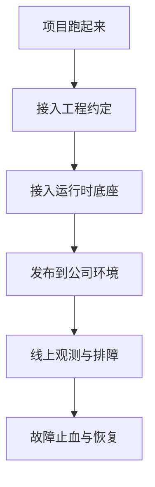

# Part 2：公司内部基础设施

> **TL;DR**：`Part 1` 解决的是“懂不懂通用服务端”的问题，`Part 2` 解决的是“能不能在公司环境里真正把东西做出来、发出去、查清楚”的问题。这里不按平台名字拆文档，而按公司内的**交付闭环**组织：项目怎么跑起来、底座怎么接、服务怎么发出去、问题怎么查、事故怎么止血。

## 为什么 Part 2 要换一种组织方式

如果 `Part 2` 只是按平台拆成一组说明书，很容易变成：

- 一篇配置平台
- 一篇日志平台
- 一篇发布平台
- 一篇权限平台

这样当然方便查资料，但不方便建立整体认知。  
读者最后记住的通常只是平台名字，却不知道：

- 自己在什么时候该用它
- 它和前后步骤是什么关系
- 出问题时该先查哪个入口

所以 `Part 2` 更适合按**交付闭环**来组织，而不是按平台分类来组织。

`Part 1` 的最后一篇已经把问题收束到“交付闭环”：测试、可观测性与安全上线。  
`Part 2` 就继续往前走一步，回答：**公司到底是用哪些基础设施，把这条交付闭环接住的。**

## Part 2 的总主线

从公司环境的视角看，一个服务真正落地，至少要经过下面这条线：

这条线不是“平台使用顺序”，而是“一个研发把服务真正做出来、发出去、查清楚”的顺序。

## 建议的 6 篇结构

### 1. 开发环境、脚手架与项目启动

**它解决什么问题**：拿到一个项目后，怎样在公司环境里真正跑起来。  
**为什么放最前面**：如果连项目都跑不起来，后面的配置、发布、观测都没有落点。  
**后续输入来源**：

- 项目模板
- 本地开发文档
- 启动脚本说明
- 新人 onboarding 材料

### 2. 工程规范、目录约定与团队默认做法

**它解决什么问题**：为什么公司里的项目长得这么像，以及哪些约定不是“个人风格”，而是团队默认基础设施的一部分。  
**为什么放第二篇**：项目能跑起来之后，下一个问题不是“怎么加功能”，而是“怎么按公司方式写”。  
**后续输入来源**：

- 模板工程
- 编码规范
- 分层约定
- HTTP / RPC / 异常 / 日志统一规范

### 3. 配置中心、多环境与基础设施接入

**它解决什么问题**：服务在公司环境里怎么真正连上 DB、Redis、MQ、搜索、鉴权等运行时底座。  
**为什么单独成篇**：这是从“能启动”走向“能在真实环境里工作”的关键跃迁。  
**后续输入来源**：

- 配置中心文档
- 多环境说明
- DB / Redis / MQ / 搜索接入文档
- 权限与鉴权底座说明

### 4. CI/CD、发布、灰度与回滚

**它解决什么问题**：代码怎样从仓库真正进到测试、预发和生产环境。  
**为什么放在这里**：底座接好之后，才谈得上真正交付。  
**后续输入来源**：

- CI/CD 流水线说明
- 发布平台文档
- 灰度与回滚流程
- 发布 checklist

### 5. 日志、指标、Trace、告警与排障入口

**它解决什么问题**：线上出问题后，第一步去哪里看，第二步看什么，最后怎么缩小范围。  
**为什么不是平台说明**：这里更重要的是“排障方法”而不是“工具功能大全”。  
**后续输入来源**：

- 日志平台文档
- 指标/监控平台说明
- Trace 平台说明
- 告警规则与常见排障手册

### 6. 故障处理、值班协作与应急机制

**它解决什么问题**：问题已经发生时，公司环境里怎样止血、恢复、协作和复盘。  
**为什么是最后一篇**：这是整个交付闭环的最后一道防线。  
**后续输入来源**：

- 故障预案
- 值班手册
- 降级/切流/回滚操作说明
- 事故复盘模板

## 为什么不建议再按平台拆得更碎

如果一开始就拆成很多平台文档，`Part 2` 很容易退化成“内部链接导航页”。  
但真正需要建立的是这样一种理解：

- 项目为什么跑不起来
- 底座为什么接不上
- 发布为什么会失败
- 线上为什么查不到
- 故障发生时为什么容易慌

也就是说，`Part 2` 的核心不该是“记住公司有哪些平台”，而该是：

**理解公司是用哪些基础设施，把服务端工程里的复杂性接住的。**

## 每篇基础设施文档必须回答的 4 个问题

### 1. 它解决什么问题

不要一上来介绍平台页面长什么样，而要先回答：  
**为什么公司需要这个基础设施？如果没有它，会出现什么问题？**

### 2. 默认怎么接

面向一线研发，最重要的信息通常不是“系统架构图”，而是：  
**我在一个实际项目里，该怎么把它接进来？**

### 3. 常见坑是什么

基础设施最容易掉坑的地方通常不是文档里写得最全的部分，而是那些默认成立、但实际经常不成立的前提，比如：

- 权限没开通
- 配置没生效
- 环境不一致
- 发布脚本跑通了但服务没真正可用
- Trace 查不到、日志打不全、告警不触发

### 4. 出问题怎么查

这是基础设施文档最容易缺失、但最有价值的一部分。  
真正决定文档实用性的，不只是“怎么接入”，而是“接入之后出问题该去哪里排查”。

## 单篇写作模板

后续每篇基础设施文档，建议统一用下面这个结构：

1. TL;DR
2. 它解决什么问题
3. 在交付闭环里的位置
4. 默认接入路径
5. 最小示例或最小流程
6. 常见坑与失败路径
7. 排障入口与检查清单
8. 与 `Part 1` 哪些通用能力有关

## 需要你后续提供的材料

为了把这一部分从结构占位升级成正式目录，我后续需要以下输入：

- 公司内部基础设施相关文章
- 项目脚手架或模板说明
- 配置 / 权限 / 发布 / 监控 / 告警相关平台说明
- 故障预案、值班手册、回滚流程
- 如果有的话，内部 Agent / AI 平台能力文档

## 当前状态

- 这一部分先不展开正文
- 当前先确定整体组织方式和篇序
- 等材料输入后，再逐篇压成正式文档
