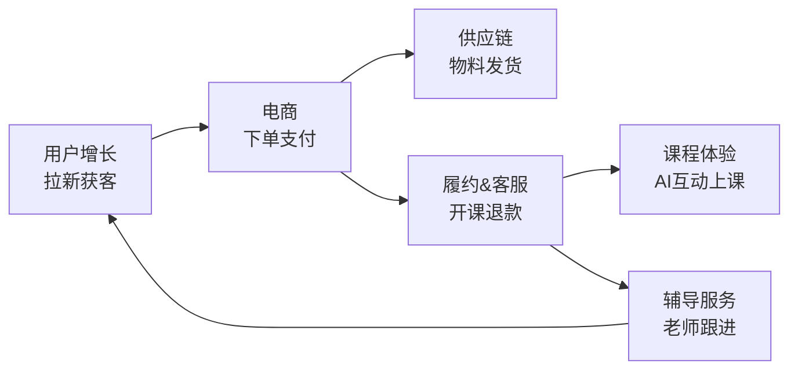

# 业务全景地图：斑马研发团队在做什么

> **TL;DR**：斑马的核心业务是面向 2-8 岁儿童的 AI 互动课程。从用户视角看，完整链路是"获客 → 下单 → 发货 → 开课 → 上课 → 辅导服务"。6 个研发团队各负责其中一段，通过订单消息和 RPC 调用串联。新人看完这篇，接到任何需求都能定位到"这事归哪个团队、上下游是谁"。

---

## 一句话理解斑马

斑马是猿辅导旗下面向 2-8 岁儿童的在线教育产品。用户通过 App 购买 AI 互动课程（英语、思维、阅读、美术、书法、音乐等学科），系统完成开课、发物料，辅导老师跟进学习进度和续费。

**商业模式本质**：用增长手段获取用户 → 电商系统完成交易 → 履约系统交付课程和物料 → 辅导服务促进留存和续费 → 形成闭环。

## 用户旅程与团队职责

从一个用户被"老带新"活动吸引、到最终续费系统课，完整链路经过以下 6 个团队：

最后一条虚线：辅导服务通过续费沟通和"推荐有礼"活动，把满意用户重新导入增长漏斗，形成闭环。

## 各团队速览

### 用户增长

**一句话**：通过转介绍、投放、分销等方式获取新用户并转化为付费用户。

- 核心系统：活动系统、任务系统、锁粉（推荐关系绑定）、风控系统、动态域名
- 关键流程：用户分享海报 → 被邀请人扫码领课 → 付费后给邀请人返佣
- 上游：无（漏斗入口）
- 下游：电商（用户进入购买流程）
- 零一说：[第一期 增长获客之转介绍](https://confluence.zhenguanyu.com/pages/viewpage.action?pageId=441683945)、[第十三期 广告投放业务分享](https://confluence.zhenguanyu.com/pages/viewpage.action?pageId=638124271)

### 电商

**一句话**：提供商品管理、交易下单、支付、营销促销的全链路电商能力。

- 核心系统：商品系统（SPU/SKU）、交易系统（订单状态机）、支付系统、营销系统（优惠券/价格策略）
- 关键流程：浏览商品 → 营销计价 → 创建订单 → 发起支付 → 支付成功消息通知下游
- 上游：用户增长（导入流量）
- 下游：履约&客服（MQ 消息驱动开课和发货）
- 零一说：[第二期 斑马电商系统的来龙去脉](https://confluence.zhenguanyu.com/pages/viewpage.action?pageId=441699770)、[第九期 斑马电商之营销中心](https://confluence.zhenguanyu.com/pages/viewpage.action?pageId=570073602)

### 供应链

**一句话**：管理学习物料（课本、教具、礼品）的库存和物流配送。

- 核心系统：物料管理、物流调度、发货状态跟踪
- 关键流程：订单支付成功 → 履约中心通知供应链 → 创建物流单 → 发货 → 用户签收
- 上游：履约中心（分发实物履约指令）
- 下游：无（终端履约方）

### 履约 & 客服

**一句话**：承上启下的枢纽——将电商订单拆解为具体的履约动作（开课、发货、权益发放），并处理退款和客诉。

- 核心系统：履约中心（调度四类履约：课程/实物/时效权益/虚拟）、客服中心
- 关键流程（正向）：支付成功消息 → 履约中心创建履约单 → 分发给课程履约、供应链、辅导服务
- 关键流程（逆向）：用户申请退款 → 客服发起 → 履约中心计算可退金额 → 调度各方回收资源 → 电商完成退款
- 上游：电商（订单消息）
- 下游：课程体验、供应链、辅导服务
- 零一说：[第三期 我们如何完成用户履约](https://confluence.zhenguanyu.com/pages/viewpage.action?pageId=452887613)

### 课程体验

**一句话**：用户的核心学习体验——AI 互动课的内容展现、交互反馈、学习数据采集。

- 核心系统：课程播放引擎、互动交互（Cocos 游戏引擎）、学习数据采集、Mission 任务体系
- 关键流程：用户进入课程 → 播放动画/互动练习 → 实时识别反馈 → 记录完课数据
- 上游：履约中心（开课权限）
- 下游：辅导服务（提供完课率、学习报告等数据）
- 零一说：[第四期 如何实现音乐学科生动有趣的互动体验](https://confluence.zhenguanyu.com/pages/viewpage.action?pageId=480196761)、[第七期 如何实现自适应学习](https://confluence.zhenguanyu.com/pages/viewpage.action?pageId=540904880)、[第八期 从学习数据到效果外化](https://confluence.zhenguanyu.com/pages/viewpage.action?pageId=569810843)

### 辅导服务

**一句话**：管理辅导老师的日常工作——分班、沟通任务生成、沟通记录、续费跟进。

- 核心系统：Peace 工作台（辅导老师工作台）、沟通任务系统（参课/完课/学情/续报）、沟通模板配置化、绩效看板
- 关键流程：用户进班 → 系统按策略生成沟通任务 → 老师电话/微信沟通 → 记录沟通结果 → 驱动续费
- 上游：履约中心（分班触发）、课程体验（完课数据、学习报告）
- 下游：用户增长（推荐有礼活动引导老带新）
- 零一说：[第六期 辅导老师工作台之沟通](https://confluence.zhenguanyu.com/pages/viewpage.action?pageId=519310819)、[第十一期 辅导服务看板&绩效](https://confluence.zhenguanyu.com/pages/viewpage.action?pageId=569932947)、[第十二期 点评业务分享](https://confluence.zhenguanyu.com/pages/viewpage.action?pageId=619101064)

## 系统间协作模式

团队之间不是随意调用，而是遵循两种主要模式：

| 协作模式         | 典型场景                   | 特点                 |
| ------------ | ---------------------- | ------------------ |
| **同步 RPC**   | 下单时调用商品系统查价格、调用营销系统算折扣 | 调用方等待结果，强一致性要求     |
| **异步 MQ 消息** | 支付成功后通知履约中心开课、通知供应链发货  | 发布方不等待，最终一致性，解耦上下游 |

**经验法则**：

- 同一个用户请求链路内的校验和查询 → 同步 RPC
- 跨团队的状态变更和通知 → 异步 MQ
- 逆向流程（退款）目前仍有部分同步调用，历史原因，正在逐步迁移到消息驱动

## 需求归属速查

接到一个需求，怎么快速判断它属于哪个领域？

| 需求关键词               | 大概率归属   |
| ------------------- | ------- |
| 拉新、转介绍、投放、分享海报、返佣   | 用户增长    |
| 商品、SKU、价格、订单、支付、优惠券 | 电商      |
| 发货、物流、物料、库存         | 供应链     |
| 开课、退款、课时、履约单        | 履约 & 客服 |
| 课程播放、互动、识别、学习数据、完课  | 课程体验    |
| 沟通任务、辅导老师、工作台、续报、学情 | 辅导服务    |

**边界模糊时的判断技巧**：看这个需求操作的核心数据归谁——数据在谁的数据库里，需求大概率就归谁。如果涉及多方协作，看"谁发起动作"和"谁被通知"，发起方通常是主负责团队。

## 核心仓库速查

| 团队      | 核心仓库                                                                 |
| ------- | -------------------------------------------------------------------- |
| 用户增长    | conan-growth-referral, conan-growth-activity                         |
| 电商      | conan-commerce-order, conan-commerce-product, conan-hermes-marketing |
| 课程体验    | conan-mission                                                        |
| 辅导服务    | conan-mentor, conan-zts-web                                          |
| 履约 & 客服 | conan-fulfill-center, conan-kefu-center                              |
| 供应链     | conan-commerce-shipment, conan-supply-plan                           |

## 零一说全目录索引

以下是公司已有的领域知识沉淀，建议按需阅读：

| 期数   | 主题                | 链接                                                                                     |
| ---- | ----------------- | -------------------------------------------------------------------------------------- |
| 第一期  | 增长获客之转介绍          | [Confluence](https://confluence.zhenguanyu.com/pages/viewpage.action?pageId=441683945) |
| 第二期  | 斑马电商系统的来龙去脉       | [Confluence](https://confluence.zhenguanyu.com/pages/viewpage.action?pageId=441699770) |
| 第三期  | 我们如何完成用户履约        | [Confluence](https://confluence.zhenguanyu.com/pages/viewpage.action?pageId=452887613) |
| 第四期  | 如何实现音乐学科生动有趣的互动体验 | [Confluence](https://confluence.zhenguanyu.com/pages/viewpage.action?pageId=480196761) |
| 第五期  | CretaClass 之内容订阅  | [Confluence](https://confluence.zhenguanyu.com/pages/viewpage.action?pageId=496610642) |
| 第六期  | 辅导老师工作台之沟通        | [Confluence](https://confluence.zhenguanyu.com/pages/viewpage.action?pageId=519310819) |
| 第七期  | 如何实现自适应学习         | [Confluence](https://confluence.zhenguanyu.com/pages/viewpage.action?pageId=540904880) |
| 第八期  | 从学习数据到效果外化        | [Confluence](https://confluence.zhenguanyu.com/pages/viewpage.action?pageId=569810843) |
| 第九期  | 斑马电商之营销中心         | [Confluence](https://confluence.zhenguanyu.com/pages/viewpage.action?pageId=570073602) |
| 第十期  | 斑马 AIGC 分享        | [Confluence](https://confluence.zhenguanyu.com/pages/viewpage.action?pageId=598553238) |
| 第十一期 | 辅导服务看板 & 绩效       | [Confluence](https://confluence.zhenguanyu.com/pages/viewpage.action?pageId=569932947) |
| 第十二期 | 点评业务分享            | [Confluence](https://confluence.zhenguanyu.com/pages/viewpage.action?pageId=619101064) |
| 第十三期 | 广告投放业务分享          | [Confluence](https://confluence.zhenguanyu.com/pages/viewpage.action?pageId=638124271) |
| 第十四期 | 斑马数仓能力            | [Confluence](https://confluence.zhenguanyu.com/pages/viewpage.action?pageId=790522030) |
| 第十六期 | 斑马百科多场景适配         | [Confluence](https://confluence.zhenguanyu.com/pages/viewpage.action?pageId=989496131) |

