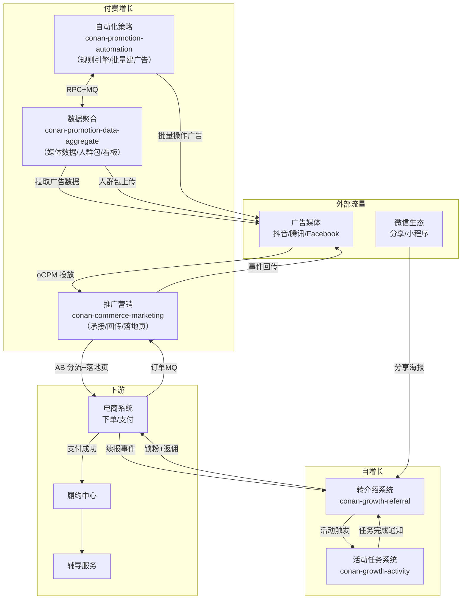
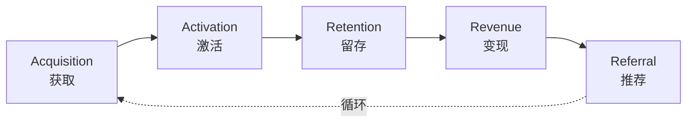
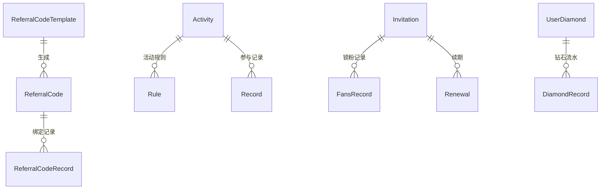
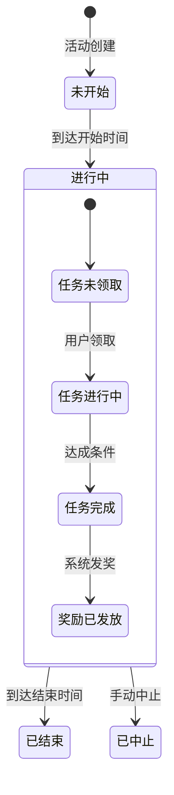
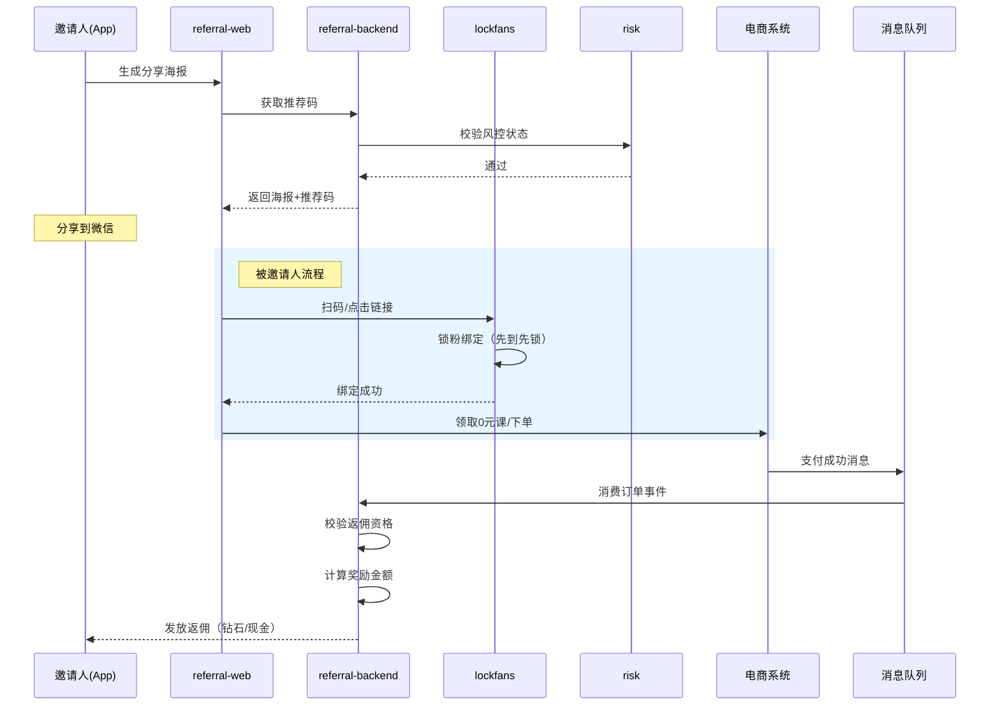
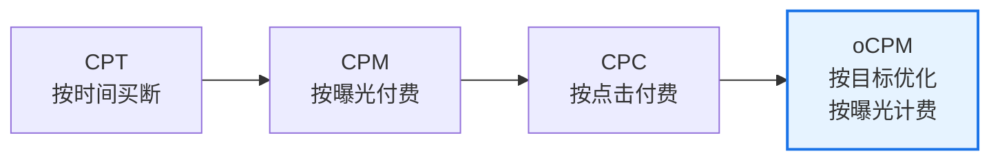
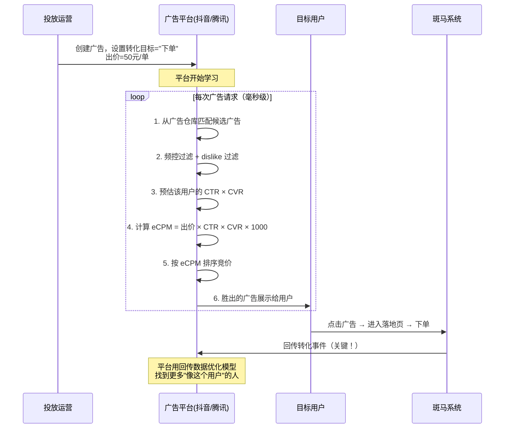
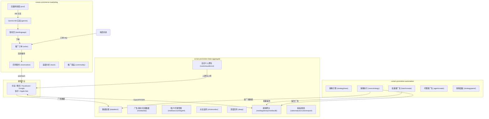
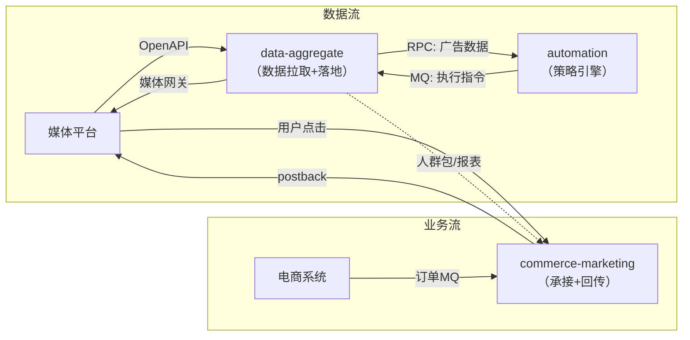

# 用户增长工程指南

> **TL;DR**：增长团队通过**转介绍（referral）**和**活动任务（activity）**两大系统实现用户裂变与留存，同时通过**广告投放**体系从外部媒体获取付费流量。新人理解"锁粉 → 任务 → 返佣"和"流量承接 → 回传优化"两条主线，即可覆盖 80% 的增长业务需求。

---

## 1. 系统架构总览



**核心链路**：

- **自增长**：老用户分享海报 → 新用户扫码 → 锁粉绑定 → 新用户下单 → 系统确认返佣资格 → 发放奖励
- **付费增长**：运营在媒体平台投放广告 → 用户点击进入流量承接器 → AB 分流至落地页 → 下单购课 → 回传事件优化 oCPM 模型

### 1.1 AARRR 增长模型与斑马落地

AARRR（海盗指标）是理解增长业务的思维框架。斑马的增长工作本质上就是围绕这五个环节展开，每个环节对应不同的业务方向和系统支撑：



| AARRR 环节 | 斑马对应业务 | 关键系统 |
|---|---|---|
| **Acquisition（获取）** | 投放拉新、分销、渠道推广 | conan-commerce-marketing、conan-promotion-* |
| **Activation（激活）** | 0 转体（免费→体验课转化）、直播带货 | 电商系统、落地页 |
| **Retention（留存）** | 体验课→系统课转化、CC 召回断课用户 | 电商系统、辅导服务 |
| **Revenue（变现）** | 长续长、扩科、提升客单价 | 电商系统、辅导服务 |
| **Referral（推荐）** | 转介绍、分销官、流量池 | conan-growth-referral、conan-growth-activity |

结合用户生命周期理解：

| 生命周期阶段 | 用户特征 | 增长策略侧重 |
|---|---|---|
| 潜在期 | 尚未下载 App | 投放获客（Acquisition） |
| 新手期 | 下载后免费体验中 | 激活转化（Activation） |
| 成长期 | 领取 0 元课、转化体验课 | 激活 + 留存 |
| 成熟期 | 系统课续费、扩科购买 | 变现 + 推荐（Revenue + Referral） |
| 衰退/沉默期 | 断课、无访问 | 留存召回（Retention） |

> **深刻认知**：转介绍（Referral）是整个漏斗中 ROI 最高的环节——老用户推荐新用户，获客成本远低于付费投放，且被推荐用户的信任度和续报率更高。这就是增长团队在转介绍上投入最重的原因。但 Referral 受限于存量活跃用户数，天花板明确，所以必须搭配付费增长（Acquisition）持续注入新流量。**两者不是替代关系，而是互相喂养的飞轮。**

---

## 2. 仓库与模块结构

### 2.1 conan-growth-referral（转介绍系统）

转介绍是增长的核心引擎，承载推荐有礼、锁粉、周周分享、转介绍商城等全部裂变场景。

| 模块 | 类型 | 职责 |
|---|---|---|
| `conan-growth-referral-backend` | Library | 核心业务逻辑，包含所有转介绍组件 |
| `conan-growth-referral-web` | Service | C 端接口入口 |
| `conan-growth-referral-admin` | Service | 运营后台管理 |
| `conan-growth-referral-rpc` | Service | RPC 服务，供其他系统调用 |
| `conan-growth-referral-consumer` | Service | MQ 消费（订单、续报事件等） |
| `conan-growth-referral-job` | Service | 定时任务（统计、过期清理等） |
| `conan-growth-tide` | Service | 潮汐活动独立服务 |
| `conan-growth-invitation` | Service | 邀请码独立服务 |

**backend 组件划分**：

```
conan-growth-referral-backend/
├── component/
│   ├── referral/        # 转介绍核心（首页、资格判断）
│   ├── referralcode/    # 推荐码管理（生成/绑定/模板）
│   ├── lockfans/        # 锁粉机制（邀请绑定、续期）
│   ├── share/           # 分享活动（周周分享、海报等）
│   ├── refergift/       # 推荐有礼（返佣奖励/任务）
│   ├── mall/            # 转介绍商城（斑马币/钻石兑换）
│   ├── diamond/         # 钻石体系（收支记录）
│   ├── giftcard/        # 礼品卡
│   ├── risk/            # 风控系统（黑产识别/封禁）
│   ├── statistics/      # 数据统计
│   └── base/            # 公共配置与基础定义
```

### 2.2 conan-growth-activity（活动任务系统）

活动任务系统提供通用的「活动 → 任务 → 奖励」框架，支撑各类运营活动。

| 模块 | 类型 | 职责 |
|---|---|---|
| `conan-growth-activity-backend` | Library | 核心业务逻辑 |
| `conan-growth-activity-web` | Service | C 端入口 |
| `conan-growth-activity-admin` | Service | 运营后台 |
| `conan-growth-activity-consumer` | Service | MQ 消费 |
| `conan-growth-activity-job` | Service | 定时任务 |
| `conan-growth-activity-server` | Service | 独立服务入口 |

**backend 组件划分**：

```
conan-growth-activity-backend/
├── component/
│   ├── newactivity/     # 活动任务核心（Activity/Task/UserTask）
│   ├── challenge/       # 挑战类活动（答题/助力/抽奖）
│   └── activityepop/    # 活动弹窗
```

---

## 3. 核心领域模型

### 3.1 转介绍核心模型



**关键实体**：

| 实体 | 所在组件 | 说明 |
|---|---|---|
| `ReferralCode` | referralcode | 推荐码，关联邀请人身份 |
| `ReferralCodeRecord` | referralcode | 推荐码使用记录，记录谁用了谁的码 |
| `ReferralCodeTemplate` | referralcode | 推荐码模板，定义生成规则 |
| `Invitation` / `FansRecord` | lockfans | 锁粉核心：邀请关系绑定，先到先锁 |
| `Activity` / `Rule` | share | 分享活动及其规则配置 |
| `UserDiamond` / `DiamondRecord` | diamond | 钻石资产与流水 |
| `UserRiskControlRecord` | risk | 风控标记与封禁记录 |

### 3.2 活动任务模型



**聚合关系**（来自 README 定义）：

- **Activity**：活动实体，控制开始/结束时间、活动类型
- **Task**：任务定义，支持普通任务和阶梯任务，定义达成条件和奖励
- **UserTask**：用户维度的任务状态，追踪进度
- **UserAction**：用户行为记录，触发任务进度更新
- **NotifyConfig**：触达配置，控制活动通知方式

---

## 4. 关键流程：推荐有礼

推荐有礼是转介绍最核心的场景，完整链路如下：



**锁粉机制要点**：
- 先到先锁：同一被邀请人只绑定第一个邀请人
- 有效期管理：锁粉关系有过期时间，到期自动释放
- 互斥逻辑：不同业务线共享锁粉，只给一个业务返佣

---

## 5. 广告投放体系

### 5.1 广告计费模式——从投放人视角理解

广告投放的核心问题是：**广告主（斑马）花钱买流量，按什么标准付费？** 行业经历了四代计费模式演进，每一代都在重新分配广告主与平台之间的风险：



| 模式 | 出价点 | 计费点 | 广告主风险 | 平台风险 | 适用场景 |
|---|---|---|---|---|---|
| **CPT** (Cost Per Time) | 时间段 | 时间段 | 高：不知道能曝光多少次 | 低：旱涝保收 | 品牌曝光、开屏广告 |
| **CPM** (Cost Per Mille) | 千次曝光 | 千次曝光 | 中高：曝光了但用户不一定点 | 低：只要曝光就收钱 | 品牌宣传、受众广泛的产品 |
| **CPC** (Cost Per Click) | 单次点击 | 单次点击 | 中：点了但不一定转化 | 中：曝光不收钱，需要吸引点击 | 效果类投放初期、搜索广告 |
| **oCPM** (optimized CPM) | **转化目标** | **千次曝光** | **低：按目标出价** | 低：按曝光收费 | **当前主流，斑马主要使用** |

> **给新手的解释**：可以类比开饭店。CPM = 花钱在门口发传单（发了就收钱）；CPC = 花钱把人引进店里（进门才收钱）；oCPM = 告诉平台"我只想为最终点菜消费的人付费"，平台帮你找更可能消费的人，但实际还是按发传单次数收钱。

### 5.2 oCPM 的运作机制

oCPM 是当前行业主流（由 Facebook 于 2014 年首创），也是斑马投放的主要计费方式。它的核心创新在于：**分离了出价点和计费点**。

**投放人视角的完整流程**：



**为什么 oCPM 对双方都有利？**

- **对广告主**：按转化目标出价（如"50 元一个下单"），风险可控。即使实际按曝光收费，平台有**超成本赔付机制**——如果实际转化成本超出出价一定比例，平台会赔付差额。这解决了投放初期模型不稳定的信心问题。
- **对平台**：按曝光收费保证了收入确定性；同时 oCPM 降低了广告主的投放门槛，广告主数量比 CPC 时代翻了数倍，总收入反而更高。

**oCPM 对研发的关键含义**：模型优化依赖**回传数据**。如果斑马不把"用户下单了""用户续报了"这些后端事件回传给媒体，平台的 oCPM 模型就是瞎的——它不知道什么样的用户更容易转化，获客成本会居高不下。**这就是回传服务存在的根本原因。**

### 5.3 投放系统三仓架构

投放体系由三个独立仓库协作，各自有清晰的职责边界：



#### 5.3.1 conan-commerce-marketing（推广营销中台）

**定位**：承接广告流量、管理落地页、处理推广订单、执行回传。是用户从「看到广告」到「完成下单」全链路的业务枢纽。

| 核心组件 | 职责 |
|---|---|
| `pool` | 流量承接器，统一 URL 入口，解耦广告链接与落地页 |
| `landingpage` | 落地页配置与渲染（预设模板 + 动态配置模式） |
| `gemini` | AB 实验引擎（实验/策略/场景/配置/属性五层模型） |
| `reservation` | 回传服务核心，向媒体 postback 转化事件（clickid + Redis 去重） |
| `order` | 推广订单管理，消费电商订单 MQ，关联投放来源 |
| `commodity` | 推广商品，基于电商商品二次封装，适配不同区域售卖 |
| `track` | 追踪分析，UTM 参数处理与归因 |
| `monitor` | 点击/转化监测 |
| `leads` | 线索管理 |
| `notify` | 触达通知 |
| `user` / `mission` | 用户状态与任务完成记录 |

**关键数据表**：`post_back_record`（回传记录）、`promotion_order`（推广订单）

**对外依赖**：电商主站/国际站（订单 RPC）、课程商品服务、Gemini 实验库、Doris（分析）

#### 5.3.2 conan-promotion-data-aggregate（媒体数据聚合）

**定位**：对接各广告媒体的 OpenAPI/SDK，拉取并落地广告层级全量数据（账户→计划→广告组→广告→创意→素材），为看板和自动化提供数据基础。

| 核心组件 | 职责 |
|---|---|
| `datafetch` | 统一数据拉取框架（任务编排 + 频控 + 重试 + 监控） |
| `mediadata` | 广告/素材/创意数据落地（44 个 Storage 覆盖全层级） |
| `mediagateway` / `mediasdk` | 媒体网关，统一封装各平台 API 差异，供自动化等调用 |
| `mediaaccount` / `agent` | 管家账号、广告账号、代理商管理 |
| `customaudience` | 自定义人群包管理与上传 |
| `clickmonitor` | 多平台点击监测（抖音/Apple Ads/华为等） |
| `deep` | 深度回传记录与数据 |
| `saleanalysis` / `snapshot` | 销售分析、实验统计、账户快照 |
| `rta` | 实时竞价辅助（RTA）|

**数据存储**：MySQL（多库）+ Doris（分析型）+ ES（搜索）+ Redis

**关键设计——数据拉取框架**：统一任务状态机驱动，新接媒体渠道只需继承抽象类实现 `fetchData`（拉数据）+ `mapper`（映射内部格式）两个方法，无需关注任务调度、重试、频控。

#### 5.3.3 conan-promotion-automation（自动化策略）

**定位**：7×24 小时自动化管理广告账户，替代人工盯账户操作。通过规则引擎配置策略条件和动作，自动执行调价、暂停、预算调整等操作。

| 核心组件 | 职责 |
|---|---|
| `strategybase` | 策略基础定义：规则表达式、条件、函数 |
| `execstrategy` | 策略执行引擎：任务编排、执行日志、判断明细 |
| `strategypanel` | 策略面板：运营配置与可视化 |
| `batchcreate` | 批量创建广告（模板化、复用创意） |
| `agentcreate` | 代理维度的广告创建 |
| `material` | 素材报表与属性管理 |
| `advert` | 广告报表（MySQL + Doris 双写） |
| `simulation` | 策略模拟（执行前预估效果） |

**核心模型**：策略由 `AutoStrategyBaseInfo`（基础信息）+ `AutoStrategyCondition`（触发条件）+ `AutoStrategyFunction`（执行动作）+ `RuleExpression`（规则表达式）四层组合构成。

**与 data-aggregate 的协作**：
- 通过 RPC 调用 data-aggregate 读取广告数据和报表
- 通过 MQ 消费 data-aggregate 的 mediaGateway 事件
- 通过 mediaGateway 向媒体执行批量操作

### 5.4 三仓协作关系



一句话总结：**marketing 管「用户从哪来、转化了没有」，data-aggregate 管「广告数据从媒体拉回来」，automation 管「自动帮运营操作广告」**。

---

## 6. 本地开发与联调

### 6.1 自增长（转介绍/活动）

| 配置项 | 说明 |
|---|---|
| FDC 配置 | 转介绍活动配置、风控规则、推荐码模板等 |
| 依赖服务 | 电商系统（商品/订单）、辅导服务（老师分享）、支付 |
| MQ Topic | 订单支付成功、续报成功、用户注册等事件 |
| 关键 Job | 锁粉过期清理、活动状态流转、统计计算 |

**联调注意**：
- 转介绍资格判断依赖用户课程状态，测试时需确保用户有在课记录
- 风控系统有三方数据依赖，测试环境可能需要 mock

### 6.2 付费增长（投放三仓）

| 仓库 | 数据库 | 关键依赖 |
|---|---|---|
| `conan-commerce-marketing` | `conan_commerce_marketing`, `conan_promotion_flow`, `conan_gemini` | 电商主站/国际站（订单 RPC）、Gemini 实验、Doris |
| `conan-promotion-data-aggregate` | `conan_promotion_data_aggregate`, `account`, `landing` | 各媒体 OpenAPI（需配 Token）、Doris、ES |
| `conan-promotion-automation` | `conan_promotion_automation` | data-aggregate（RPC+MQ）、媒体网关、Doris、xxl-job |

**联调注意**：
- 广告回传依赖媒体 API 和 clickid，测试需使用沙箱环境或 mock
- data-aggregate 的数据拉取有频控限制，调试时注意 API 调用配额
- automation 策略执行依赖 data-aggregate 的广告数据，需先确保数据拉取正常
- 三仓间通过 RPC + MQ 协作，本地开发建议聚焦单一仓库，其他走测试环境

---

## 7. 常见故障与排障路径

### 自增长故障

| 故障场景 | 排查思路 |
|---|---|
| 用户分享后被邀请人未绑定 | 检查锁粉记录 → 是否已被其他人锁定 → 锁粉有效期 → 风控拦截 |
| 返佣未到账 | 检查订单支付消息是否消费 → 返佣资格校验 → 奖励发放记录 → 钻石/现金流水 |
| 活动页面打不开 | 检查活动状态（是否过期/中止）→ 用户资格 → 风控拦截 |
| 微信域名被封 | 动态域名监控告警 → 切换备用域名 → 前端风险项目隔离 |

### 投放体系故障

| 故障场景 | 排查思路 |
|---|---|
| 回传异常（成本飙升的根因） | `post_back_record` 表 → reservation 组件日志 → clickid 是否有效 → Redis 去重是否误判 → 媒体 API 返回码 |
| 落地页打不开/白屏 | 流量承接器配置 → pool 组件 → landingpage 模板配置 → Gemini 实验分组 |
| 广告数据缺失（看板空白） | datafetch 任务状态机 → 任务是否执行/失败 → 媒体 API Token 是否过期 → 频控是否触发 |
| 人群包上传失败 | customaudience 组件日志 → 媒体 API 配额 → 数据格式校验 |
| 自动化策略未生效 | 策略状态（是否启用）→ 条件判断明细（`AutoStrategyJudgeDetail`）→ 执行日志（`ExecLog`）→ 媒体网关调用结果 |
| 批量建广告失败 | batchcreate 任务状态 → 创意/素材是否就绪 → 媒体 API 限制 → 账户预算/余额 |

---

## 8. 历史决策与演进

增长系统经历了四个关键演进阶段（来自零一说第一期）：

### 8.1 系统初步建设：钻石兑换

最初通过「内在激励（效果外化）+ 外在激励（钻石返佣）」培养用户分享习惯。设计了钻石兑换系统，这是转介绍的起点。

### 8.2 系统抽象：锁粉 + 增长中台

接入方增多后，面临两个问题：
- **返佣互斥**：多业务线争抢同一被邀请人 → 引入锁粉机制，先到先锁
- **奖品履约**：抽象奖品履约系统，统一管理奖品的发放和核销

### 8.3 平台运营：任务系统

业务数据见顶后，引入任务系统丰富玩法：
- 对邀请人：丰富任务类型（普通任务/阶梯任务），提升奖励级别
- 对被邀请人：降低参与门槛，扩大任务事件范围

### 8.4 精细化运营：活动系统 + 风控

- **活动系统**：统一管理活动配置、触达和曝光，支持推荐有礼、周周分享、节日活动等多类型
- **风控系统**：接入三方数据识别黑产，推荐有礼风险例子 18.1%，节省成本 37 万+

### 8.5 付费增长演进

广告投放经历了三个阶段：

1. **基础期**：直接在媒体配置落地页 URL → 问题：无法 AB 实验，链接管理混乱
2. **体系化**：引入流量承接器 + AB 实验 + 回传服务 → 解决了 oCPM 模型冷启动和实验能力
3. **提效期**：数据拉取 + 广告看板 + 自动化策略 → 前后端数据打通，7×24 自动化运营

每个阶段都是被真实痛点驱动的：回传缺失导致获客成本高出同行数倍，人群包缺失导致大量无效曝光，手工盯账户导致运营效率低下。

---

## 9. 推荐阅读路径

### 新人入门（第 1 周）

1. 阅读 `conan-growth-referral/README.md` 了解转介绍系统全貌
2. 阅读 `conan-growth-activity/README.md` 了解活动任务模型
3. 浏览零一说第一期：增长获客之转介绍（业务全景）
4. 了解 AARRR 增长模型在斑马的落地

### 深入理解（第 2-3 周）

5. 走读 `lockfans` 组件的锁粉绑定流程
6. 走读 `refergift` 组件的返佣计算逻辑
7. 走读 `newactivity` 组件的任务状态机
8. 浏览零一说第十三期：广告投放业务分享

### 投放体系入门（第 2-3 周）

9. 阅读 `conan-commerce-marketing/README.md` 理解回传核心逻辑
10. 走读 `pool` → `landingpage` → `reservation` 组件的承接→回传链路
11. 了解 `conan-promotion-data-aggregate` 的 datafetch 任务框架
12. 了解 `conan-promotion-automation` 的策略四层模型（BaseInfo/Condition/Function/RuleExpression）

### 进阶参考

- 转介绍业务关键词表（零一说第一期「关键词」章节）
- 风控系统架构与判定逻辑
- 动态域名监控方案（微信封禁应对）
- data-aggregate 媒体网关的多平台 API 封装模式
- automation 策略执行引擎的任务编排与模拟能力
