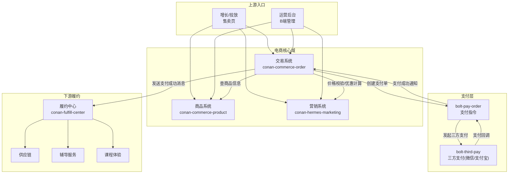
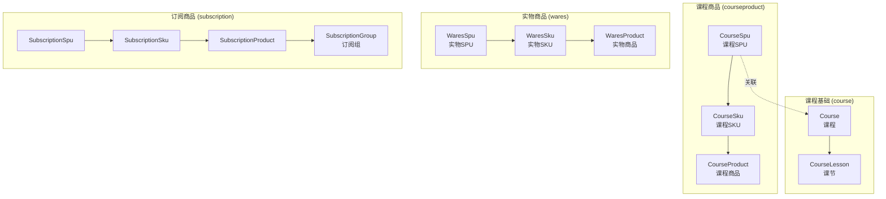
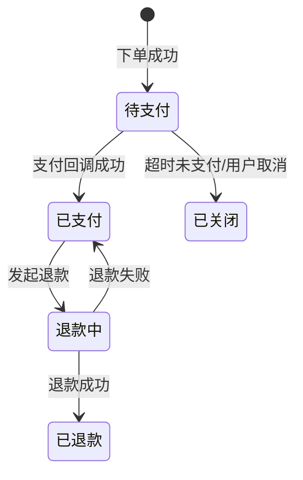
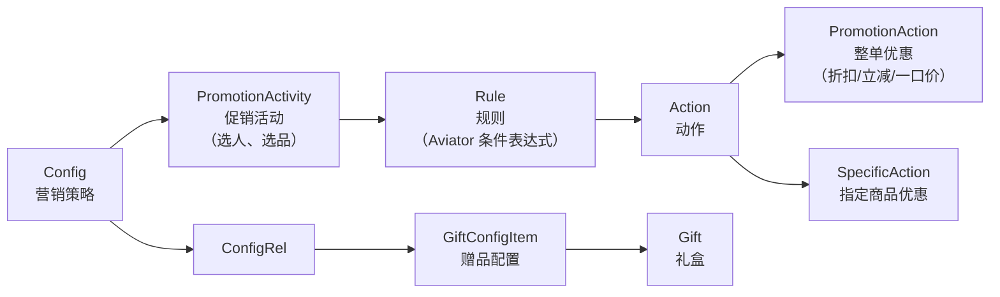
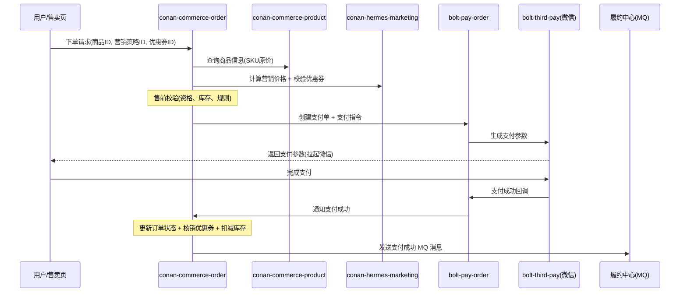
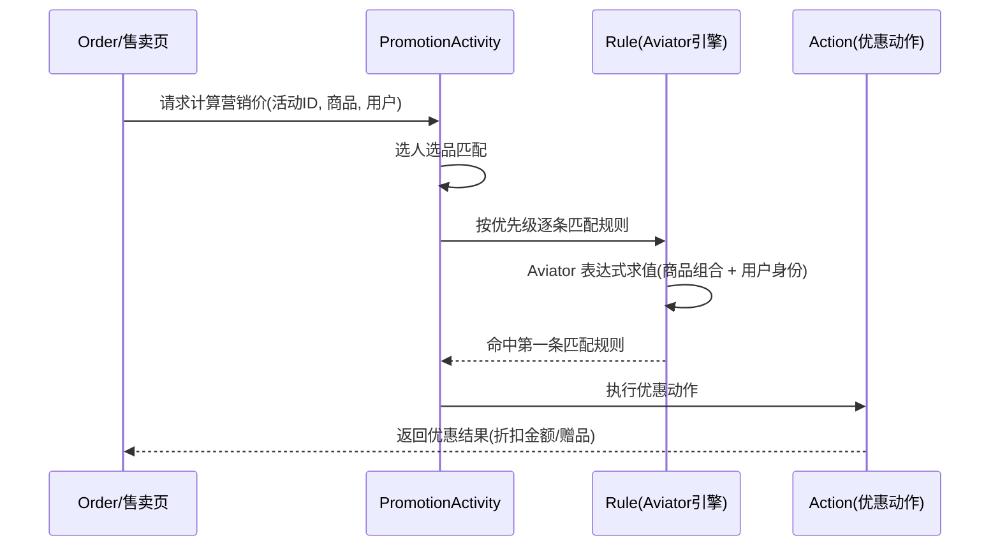

# 电商工程指南

> **TL;DR**：电商是斑马最核心的交易基础设施，由**商品（product）、交易（order）、营销（marketing）**三大子系统组成，支撑十亿级 GMV。新人只要理解"SPU/SKU → 营销定价 → 下单 → 支付 → 履约"这条主线，就能快速定位大部分电商需求和故障。

---

## 1. 系统架构总览



**核心调用链**：用户在售卖页选择商品 → 调用 `Product` 获取 SKU 信息和价格 → 调用 `Marketing` 计算营销价 → 调用 `Order` 下单 → `Order` 通过 `bolt-pay-order` 创建支付 → 三方支付回调 → `Order` 处理支付成功 → 发送 MQ 消息触发履约。

---

## 2. 仓库与模块结构

### 2.1 conan-commerce-order（交易系统）

交易系统是电商的核心枢纽，承接所有售卖场景的下单、支付、退款流程。

| 模块 | 类型 | 职责 |
|---|---|---|
| `conan-commerce-order-backend` | Library | 核心业务逻辑，包含所有交易组件 |
| `conan-commerce-mainland` | Service | 国内订单的 Web/RPC 入口 |
| `conan-commerce-internation` | Service | 国际订单入口 |
| `conan-commerce-subscription` | Service | 订阅订单入口 |
| `conan-commerce-qualification` | Library | 购买资格校验引擎 |
| `conan-commerce-order-admin` | Service | 后台管理入口 |
| `conan-commerce-order-job` | Service | 定时任务（超时关单、对账等） |

**backend 内部组件划分**：

```
conan-commerce-order-backend/
├── component/
│   ├── mainland/          # 国内订单域（最核心）
│   │   ├── biz/
│   │   │   ├── trade/
│   │   │   │   ├── sale/     # 售前校验 + 下单组装
│   │   │   │   ├── refund/   # 退款上下文与流程
│   │   │   │   └── pay/      # 支付处理
│   │   │   └── ...
│   │   ├── process/       # 售卖流程引擎（可编排的节点化流程）
│   │   ├── data/          # 核心领域实体（Order, Payment, Refundment）
│   │   ├── storage/       # MySQL + Redis 持久化
│   │   ├── service/       # 对外服务接口
│   │   └── message/       # MQ 消息发送
│   ├── internation/       # 国际化订单域
│   ├── subscription/      # 订阅订单域
│   └── qualification/     # 购买资格域（通用规则引擎）
```

> **关键认知**：`mainland` 是日常需求最密集的组件。国内 80%+ 的交易需求都在这个包下改。

### 2.2 conan-commerce-product（商品系统）

商品系统是售卖的前置条件，衔接交易和履约的桥梁。

| 模块 | 类型 | 职责 |
|---|---|---|
| `conan-commerce-product-backend` | Library | 商品核心业务逻辑 |
| `conan-commerce-product-common` | Library | 公共定义（Thrift、枚举） |
| `conan-commerce-wares` | Service | 实物商品服务 |
| `conan-commerce-course` | Library | 课程基础信息 |
| `conan-commerce-course-product` | Service | 课程商品（AI 课 SPU/SKU） |
| `conan-commerce-internation-product` | Service | 国际商品 |
| `conan-commerce-oversea-wares` | Service | 海外实物商品 |
| `conan-commerce-subscription-product` | Service | 订阅商品 |
| `conan-commerce-product-admin` | Service | 商品后台管理 |
| `conan-commerce-product-consumer` | Service | 消息消费 |
| `conan-commerce-product-job` | Service | 定时任务 |

**backend 核心组件**：

```
conan-commerce-product-backend/
├── component/
│   ├── wares/             # 实物商品（SPU/SKU/Product）
│   ├── warescategory/     # 类目与属性管理
│   ├── course/            # 课程（Course、CourseLesson）
│   ├── courseproduct/     # 课程商品（CourseSpu/CourseSku/CourseProduct）
│   ├── subscription/      # 订阅商品
│   ├── internation/       # 国际商品
│   ├── overseawares/      # 海外商品
│   └── common/            # 公共常量、锁、通用数据
```

### 2.3 conan-hermes-marketing（营销系统）

营销系统是"商品-营销-交易"三大售卖基础能力之一，提供价格优惠与赠品策略。

| 模块 | 类型 | 职责 |
|---|---|---|
| `conan-hermes-marketing-backend` | Library | 营销核心逻辑 |
| `conan-hermes-marketing-common` | Library | 公共定义 |
| `conan-hermes-marketing-client` | Library | RPC 客户端 SDK |
| `conan-hermes-marketing-web` | Service | C 端 HTTP 入口 |
| `conan-hermes-marketing-rpc` | Service | RPC 服务入口 |
| `conan-hermes-marketing-admin` | Service | 后台管理 |
| `conan-hermes-marketing-consumer` | Service | 消息消费 |
| `conan-hermes-marketing-job` | Service | 定时任务 |
| `conan-commerce-gift` | Service | 赠品/赠课/礼包 |
| `conan-hermes-marketing-promotion` | Service | 促销策略（策略价、策略加赠） |
| `conan-hermes-bulk` | Service | 团购 |
| `conan-commerce-coupon` | Service | 优惠券 |
| `conan-commerce-redeem` | Service | 兑换码 |

**backend 核心组件**：

```
conan-hermes-marketing-backend/
├── component/
│   ├── coupon/            # 优惠券（模板 + 用户券）
│   ├── redeemcode/        # 兑换码
│   ├── gift/
│   │   ├── giftactivity/  # 赠品活动（任务、规则引擎）
│   │   ├── giftproduct/   # 赠课/赠商品
│   │   └── giftpackage/   # 礼包
│   ├── promotion/
│   │   ├── promotionprice/  # 促销策略价（Activity→Rule→Action）
│   │   ├── promotiongift/   # 策略加赠
│   │   └── subscription/    # 订阅促销
│   ├── bulk/              # 团购（开团/参团/成团）
│   ├── apply/             # 审批/申请流程
│   ├── workflow/          # 工作流
│   ├── monitor/           # 监控（如券投放失败告警）
│   └── common/            # 员工、配置、通用存储
```

---

## 3. 核心领域模型

### 3.1 商品模型：SPU / SKU / Product

斑马采用了**分业务线建模**的策略，不同类型商品有独立的 SPU/SKU/Product 实体：



**关键设计决策**（来自商品系统 2.0 重构）：

- **为什么不用传统电商类目体系？** 斑马的商品品类少（主要是课程），传统类目体系在运营层面理解成本过高。斑马以 Course 来统筹交易和履约，更直观。
- **为什么拆分 Lesson 和 Course？** Lesson 在履约域承载资源管理（稳定），Course 在售卖域需要灵活多变。解耦后售卖和履约可以独立迭代。
- **每个业务线独立模型**：屏蔽中台复杂度，为上游提供特定领域接口，降低理解成本。

### 3.2 交易模型：Order / Payment / Refundment



核心实体（位于 `mainland/data/` 目录）：

| 实体 | 说明 | 持久化 |
|---|---|---|
| `Order` | 订单主体，记录商品、金额、状态 | `DbOrderStorage` |
| `OrderItem` | 订单明细，单个商品项 | `DbOrderItemStorage` |
| `Payment` | 支付单，对应一次支付行为 | `DbPaymentStorage` |
| `Refundment` | 退款单，对应一次退款行为 | `DbRefundmentStorage` |
| `OrderScenario` | 售卖场景配置 | `DbOrderScenarioStorage` |
| `OrderSaleProcess` | 可编排售卖流程（节点化） | `DbOrderSaleProcessStorage` |

> **反直觉认知**：交易系统的核心领域实体不在 `domain/` 包下，而在 `mainland/data/` 下。这是因为 `domain/` 主要存放各类 Context（上下文对象）和 Calculator，而 Order/Payment 等聚合根放在 `data/` 中。阅读代码时不要只看 `domain` 包。

### 3.3 营销模型：Activity → Rule → Action

营销系统引入了**规则引擎（Aviator）**，实现了"条件匹配 + 动作执行"的通用范式：



**优惠券模型**（采用"模板 + 用户券"二层结构）：

| 实体 | 说明 |
|---|---|
| 优惠券模板 | 定义券的公共属性：类型（代金券/现金券）、优惠类型（折扣/满减）、适用商品、有效期 |
| 用户优惠券 | 发券后为具体用户生成，记录用户 ID、来源、使用状态、关联订单 |

**团购模型**（开团 → 参团 → 成团）：

| 实体 | 说明 |
|---|---|
| `Bulk` | 团购活动主体，定义容量、价格策略、结束规则 |
| `UserBulk` | 用户开的团，记录状态、当前参团人数 |
| `UserBulkMember` | 参团成员，关联参团订单 |

---

## 4. 关键流程代码走读

### 4.1 下单流程（核心路径）

这是电商最核心的链路，理解了这条路径就理解了电商的主干。



**代码路径**（以 mainland 国内订单为例）：

1. **入口**：`mainland/` 下的 Controller 或 RPC Handler
2. **售前校验**：`mainland/biz/trade/sale/pre/ability/` — 各类 Ability 组件进行并行校验
3. **上下文组装**：`mainland/biz/trade/sale/order/domain/context/` — `OrderCreateContext`、`SingleOrderCreateContext`、`BundleOrderCreateContext`
4. **流程执行**：`mainland/process/` — 节点化流程引擎（`OrderSaleProcess` → `Node` → `NodeMeta`），支持可编排的售卖流程
5. **支付处理**：`mainland/biz/pay/` — 创建 Payment，调用 bolt-pay-order
6. **消息发送**：`mainland/message/` — 支付成功后发送 MQ 消息

> **核心设计**：交易系统采用了**流程引擎**（`process/`）来编排下单流程。每个售卖场景（`OrderScenario`）对应一套可配置的流程节点，支持灵活扩展。这是与简单 Service 编排的重要区别。

### 4.2 促销价格计算流程



**规则引擎选型**：采用 Aviator 表达式引擎，将复杂的营销规则配置化。新增一种规则条件只需实现一个新的 `FeatureFetcher`（变量提取器），无需改动核心流程。

---

## 5. 本地开发与联调

### 5.1 环境准备

| 依赖 | 说明 |
|---|---|
| JDK | 项目基于 Spring Boot 2.x，JDK 8 |
| MySQL | 各模块有独立数据库，本地需要对应的 DB 配置 |
| Redis | 缓存、分布式锁 |
| Elasticsearch 7.8 | marketing 仓库明确锁定了 ES 7.8.0（与 `commons-elastic7` 对齐） |
| RocketMQ | 异步消息（支付成功、订单状态变更等） |
| FDC | 动态配置中心，大量开关和参数通过 FDC 控制 |

### 5.2 本地启动要点

1. **Profile 配置**：确认本地使用 `dev` / `test` profile，FDC 配置会按环境自动加载
2. **依赖服务 Mock**：bolt-pay-order、bolt-third-pay 等支付服务在本地一般通过虚环境联调
3. **数据库**：三个仓库各自独立数据库，需确认本地或测试环境的 DBKEY 配置
4. **构建命令**：`make install`（安装依赖）、`make deploy`（部署）

### 5.3 联调注意事项

- **交易 → 商品**：Order 通过 RPC 调用 Product 获取 SKU 信息，确保 Product 服务可达
- **交易 → 营销**：Order 通过 RPC 调用 Marketing 进行价格校验，需保证营销配置存在
- **支付回调**：本地无法接收三方支付回调，通常通过手动触发或 Mock 完成支付成功流程

---

## 6. 常见故障与排障路径

### 6.1 高频故障场景

| 场景 | 可能原因 | 排查入口 |
|---|---|---|
| 用户无法下单 | 购买资格校验未通过 / 商品下架 / 库存不足 | Octopus 搜索 `qualification` 相关日志 |
| 支付后订单状态未更新 | 支付回调丢失 / MQ 消费延迟 | 检查 bolt-pay-order 回调日志 + consumer 消费日志 |
| 营销价格计算错误 | 促销配置有误 / 规则优先级冲突 | 后台检查促销活动配置 + Aviator 表达式 |
| 优惠券无法使用 | 券过期 / 不满足适用条件 / 券已核销 | 查询用户优惠券状态 + 模板配置 |
| 退款失败 | 退款金额校验不通过 / 三方退款接口异常 | 检查 Refundment 状态 + bolt-pay-order 退款日志 |

### 6.2 排障关键词（Octopus 搜索）

- 下单异常：`OrderCreateContext`、`sale.pre.ability`
- 支付异常：`PaymentService`、`bolt-pay-order`
- 营销异常：`PromotionActivity`、`AviatorExpression`、`coupon`
- 退款异常：`RefundmentState`、`refund`

### 6.3 关键监控指标

- 下单成功率 / 支付成功率
- 营销价格校验失败率
- MQ 消费延迟（支付成功消息 → 履约触发）

---

## 7. 历史决策与演进

电商系统经历了多次重大重构，理解这些决策有助于理解当前代码结构中的"历史痕迹"。

### 7.1 商品系统 1.0 → 2.0（Lesson 解耦）

**问题**：上游售卖和下游履约共用 `Lesson` 实体。Lesson 在履约域要求稳定，在售卖域要求灵活——两个方向的需求冲突导致耦合严重。

**方案**：
- 分离 Course（前台售卖概念）和 Lesson（后台履约资源）
- 按业务线独立建模（WaresSpu/CourseSpu/SubscriptionSpu），不再混用一套 SPU/SKU
- 屏蔽中台复杂度，为每个业务线提供专属领域接口

**遗留**：商品系统 1.0 的部分代码仍在运行（通过 `conan-commerce-product-backend` 中的 `common` 和部分 `wares` 组件），新需求优先使用 2.0 的 `courseproduct` 等组件。

### 7.2 交易系统重构

**问题**：
- 下单和支付强耦合（0 元课和非 0 元课有两套流程）
- 不同业务（主题课、转介绍、AI 课）的售卖规则大量 copy-paste
- CQRS 架构导致 50+ 协议膨胀

**方案**：
- 统一所有商品的交易流程
- 抽象规则和组装逻辑（`process/` 流程引擎 + `ability/` 校验组件），不同业务共用代码
- 逐步用新统一协议替换老协议

### 7.3 营销系统演进

**问题**：早期营销逻辑以硬编码方式存在于交易系统中，无法支撑多元化营销需求。

**方案**：
- 独立 `conan-hermes-marketing` 服务
- 引入 Aviator 规则引擎，实现"条件配置化 + 动作可扩展"
- 三个子系统（优惠券、团购、促销）各自独立组件

**未来规划**：团购计划纳入促销系统统一管理；优惠券的适用条件计划接入规则引擎；发券行为可能活动化处理。

---

## 8. 推荐阅读路径

### 8.1 新人代码阅读顺序

1. **先看商品**：从 `conan-commerce-product-backend/component/courseproduct/` 入手，理解 `CourseSpu → CourseSku → CourseProduct` 的三层模型
2. **再看交易主干**：进入 `conan-commerce-order-backend/component/mainland/`，按 `data/`（实体）→ `biz/trade/sale/`（下单）→ `biz/pay/`（支付）→ `process/`（流程引擎）的顺序阅读
3. **最后看营销**：进入 `conan-hermes-marketing-backend/component/promotion/promotionprice/`，理解 `Activity → Rule → Action` 的规则引擎模式；然后看 `coupon/` 理解优惠券模板机制

### 8.2 推荐文档

| 文档 | 说明 | 链接 |
|---|---|---|
| 零一说第二期：斑马电商系统的来龙去脉 | 电商全景架构 + 核心子系统设计 + 重构历史 | [Confluence](https://confluence.zhenguanyu.com/pages/viewpage.action?pageId=441699770) |
| 零一说第九期：营销中心系统分享 | 优惠券/团购/促销三大子系统详细设计 | [Confluence](https://confluence.zhenguanyu.com/pages/viewpage.action?pageId=570073602) |

### 8.3 关键代码入口速查

| 场景 | 仓库 | 代码入口 |
|---|---|---|
| 国内下单 | conan-commerce-order | `mainland/biz/trade/sale/` |
| 国内退款 | conan-commerce-order | `mainland/biz/trade/refund/` |
| 支付处理 | conan-commerce-order | `mainland/biz/pay/` |
| 流程编排 | conan-commerce-order | `mainland/process/` |
| 购买资格 | conan-commerce-order | `qualification/` |
| 课程商品管理 | conan-commerce-product | `courseproduct/` |
| 实物商品管理 | conan-commerce-product | `wares/` + `warescategory/` |
| 促销价格计算 | conan-hermes-marketing | `promotion/promotionprice/` |
| 优惠券发放/核销 | conan-hermes-marketing | `coupon/` |
| 赠品活动 | conan-hermes-marketing | `gift/giftactivity/` |
| 团购 | conan-hermes-marketing | `bulk/` |
| 兑换码 | conan-hermes-marketing | `redeemcode/` |

---

## 9. 持久化命名约定

电商三个仓库的存储层有一个统一的**非 Spring Data 风格**命名约定：

- 存储类命名为 `Db*Storage` 或 `*StorageImpl`，而非 `*Repository`
- 接口定义在 `storage/` 下，实现在 `storage/db/` 或 `storage/redis/` 下
- 这是团队既有约定，不要按 Spring Data 习惯去找 `@Repository` 注解

---

> **深刻认知**：电商系统的复杂度不在于单个子系统的设计（商品、交易、营销各自都有清晰的模型），而在于**三者之间的协作契约**——下单时交易系统需要同时校验商品信息、营销价格、购买资格、支付通道，任何一环出问题都会导致下单失败。理解这条链路上的数据流转和校验逻辑，是排障和需求开发的关键。
