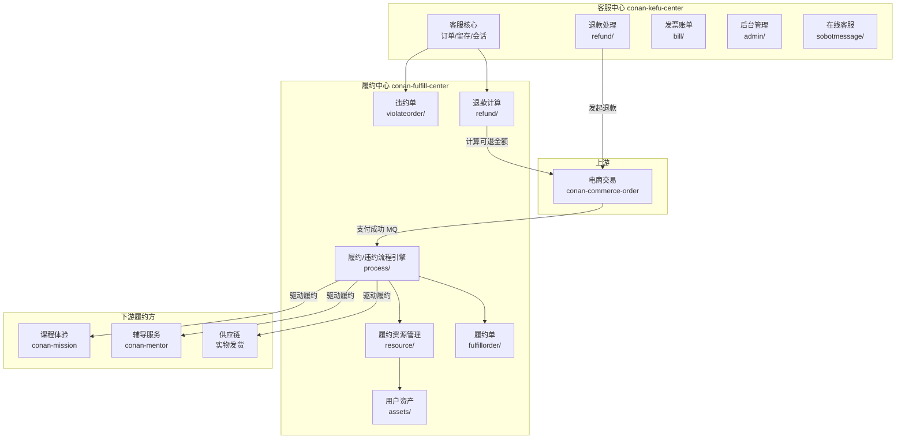
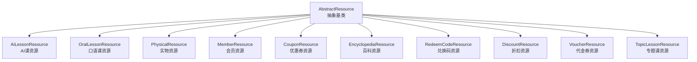
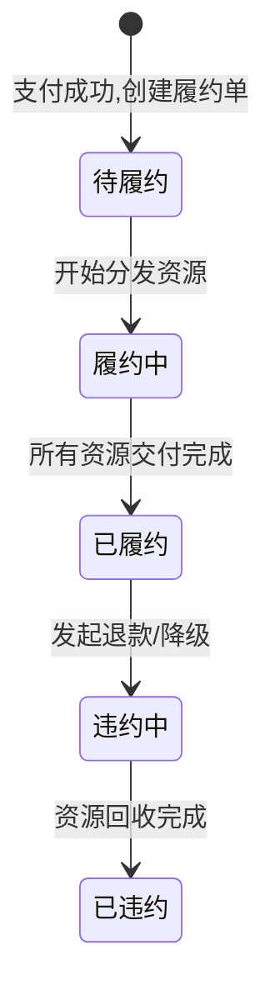
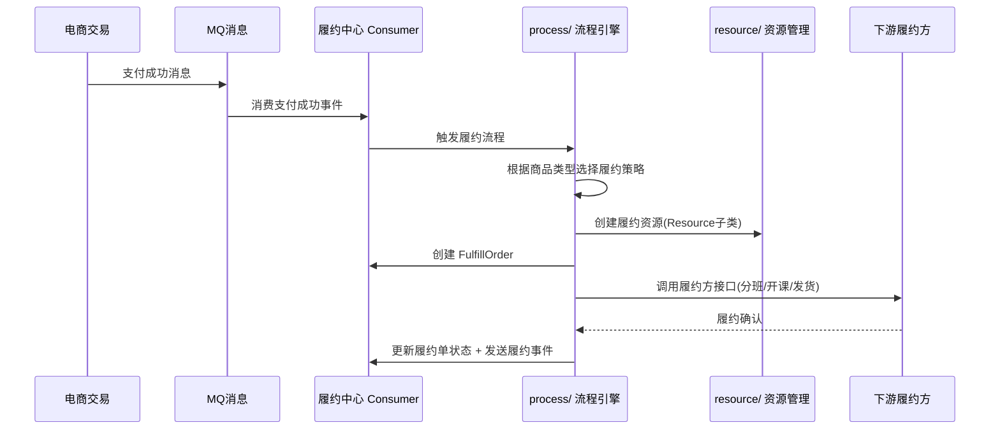
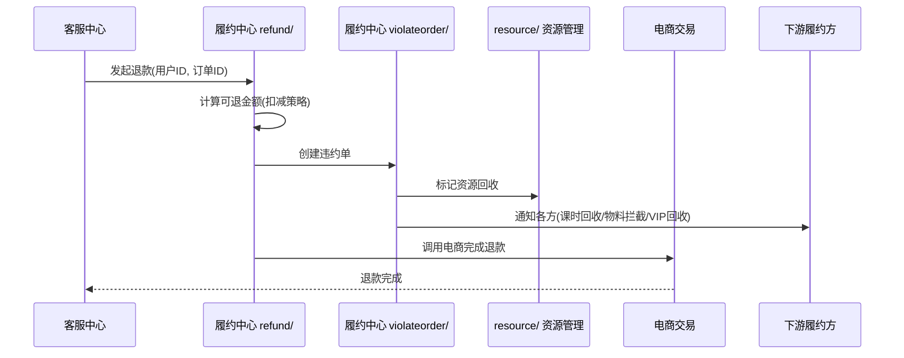

# 履约&客服工程指南

> **TL;DR**：履约中心是连接"售卖"和"服务"的枢纽——电商完成支付后，由履约中心接管，将订单转化为用户可享受的权益（内容、实物、服务），并驱动下游履约方（课程体验、辅导服务、供应链）完成交付。客服中心处理逆向流程（退款、工单、用户客诉）。两个系统合在一起覆盖了"用户付款后"的所有环节。

---

## 1. 系统架构总览



**核心定位**：
- **履约中心**：承上启下的枢纽，屏蔽电商各系统各领域的复杂度，将订单转换为具体的履约形式（课程/实物/时效权益/虚拟），调度下游履约方完成交付。逆向流程中负责计算可退金额、调度各方资源回收。
- **客服中心**：用户逆向流程的入口，处理退款、工单、客诉、发票等。

---

## 2. 仓库与模块结构

### 2.1 conan-fulfill-center（履约中心）

| 模块 | 类型 | 职责 |
|---|---|---|
| `conan-fulfill-center-backend` | Library | 核心履约业务逻辑 |
| `conan-fulfill-center-common` | Library | 公共定义（Thrift、枚举） |
| `conan-fulfill-center-client` | Library | RPC 客户端 SDK |
| `conan-fulfill-center-web` | Service | C 端 HTTP 入口 |
| `conan-fulfill-center-rpc` | Service | RPC 服务入口 |
| `conan-fulfill-center-admin` | Service | 后台管理 |
| `conan-fulfill-center-consumer` | Service | 消息消费（支付成功等） |
| `conan-fulfill-center-job` | Service | 定时任务 |

**backend 核心组件**：

```
conan-fulfill-center-backend/
├── component/
│   ├── process/           # 【最核心】履约/违约流程引擎
│   │   ├── fulfill/       # 正向履约策略 + 多场景 context
│   │   ├── violate/       # 违约处理策略
│   │   ├── strategy/      # 策略实现
│   │   ├── context/       # 多业务场景的上下文
│   │   ├── api/           # 流程对外接口
│   │   ├── adjust/        # 调整逻辑
│   │   └── mq/            # 流程相关消息
│   ├── resource/          # 履约资源（多种资源类型的抽象体系）
│   │   ├── domain/        # AbstractResource 继承体系
│   │   ├── data/          # 数据对象
│   │   ├── storage/       # 持久化
│   │   └── service/       # 资源服务
│   ├── fulfillorder/      # 履约单（记录每次履约的单据）
│   │   ├── data/          # FulfillOrder, Extension 体系
│   │   ├── storage/       # 持久化
│   │   └── mq/            # 履约事件消息
│   ├── violateorder/      # 违约单（退款/降级等违约操作记录）
│   ├── assets/            # 用户资产凭证管理
│   ├── refund/            # 退款金额计算（策略模式）
│   │   ├── context/       # 退款上下文
│   │   ├── stratrgy/      # 退款策略（注意拼写）
│   │   ├── factory/       # 策略工厂
│   │   └── storage/       # 退款记录持久化
│   ├── fulfillevent/      # 履约事件（事件驱动）
│   ├── speciallesson/     # 专题课相关
│   └── discount/          # 优惠相关计算
```

> **关键认知**：`process/` 是整个履约中心最复杂的组件，包含大量按业务场景划分的 context 和策略实现。日常需求大多涉及在 `process/` 下增加或修改某个场景的履约/违约策略。

### 2.2 conan-kefu-center（客服中心）

| 模块 | 类型 | 职责 |
|---|---|---|
| `conan-kefu-center-backend` | Library | 客服核心业务逻辑 |
| `conan-kefu-center-common` | Library | 公共定义 |
| `conan-kefu-center-client` | Library | RPC 客户端 SDK |
| `conan-kefu-center-server` | Service | C 端入口（命名为 `server` 而非 `web`） |
| `conan-kefu-center-rpc` | Service | RPC 服务入口 |
| `conan-kefu-center-consumer` | Service | 消息消费 |
| `conan-kefu-center-job` | Service | 定时任务 |
| `conan-kefu-admin` | 聚合模块 | 独立的后台管理（含 common/client/server 子模块） |

**backend 核心组件**：

```
conan-kefu-center-backend/
├── component/
│   ├── center/            # 客服核心（订单、留存、会话、AI）
│   │   ├── data/          # Order, RetentionOrder, ConsultationRecord
│   │   │   ├── ai/        # AI 相关数据模型
│   │   │   ├── chat/      # 会话数据
│   │   │   └── session/   # 会话管理
│   │   ├── service/       # 含 LLMHandler, RAGHandler（AI 客服）
│   │   └── storage/db/    # 留存单、咨询记录等
│   ├── refund/            # 退款处理
│   │   ├── strategy/      # 退款策略
│   │   ├── factory/       # 策略工厂
│   │   ├── context/       # 退款上下文
│   │   └── data/          # 退款数据（含 violateorder 子包）
│   ├── bill/              # 发票/账单
│   │   ├── data/          # Bill, BillTitle, BillOrderInfo
│   │   └── storage/db/    # 账单持久化
│   ├── admin/             # 后台能力（工单、风控、优惠券、反馈）
│   ├── sobotmessage/      # 智齿在线客服消息集成
│   ├── ordertag/          # 订单标签
│   ├── common/            # 横向能力
│   │   ├── flow/          # 事件/消息/handler/nodes 流程引擎
│   │   ├── lock/          # 分布式锁
│   │   └── userfeature/   # 用户特征
│   └── proxy/             # 外部服务代理
```

> **值得注意**：客服中心已引入 AI 能力（`LLMHandler`、`RAGHandler`），说明客服系统正在向智能客服方向演进。

---

## 3. 核心领域模型

### 3.1 履约中心的领域词汇表

理解履约中心必须先掌握这套领域词汇：

| 领域词汇 | 英文 | 含义 |
|---|---|---|
| Lesson | Lesson | 课程（后台概念，对应一门具体课） |
| Term | Term | 学期 = Lesson + 开课时间 |
| TermStage | TermStage | 学期下的级别 |
| Schedule | Schedule | 上课时间表 |
| Vacation | Vacation | 放假周 |
| StudyDays | StudyDays | 上课日 |
| Receipt | Receipt | 凭证，服务版 AI 课的资产模型 |
| FulfillOrder | 履约单 | 记录一次正向履约的单据 |
| ViolateOrder | 违约单 | 记录一次违约操作（退款/降级等） |
| UserApplication | 课时管理单据 | 用户申请单（转课、延期等） |

### 3.2 履约资源继承体系

履约中心最核心的领域模型是**资源（Resource）体系**，位于 `resource/domain/`，采用继承体系管理不同类型的履约资源：



> **设计思想**：不同商品购买后产生不同类型的履约资源。履约中心通过 `ResourceTypeEnum` 区分资源类型，每种类型对应一个 Resource 子类和一套 ResourceService 实现。新增履约类型时，主要工作是添加新的 Resource 子类和对应的 Service。

### 3.3 履约单与违约单



| 实体 | 位置 | 说明 |
|---|---|---|
| `FulfillOrder` | `fulfillorder/data/` | 履约单主体 |
| `WaresFulfillOrder` | `fulfillorder/data/` | 实物履约单 |
| `WaresFulfillOrderItem` | `fulfillorder/data/` | 实物履约单明细 |
| `*Extension` | `fulfillorder/data/` | 各类扩展信息（口语、发货、时间、订阅等） |
| `WaresViolateOrder` | `violateorder/data/` | 实物违约单 |
| `AssetTicket` | `assets/data/` | 资产凭证 |

### 3.4 客服中心核心模型

客服中心不使用 `domain` 包，模型集中在各组件的 `data/` 目录：

| 模型 | 组件 | 说明 |
|---|---|---|
| `Order` / `AfterSaleStatus` / `AfterSaleLog` | center | 售后订单 + 状态 + 日志 |
| `RetentionOrder` / `RetentionOrderLog` | center | 留存单（挽留即将退款的用户） |
| `RefundRequest` / `RefundShowDetail` / `DeductionItem` | refund | 退款请求 + 展示 + 扣减项 |
| `Bill` / `BillTitle` / `BillOrderInfo` | bill | 发票 + 抬头 + 关联订单 |
| `SobotMessage` | sobotmessage | 智齿在线客服消息 |

---

## 4. 关键流程代码走读

### 4.1 正向履约流程（支付成功 → 资源交付）



**代码路径**：

1. **消息入口**：`conan-fulfill-center-consumer` 接收支付成功 MQ 消息
2. **流程调度**：`process/fulfill/` 下根据商品类型匹配对应的履约策略（`strategy/`）
3. **资源创建**：`resource/domain/` 根据 `ResourceTypeEnum` 创建对应的 Resource 子类实例
4. **履约单记录**：`fulfillorder/` 创建 FulfillOrder 并持久化
5. **驱动下游**：通过 RPC 调用各履约方接口

### 4.2 逆向退款流程



**代码路径**：

1. **入口**：客服中心 `refund/` 组件发起退款请求
2. **金额计算**：履约中心 `refund/stratrgy/`（注意拼写）+ `factory/` 按策略计算可退金额
3. **违约单创建**：`violateorder/` 创建 WaresViolateOrder
4. **资源回收**：通知各下游履约方完成资源回收
5. **退款执行**：调用电商交易系统完成退款

---

## 5. AI 课履约的特殊性

AI 课是斑马最核心的业务场景，其履约形式最为复杂，由**三种交付方式协同**完成：

| 交付方式 | 描述 | 交付时机 | 撤回难度 | 库存约束 |
|---|---|---|---|---|
| **内容** | App 内互动视频、直播课、课后习题 | 每个上课日一个 Mission | 低 | 无 |
| **实物** | 随材、礼盒等 | 以 Unit 为单元邮寄 | 高（需回寄/快递拦截） | 强 |
| **服务** | 辅导老师线上服务 | 持续，从购买到履约完成 | 低 | 弱 |

三者相互配合、相互制约：
- 内容和随材是配套的
- 老师需要提前备课，课后针对内容点评
- 一个老师所带的班级随材需要一致
- 教研大纲的迭代需要考虑随材的消耗
- 随材邮寄周期长，需要提前确认用户上课内容

> **深刻认知**：履约中心的复杂度不在于单个资源类型的处理，而在于多种资源类型的**协同和一致性**——退款时需要同时回收课时、拦截快递、回收 VIP，任何一环遗漏都会导致资损或用户体验问题。

---

## 6. 本地开发与联调

### 6.1 环境依赖

| 依赖 | 说明 |
|---|---|
| JDK | Spring Boot 2.x，JDK 8 |
| MySQL | 履约单、违约单、资产凭证等数据 |
| Redis | 缓存 + 分布式锁 |
| RocketMQ | 接收支付成功消息、发送履约事件 |
| FDC | 动态配置（履约策略开关、资源类型配置等） |

### 6.2 联调注意事项

- **上游依赖**：履约中心的触发入口是电商的支付成功 MQ 消息，本地调试时可手动构造消息触发
- **下游依赖**：需要课程体验、辅导服务、供应链的服务可达（或通过虚环境联调）
- **退款联调**：需要客服中心 + 履约中心 + 电商交易三方配合，建议在完整虚环境中测试

---

## 7. 常见故障与排障路径

### 7.1 高频故障场景

| 场景 | 可能原因 | 排查入口 |
|---|---|---|
| 支付成功但课时未开通 | MQ 消费延迟 / 履约策略匹配失败 | consumer 消费日志 + FulfillOrder 状态 |
| 退款金额计算错误 | 扣减策略配置有误 / 资源状态不一致 | refund 策略日志 + 资产凭证状态 |
| 实物未发货 | 供应链接口异常 / FulfillOrder 扩展信息缺失 | WaresFulfillOrder + ShipmentExtension |
| 转课/延期失败 | UserApplication 状态机异常 | UserApplication 日志 |
| 智齿消息丢失 | sobotmessage 消费异常 | SobotTicket/SobotConversation 数据 |

### 7.2 排障关键词（Octopus 搜索）

- 履约异常：`FulfillOrder`、`process.fulfill`、`ResourceService`
- 违约异常：`ViolateOrder`、`process.violate`
- 退款异常：`RefundInfo`、`DeductionItem`
- 资产异常：`AssetTicket`、`AssetsRecord`
- 客服异常：`RetentionOrder`、`AfterSaleStatus`

---

## 8. 历史决策与演进

### 8.1 履约中心从 0 到 1

**背景**：早期没有独立的履约中心，各履约方（课程、辅导、供应链）直接与电商交易系统耦合。退款等逆向流程全部堆砌在客服中心，复杂度急剧上升。

**关键里程碑**：
1. 从 `conan-rock-receipt`（课时服务）演进出独立的履约中心
2. 与课程体验团队完成课时管理业务拆分
3. 与辅导服务团队完成分班逻辑迁移、去 semester&class
4. 收敛 Lesson、放假周，重建 Term 体系——从依赖物理时间切换到依赖逻辑时间
5. 重构 UserApplication，有效减少用户报障

### 8.2 履约资源体系的设计

**设计决策**：将所有履约类型抽象为 `AbstractResource` 继承体系，而非用 if-else 分支处理。每种资源类型独立一个子类 + 一套 Service 实现。

**收益**：新增履约类型（如百科、口语课、订阅等）时，只需添加新的 Resource 子类和对应 Service，不影响已有逻辑。

### 8.3 已知技术债

根据项目 README 记录的技术债：
- `FulfillOrder.sourceExtension` / `extension` 字段设计需优化
- VIP 相关存在 hack 代码待清理

---

## 9. 推荐阅读路径

### 9.1 新人代码阅读顺序

1. **先理解领域词汇**：把上面的领域词汇表过一遍，特别是 Term、Receipt、FulfillOrder、ViolateOrder
2. **看资源体系**：`resource/domain/` 下的 `AbstractResource` 继承体系，理解不同资源类型
3. **走一遍正向流程**：从 `consumer` 的消息入口 → `process/fulfill/` 策略 → `fulfillorder/` 单据创建
4. **走一遍逆向流程**：从 `refund/` 的退款计算 → `violateorder/` 违约单 → 资源回收
5. **客服侧**：先看 `center/` 的订单和留存逻辑，再看 `refund/` 的退款入口

### 9.2 推荐文档

| 文档 | 说明 | 链接 |
|---|---|---|
| 零一说第三期：我们如何完成用户履约 | 履约全景 + 履约中心架构 + AI 课履约 | [Confluence](https://confluence.zhenguanyu.com/pages/viewpage.action?pageId=452887613) |
| 履约中心子页面 | 履约中心详细设计 + 业务模型 | [Confluence](https://confluence.zhenguanyu.com/pages/viewpage.action?pageId=449734248) |
| 零一说第二期（电商部分） | 电商与履约的交互关系 | [Confluence](https://confluence.zhenguanyu.com/pages/viewpage.action?pageId=441699770) |
| resource/readme.md | 履约资源模块说明（仓库内文档） | 仓库 `backend/component/resource/readme.md` |

### 9.3 关键代码入口速查

| 场景 | 仓库 | 代码入口 |
|---|---|---|
| 正向履约策略 | conan-fulfill-center | `process/fulfill/strategy/` |
| 违约处理 | conan-fulfill-center | `process/violate/strategy/` |
| 资源管理 | conan-fulfill-center | `resource/domain/` + `resource/service/` |
| 履约单 CRUD | conan-fulfill-center | `fulfillorder/storage/db/` |
| 退款金额计算 | conan-fulfill-center | `refund/stratrgy/` + `refund/factory/` |
| 用户资产 | conan-fulfill-center | `assets/` |
| 客服退款入口 | conan-kefu-center | `refund/strategy/` |
| 留存管理 | conan-kefu-center | `center/` → RetentionOrder |
| 发票管理 | conan-kefu-center | `bill/` |
| AI 客服 | conan-kefu-center | `center/service/LLMHandler` |
| 在线客服集成 | conan-kefu-center | `sobotmessage/` |
