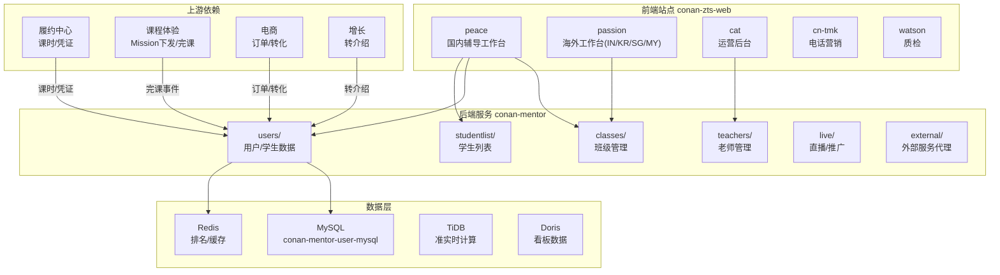
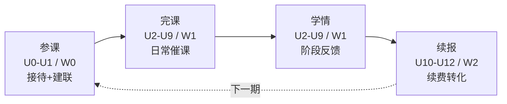
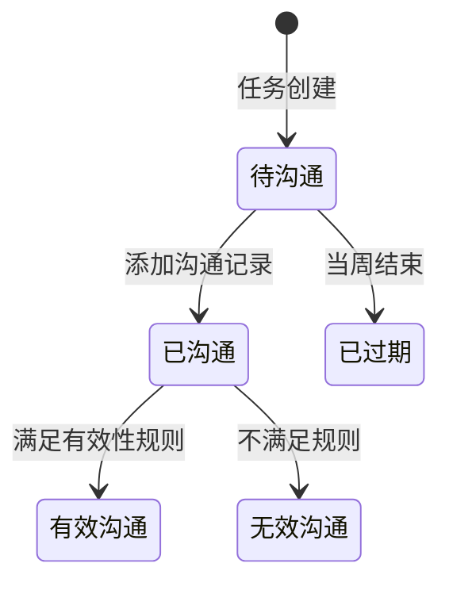
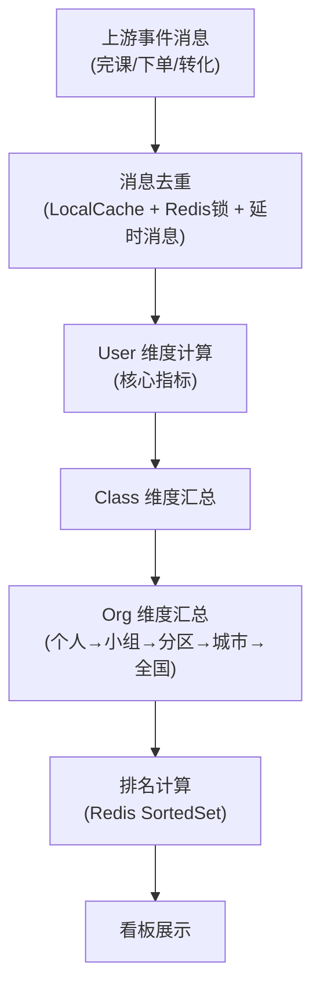

# 辅导服务工程指南

> **TL;DR**：辅导服务是斑马"服务侧"的核心——管理辅导老师的日常工作台（班级、学生列表、沟通任务、数据看板），驱动老师高效完成参课、完课、学情、续报四个阶段的用户沟通。后端是 `conan-mentor`（Java），前端是 `conan-zts-web`（React Monorepo），两个仓库共同支撑国内 peace 和海外 passion 工作台。

---

## 1. 系统架构总览



**核心定位**：
- **conan-mentor**：辅导老师工作台的后端服务，提供班级管理、学生列表、沟通任务、看板数据、绩效导出等能力
- **conan-zts-web**：前端 Monorepo，包含多个站点（peace/passion/cat 等），服务于辅导老师、管理者、运营

---

## 2. 仓库与模块结构

### 2.1 conan-mentor（Java 后端）

| 模块 | 类型 | 职责 |
|---|---|---|
| `conan-mentor-backend` | Library | 核心业务逻辑 |
| `conan-mentor-common` | Library | 公共定义 |
| `conan-mentor-client` | Library | RPC 客户端 SDK |
| `conan-mentor-server` | Service | HTTP/RPC 服务入口 |

**backend 核心组件**（8 个业务包）：

```
conan-mentor-backend/
├── component/
│   ├── users/             # 【最大组件】用户/学生数据全景
│   │   ├── data/          # UserStudyBehavior, UserTag, Order, Shipment...
│   │   ├── storage/       # 大量 Storage 接口 + Db 实现
│   │   ├── service/       # 学生数据服务
│   │   ├── strategy/      # 策略实现
│   │   ├── mapper/        # 数据映射
│   │   └── aliproducer/   # MQ 消息生产
│   ├── classes/           # 班级管理（Semester, ClassAction, 班级状态）
│   ├── teachers/          # 老师管理（Staff, TeacherMission, 扩科订单）
│   │   ├── chain/         # 责任链模式
│   │   └── storage/       # 老师相关持久化
│   ├── studentlist/       # 学生列表（筛选/排序/过滤）
│   ├── external/          # 外部服务代理（RPC 调用封装）
│   │   ├── data/          # MentorClass, UserLesson, Receipt 等 BO
│   │   └── proxy/         # 外部服务代理层
│   ├── live/              # 直播/推广活动
│   ├── pendingoff/        # 待下线功能（灰度管理）
│   └── tool/              # 工具（面试卡配置等）
```

> **关键认知**：`users/` 是体量最大的组件，涵盖了学生学习行为、沟通笔记、标签、订单、发货、学习报告等几乎所有学生维度的数据。日常需求大多在这个包下改。

### 2.2 conan-zts-web（前端 Monorepo）

基于 **pnpm workspaces** 组织，Node >= 22，pnpm >= 10。

| 站点目录 | 说明 |
|---|---|
| `projects/peace` | 国内辅导老师工作台 |
| `projects/in-passion` | 印度 passion 工作台 |
| `projects/kr-passion` | 韩国 passion 工作台 |
| `projects/sg-passion` | 新加坡 passion 工作台 |
| `projects/my-passion` | 马来西亚 passion 工作台 |
| `projects/cube` | 运营后台 |
| `projects/cn-tmk` | 国内电话营销 |
| `projects/watson` | 质检系统 |
| `projects/hunter` | 猎头/招聘 |
| `projects/im-work` | IM 工作台 |
| `projects/passion-login` | 海外登录 |

**核心代码结构**：

```
src/
├── module/            # 【核心】~121 个功能模块
│   ├── student-list/          # 学生列表
│   ├── user-class-table/      # 带班表
│   ├── learning-report/       # 学习报告
│   ├── learning-report-v2/    # 学习报告 v2
│   ├── mentor-organization-management/  # 组织架构管理
│   ├── inspect-report/        # 质检报告
│   ├── live/                  # 直播
│   ├── schedule/              # 排课板
│   ├── allocate-product/      # 分配商品
│   └── ...（更多模块）
├── routes/            # 路由系统（含守卫）
│   ├── route-data.ts          # RouteType 定义
│   ├── render-routes.tsx      # 路由渲染
│   ├── SiteGuard.tsx          # 站点守卫
│   ├── MentorStatusGuard.tsx  # 老师状态守卫
│   └── ...
├── components/        # 共享 UI 组件
├── api/               # API 定义
├── store/             # 状态管理
├── hooks/             # 自定义 Hooks
└── i18n/              # 国际化
```

> **路由系统特点**：每个站点（如 `projects/peace`）有自己的 `routes.tsx`，集中 import 合并来自 `src/module/` 和站点自有模块的路由。使用多层 Guard（`SiteGuard`、`MentorStatusGuard`、`MentorJobTypeGuard`）控制不同角色的访问权限。

---

## 3. 核心业务模型

### 3.1 辅导老师的工作周期

辅导老师的工作围绕四个阶段循环，这是理解整个系统的关键：



- **系统课**：每 4 周为 1 个 U，共 12 个 U（约一年）
- **体验课**：每周为 1 个 W，共 2 周（快速转化）
- **老师人效**：系统课老师约 450 学生，体验课老师约 100 学生

### 3.2 沟通任务体系

沟通任务是辅导服务最核心的业务实体，经过多次演进形成了三种类型：

| 任务类型 | 模式 | 适用场景 |
|---|---|---|
| **普通任务** | 定人定量（必须完成） | 参课沟通、预约学情 |
| **推荐任务** | 定量不定人（系统推荐） | 学情沟通、续报沟通 |
| **完课任务** | 按规则生成 | 完课督学 |

**任务状态机**（系统课非完课任务）：



> **演进历史**：最初只有"普通任务"（定人定量），后因业务发展新增了"推荐任务"（定量不定人）和"完课任务"。三种任务实体和状态机完全隔离，各自独立的 Job 创建和 Consumer 消费。这降低了耦合但增加了代码复杂度。

### 3.3 沟通模板的配置化

沟通模板是辅导服务最复杂的配置之一，采用**四层结构**：

| 层级 | 含义 |
|---|---|
| 沟通主题 (communicateTopic) | 沟通原因 + 学科 + 进度，唯一确定一个模板 |
| 沟通环节 (communicateStage) | 一个主题包含多个环节 |
| 沟通问题 (tag) | 一个环节包含多个问题 |
| 沟通选项 (tagValue) | 一个问题包含多个选项 |

**设计决策**：早期沟通模板是前后端通过枚举类维护，每次模板变更都需要双方修改代码上线。后改为**后端配置化**——展示内容、UI 样式、展示逻辑（使用 `jsonLogic` 组件）、展示顺序全部由后端控制，前端无需改代码。

沟通有效性判断也实现了**规则化**——使用 EL 表达式配置有效性规则，可灵活调整。

### 3.4 核心数据模型

| 模型 | 组件 | 说明 |
|---|---|---|
| `Semester` / `ClassAction` | classes | 学期、班级操作（各种枚举状态） |
| `UserStudyBehavior` | users | 用户学习行为数据 |
| `UserSubjectNote` / `UserTeacherNote` | users | 学科笔记 / 老师笔记 |
| `UserTag` / `UserCustomizeTag` / `UserOrderTag` | users | 用户标签体系（系统标签 + 自定义标签 + 订单标签） |
| `Order` / `OrderShipment` / `Shipment` | users | 订单 + 发货信息 |
| `UserReviewReport` | users | 学习报告 |
| `Staff` / `TeacherMission` | teachers | 员工 / 老师任务 |
| `MentorClass` / `UserClass` / `UserLesson` | external | 外部 BO（来自 RPC 调用） |

---

## 4. 看板系统设计

看板是辅导服务的第二大核心能力，提供数据驱动的管理工具。

### 4.1 三种计算模式

| 模式 | 延迟 | 实现 | 适用场景 |
|---|---|---|---|
| **实时** | 秒~分钟 | RocketMQ + Java + MySQL + Redis | 转化率、长续长个人看板 |
| **准实时** | 小时 | TiDB + DolphinScheduler + Spark + Doris | 完课数据、学情沟通看板 |
| **离线** | 天 | Hive + DolphinScheduler + Spark + Doris | 服务满意度、绩效 |

### 4.2 实时计算核心流程



**关键设计**：
- **消息去重**：使用 LocalCache + Redis 分布式锁 + 延时消息，避免同一事件触发多次重复计算
- **消息限流**：令牌桶算法伪集群限流 + Redis 信号量控制并行度，保护数据库
- **历史数据清理**：配置化的过期数据删除工具，定期清理看板大表

### 4.3 看板分类

| 看板 | 受众 | 关键指标 |
|---|---|---|
| 体验课核心看板 | 辅导老师 + 管理者 | 微信添加率、完课率、转化率、沟通覆盖率 |
| 长续长个人看板 | 辅导老师 | 续报率、续报目标、目标达成率 |
| 长续长管理者看板 | 管理者 + 运营 | 应续/已续、续报率周涨幅、目标达成率周涨幅 |
| 完课看板 | 全部 | 完课百分百占比、完课率 |

---

## 5. AI 能力集成

辅导服务已集成 GPT 能力，提升老师沟通效率：

| 能力 | 说明 | 效果 |
|---|---|---|
| **沟通总结** | 电话挂断后自动生成沟通记录备注 | 语音转文本(4s) + GPT 总结(10-15s)，一键填单 |
| **学情大纲** | 根据家长预约问题自动生成沟通大纲 | 替代老师从《教科书》中手动检索答案 |
| **学情纪要** | 通话后自动生成面向家长的总结 | 以老师视角润色，凸显服务专业性 |

---

## 6. 本地开发与联调

### 6.1 后端（conan-mentor）

| 依赖 | 说明 |
|---|---|
| MySQL | 集群 `conan-mentor-user-mysql`，核心表：`user_study_behavior`, `user_subject_note`, `user_teacher_note` |
| Redis | 排名计算（SortedSet）、缓存 |
| RocketMQ | 消费上游事件（完课、转化、进班等） |
| FDC | 动态配置 |

### 6.2 前端（conan-zts-web）

```bash
pnpm install
pnpm --filter peace run dev       # 国内 peace 工作台
pnpm --filter in-passion run dev  # 印度 passion 工作台
pnpm --filter cube run dev        # 运营后台
```

### 6.3 联调注意事项

- 后端依赖大量外部 RPC（履约中心、课程体验、增长等），`external/proxy/` 封装了这些调用
- 沟通模板配置在数据库中，修改模板不需要发布代码
- 看板数据依赖上游事件消息，本地可通过手动构造消息测试

---

## 7. 常见故障与排障路径

| 场景 | 可能原因 | 排查入口 |
|---|---|---|
| 沟通任务未生成 | Job 执行异常 / 进班消息丢失 | Job 日志 + consumer 消费日志 |
| 看板数据不准 | 消息丢失/去重失败/上游数据变更 | 数据规则校验报警 + 对账 |
| 学生列表缺少数据 | 外部 RPC 超时 / 数据同步延迟 | external/proxy 调用日志 |
| 沟通模板显示异常 | 配置项错误 / jsonLogic 表达式有误 | 数据库沟通配置表 |
| 看板排名错误 | Redis SortedSet 数据不一致 | Redis 数据 vs MySQL 计算结果对比 |

**数据正确性保障体系**：
- **上线前**：虚环境切库全量重算 + 新旧数据对比
- **上线后**：数据规则校验（DolphinScheduler 定时）+ 数据趋势校验 + 数据对账

---

## 8. 历史决策与演进

### 8.1 沟通任务三实体演进

最初只有一种任务实体（普通任务），随业务发展逐步分裂为三种独立实体。虽然增加了代码复杂度，但保障了灰度实验期间各任务类型的完全隔离。

**思考**：现有任务体系是否可以进一步抽象出统一的符合业务整体理解语义的实体概念——这是当前已识别的技术债。

### 8.2 沟通模板从硬编码到配置化

沟通模板从前后端枚举类协同维护，演进为后端配置表驱动（含 jsonLogic 控制展示逻辑），大幅降低了迭代成本。

### 8.3 看板从线下到线上

看板从最初的线下人工制表，演进为实时/准实时/离线三套计算方案并存。引入了消息去重、限流、历史清理等工程手段保障系统稳定性。

---

## 9. 推荐阅读路径

### 9.1 新人代码阅读顺序

1. **理解业务周期**：参课→完课→学情→续报四个阶段
2. **看 `classes/`**：理解 Semester、ClassAction 等班级管理概念
3. **看 `users/`**：理解学生数据全景（学习行为、标签、订单）
4. **看 `studentlist/`**：理解列表筛选/排序逻辑
5. **前端看 `src/module/student-list/`**：理解学生列表页的前端实现

### 9.2 推荐文档

| 文档 | 说明 | 链接 |
|---|---|---|
| 零一说第六期：辅导老师工作台之沟通 | 沟通任务体系 + 模板配置化 + GPT 集成 | [Confluence](https://confluence.zhenguanyu.com/pages/viewpage.action?pageId=519310819) |
| 零一说第十一期：辅导服务看板&绩效 | 看板架构 + 三种计算模式 + 数据正确性保障 | [Confluence](https://confluence.zhenguanyu.com/pages/viewpage.action?pageId=569932947) |
| 零一说第十二期：点评业务分享 | 点评业务详细设计 | [Confluence](https://confluence.zhenguanyu.com/pages/viewpage.action?pageId=619101064) |

### 9.3 关键代码入口速查

| 场景 | 仓库 | 代码入口 |
|---|---|---|
| 班级管理 | conan-mentor | `component/classes/` |
| 学生数据全景 | conan-mentor | `component/users/` |
| 沟通任务 | conan-mentor | `component/users/service/` (任务创建/状态流转) |
| 老师管理 | conan-mentor | `component/teachers/` |
| 学生列表筛排 | conan-mentor | `component/studentlist/` |
| 外部 RPC 调用 | conan-mentor | `component/external/proxy/` |
| 学生列表页 | conan-zts-web | `src/module/student-list/` |
| 带班表 | conan-zts-web | `src/module/user-class-table/` |
| 学习报告 | conan-zts-web | `src/module/learning-report-v2/` |
| 路由与权限 | conan-zts-web | `src/routes/` + 各种 Guard |
| 各站点入口 | conan-zts-web | `projects/peace/`, `projects/*/` |
