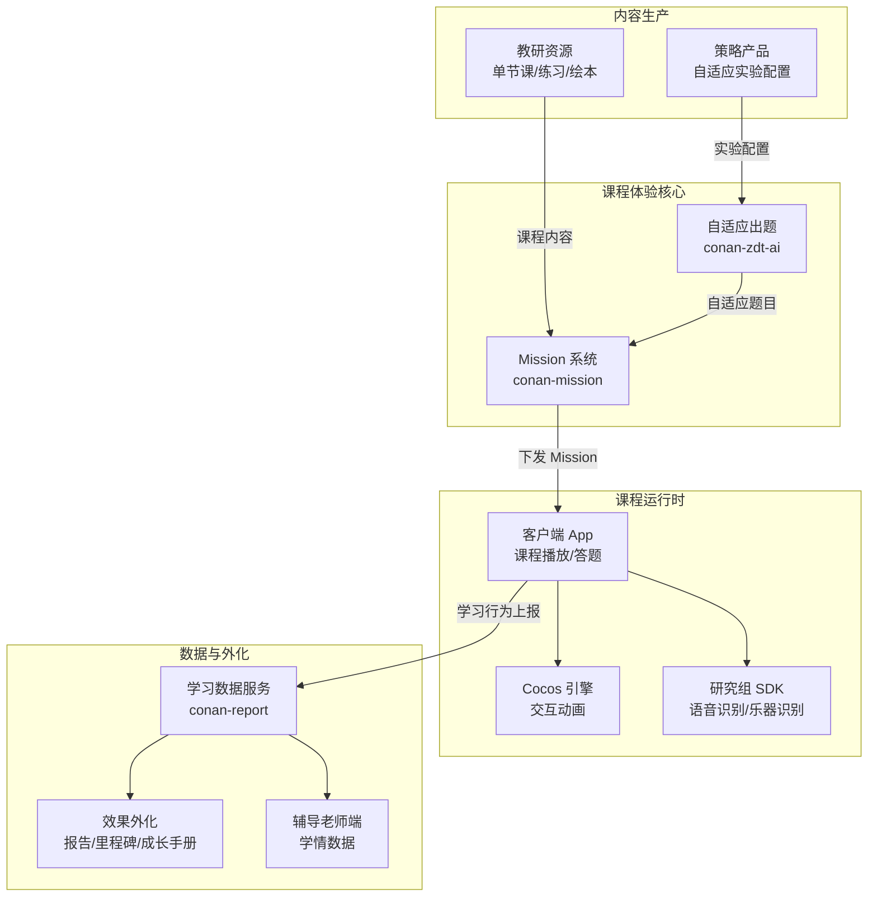
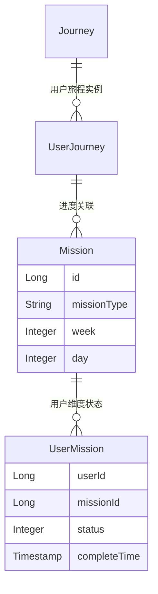
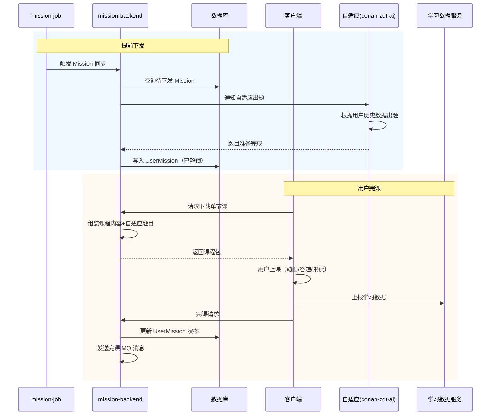
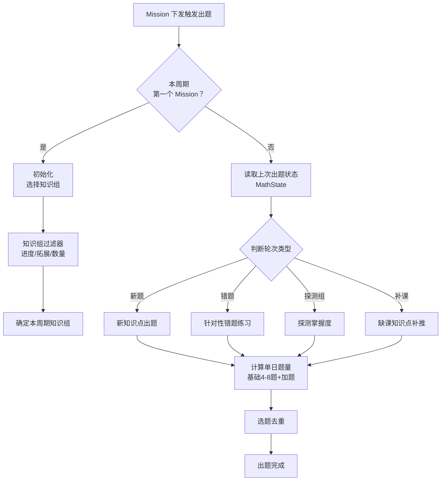

# 课程体验工程指南

> **TL;DR**：课程体验团队围绕 `conan-mission` 系统构建了斑马的**课程下发、学习数据收集、自适应出题、效果外化**全链路。新人只要理解"Mission 下发 → 用户完课 → 数据采集 → 效果呈现"这条主线，就能快速定位课程体验域的大部分需求。

---

## 1. 系统架构总览



**核心链路**：教研编排课程内容 → Mission 系统按进度下发 → 自适应引擎补充个性化题目 → 客户端渲染并执行 → 学习数据回收 → 效果外化触达家长。

---

## 2. 仓库与模块结构

### 2.1 conan-mission（课程任务系统）

Mission 系统是课程体验的中枢，负责课程的**下发、展示、回收**。

| 模块 | 类型 | 职责 |
|---|---|---|
| `conan-mission-backend` | Library | 核心业务逻辑 |
| `conan-mission-web` | Service | C 端接口（课程列表/下载） |
| `conan-mission-admin` | Service | 运营后台 |
| `conan-mission-rpc` | Service | RPC 服务（供自适应/辅导等调用） |
| `conan-mission-consumer` | Service | MQ 消费（开课/完课事件） |
| `conan-mission-job` | Service | 定时任务（Mission 同步/下发） |
| `conan-mission-common` | Library | 公共定义 |
| `conan-mission-client` | Library | RPC 客户端 SDK |

**backend 组件划分**：

```
conan-mission-backend/
├── component/
│   ├── mission/          # Mission 核心（下发/展示/状态管理）
│   │   ├── data/
│   │   │   ├── mission/  # MissionBO, UserMissionBO 及子类型
│   │   │   └── roadmap/  # 学习路线图（UserLesson, RoadmapBO）
│   │   └── storage/
│   │       ├── data/     # MissionDO, UserMissionDO, DemoMissionDO
│   │       └── db/       # 分库分表存储
│   ├── dispatcher/       # 课程编排器（Journey/学习旅程管理）
│   │   ├── data/         # UserJourneyBO, MissionCheckBO
│   │   └── storage/
│   │       └── data/     # JourneyDO, UserJourneyDO, StudyManualConfig
│   ├── remind/           # 提醒触达（推送/短信/弹窗）
│   ├── concrete/         # 具体课程类型处理
│   ├── questionnaire/    # 问卷
│   ├── receiptedition/   # 内容版本管理
│   └── baselinetest/     # 基线测试
```

---

## 3. 核心领域模型

### 3.1 Mission 体系



**关键实体**：

| 实体 | 组件 | 说明 |
|---|---|---|
| `MissionDO` / `MissionBO` | mission | 课程任务定义，一个 Mission 对应一节课 |
| `UserMissionDO` / `UserMissionBO` | mission | 用户维度的 Mission 状态（未解锁/已解锁/已完课） |
| `JourneyDO` / `UserJourneyDO` | dispatcher | 学习旅程，管理用户的课程编排和进度 |
| `StudyManualConfig` | dispatcher | 学习手册配置，控制课程展示方式 |
| `UserLesson` / `RoadmapBO` | mission/roadmap | 路线图展示模型，用于客户端渲染学习路径 |

### 3.2 Mission 类型体系

Mission 是一个多态模型，不同课程类型有不同的子类型：

| Mission 子类型 | 说明 |
|---|---|
| `EpisodeMissionBO` | 标准单节课（最常见） |
| `LiveMissionBO` | 直播课 |
| `ExamMissionBO` | 考试/测评 |
| `DemoMissionBO` | 体验课/Demo 课 |

### 3.3 学习数据模型（来自零一说第八期）

学习数据从粗到细分为四层：

| 层级 | 内容 | 数据来源 |
|---|---|---|
| 学习进度 | 到课、参课、完课、章节完成 | 客户端上报 |
| 学习活动记录 | 视频观看、跟读录音、答题、书写轨迹 | 客户端上报 |
| 学习评价 | 星级（1-3星）、百分制、特定评价 | 语音模型/规则引擎 |
| 统计信息 | 用户/日/周/班级维度聚合 | 后端计算 |

---

## 4. 关键流程：Mission 下发与完课



**下发策略要点**（来自 README）：
- Mission 提前下发，在用户解锁前题目已准备好
- 同步逻辑处理 Mission 与 Journey 的关联
- 消费端包括 `MissionConsumer`（Mission 状态变更）和 `UserJourneyConsumer`（旅程进度更新）

---

## 5. 自适应学习系统（零一说第七期）

自适应是课程体验最具技术深度的子系统，当前为**第三代**架构。

### 5.1 核心概念

| 概念 | 说明 |
|---|---|
| 策略实验 | 通过 AB 实验控制不同用户的出题策略 |
| 内容实验 | 通过切换 option（内容分组）控制不同用户看到的课程内容 |
| 周期 | 学期 48 周分为 12 个周期，每周期 4 周 |
| 知识组 | 教研编排的相关知识点集合，每周期练习 1 组 |
| 知识点 | 最小学习粒度，关联题库中的题目 |

### 5.2 策略出题流程



**关键设计决策**：
- **知识组步进**：上周期 60%+ 知识点三星率 ≥80% 才步进到下一组
- **受挫保护**：连错 4 题触发知识点受挫，替换为前序知识点
- **周期级回退**：最近 3 天平均三星率 <50% 则回退到上一知识组

---

## 6. 效果外化体系（零一说第八期）

效果外化将学习效果可视化呈现给家长，核心目标是**提升课程认可度 → 促进续报**。

### 6.1 外化形式矩阵

| 形式 | 时间维度 | 外化内容 | 触达方式 |
|---|---|---|---|
| 完课报告 | 每日 | 教学内容、学习效果、星级 | 微信模板消息、App 内 |
| 周学习报告 | 每周 | 进度、效果、知识点掌握 | 微信模板消息、App 内 |
| 阶段测评报告 | 每季度(U3/U6/U9) | 考卷答题情况、评级 | 辅导老师学情沟通 |
| 成长手册 | 学期末(U9) | 作品展示、能力成长 | 微信模板消息 |
| 里程碑卡片 | 实时 | 数据统计（开口次数等） | 家长中心信息流 |

### 6.2 技术要点

- **数据结构可扩展**：三层结构（课程 → 章节 → 素材），通过 JSON ext 字段扩展
- **接口性能**：使用 CompletableFuture 编排 RPC 请求，最大化并行度
- **数据准确性**：基于 SpEL 表达式的校验规则，在测试阶段发现上报异常

---

## 7. 本地开发与联调

| 配置项 | 说明 |
|---|---|
| FDC 配置 | 自适应实验配置、Mission 下发策略、学科开关等 |
| 核心依赖 | conan-zdt-ai（自适应）、学习数据服务、教研内容服务 |
| MQ Topic | Mission 下发通知、完课事件、自适应出题触发 |
| 分库分表 | UserMission 按 userId 分库分表（注意 Sharding 配置） |

**联调注意**：
- 自适应出题依赖用户历史学习数据，新用户走冷启动逻辑
- Mission 下发有时间窗口，测试时可能需要手动触发 Job
- 学习数据上报由客户端完成，服务端测试需模拟上报

---

## 8. 常见故障与排障路径

| 故障场景 | 排查思路 |
|---|---|
| 用户课程未解锁 | Mission 下发 Job 执行状态 → UserMission 记录 → Journey 进度 |
| 自适应题目缺失 | 实验配置状态 → 用户分组 → 出题 MathState → 题库数据 |
| 完课报告不准确 | 客户端上报日志 → 校验规则命中 → 学习数据存储 → 外化组装逻辑 |
| 课程内容错乱 | Option 配置 → 内容实验分组 → 单节课绑定关系 |
| 评分异常 | 语音模型版本 → 录音质量 → 打分阈值配置 |

---

## 8. 历史决策与演进

### 自适应三代演进

| 代际 | 方案 | 状态 |
|---|---|---|
| 第一代 | 从题库选一套题，章节类型 SMART_QUIZ | 已废弃 |
| 第二代 | 半自适应，教研设定题型+知识点，系统选干扰项 | 已废弃 |
| 第三代 | 完全自适应，周期-知识组-知识点三层架构，策略实验控制 | 当前使用 |

**关键决策**：
- 第二代 → 第三代：从「半自适应」到「完全自适应」，核心突破是引入知识组/周期的课程编排抽象
- 思维学科从照搬英语到独立发展（每日计算 1.0 → 2.0）
- 内容实验通过复用课程体验组的 `updateTUserOption` 接口，避免重复建设

### 学习数据治理

- **补天行动**：合并同层级 RPC 接口，数量降至原先 1/5
- **数据校验**：引入 SpEL 规则引擎，将 bug 发现前移到测试阶段

### 音乐学科的特殊挑战（零一说第四期）

- **回声消除**：手机扬声器干扰麦克风录音 → 回声消除 + 音量控制策略
- **跑谱一致性**：跑谱/伴奏/录音三者同步 → 低延迟组件（iOS AudioUnit / Android AAudio）+ 提前开启录音
- **识别区间优化**：从固定区间 → 自适应区间 → 右偏区间（适应儿童偏慢的敲击节奏）

---

## 9. 推荐阅读路径

### 新人入门（第 1 周）

1. 阅读 `conan-mission/README.md` 了解 Mission 系统职责
2. 了解 `mission` 和 `dispatcher` 两个核心组件的关系
3. 浏览零一说第八期前半：学习数据包含哪些内容

### 深入理解（第 2-3 周）

4. 走读 Mission 下发流程（Job → Backend → DB）
5. 走读完课流程（Client → Backend → MQ）
6. 浏览零一说第七期：自适应学习的知识组/周期/出题策略
7. 了解 UserMission 分库分表规则

### 进阶参考

- 零一说第四期：音乐学科实现（Cocos 引擎、MIDI、乐器识别）
- 自适应实验平台操作（实验创建/分流/监控）
- 效果外化系统的 CompletableFuture 任务编排模式
- 学习数据校验规则的 SpEL 表达式编写
