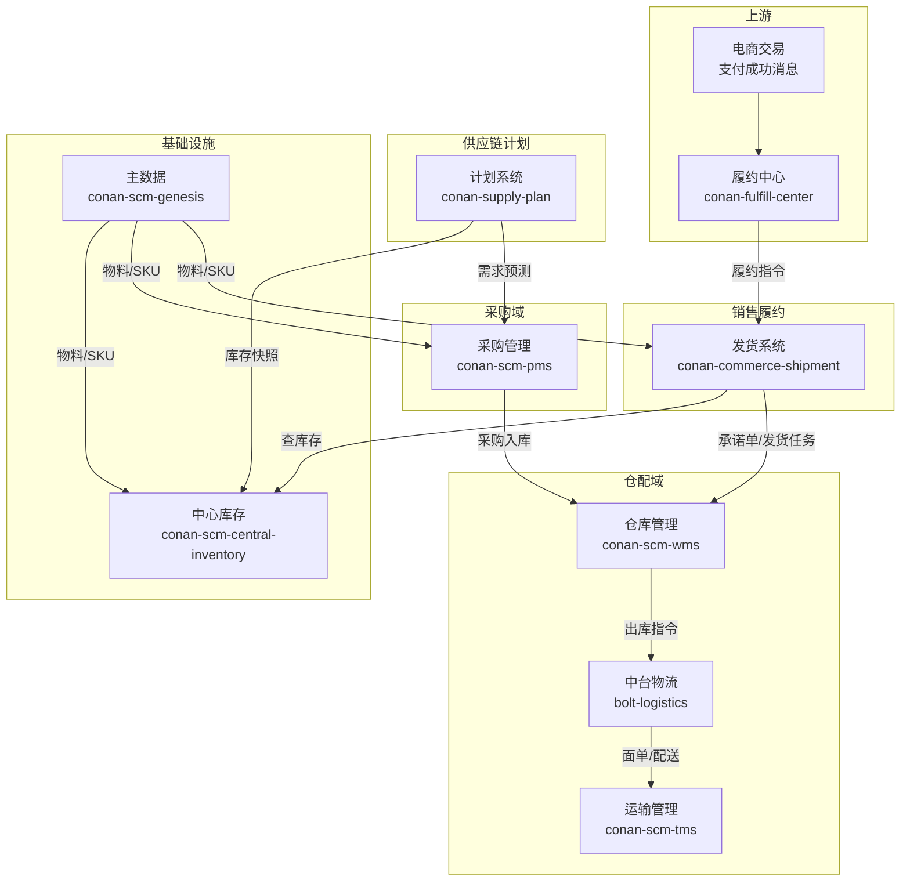
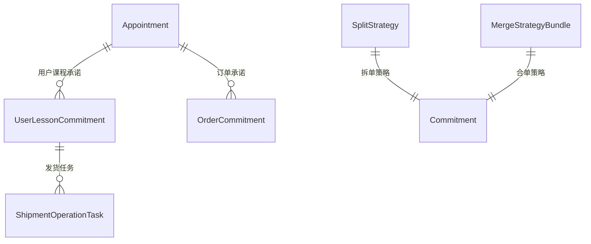
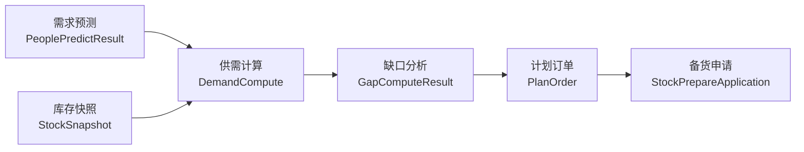
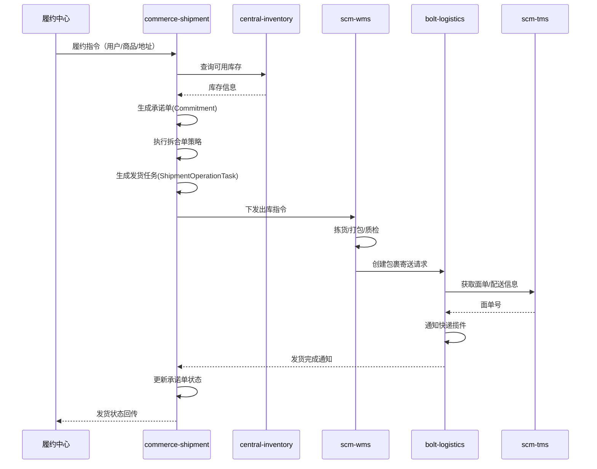
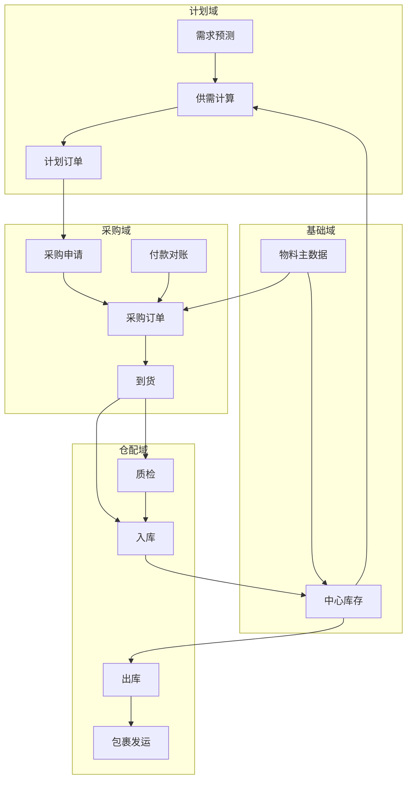

# 供应链工程指南

> **TL;DR**：供应链是斑马从「用户下单」到「实物到手」的完整后端链路，涵盖**销售履约（shipment）、计划预测（supply-plan）、采购（PMS）、仓储（WMS）、运输（TMS）、中心库存（central-inventory）**等子系统。新人理解"承诺单 → 发货任务 → 仓库出库 → 物流配送"这条主线，就能定位大部分供应链需求。

---

## 1. 系统架构总览



**核心调用链（正向发货）**：

履约中心发出履约指令 → `conan-commerce-shipment` 生成承诺单(Commitment) → 根据库存和策略拆合单 → 生成发货任务(ShipmentOperationTask) → WMS 执行仓内拣货打包 → `bolt-logistics` 创建包裹寄送 → TMS 对接快递公司 → 物流签收。

---

## 2. 仓库全景

供应链是斑马仓库最多的领域，`~/Shipment/` 下共 11 个仓库：

| 仓库 | 定位 | 核心能力 |
|---|---|---|
| `conan-commerce-shipment` | 销售履约 | 承诺单、发货任务、拆合单、逆向退货 |
| `conan-supply-plan` | 供应链计划 | 需求预测、供需缺口计算、备货计划 |
| `conan-scm-pms` | 采购管理 | 供应商、询价核价、采购订单、到货、付款对账 |
| `conan-scm-wms` | 仓库管理 | 入出库作业、质检、仓内配送 |
| `conan-scm-tms` | 运输管理 | 快递公司、面单、承运商管理 |
| `bolt-logistics` | 中台物流 | 统一寄送能力、库存、包裹跟踪、ERP对接 |
| `conan-scm-central-inventory` | 中心库存 | 集团视角库存账务、库存查询与同步 |
| `conan-scm-genesis` | 主数据 | 物料、商品SKU、序列号管理 |
| `conan-scm-common` | 公共库 | 动态配置、国际化、工具类 |
| `conan-scm-meta` | 知识库 | Submodule 聚合 + 文档/工作流 |
| `commons-oss` | OSS 封装 | 对象存储客户端（阿里云/腾讯云） |

---

## 3. 核心仓库详解

### 3.1 conan-commerce-shipment（销售履约）

供应链最核心的业务仓库，承接从履约中心到仓库的全链路。

**模块结构**：standard + `conan-supply-admin`（供应链管理后台也在此仓库）。

**backend 组件（19 个）**：

```
conan-commerce-shipment-backend/
├── component/
│   ├── commitment/              # 承诺单（核心！拆合单策略）
│   ├── shipment/                # 发货任务管理
│   ├── fulfill/                 # 履约执行
│   ├── reverse/                 # 逆向退货
│   ├── inventory/               # 库存查询与预占
│   ├── stockchannel/            # 库存渠道
│   ├── customdelivery/          # 自定义配送
│   ├── customdeliveryext/       # 自定义配送扩展
│   ├── lessondeliverystrategy/  # 课程发货策略
│   ├── gift/                    # 赠品处理
│   ├── inspection/              # 验货
│   ├── fullchainmonitor/        # 全链路监控
│   ├── statistics/              # 统计
│   ├── invoicetemplate/         # 发票模板
│   ├── promotionshipmentrecord/ # 促销发货记录
│   ├── bomextendinfo/           # BOM 扩展信息
│   ├── grouphelper/             # 分组辅助
│   ├── magiccube/               # 魔方（灵活配置）
│   └── common/                  # 公共
```

### 3.2 conan-supply-plan（供应链计划）

从需求预测到采购计划的智能决策系统。

**backend 组件（13 个）**：

```
conan-supply-plan-backend/
├── component/
│   ├── predict/                 # 需求预测
│   ├── peoplepredict/           # 人数预测
│   ├── plancompute/             # 计划计算引擎
│   ├── planorder/               # 计划订单
│   ├── fullchain/               # 全链路供需（净需求/缺口/库存快照）
│   ├── stockprepare/            # 备货申请
│   ├── stockturnover/           # 库存周转
│   ├── stockallocationconfig/   # 库存分配配置
│   ├── inventorymap/            # 库存映射/BOM
│   ├── productselectionpool/    # 选品池
│   ├── srm/                     # 供应商关系管理
│   ├── approval/                # 审批
│   └── common/                  # 公共
```

### 3.3 conan-scm-pms（采购管理）

采购全链路系统，组件数最多（25 个），覆盖从寻源到结算。

**核心组件分组**：

| 阶段 | 组件 | 职责 |
|---|---|---|
| 寻源 | `supplier`, `suppliermaterial`, `resourcereviewapplication` | 供应商、物料货源、资源评审 |
| 定价 | `inquiryprice`, `pricing`, `pricemasterdata`, `priceapplication` | 询价、核价、价格主数据、价格申请 |
| 采购执行 | `purchaserequest`, `purchaseorder`, `purchasematerialsource` | 采购申请、采购订单、物料来源 |
| 到货 | `purchasedelivery`, `purchasebookdelivery`, `inspection` | 到货通知、预约送货、来料检验 |
| 结算 | `payment`, `reconciliation`, `purchaserefund`, `purchasevoucher` | 付款、对账、退款、凭证 |
| 其他 | `contract`, `riskcontrol`, `purchaseallocationplan` | 合同、风控、采购分配计划 |

---

## 4. 核心领域模型

### 4.1 承诺单模型（Commitment）

承诺单是销售履约的核心概念，代表「承诺给用户发什么货」：



**关键实体**：

| 实体 | 说明 |
|---|---|
| `Appointment` | 预约单，记录用户的发货预约 |
| `UserLessonCommitment` | 用户课程维度的承诺，核心业务单据 |
| `OrderCommitment` | 订单维度的承诺 |
| `CustomDeliveryCommitment` | 自定义配送承诺 |
| `ShipmentOperationTask` | 发货操作任务，执行层面的工作单 |
| `SplitStrategy` / `MergeStrategyBundle` | 拆合单策略配置 |

### 4.2 计划模型



| 实体 | 组件 | 说明 |
|---|---|---|
| `PlanOrder` / `PlanOrderDetail` | planorder | 计划订单，驱动采购需求 |
| `NetDemand` / `DemandCompute` | fullchain | 净需求计算 |
| `GapComputeResult` | fullchain | 供需缺口分析结果 |
| `StockSnapshot` | fullchain | 库存快照，计算时点的库存状态 |
| `DeliveryPredict` | fullchain | 到货预测 |

---

## 5. 关键流程：正向发货



**拆合单策略**是发货流程最复杂的部分：
- **拆单**：一个订单可能需要分多次发货（如不同仓库、不同时间）
- **合单**：多个订单可能合并为一个包裹（如同一用户同一地址）
- 策略由 `SplitStrategy` 和 `MergeStrategyBundle` 配置驱动

---

## 6. 各子系统协作关系



**一句话串联**：需求预测驱动计划 → 计划驱动采购 → 采购到货入仓 → 用户下单触发出库 → 仓库拣货打包 → 物流配送到家。

---

## 7. 本地开发与联调

| 配置项 | 说明 |
|---|---|
| FDC 配置 | 拆合单策略、发货规则、库存渠道配置 |
| 核心依赖 | 履约中心（上游指令）、电商（订单信息）、bolt-logistics（物流能力） |
| 外部依赖 | ERP 系统（hand-erp）、三方快递 API |
| MQ Topic | 履约指令、发货状态变更、库存变动、采购到货 |

**联调注意**：
- 供应链系统间依赖密切，本地开发建议聚焦单一仓库，其他依赖走测试环境 RPC
- `conan-scm-meta` 是知识库入口，首次接触供应链建议从 `repos/README.md` 开始
- 库存操作涉及多系统协作，测试时注意数据一致性

---

## 8. 常见故障与排障路径

| 故障场景 | 排查思路 |
|---|---|
| 用户未收到发货 | 承诺单状态 → 发货任务状态 → WMS 出库记录 → 物流单号 → 快递状态 |
| 拆单异常 | 拆单策略配置 → 库存分布 → 承诺单拆分记录 → 发货任务数量 |
| 库存不足 | 中心库存查询 → 预占记录 → 各渠道库存 → 入库记录 |
| 采购到货延迟 | 采购订单状态 → 预约送货记录 → 供应商履约 → ERP 对接 |
| 物流签收异常 | bolt-logistics 包裹状态 → TMS 面单信息 → 快递公司API |
| 全链路监控告警 | fullchainmonitor 组件 → 各节点状态 → 超时配置 |

---

## 8. 历史决策与演进

### 从「电商发货」到「独立供应链」

早期发货逻辑嵌在电商系统中，随着业务复杂度增长（实物+课程混合发货、拆合单需求、多仓库管理），逐步拆分为独立的供应链系统体系。

### 中台化：bolt-logistics

`bolt-logistics` 作为物流中台，为各业务线提供统一的寄送与仓配能力，避免各业务线重复对接快递公司和仓库系统。

### SCM 体系建设

采购（PMS）、仓储（WMS）、运输（TMS）是标准供应链管理三件套，斑马的实现遵循行业通用模式，但根据教育行业特点做了适配：
- **课程发货策略**（`lessondeliverystrategy`）：针对课程类商品的特殊发货逻辑
- **承诺单**（`commitment`）：教育行业的承诺制履约模式
- **BOM 扩展**（`bomextendinfo`）：教材包等组合商品的物料清单管理

### 计划系统的价值

`conan-supply-plan` 的核心价值在于**从被动响应到主动预测**：通过人数预测和需求计算，提前计算采购缺口，避免缺货影响用户体验。

---

## 9. 推荐阅读路径

### 新人入门（第 1 周）

1. 阅读 `conan-scm-meta/repos/README.md` 了解供应链全景
2. 阅读 `conan-commerce-shipment/README.md` 了解销售履约定位
3. 理解承诺单（Commitment）→ 发货任务（ShipmentOperationTask）的核心关系

### 深入理解（第 2-3 周）

4. 走读 `commitment` 组件的拆合单策略
5. 走读 `shipment` 组件的发货任务执行流程
6. 了解 `bolt-logistics` 的中台物流能力
7. 浏览 `conan-supply-plan` 的全链路供需计算（`fullchain` 组件）

### 进阶参考

- `conan-scm-pms` 的采购全链路（25 个组件覆盖从寻源到结算）
- `conan-scm-wms` / `conan-scm-central-inventory` 的仓储与库存账务分工
- 全链路监控（`fullchainmonitor`）的设计与告警策略
- 供应链 Confluence 文档：「斑马供应链销售履约」
