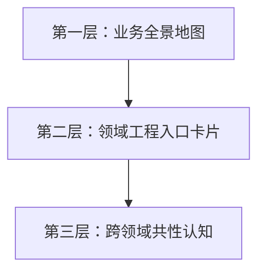

# Part 3：业务领域导航与工程入口

> **TL;DR**：这一部分不重写领域知识，而是做**索引层 + 工程桥接层**。公司已有"零一说"沉淀各领域的业务背景和设计思路，Part 3 的价值在于：帮新人回答"作为工程师，我怎么进入这个领域——看哪些仓库、查哪些文档、注意哪些坑"。

---

## 与"零一说"的关系

[零一说](https://confluence.zhenguanyu.com/pages/viewpage.action?pageId=441683943)已经按领域沉淀了大量业务知识（增长获客、电商、供应链、课程体验等）。它回答的是"这个业务是什么、为什么这样设计"。

Part 3 **不重复这些内容**，而是从工程视角补充：

| 零一说已覆盖 | Part 3 补充 |
|---|---|
| 业务背景与动机 | 核心仓库与代码入口 |
| 系统设计思路 | 本地环境搭建要点 |
| 关键流程说明 | 高频排障路径与告警 |
| 领域术语 | 跨领域共性模式 |

## 三层内容结构

### 第一层：业务全景地图（1 篇）

用一张图说清楚斑马当前有哪些业务线、各团队负责什么、系统间的核心依赖关系。新人看完这张图，至少知道"我接的需求属于哪个领域，上下游是谁"。

### 第二层：领域工程入口卡片（每团队 1 页）

每个业务团队一张卡片，格式统一，内容聚焦"工程师进入这个领域的最短路径"。

**卡片标准结构**：

- 团队职责一句话
- 核心仓库列表
- 零一说对应文章链接
- 本地开发/联调注意事项
- 常见告警与排障入口
- 领域特有的技术选型说明（如果有）

### 第三层：跨领域共性认知（1-2 篇）

从多个领域中提炼共性模式，避免每个卡片重复写：

- 订单/状态机模式（电商、履约、供应链都涉及）
- 消息驱动的跨系统协作
- 缓存与搜索的组合使用
- 灰度/白名单的常见策略与踩坑

---

## 各团队核心仓库

| 团队 | 核心仓库 |
|---|---|
| **用户增长** | conan-growth-referral, conan-growth-activity, conan-commerce-marketing, conan-promotion-data-aggregate, conan-promotion-automation |
| **电商** | conan-commerce-order, conan-commerce-product, conan-hermes-marketing |
| **课程体验** | conan-mission |
| **辅导服务** | conan-mentor, conan-zts-web |
| **履约 & 客服** | conan-fulfill-center, conan-kefu-center |
| **供应链** | conan-commerce-shipment, conan-supply-plan |

## 当前进度

- 三层结构已确定，各团队核心仓库已确认
- 第一层：业务全景地图 → `01-业务全景地图.md`（✅ 已完成）
- 第二层：领域工程入口卡片（✅ 6 篇全部完成）
  - `02-用户增长工程指南.md` ✅
  - `03-电商工程指南.md` ✅
  - `04-履约客服工程指南.md` ✅
  - `05-辅导服务工程指南.md` ✅
  - `06-课程体验工程指南.md` ✅
  - `07-供应链工程指南.md` ✅
- 第三层：跨领域共性认知 → 待编写
