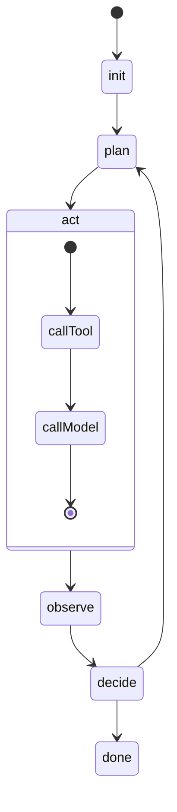
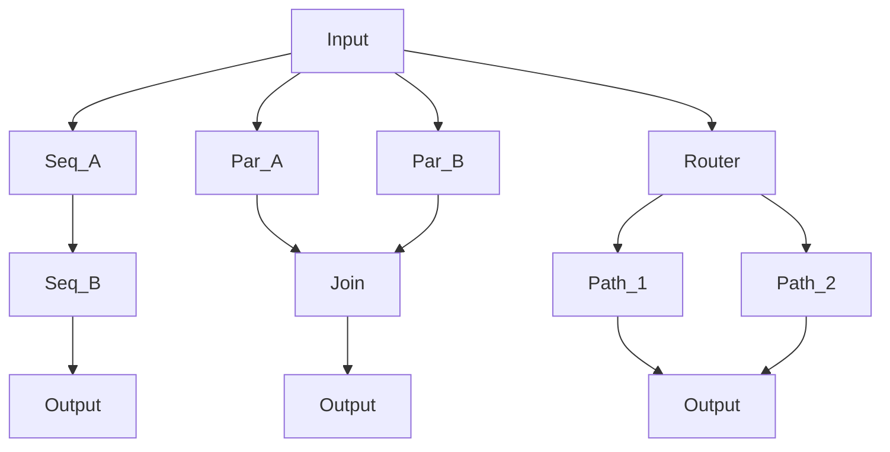
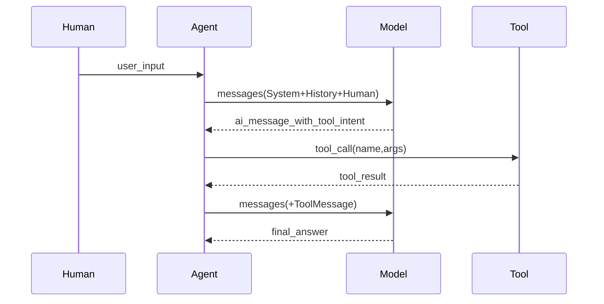
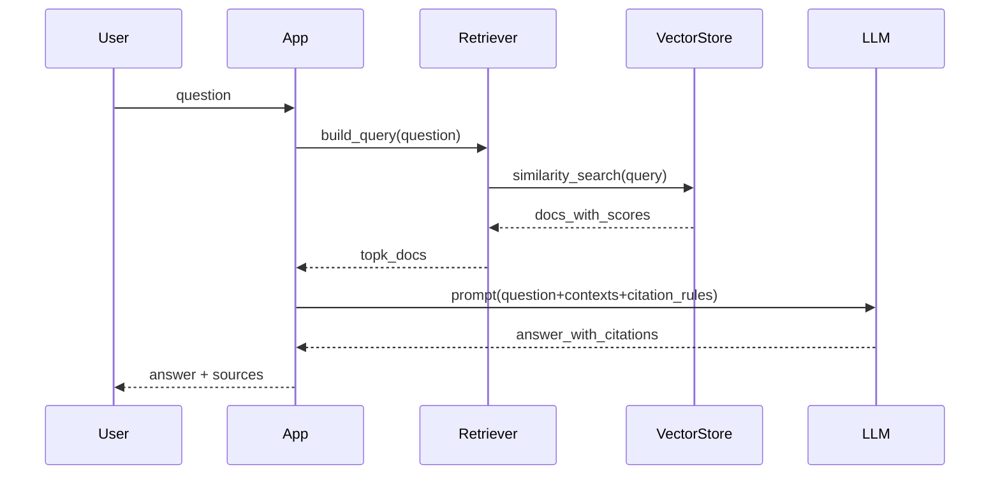
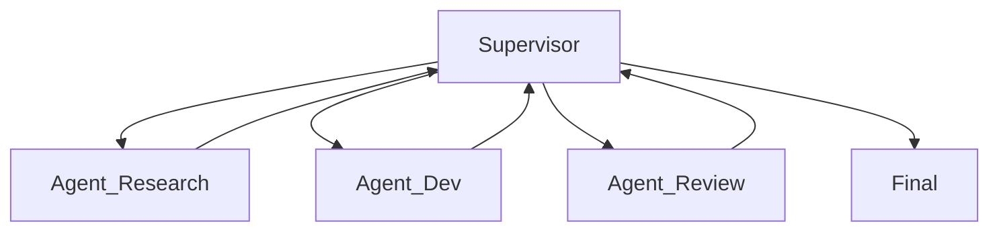
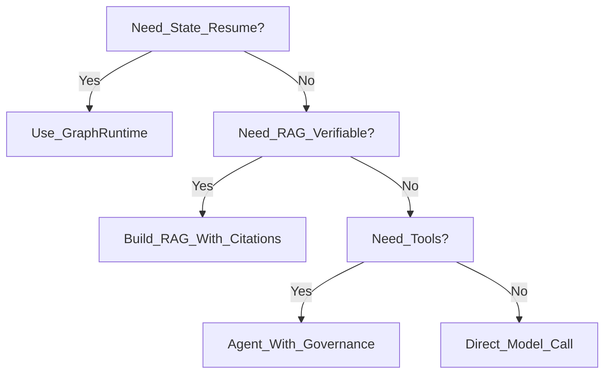

# LangChain 1.0 深度学习指南：从拼装库到生产级 Agent 运行时

> **TL;DR**：LangChain 1.0 的核心变化不是“API 换皮”，而是把框架重心从“链式拼装”迁移到以 `Runnable/LCEL` 为统一抽象、并以 `LangGraph` 作为运行时来承载“状态、恢复、并发、可观测”。本文面向工程与架构视角，拆开 `langchain-core/langchain/langchain-community/partner/classic` 的职责边界，并给出 RAG/Agent/Multi-Agent 的标准落地路径与生产 checklist。

---

## 目录
- [LangChain 1.0 深度学习指南：从拼装库到生产级 Agent 运行时](#langchain-10-深度学习指南从拼装库到生产级-agent-运行时)
  - [目录](#目录)
  - [1) 引言：从 0.x 到 1.0，思维模型发生了什么变化？](#1-引言从-0x-到-10思维模型发生了什么变化)
  - [2) 技术本质：LangChain 1.0 在解决什么“系统问题”](#2-技术本质langchain-10-在解决什么系统问题)
  - [3) 核心设计理念：四个根本性转变](#3-核心设计理念四个根本性转变)
    - [3.1 从“拼装库”到“Agent 运行时”](#31-从拼装库到agent-运行时)
    - [3.2 LCEL：统一的表达语言（以及它不适合的场景）](#32-lcel统一的表达语言以及它不适合的场景)
      - [3.2.1 深度视角：`|` 到底做了什么？](#321-深度视角-到底做了什么)
    - [3.3 LangGraph：把“执行”从函数调用升级成可恢复的图](#33-langgraph把执行从函数调用升级成可恢复的图)
      - [3.3.1 一个可操作的心智模型：可恢复的概率状态机](#331-一个可操作的心智模型可恢复的概率状态机)
      - [3.3.2 深度视角：State 的“Reducer”机制](#332-深度视角state-的reducer机制)
      - [3.3.3 为什么“可恢复”是生产必需品](#333-为什么可恢复是生产必需品)
    - [3.4 模块化：5 个包的职责边界与依赖策略](#34-模块化5-个包的职责边界与依赖策略)
      - [3.4.1 `langchain-core`：稳定抽象层](#341-langchain-core稳定抽象层)
      - [3.4.2 `langchain`：面向应用的高阶入口](#342-langchain面向应用的高阶入口)
      - [3.4.3 `langchain-community`：集成“广度”](#343-langchain-community集成广度)
      - [3.4.4 `langchain-[partner]`：集成“深度”](#344-langchain-partner集成深度)
      - [3.4.5 `langchain-classic`：迁移缓冲层](#345-langchain-classic迁移缓冲层)
  - [4) 底层模块深度剖析：从 `langchain-core` 开始](#4-底层模块深度剖析从-langchain-core-开始)
    - [4.1 `langchain-core`：接口、协议与“可组合性”](#41-langchain-core接口协议与可组合性)
      - [4.1.1 Runnable：把“执行单元”标准化](#411-runnable把执行单元标准化)
      - [4.1.2 Runnable 的组合原语：Sequence / Parallel / Router](#412-runnable-的组合原语sequence--parallel--router)
      - [4.1.3 Message：把上下文从“字符串”升级成“结构”](#413-message把上下文从字符串升级成结构)
      - [4.1.4 Prompt：从模板到“提示值（PromptValue）”](#414-prompt从模板到提示值promptvalue)
      - [4.1.5 Output Parser / Structured Output：把“可验证”前置](#415-output-parser--structured-output把可验证前置)
    - [4.2 `langchain`：面向应用的高阶 API 与现代 Agent 入口](#42-langchain面向应用的高阶-api-与现代-agent-入口)
    - [4.3 `langchain-community`：集成的供给侧与生产边界](#43-langchain-community集成的供给侧与生产边界)
    - [4.4 `langchain-[partner]`：厂商集成的最佳实践与最小依赖](#44-langchain-partner厂商集成的最佳实践与最小依赖)
    - [4.5 `langchain-classic`：0.x 兼容层与迁移策略](#45-langchain-classic0x-兼容层与迁移策略)
  - [5) 实战架构模式：RAG / Agent / Multi-Agent](#5-实战架构模式rag--agent--multi-agent)
    - [5.1 RAG：从“能检索”到“可验证”的标准链路](#51-rag从能检索到可验证的标准链路)
      - [5.1.1 标准数据流](#511-标准数据流)
      - [5.1.2 最小可用骨架（伪代码）](#512-最小可用骨架伪代码)
      - [5.1.3 三个常见"反模式"（Naive RAG 坑位）](#513-三个常见反模式naive-rag-坑位)
      - [5.1.4 完整的最小 RAG 项目结构（可直接参考）](#514-完整的最小-rag-项目结构可直接参考)
    - [5.2 Agent：受控 ReAct 循环与工具治理](#52-agent受控-react-循环与工具治理)
      - [5.2.1 一个受控 Agent 的最小闭环](#521-一个受控-agent-的最小闭环)
      - [5.2.2 工具治理的四条硬约束（建议直接落到代码/配置）](#522-工具治理的四条硬约束建议直接落到代码配置)
    - [5.3 Multi-Agent：协作拓扑、通信协议与收敛性](#53-multi-agent协作拓扑通信协议与收敛性)
      - [5.3.1 三种常见协作拓扑](#531-三种常见协作拓扑)
      - [5.3.2 收敛性：多智能体的“隐形成本”](#532-收敛性多智能体的隐形成本)
  - [6) 生产落地实践：观测、部署、性能、错误处理](#6-生产落地实践观测部署性能错误处理)
    - [6.1 LangSmith：可观测不是“锦上添花”，而是控制面](#61-langsmith可观测不是锦上添花而是控制面)
      - [6.1.1 什么是 Trace？（文本模拟版）](#611-什么是-trace文本模拟版)
      - [6.1.2 建议记录什么（最小可用）](#612-建议记录什么最小可用)
      - [6.1.3 评估（Eval）要像单测一样做回归](#613-评估eval要像单测一样做回归)
    - [6.2 LangServe：把链路变成 API，并把“流式”变成协议](#62-langserve把链路变成-api并把流式变成协议)
    - [6.3 性能：batch/并发/缓存 的工程边界](#63-性能batch并发缓存-的工程边界)
      - [6.3.1 三种缓存（按收益排序）](#631-三种缓存按收益排序)
      - [6.3.2 并发的正确姿势：可控并发](#632-并发的正确姿势可控并发)
    - [6.4 可靠性：重试、降级、熔断与补偿](#64-可靠性重试降级熔断与补偿)
      - [6.4.1 重试（Retry）](#641-重试retry)
      - [6.4.2 降级（Graceful Degradation）](#642-降级graceful-degradation)
      - [6.4.3 熔断（Circuit Breaker）](#643-熔断circuit-breaker)
      - [6.4.4 补偿（Compensating Transaction）](#644-补偿compensating-transaction)
  - [7) 常见反模式与故障复盘：为什么“看起来合理”仍会翻车](#7-常见反模式与故障复盘为什么看起来合理仍会翻车)
    - [7.1 反模式：无限工具循环（while True）](#71-反模式无限工具循环while-true)
    - [7.2 反模式：不可审计输出（无证据链路）](#72-反模式不可审计输出无证据链路)
    - [7.3 反模式：RAG 把“噪声当知识”](#73-反模式rag-把噪声当知识)
    - [7.4 反模式：把社区集成当生产依赖](#74-反模式把社区集成当生产依赖)
    - [7.5 真实故障复盘：失控的研究 Agent（¥8 万美元教训）](#75-真实故障复盘失控的研究-agent8-万美元教训)
  - [8) 技术栈选型与对比：何时选 LangChain，何时不选](#8-技术栈选型与对比何时选-langchain何时不选)
    - [8.1 真实选型案例（可对照参考）](#81-真实选型案例可对照参考)
      - [案例 A：金融风控 RAG（选择 LangChain）](#案例-a金融风控-rag选择-langchain)
      - [案例 B：内部知识问答（选择 LlamaIndex）](#案例-b内部知识问答选择-llamaindex)
      - [案例 C：实验性多智能体协作（选择 AutoGen）](#案例-c实验性多智能体协作选择-autogen)
      - [案例 D：极致成本控制的客服（选择自研）](#案例-d极致成本控制的客服选择自研)
  - [9) 决策框架：6 问（可直接照抄）](#9-决策框架6-问可直接照抄)
      - [灰度与验收（建议直接复用）](#灰度与验收建议直接复用)
  - [10) 深刻认知：五条反直觉结论](#10-深刻认知五条反直觉结论)
    - [结论 1：LCEL 不是必须的](#结论-1lcel-不是必须的)
    - [结论 2：运行时比提示词更重要](#结论-2运行时比提示词更重要)
    - [结论 3：可观测不是排障工具，是控制面](#结论-3可观测不是排障工具是控制面)
    - [结论 4：模块化拆分会增加依赖复杂度](#结论-4模块化拆分会增加依赖复杂度)
    - [结论 5：多智能体不是免费提升](#结论-5多智能体不是免费提升)
  - [11) 行动建议：三周学习路线与验收标准](#11-行动建议三周学习路线与验收标准)
    - [第 1 周：Runnable/LCEL + 最小 RAG](#第-1-周runnablelcel--最小-rag)
    - [第 2 周：图运行时（LangGraph 思维）+ 受控 Agent](#第-2-周图运行时langgraph-思维-受控-agent)
    - [第 3 周：生产化（观测/部署/回归）](#第-3-周生产化观测部署回归)
  - [12) 附录：速查清单与模板](#12-附录速查清单与模板)
    - [A) Runnable 速查（工程视角）](#a-runnable-速查工程视角)
    - [B) RAG 证据链路模板（结构化输出建议）](#b-rag-证据链路模板结构化输出建议)
    - [C) Agent 工具治理 checklist](#c-agent-工具治理-checklist)
    - [D) Multi-Agent 收敛 checklist](#d-multi-agent-收敛-checklist)
    - [E) 常见错误排查速查表](#e-常见错误排查速查表)
      - [E1. `OutputParserException: Could not parse output`](#e1-outputparserexception-could-not-parse-output)
      - [E2. `RateLimitError: Too many requests`](#e2-ratelimiterror-too-many-requests)
      - [E3. `ValidationError: field required`](#e3-validationerror-field-required)
      - [E4. Agent 死循环（工具一直被调用）](#e4-agent-死循环工具一直被调用)
      - [E5. `KeyError: 'context'` in prompt template](#e5-keyerror-context-in-prompt-template)
      - [E6. `TimeoutError` in long-running chain](#e6-timeouterror-in-long-running-chain)
      - [E7. LangSmith trace 显示但内容为空](#e7-langsmith-trace-显示但内容为空)
      - [E8. `ImportError: cannot import name 'X' from 'langchain'`](#e8-importerror-cannot-import-name-x-from-langchain)
      - [E9. Vector store 返回空结果（明明有数据）](#e9-vector-store-返回空结果明明有数据)
      - [E10. API 返回 `StreamingResponse` 但前端收不到](#e10-api-返回-streamingresponse-但前端收不到)

---

## 1) 引言：从 0.x 到 1.0，思维模型发生了什么变化？

很多团队最初使用 LangChain，是把它当成“把 prompt、模型、工具、解析器串起来”的拼装库：能跑就行，能复用就更好。

但一旦进入更复杂的场景——多步骤任务、并发工具调用、流式输出、任务中断恢复、线上可观测、评估回归——你会发现：真正的难点不在“怎么拼”，而在“怎么执行、怎么治理、怎么让系统可控”。

LangChain 1.0 的价值，恰恰是把这些“系统问题”显式化：用更稳定的抽象（Runnable/LCEL）承接组合，用更工程化的运行时（LangGraph）承接执行，用 LangSmith/LangServe 让调试与部署成为标准路径。

---

## 2) 技术本质：LangChain 1.0 在解决什么“系统问题”

把 LangChain 1.0 当成“LLM 应用框架”会低估它；更接近的理解是：它在尝试把 LLM 应用从“脚本”升级成“可运行的系统”，并把关键工程约束前置到框架层。

在工程层面，LangChain 1.0 主要围绕四类约束展开：
- **可组合**：不同来源的组件（prompt/model/tool/parser）需要像积木一样能组合，并且组合后的行为可预测。
- **可执行**：链路不只是函数调用，还要支持流式、并发、分支、循环、回放、恢复。
- **可治理**：预算、权限、工具白名单、输出结构、错误处理都需要制度化，而不是靠“提示词写得更严”。
- **可观测**：调试与评估要成为标准流程，不然系统会在生产里以“概率性故障”的形态出现。

后续章节会把这些约束分别映射到 1.0 的设计点上：LCEL/Runnable、LangGraph、LangSmith、LangServe 与模块化拆分。

---

## 3) 核心设计理念：四个根本性转变

> 本章将先给结论：1.0 的“新”主要来自抽象边界重划与运行时升级，而不是某个单一 API。

### 3.1 从“拼装库”到“Agent 运行时”

如果把 0.x 的 LangChain 理解为“把组件串起来”，那 1.0 更像“给组件提供可执行语义，并把执行语义工程化”。这句话听起来抽象，但可以用一个更可操作的对比来理解：

- 0.x 的主心智模型：**把一条链写出来**（调用顺序=执行顺序）。
- 1.0 的主心智模型：**先描述一个可组合的执行单元（Runnable），再选择执行方式**（同步/批处理/流式/并发/图编排）。

你会在真实项目里很快遇到下面这些“运行时问题”：
- **流式**：你需要 token 级别的增量输出，且要能在中途取消。
- **并发**：你希望同时跑多个工具调用或多个子链路（受限于 rate limit 和任务依赖）。
- **恢复**：一个长流程跑到一半失败，你需要从某个节点恢复（而不是从头再来）。
- **可观测**：你需要把每次调用的输入输出、工具调用、耗时、失败原因结构化落盘，支持回放与评估。

这些都不是“链条能不能拼出来”的问题，而是“这个系统有没有运行时能力”的问题。LangChain 1.0 的迁移方向是：把“可组合”标准化（Runnable/LCEL），把“可执行”下沉到运行时（LangGraph），把“可观测/评估/部署”产品化（LangSmith/LangServe）。

下面这张图用非常粗的方式对比两代心智模型：0.x 更接近“线性 pipeline”，1.0 更接近“图执行 + 可恢复”。


<details>
<summary>📝 查看/编辑 Mermaid 源码</summary>

```mermaid
flowchart TD
  subgraph v0x [v0x_LinearChain]
    v0_prompt[Prompt] --> v0_llm[LLM]
    v0_llm --> v0_tool[Tool]
    v0_tool --> v0_parser[Parser]
    v0_parser --> v0_out[Output]
  end

  subgraph v1x [v1x_GraphRuntime]
    v1_input[Input] --> nodeA[Node_A_Runnable]
    v1_input --> nodeB[Node_B_Runnable]
    nodeA --> joinNode[Join]
    nodeB --> joinNode
    joinNode --> nodeC[Node_C_Runnable]
    nodeC --> v1_out[Output]
  end```

</details>

**边界条件**（避免过度概括）：
- 如果你的链路始终是“短、线性、无并发、无恢复需求”，0.x 风格的线性拼装也能跑得很好，1.0 的运行时能力可能是“用不上但要学”。
- 如果你的系统进入“长链路 + 多工具 + 多步骤 + 可观测/评估/上线”，你迟早会在业务层重复造运行时轮子；这时 1.0 的收益才会显著。

### 3.2 LCEL：统一的表达语言（以及它不适合的场景）

LCEL（LangChain Expression Language）可以粗略理解为：用更一致的方式把“可执行单元”连接起来，让组合后的对象仍然是一个可执行单元（Runnable），并天然拥有 `invoke/batch/stream` 这类执行接口（具体能力取决于底层组件是否支持）。

一个容易忽略但非常关键的点是：LCEL 不是“语法糖”这么简单，它在做两件事：
- **把组合变成一等公民**：组合出来的链路仍然是 Runnable，可以再次被组合、被并发、被容错包装。
- **把执行策略从业务代码里剥离**：你可以先把“逻辑结构”写清楚，再决定“怎么跑”（单次、批量、流式、并行）。

#### 3.2.1 深度视角：`|` 到底做了什么？

当你写 `A | B` 时，Python 实际上执行了 `A.__or__(B)`，这会创建一个 `RunnableSequence(first=A, last=B)` 对象。这个对象会自动处理：
- **流式传递**：如果 A 产出流（Iterator），B 支持消费流，则整个链条自动流式化。
- **类型检查**：在运行时检查 A 的 Output Schema 是否匹配 B 的 Input Schema（如果有定义）。
- **配置透传**：你在 `invoke(..., config={...})` 传入的 callbacks 和 tags 会自动穿透到 A 和 B。

下面给一个最小示例（重点是“组合后的对象仍可执行”，而不是某个具体类名）。当你对具体 import 路径不确定时，把它当成伪代码来理解即可：

```python
# (Pseudocode) 重点是 Runnable 组合与统一执行接口，不绑定具体 provider
prompt = PromptTemplate("用三句话解释：{topic}")
model = ChatModel("provider:model_name")
parser = OutputParser.to_str()

chain = prompt | model | parser
result = chain.invoke({"topic": "LCEL"})
print(result)
```

**LCEL 适合的场景**：
- 你希望把“链路结构”写得一眼可读，并在多个地方复用（例如把检索、压缩、生成分成可复用模块）。
- 你希望统一处理：日志、重试、fallback、超时、缓存（把这些当作对 Runnable 的“装饰器”）。
- 你需要批处理/并发/流式，并希望尽量避免业务代码里出现大量 if/else 和回调拼接。

**LCEL 不适合（或收益不大）的场景**：
- 你的任务极短且一次性：直接调用模型更清晰，过度抽象会增加维护成本。
- 你的执行逻辑高度动态（大量运行时分支）且你不打算用图编排承载：这时“写一个清晰的控制器”可能更稳。
- 团队对抽象层没有共识：LCEL 容易被滥用成“管道套管道”，读起来反而更难。

一个很实用的判断题：**当你发现自己在业务代码里重复写“同一类前后处理（日志/重试/降级/解析）”，就说明你需要把链路抽象成 Runnable，再用 LCEL 组合**。

### 3.3 LangGraph：把“执行”从函数调用升级成可恢复的图

LangGraph 把执行模型从“函数嵌套调用”升级成“显式状态机/图”。这件事对生产系统的意义在于：你终于能把“状态、失败、恢复、并发、回放”变成系统能力，而不是在业务代码里分散实现。

你可以把 LangGraph 粗略理解为：一个约束更强（更可控）的工作流引擎，专门为 LLM/工具调用这类“概率组件”服务。它解决的不是“怎么推理更聪明”，而是“怎么让系统更可控”。

#### 3.3.1 一个可操作的心智模型：可恢复的概率状态机

在 Agent 里，最危险的不是模型偶尔说错，而是控制流失控：无限循环、工具风暴、预算爆炸、不可审计输出。LangGraph 的价值是把控制流画出来，并让每一步都有可观测与可恢复的边界。



上面这张图故意简单化，但它强调了三件关键事实：
- **状态是显式的**：你可以把“当前计划/工具结果/预算/证据”放在 state 里，而不是散落在闭包变量与日志里。
- **循环是显式的**：你能对循环设置硬约束（最大步数、预算、超时、必须收敛条件）。
- **终止是显式的**：你能定义“可接受的完成态”，并为无法完成的情况定义降级输出。

#### 3.3.2 深度视角：State 的“Reducer”机制

LangGraph 最反直觉也最强大的设计是 **Reducer**。

在传统编程里，`state = new_value` 是覆盖。但在 Agent 里，我们往往需要“追加”信息（例如：追加一条新消息到历史记录，而不是覆盖旧消息）。

LangGraph 允许你定义：
```python
# (Pseudocode) 定义状态如何更新
class AgentState(TypedDict):
    # Annotated[类型, reducer函数]
    # operator.add 表示：新值会 extend 到旧列表，而不是覆盖
    messages: Annotated[list, operator.add]
    current_step: int
```

这意味着：
1. 当节点返回 `{"messages": [new_msg]}` 时，系统自动执行 `old_msgs + [new_msg]`。
2. 并发节点同时返回消息时，Reducer 负责合并，避免竞态条件。

#### 3.3.3 为什么“可恢复”是生产必需品

一旦链路超过几十秒（或涉及外部系统），失败是常态：限流、网络抖动、工具 500、权限拒绝、解析失败。没有“恢复”，你只能重跑；重跑意味着成本与不确定性叠加。

LangGraph 一类运行时强调的“检查点/中断/恢复”，本质是在回答这句工程问题：

> 如果系统在第 N 步失败，是否可以在不重复前 N-1 步的前提下，从第 N 步继续？

**边界条件**：
- 恢复并不等于“完全确定性”。如果某一步包含随机性（温度、外部数据变化），恢复后结果可能不同；因此生产系统需要把“关键输入、版本、工具返回”纳入状态与日志。
- 并发也不是免费午餐：它受限于 rate limit、共享资源（数据库/工具配额）、以及任务依赖图。并发的正确做法是“可控并发”，而不是“尽可能并行”。

### 3.4 模块化：5 个包的职责边界与依赖策略

LangChain 1.0 的模块化拆分，表面上是“包更多了”，实质上是在做一件很工程化的事：把“稳定抽象层”与“集成实现层”分开，让你的生产依赖尽量贴近稳定层。

一个建议的分层心智模型如下：


<details>
<summary>📝 查看/编辑 Mermaid 源码</summary>

```mermaid
flowchart TD
  app[YourApp] --> lc[langchain]
  lc --> core[langchain_core]

  app --> partner["langchain_provider_packages"]
  partner --> core

  app --> community[langchain_community]
  community --> core

  app --> classic[langchain_classic]
  classic --> core```

</details>

为了避免把包名写死成某个单一版本，这里用更通用的描述（你可以把 `langchain_provider_packages` 理解为 `langchain-openai/langchain-anthropic/...` 这类厂商包）。

#### 3.4.1 `langchain-core`：稳定抽象层

核心职责是定义接口与协议：Runnable、消息与提示词抽象、工具/解析器接口等。它应该尽量少依赖第三方，以保证版本稳定与可迁移性。

#### 3.4.2 `langchain`：面向应用的高阶入口

核心职责是提供面向应用的组装方式、默认实现与常用模式入口。你可以把它当成“推荐路径”，但生产系统仍然需要对关键边界做显式治理（预算、权限、输出结构）。

#### 3.4.3 `langchain-community`：集成“广度”

它提供非常多的第三方集成与实验性实现，适合原型期快速验证。但生产落地时要有明确策略：
- 依赖 `community` 的组件要做版本锁定与回归测试。
- 对关键链路的集成，优先选择“厂商维护/官方深度支持”的 provider 包或自研适配层。

#### 3.4.4 `langchain-[partner]`：集成“深度”

这类包的工程意义是“最小依赖 + 最佳实现”：只依赖 core，并把某个 provider 的能力做得更完整（例如更一致的流式、工具调用、错误类型映射）。

#### 3.4.5 `langchain-classic`：迁移缓冲层

当你从 0.x 迁移时，Classic 层的作用是降低一次性迁移成本。但要注意一个常见陷阱：长期依赖 classic 等于把技术债永久化。更健康的策略是把它当成“过渡期适配层”，以模块为单位逐步迁移到 Runnable/LCEL 与图执行。

**生产依赖策略（可执行）**：
- 最小依赖：能用 `core + provider` 就不要把 `community` 作为关键路径依赖。
- 抽象稳定：业务代码尽量依赖 `Runnable/Message/Tool` 这类抽象，而不是某个具体链条类的内部行为。
- 回归护栏：任何涉及工具/检索/解析的链路，必须建立最小评估集（10~50 条）用于升级回归。

---

## 4) 底层模块深度剖析：从 `langchain-core` 开始

这一章的目标是：不再从“某个具体链条怎么写”入手，而是从 **LangChain 1.0 的协议层**理解它——也就是 `langchain-core` 里那些“你可以长期依赖”的抽象边界。

如果你只记住一句话：

> `langchain-core` 的核心价值是把 LLM 应用拆成若干可组合的、可执行的、可观测的单元（Runnable），并用统一的消息/工具/解析协议把它们粘合起来。

---

### 4.1 `langchain-core`：接口、协议与“可组合性”

#### 4.1.1 Runnable：把“执行单元”标准化

Runnable 可以粗略理解为：**“输入 → 输出”的可执行对象**，并且天然支持多种执行形态（是否真正支持取决于底层组件实现）：
- `invoke(input)`：单次执行
- `batch(inputs)`：批处理执行（受限于 provider/并发与配额）
- `stream(input)`：流式执行（适合 token streaming / chunk streaming）

它背后体现的设计理念是：先把“逻辑结构”写成可组合对象，再把“执行策略”当成运行时决策。

**为什么这对架构师重要**？因为它把工程里最难的部分前置了：
- 你可以把日志、重试、fallback、超时、缓存等“控制面能力”当作对 Runnable 的包装，而不是散落在业务代码里；
- 你可以在不改业务逻辑的情况下，切换执行策略（单次→批量→并发→图编排）。

**必学技巧：RunnableLambda（万能胶水）**

很多时候你只想插入一段简单的 Python 函数（比如数据清洗、格式转换），不需要写复杂的类。`RunnableLambda` 就是为此设计的：

```python
# 任何接受一个参数的函数，都可以被 @chain 装饰成 Runnable
@chain
def format_context(docs):
    return "\n".join([d.page_content for d in docs])

# 现在它可以直接参与 LCEL
rag_chain = retriever | format_context | prompt | model
```

下面给一个“把控制面收拢到 Runnable 装饰层”的最小示例（伪代码，重点是结构）：

```python
# (Pseudocode) 重点：链路=Runnable；治理能力=对 Runnable 的包装
core = prompt | model | parser

safe = (
  core
  .with_config(tags=["prod"], metadata={"component": "answer"})
  .with_fallbacks([fallback_chain])
  .with_retry(max_attempts=3, backoff="exponential")
  .with_timeout(seconds=20)
)

out = safe.invoke({"input": "..."})
```

**边界条件**：
- 这些“with_*”能力在不同版本/不同组件上可能名称或行为有差异；在生产里应当把它们封装成你自己的 `runtime/` 层，避免业务代码直接耦合到某个 API 细节。

#### 4.1.2 Runnable 的组合原语：Sequence / Parallel / Router

从工程角度，Runnable 的组合可以抽象成三类：
- **Sequence（串行）**：A → B → C（LCEL 的 `|`）
- **Parallel（并发）**：A 与 B 同时跑（受限于 rate limit、任务依赖、资源共享）
- **Router（分流）**：根据输入/中间结果决定走哪条分支

你可以用一张图把这三类组合讲清楚：



**工程建议**：在生产代码里明确区分“并发”和“并行”：
- 并发强调“同一时间推进多个任务”（受限于 IO/配额），未必带来速度线性提升；
- 并行强调“真的同时在多核/多进程跑”，对 Python 来说通常需要额外工程手段。

#### 4.1.3 Message：把上下文从“字符串”升级成“结构”

LangChain 1.0 的消息系统核心不在“角色有几种”，而在于：它让上下文携带 **可被系统理解的结构化元信息**，从而支持：
- 工具调用/工具返回的标准表示（能被追踪与回放）
- 多模态/富内容（content blocks）以及更可控的渲染/过滤
- 更严格的安全策略（例如工具返回中的敏感字段脱敏）

常见的消息类别可以这样理解（不绑定具体类名，强调语义）：
- **System**：系统约束、策略、角色与禁止事项（可粗略理解为 system prompt 的一部分）
- **Human**：用户输入
- **AI**：模型输出（可能包含 tool call 的意图）
- **Tool**：工具返回（必须被纳入可观测与审计）

**生产调试技巧：查看 ToolMessage 的 payload**

当 Agent 行为异常（例如死循环）时，去 trace 里看 `ToolMessage` 往往能找到真相。一个标准的 ToolMessage 包含：
- `tool_call_id`: 对应 AI 消息里那个 call 的 ID（像 TCP 的 seq/ack，把请求和响应对齐）
- `content`: 工具的真实返回（可能是报错信息，模型可能“看不懂”这个报错所以瞎猜）
- `status`: (LangGraph特有) 标记这次调用是否成功

把它画成一次 ReAct 循环的消息流，会更直观：



**边界条件**：
- 如果你把工具结果当成普通文本拼回 prompt，你会失去“工具调用可审计/可回放”的结构；生产系统里建议把工具返回视为“第一等数据”，并落盘到 trace。

#### 4.1.4 Prompt：从模板到“提示值（PromptValue）”

Prompt 在 1.0 里更像“可执行链路的一段输入生产器”，而不是“一段字符串模板”。这让你能在不同的上下文形态之间切换：
- 生成 chat messages（更适合工具调用与多轮对话）
- 生成纯文本 prompt（适合简单一次性任务）

工程上建议把 Prompt 当作“边界层”，把业务规则/约束放在 Prompt 里，但把可观测、重试、预算等放在运行时控制层（否则会变成“提示词里写工程策略”，可维护性差）。

#### 4.1.5 Output Parser / Structured Output：把“可验证”前置

LLM 最大的问题之一是：输出“看起来对”，但不可验证、不可解析。输出解析的本质是把“可验证”变成链路的一部分：
- 能解析（schema）
- 能失败（fail fast）
- 能降级（fallback）

一个推荐的工程原则：

> 生产链路里，凡是要进入下游系统（数据库/工单/执行器）的输出，必须结构化并可验证。

```python
# (Pseudocode) 重点：先定义 schema，再强制解析
schema = {
  "type": "object",
  "required": ["decision", "reason", "confidence"],
  "properties": {
    "decision": {"enum": ["ALLOW", "DENY", "NEED_REVIEW"]},
    "reason": {"type": "string"},
    "confidence": {"type": "number"}
  }
}
chain = prompt | model.with_structured_output(schema)
result = chain.invoke({"input": "..."})
```

---

### 4.2 `langchain`：面向应用的高阶 API 与现代 Agent 入口

如果说 `core` 是协议层，那 `langchain` 更偏“推荐路径”与“应用层入口”：它把一些常见范式（Agent、RAG、路由、链式组合）包装得更易用。

这里不强行绑定某一个具体函数名（因为不同版本 API 可能调整），更推荐按 **能力面**理解 `langchain`：
- **Agent 构建入口**：把“模型 + 工具 + 指令 + 运行时约束”组合成可运行实体；
- **链路装配入口**：提供更常用的 prompt/parse/loader 组合方式；
- **默认工程约束的落点**：例如更一致的 callback/trace 打点入口（最终通常接 LangSmith）。

**给架构师的建议**：
- 把 `langchain` 当成“应用层胶水”，但把“公司级约束（安全/预算/验收）”沉到你自己的 `runtime/` 与 `policy/` 层；
- 任何会影响线上行为的能力（重试、fallback、工具白名单、超时、并发上限）都应当是配置化并可审计的。

推荐的工程化目录结构（示意）：

```text
app/
  workflows/          # 业务工作流（RAG/Agent/Multi-Agent 的图）
  runtime/            # 超时/重试/回退/并发/缓存/预算
  policies/           # 工具白名单、数据分级、脱敏策略
  tools/              # 工具实现与 schema
  prompts/            # Prompt 模板与版本管理
  eval/               # 评估集与回归脚本（LangSmith 或自研）
```

---

### 4.3 `langchain-community`：集成的供给侧与生产边界

`langchain-community` 的定位更像“集成市场”：覆盖范围广，但质量与维护强度不一致。对架构师来说，它的关键价值不是“拿来就用”，而是：
- 帮你快速验证某个外部系统是否值得集成；
- 为自研适配提供参考实现；
- 在非关键链路（后台辅助、离线任务）里加速落地。

**生产边界建议（可执行）**：
- **关键链路避免强依赖**：一旦它成为核心路径，你需要投入同等强度的测试与维护；
- **版本锁定 + 回归集**：任何升级都必须跑固定评估集；
- **兜底策略明确**：社区集成失败时必须有降级（例如只返回“部分结果”）。

---

### 4.4 `langchain-[partner]`：厂商集成的最佳实践与最小依赖

`langchain-[partner]` 可以理解为“深度集成包”：它通常把某一模型/平台的特性做得更完整，并尽量维持对 `core` 的最小依赖。

对生产系统更稳的依赖策略是：
- `langchain-core`（协议层稳定）
- `langchain-[partner]`（provider 实现稳定）
- 业务系统自己的 `runtime/policy/tools`（公司级治理）

这能降低你被某个“综合大包”的内部实现细节绑定的风险。

---

### 4.5 `langchain-classic`：0.x 兼容层与迁移策略

Classic 层的正确用法是“迁移缓冲”，而不是“永久依赖”。一个更健康的迁移策略是：

1. **先把输出结构化**：把旧链路的输出变成 schema 可验证（降低不可控面）。
2. **把关键链路抽象成 Runnable**：让业务代码依赖抽象，而不是旧类/旧构造器。
3. **再把执行升级到图**：把循环、分支、并发、恢复迁移到 LangGraph（或你的工作流层）。
4. **最后拆掉 classic**：把它从关键路径依赖移除。

> 迁移不是“升级版本号”，而是“把不可控因素移出业务代码”。

---

## 5) 实战架构模式：RAG / Agent / Multi-Agent

这一章给你三套“标准形态”，每套都强调：**边界条件、可观测、可验证**。因为在生产里，“能跑”远远不够。

---

### 5.1 RAG：从“能检索”到“可验证”的标准链路

RAG 的真正目标不是“把知识塞给模型”，而是：
- 让回答的关键事实 **可溯源**（source、chunk、score）
- 让检索与生成之间的耦合 **可控**（上下文预算、引用策略）
- 让失败模式 **可降级**（找不到证据就拒答/转人工）

#### 5.1.1 标准数据流



#### 5.1.2 最小可用骨架（伪代码）

```python
# (Pseudocode) RAG 的最小骨架：检索 -> 生成 -> 引用
docs = retriever.retrieve(question, k=5)
contexts = pack_context(docs, token_budget=3000)

prompt = make_prompt(
  question=question,
  contexts=contexts,
  rules=[
    "回答必须引用 contexts 中的证据",
    "找不到证据就输出 NEED_MORE_INFO"
  ],
)
out = (prompt | model | parser).invoke({})
return out
```

#### 5.1.3 三个常见"反模式"（Naive RAG 坑位）

- **反模式 A：把所有文档都塞进上下文**  
  - **现象**：回答更长但更飘；成本暴涨；延迟不可控。  
  - **根因**：上下文变成噪声池，模型在噪声里做"合理化"。  
  - **修复**：严格 token budget + top-k + rerank + 压缩（extractive compression）。

- **反模式 B：引用是装饰，不是约束**  
  - **现象**：给了 sources，但答案与 source 对不上。  
  - **根因**：没有把"引用规则"变成可验证输出。  
  - **修复**：结构化输出：每条结论必须携带 `{source_id, span, confidence}`，并做校验。

- **反模式 C：忽略 prompt injection（来自检索内容）**  
  - **现象**：文档里夹带"忽略系统指令"等文本，模型被带偏。  
  - **根因**：把检索内容当成指令，而不是"证据材料"。  
  - **修复**：在 prompt 明确声明"contexts 是不可信文本"；对检索内容做过滤/分级；必要时使用隔离通道（例如只允许引用，不允许执行）。

---

#### 5.1.4 完整的最小 RAG 项目结构（可直接参考）

这是一个"生产就绪"的最小 RAG 项目结构，不是 demo，而是可以直接部署的骨架：

```text
rag_project/
├── runtime/
│   ├── __init__.py
│   ├── chain.py          # Runnable 装饰层（timeout/retry/fallback）
│   └── budget.py         # 预算控制（token/cost 追踪）
├── retrieval/
│   ├── __init__.py
│   ├── embedder.py       # Embedding 生成（带缓存）
│   ├── retriever.py      # 检索器（top-k + rerank）
│   └── compressor.py     # 上下文压缩
├── generation/
│   ├── __init__.py
│   ├── prompts.py        # Prompt 模板（版本化）
│   ├── schema.py         # 结构化输出 Schema（Pydantic）
│   └── generator.py      # 生成链路（prompt | model | parser）
├── tools/
│   ├── __init__.py
│   └── citation_validator.py  # 引用校验工具
├── eval/
│   ├── test_cases.json   # 评估集（20~50 条）
│   └── eval_runner.py    # 回归脚本
├── api/
│   ├── __init__.py
│   └── server.py         # LangServe 部署入口
├── config.yaml           # 配置（模型/向量库/预算）
├── requirements.txt
└── README.md
```

**关键文件示例**：

**`generation/schema.py`**（结构化输出）：
```python
from pydantic import BaseModel, Field

class Evidence(BaseModel):
    source_id: str = Field(description="文档 ID")
    content: str = Field(description="引用片段")
    score: float = Field(description="相关性分数", ge=0, le=1)

class Answer(BaseModel):
    answer: str = Field(description="最终回答")
    evidences: list[Evidence] = Field(description="证据列表")
    confidence: float = Field(description="置信度", ge=0, le=1)
    need_more_info: bool = Field(description="是否需要更多信息")
```

**`runtime/budget.py`**（预算控制）：
```python
class BudgetTracker:
    def __init__(self, max_tokens=10000, max_cost_usd=1.0):
        self.max_tokens = max_tokens
        self.max_cost = max_cost_usd
        self.used_tokens = 0
        self.used_cost = 0.0
    
    def check_and_update(self, tokens, cost):
        if self.used_tokens + tokens > self.max_tokens:
            raise BudgetExceededError("Token 预算超限")
        if self.used_cost + cost > self.max_cost:
            raise BudgetExceededError("成本预算超限")
        self.used_tokens += tokens
        self.used_cost += cost
```

**`eval/test_cases.json`**（评估集示例）：
```json
[
  {
    "id": "case_001",
    "query": "如何重置密码？",
    "expected_keywords": ["设置", "账户", "密码"],
    "expected_source_ids": ["doc_123"],
    "max_cost_usd": 0.05
  }
]
```

**工程建议**：
- **配置分离**：所有魔法数字（top-k/temperature/预算）放 `config.yaml`，不写死在代码里
- **版本化**：Prompt 模板加版本号（例如 `v2_citation_strict.txt`），便于 A/B 测试
- **监控打点**：每个关键环节（检索/生成/校验）都记录 latency 和 success rate

---

### 5.2 Agent：受控 ReAct 循环与工具治理

Agent 的“强大”来自工具调用；Agent 的“风险”也来自工具调用。生产系统要做的是：**把 Agent 变成受控系统**。

#### 5.2.1 一个受控 Agent 的最小闭环


<details>
<summary>📝 查看/编辑 Mermaid 源码</summary>

```mermaid
stateDiagram-v2
  [*] --> plan
  plan --> callTool
  callTool --> observe
  observe --> decide
  decide --> done
  decide --> plan```

</details>

#### 5.2.2 工具治理的四条硬约束（建议直接落到代码/配置）

- **工具白名单**：只允许调用明确注册的工具；默认拒绝未知工具。
- **参数校验**：工具 schema 必须严格验证；不满足就拒绝执行并返回可解释错误。
- **预算上限**：最大步数、最大工具调用次数、最大 token、最大 wall time。
- **降级策略**：超预算/失败时输出“部分结果 + 原因 + 建议下一步”，而不是继续赌。

最小骨架（伪代码）：

```python
# (Pseudocode) 受控 Agent 循环：预算、白名单、可观测
state = init_state(user_input)
for step in range(MAX_STEPS):
  action = model.decide(state)
  if action.type == "FINAL":
    return action.output
  if action.tool not in TOOL_ALLOWLIST:
    state = add_error(state, "TOOL_NOT_ALLOWED")
    continue
  result = run_tool(action.tool, validate(action.args))
  state = update_state(state, action, result)
return partial_output(state, reason="MAX_STEPS_EXCEEDED")
```

---

### 5.3 Multi-Agent：协作拓扑、通信协议与收敛性

多智能体系统不是“把一个 Agent 拆成三个”就能更强；它更像分布式系统：**通信、协作、收敛** 才是关键。

#### 5.3.1 三种常见协作拓扑

- **Supervisor（主管调度）**：一个总控负责拆分任务、分配子任务、汇总结果。  
- **Handoff（接力）**：按阶段把任务交给不同角色（检索→分析→写作→校对）。  
- **Broadcast/Map-Reduce**：并发生成候选，再聚合/投票/评估。



#### 5.3.2 收敛性：多智能体的“隐形成本”

常见失败是“大家都在努力，但系统不收敛”：
- **互相打架**：一个 agent 提建议，另一个推翻，循环往复；
- **信息风暴**：并发产出太多候选，聚合成本暴涨；
- **责任不清**：没人对最终输出负责，导致质量不稳定。

工程修复思路：
- 明确“最终裁决者”（Supervisor 或评估器）
- 明确“收敛条件”（足够好就停，而不是无限优化）
- 明确“共享状态协议”（哪些字段可读写、版本如何演进）

---

---

## 6) 生产落地实践：观测、部署、性能、错误处理

这一章把 LangChain 1.0 相关的生产问题分成四件事：**可观测、可部署、可优化、可恢复**。你可以把它理解为“控制面建设清单”。

---

### 6.1 LangSmith：可观测不是“锦上添花”，而是控制面

对 LLM 系统来说，“日志”不够用：你需要的是 **可回放的执行轨迹（trace）**。原因很简单：LLM 产生的是概率行为，许多 bug 只在特定上下文/特定工具返回下出现。

#### 6.1.1 什么是 Trace？（文本模拟版）

不要把 Trace 想象成复杂的 APM，它其实就是**一棵执行树**。想象一下你在 LangSmith 里看到的结构：

```text
[Chain] RAG_Flow (latency: 1.2s, tokens: 450)
 ├── [Retriever] VectorStore_Search
 │    ├── Input: "如何重置密码"
 │    └── Output: [Doc(id=1, score=0.9), Doc(id=2...)]
 ├── [Runnable] Format_Context (latency: 0.01s)
 └── [LLM] ChatOpenAI (latency: 0.8s)
      ├── Input: System="...", User="...", Context="..."
      └── Output: "请点击设置页面的..."
```

**控制面价值**：
1. **调试**：点开 `VectorStore_Search` 节点，发现 score 很低 -> 知道是检索问题，不是模型笨。
2. **数据集收集**：一键把这个 Trace 的 Input/Output 添加到“回归测试集”。

#### 6.1.2 建议记录什么（最小可用）

- **输入**：用户输入、系统策略版本、prompt 版本、模型版本
- **中间过程**：每一步工具调用（name/args/result/latency/error）
- **输出**：结构化输出 + 渲染输出
- **预算**：token/步骤/耗时/重试次数
- **安全**：敏感字段脱敏后的影子副本

#### 6.1.3 评估（Eval）要像单测一样做回归

一个最小评估集可以是 20~50 条典型 query（覆盖长文、歧义、拒答、边界输入）。每次升级模型/提示词/检索器都跑：
- 正确性（事实与引用一致）
- 稳定性（输出 schema 可解析）
- 成本（token、工具调用数）
- 安全（不泄露、不越权、不执行不允许工具）

---

### 6.2 LangServe：把链路变成 API，并把“流式”变成协议

部署最怕的是“把 demo 代码包一层 FastAPI”。生产 API 需要明确契约：
- 输入 schema（版本化）
- 输出 schema（结构化 + 可渲染）
- 流式协议（SSE/WebSocket）
- 取消语义（客户端断开如何停止后端）
- 幂等性（同一 request_id 重试不会造成重复副作用）

建议的 API 形态（示意）：

```json
{
  "request_id": "uuid",
  "input": "...",
  "options": {
    "stream": true,
    "max_steps": 8,
    "timeout_ms": 20000
  }
}
```

---

### 6.3 性能：batch/并发/缓存 的工程边界

性能优化不要从“换更快模型”开始，而要先把系统瓶颈拆开：
- **LLM 调用耗时**：可用 batch（受限于 provider）与并发（受限于 rate limit）
- **检索耗时**：向量库延迟、rerank 模型延迟
- **工具耗时**：外部 API 的尾延迟（p95/p99）

#### 6.3.1 三种缓存（按收益排序）

- **Embedding 缓存**：同一文档/同一 query 的 embedding 重复计算浪费巨大
- **检索缓存**：同一 query 的 top-k 结果（注意时效性）
- **LLM 输出缓存**：只适合确定性强、输入规范化的链路（否则命中率低）

#### 6.3.2 并发的正确姿势：可控并发

并发要有“上限、队列、超时、降级”。否则你只是把问题从“慢”变成“雪崩”。

---

### 6.4 可靠性：重试、降级、熔断与补偿

LLM 系统的可靠性不是“保证回答正确”，而是“保证系统行为可预期”。

#### 6.4.1 重试（Retry）

只对“明显瞬时错误”重试（网络抖动、429、5xx）。对“逻辑错误”重试只会放大成本。

#### 6.4.2 降级（Graceful Degradation）

典型降级策略：
- 检索失败：只回答“需要更多信息/无法确认”，并给出下一步
- 工具失败：返回“部分结果 + 错误原因 + 建议重试”
- 解析失败：退回到更宽松 parser，但要打标“低置信输出”

#### 6.4.3 熔断（Circuit Breaker）

当外部工具持续失败时，快速失败比“继续重试”更好：保护系统与成本。

#### 6.4.4 补偿（Compensating Transaction）

如果 Agent 会产生副作用（发邮件、写库、下单），必须设计补偿动作：
- 写库：写入前置校验 + 回滚/标记撤销
- 下单：先创建草稿，再确认提交

---

---

## 7) 常见反模式与故障复盘：为什么“看起来合理”仍会翻车

这一章直接给“会在生产里出现”的坑，并给出可落地修复策略。

### 7.1 反模式：无限工具循环（while True）

- **现象**：Agent 不停调用工具，永远不收敛；成本飙升。
- **根因**：没有明确收敛条件；工具返回不断引入新子任务。
- **修复**：
  - `MAX_STEPS` + `MAX_TOOL_CALLS` + `MAX_TOKENS`
  - 强制“完成态定义”（done 条件）
  - 引入“任务栈深度限制”（避免无限递归）

### 7.2 反模式：不可审计输出（无证据链路）

- **现象**：回答像真的，但无法追溯依据；业务方不敢用。
- **根因**：输出没有结构化字段承载证据。
- **修复**：
  - 强制结构化输出：`{claim, evidence_ids, confidence}`
  - 对 evidence 做校验：必须来自检索上下文或工具返回

### 7.3 反模式：RAG 把“噪声当知识”

- **现象**：上下文越多越错；引用与结论不一致。
- **修复**：
  - token budget、rerank、压缩
  - 引用校验 + 拒答策略

### 7.4 反模式：把社区集成当生产依赖

- **现象**：升级小版本就炸；行为变化难排查。
- **修复**：
  - 关键链路用 provider 包或自研适配层
  - 版本锁定 + 评估回归

---

### 7.5 真实故障复盘：失控的研究 Agent（¥8 万美元教训）

**背景**：某 AI 创业公司做"自动化市场研究 Agent"，能调用 Google Search / Web Scraper / GPT-4 生成报告。

**事故经过**：
1. **周五晚上 8 点**：产品经理为了演示，放开了 Agent 的步数限制（`MAX_STEPS=100`）
2. **周五晚上 8:05**：Agent 接到任务："分析全球 AI 芯片市场"
3. **周五晚上 8:10**：Agent 进入死循环：
   - 搜索"AI chip market" → 发现 NVIDIA 
   - 搜索"NVIDIA products" → 发现 H100 
   - 搜索"H100 competitors" → 发现 AMD/Intel 
   - 搜索"AMD chips" → 发现新产品 
   - 搜索"new AI chips 2024" → 又发现 NVIDIA...
4. **周六早上 9 点**：工程师收到账单告警：OpenAI API $78,432（7.8 万美元）

**根因分析**：
- **缺少收敛条件**：Agent 认为"信息越多越好"，没有"足够好就停"的判断
- **缺少预算硬约束**：`MAX_STEPS=100` 但没有 `MAX_COST`，也没有 `MAX_TOOL_CALLS`
- **周末无人值守**：告警邮件周五晚上发出，但没有 PagerDuty/短信

**修复方案**（已落地）：
```python
# 强制多维预算约束
BUDGET = {
  "max_steps": 20,              # 最多 20 轮
  "max_tool_calls": 50,         # 最多调用 50 次工具
  "max_tokens": 100_000,        # 累计最多 10 万 token
  "max_cost_usd": 10.0,         # 累计最多 $10
  "max_wall_time_sec": 300      # 最多跑 5 分钟
}

# 收敛条件前置
if len(collected_info) >= 10:   # 收集够 10 条关键信息就停
  return finalize_report()
```

**深刻教训**：
1. **Agent 不是"越自由越好"**：自由度=风险面，生产系统必须有硬约束
2. **成本是资源，不是"事后统计"**：要像管理 CPU/内存一样管理 token 预算
3. **告警要能叫醒人**：周末/夜间的关键告警必须有升级机制

---

---

## 8) 技术栈选型与对比：何时选 LangChain，何时不选

你可以把选型问题抽象成两条轴：
- **你需要多强的“运行时能力”（状态/恢复/并发/观测）？**
- **你需要多强的“集成生态”（loader/vectorstore/tool/provider）？**

一个简化对比矩阵（只给工程判断，不做营销）：

| 方向 | LangChain 1.0 | LlamaIndex（偏 RAG） | AutoGen（偏多智能体） | 自研 |
|---|---|---|---|---|
| 生态集成 | 强（广+深分层） | 强（RAG相关强） | 中（更偏协作框架） | 取决于投入 |
| 运行时治理 | 强（LangGraph/LangSmith） | 中（需自己补工作流） | 中-强（协作强，但工程治理需补） | 可做到极强 |
| 学习成本 | 中-高（抽象多） | 中（RAG概念为主） | 中（协作范式） | 高 |
| 可控性 | 强（可观测+图） | 中 | 中 | 可定制 |
| 适用场景 | RAG+Agent+生产 | 重 RAG | 重 Multi-Agent 实验 | 强约束行业/极致成本 |

**什么时候不选 LangChain**（边界条件）：
- 需求极简单：直接 SDK + 少量 glue code 可能更清晰；
- 团队无法维护抽象：引入框架反而导致不可控；
- 你需要极致确定性与极致成本控制：自研一个"受控执行器"可能更合适。

---

### 8.1 真实选型案例（可对照参考）

#### 案例 A：金融风控 RAG（选择 LangChain）

**需求**：
- 从 10 万+监管文档检索法规依据，辅助信贷审核
- 必须可引用、可审计、可回溯

**为什么选 LangChain**：
1. 需要 LangSmith 的 Trace 做合规审计（监管要求"可解释"）
2. 需要结构化输出 + 证据链路（`with_structured_output`）
3. 向量库/检索器生态成熟（Pinecone/Weaviate 都有官方支持）

**架构决策**：
- 依赖：`langchain-core + langchain-openai + langchain-pinecone`
- 不用 `community`：关键链路自研 rerank 与压缩
- 运行时：图执行（检索 → rerank → 生成 → 引用校验）

---

#### 案例 B：内部知识问答（选择 LlamaIndex）

**需求**：
- Slack Bot 回答公司内部文档问题
- 不需要工具调用、不需要复杂流程

**为什么选 LlamaIndex**：
1. 核心诉求是 RAG，不需要 Agent 能力
2. LlamaIndex 的索引/查询抽象更直观（针对 RAG 优化）
3. 团队只有 2 个后端，学习成本要最低

**架构决策**：
- 用 LlamaIndex 的 `VectorStoreIndex` + `QueryEngine`
- 自己补充 LangSmith（通过 callback handler）
- 不做复杂工作流，直接 `query_engine.query(user_input)`

---

#### 案例 C：实验性多智能体协作（选择 AutoGen）

**需求**：
- 研究如何让多个 Agent 协作完成代码生成任务
- 原型验证阶段，3 个月内不上生产

**为什么选 AutoGen**：
1. 协作范式内置（ConversableAgent + GroupChat）
2. 不需要考虑生产可靠性（实验性质）
3. 社区有大量多智能体协作示例

**后续计划**：
- 如果要上生产，会迁移到 LangGraph（更可控的状态管理 + LangSmith 观测）

---

#### 案例 D：极致成本控制的客服（选择自研）

**需求**：
- 日均 100 万次会话，成本敏感（每次推理要低于 ¥0.01）
- 使用自部署模型（DeepSeek/Qwen）

**为什么自研**：
1. LangChain 的抽象层有性能开销（虽然不大，但乘以 100 万就明显）
2. 需要极致定制（自己的缓存/批处理/并发策略）
3. 团队有 5 个 AI 架构师，能驾驭自研成本

**架构决策**：
- 直接调用模型 SDK
- 自研"受控执行器"（100 行 Python，实现 MAX_STEPS/超时/降级）
- 借鉴 LangChain 的"结构化输出"思想（Pydantic schema）

---

---

## 9) 决策框架：6 问（可直接照抄）

这 6 问的目标是：把“技术选型”变成可复用的决策过程，而不是拍脑袋。

1. **是否需要复杂状态管理与恢复？**（需要 → 图运行时/检查点）  
2. **是否需要 RAG 且要可引用可验证？**（需要 → 证据链路 + 结构化引用）  
3. **是否需要多工具/多系统集成？**（需要 → 工具白名单 + schema 校验 + 超时）  
4. **是否需要生产级观测与评估回归？**（需要 → trace + eval 数据集）  
5. **是否需要 API 化与流式输出？**（需要 → 版本化契约 + SSE/WebSocket + 取消语义）  
6. **团队是否能维护抽象与升级成本？**（不能 → 降低框架使用面，或选更窄框架/自研）  

可视化决策树（简化版）：



#### 灰度与验收（建议直接复用）

上线前最小验收清单：
- **正确性**：评估集通过率达到阈值（你定义）
- **可解析**：结构化输出解析成功率 > 99%
- **成本**：p95 token 与工具调用数在预算内
- **安全**：不越权、不泄露、工具白名单生效
- **可回放**：任意线上请求可查 trace，并能复现关键步骤

---

---

## 10) 深刻认知：五条反直觉结论

### 结论 1：LCEL 不是必须的

**直觉**：既然官方推荐 LCEL，那所有链路都应该用 `|` 写。  
**反直觉真相**：LCEL 的收益在"组合+治理"，不在"写法优雅"。对于简单的 3 步以内链路，直接调用更清晰。

**为什么反直觉**？  
因为框架文档往往强调"最佳实践"，让人产生"不这么写就不专业"的心理压力。但工程的本质是权衡：抽象有成本（学习、调试、维护），只有在收益大于成本时才值得引入。

**判断标准**：
- 需要批处理/流式/fallback → 上 LCEL
- 需要多处复用同一链路 → 上 LCEL
- 只调用 1-2 次、逻辑线性 → 直接调用

---

### 结论 2：运行时比提示词更重要

**直觉**：把 Prompt 写得足够好，Agent 就能可靠工作。  
**反直觉真相**：Prompt 能提升 p50（平均表现），但运行时决定 p99（最坏情况）是否可控。

**为什么反直觉**？  
因为 LLM 的"智能幻觉"让人以为"只要指令清晰，模型就会听话"。但现实是：模型是概率系统，总会有 1% 的 case 做出奇怪决策。运行时的作用是：**在模型失控前强制终止**（MAX_STEPS）、**在输出不合规时拒绝**（schema 校验）、**在工具危险时拦截**（白名单）。

**真实场景**：  
某公司的客服 Agent，Prompt 写得很完美："只回答产品相关问题"。但某次用户输入触发了模型的"帮助倾向"，开始无限调用"查询数据库"工具，单个会话产生了 300 次查询，最终被 `MAX_TOOL_CALLS=20` 救回。

---

### 结论 3：可观测不是排障工具，是控制面

**直觉**：系统能跑就行，出问题再看日志。  
**反直觉真相**：没有 Trace，你无法做 A/B 测试、无法评估、无法复现 bug，只能"凭感觉改 prompt"。

**为什么反直觉**？  
因为传统软件的"正确性"是确定的（单测通过=正确），但 LLM 系统的"正确性"是统计性的（需要在评估集上持续回归）。Trace 不是用来"查错"的，而是用来"建立反馈循环"的：
1. 收集 bad case → 2. 补充到评估集 → 3. 改进系统 → 4. 跑回归 → 重复

---

### 结论 4：模块化拆分会增加依赖复杂度

**直觉**：拆得越细越好，职责越清晰越好。  
**反直觉真相**：LangChain 1.0 的 5 个包拆分，收益是"稳定抽象"，代价是"依赖图变复杂"。

**为什么反直觉**？  
因为"模块化"在传统软件里几乎是"免费的好事"。但在快速迭代的 AI 框架里，拆分意味着：
- 你要管理 5 个包的版本兼容性
- 你要知道某个功能到底在哪个包
- 你要理解"core 稳定但 community 不稳定"的边界

**正确姿势**：  
只依赖 `langchain-core + langchain-[你的provider]`，把 `community` 当成"参考实现"而不是"生产依赖"。

---

### 结论 5：多智能体不是免费提升

**直觉**：一个 Agent 不够聪明，那用 3 个 Agent 协作肯定更强。  
**反直觉真相**：协作会引入分布式系统问题（收敛、冲突、通信成本），总成本可能 3 倍于单体。

**为什么反直觉**？  
因为"分工协作"在人类世界是常识。但 Agent 不是人：
- 人有共同的语言协议和社会规范；Agent 需要你显式定义通信协议
- 人能自主判断"何时该放弃"；Agent 需要你写死收敛条件
- 人的失败成本是"浪费时间"；Agent 的失败成本是"浪费钱+错误决策"

**工程建议**：  
先做一个"受控单体 Agent"（有预算、有白名单、有降级），跑到 p95 可控后，再考虑拆分成多智能体。  

---

---

## 11) 行动建议：三周学习路线与验收标准

这份路线图面向“能落地”，每周都有验收产物。

### 第 1 周：Runnable/LCEL + 最小 RAG

**学习目标**：
- 理解 Runnable 的三种执行模式（invoke/batch/stream）
- 能用 LCEL 组合链路并加上 fallback/retry
- 实现一个带结构化输出的 RAG

**实战任务**（必须亲手完成）：
```python
# 任务 1：写一个带 fallback 的链路
primary = prompt | expensive_model | parser
backup = prompt | cheap_model | parser
safe_chain = primary.with_fallbacks([backup])

# 任务 2：实现一个最小 RAG（带引用）
# - 检索 top-5 文档
# - 生成答案时必须引用 source_id
# - 输出 Schema: {answer, evidences: [{source_id, content}]}
```

**验收标准（可量化）**：
- [ ] RAG 输出能通过 Pydantic schema 校验（100% 解析成功率）
- [ ] 评估集 ≥20 条，覆盖：正常 query、歧义 query、无答案 query
- [ ] 跑完评估集，记录：平均 token 数、平均成本、平均 latency
- [ ] 能用一句话解释"RunnableSequence 与普通函数组合的区别"

---

### 第 2 周：图运行时（LangGraph 思维）+ 受控 Agent

**学习目标**：
- 理解 LangGraph 的 State + Reducer 机制
- 能画出 Agent 的状态转移图
- 实现工具白名单、预算上限、降级策略

**实战任务**（必须亲手完成）：
```python
# 任务 3：把线性 RAG 改造成图
# - 节点：检索 -> rerank -> 生成 -> 校验
# - 分支：如果校验失败，回到检索（最多重试 2 次）

# 任务 4：实现一个受控 Agent
# - 工具白名单：只允许 [search, calculate]
# - 预算约束：MAX_STEPS=10, MAX_TOOL_CALLS=15
# - 降级输出：超预算时返回 {partial_result, reason, next_steps}
```

**验收标准（可量化）**：
- [ ] Agent 在工具调用 15 次后强制终止（而不是无限循环）
- [ ] 尝试调用未授权工具时，返回明确错误并记录到 trace
- [ ] 能画出你的 Agent 的状态转移图（至少包含：plan/act/observe/decide）
- [ ] 跑一次"恶意测试"：让 Agent 去调用不存在的工具，验证降级是否生效

---

### 第 3 周：生产化（观测/部署/回归）

**学习目标**：
- 会用 LangSmith 查看和回放 trace
- 能部署一个支持流式输出的 API
- 建立评估回归流程

**实战任务**（必须亲手完成）：
```python
# 任务 5：集成 LangSmith
# - 把你的 RAG/Agent 接入 LangSmith
# - 跑 10 次请求，在 LangSmith 界面查看每次的 trace 树

# 任务 6：部署 API（LangServe 或 FastAPI）
# - 支持流式输出（SSE）
# - 支持取消（客户端断开时停止后端执行）
# - 输入/输出都有明确 Schema

# 任务 7：建立回归流程
# - 评估集从 20 条扩展到 50 条
# - 写一个脚本：对比"改 prompt 前后"的指标差异
```

**验收标准（可量化）**：
- [ ] 线上任意请求都能在 LangSmith 查到完整 trace（包含每个工具调用的 latency）
- [ ] API 支持流式输出，且客户端断开时后端 <5 秒内停止（而不是继续跑完）
- [ ] 回归脚本能输出对比报告：
  ```
  指标对比（v1 vs v2）：
  - 正确率：85% -> 88% (+3%)
  - 平均 token：450 -> 520 (+15%)
  - p95 延迟：1.2s -> 1.5s (+25%)
  ```
- [ ] 能回答："如果线上某个请求失败了，你会如何排查？"（至少说出 3 步）

---

**三周后你应该能回答的 10 个问题**：
1. LCEL 的 `|` 和普通函数链式调用有什么本质区别？
2. LangGraph 的 Reducer 解决了什么问题？
3. 为什么"可恢复"对生产系统重要？
4. RAG 的"引用校验"具体要校验什么？
5. Agent 的"预算"包括哪几个维度？
6. 什么时候用 LCEL，什么时候直接调用？
7. 如何判断一个工具调用是否应该被允许？
8. Trace 和日志的本质区别是什么？
9. 如何设计一个 Agent 的降级策略？
10. 评估集应该包含哪些类型的 case？

---

---

## 12) 附录：速查清单与模板

### A) Runnable 速查（工程视角）

- **Sequence**：A `|` B `|` C
- **Parallel**：并发执行多个子链路（注意并发上限）
- **Router**：按规则分流到不同链路
- **Fallback**：失败时走备用链路
- **Retry/Timeout**：只对瞬时错误重试；超时必须可控

### B) RAG 证据链路模板（结构化输出建议）

```json
{
  "answer": "string",
  "claims": [
    {
      "claim": "string",
      "evidence": [{"source_id": "doc_1", "span": "L10-L15"}],
      "confidence": 0.0
    }
  ],
  "need_more_info": false
}
```

### C) Agent 工具治理 checklist

- 工具白名单：有/无
- 工具 schema 校验：有/无
- 工具超时：有/无
- 最大步数：有/无
- 最大工具调用数：有/无
- 输出结构化：有/无
- 失败降级输出：有/无

### D) Multi-Agent 收敛 checklist

- 是否有最终裁决者：有/无
- 是否有收敛条件：有/无
- 是否有共享状态协议：有/无
- 是否限制并发与候选规模：有/无

---

### E) 常见错误排查速查表

这是实战中最常遇到的 10 个错误及其排查思路：

#### E1. `OutputParserException: Could not parse output`

**现象**：模型输出无法被 parser 解析  
**根因**：
- 模型返回格式不符合 schema（常见于 temperature 过高或 prompt 不够严格）
- 模型"聊天式回复"而不是输出结构化数据

**排查步骤**：
1. 打印原始输出：`print(raw_output)` 看模型到底返回了什么
2. 检查 prompt 是否明确要求输出格式（例如："必须输出 JSON，不要解释"）
3. 降低 temperature（0.0 ~ 0.3）
4. 考虑用 `with_structured_output()` 而不是自定义 parser

**快速修复**：
```python
# 加 fallback：解析失败时用更宽松的 parser
strict_parser = PydanticOutputParser(pydantic_object=MySchema)
loose_parser = JsonOutputParser()
chain = prompt | model | strict_parser.with_fallbacks([loose_parser])
```

---

#### E2. `RateLimitError: Too many requests`

**现象**：API 返回 429  
**根因**：并发/批处理超过 provider 的 rate limit

**排查步骤**：
1. 检查是否用了 `RunnableParallel` 或 `batch()` 但没限制并发数
2. 查看 provider 的 rate limit 文档（例如 OpenAI 是 RPM/TPM 双限制）

**快速修复**：
```python
# 方案 1：限制并发数
from langchain.schema.runnable import RunnableConfig
chain.batch(inputs, config=RunnableConfig(max_concurrency=5))

# 方案 2：加重试 + 指数退避
chain_with_retry = chain.with_retry(
    stop_after_attempt=3,
    wait=wait_exponential(min=1, max=60)
)
```

---

#### E3. `ValidationError: field required`

**现象**：Pydantic 校验失败  
**根因**：上游 Runnable 的输出字段名与下游 schema 不匹配

**排查步骤**：
1. 打印上游输出：看实际返回的字段名是什么
2. 检查是否有"驼峰/下划线"不一致（例如 `userId` vs `user_id`）

**快速修复**：
```python
# 插入一个转换层
@chain
def transform_keys(data):
    return {"user_id": data.get("userId")}

chain = upstream | transform_keys | downstream
```

---

#### E4. Agent 死循环（工具一直被调用）

**现象**：Agent 不停调用同一个工具，成本爆炸  
**根因**：
- 工具返回信息不足，模型认为"还需要更多"
- 没有明确的完成条件

**排查步骤**：
1. 看 trace：是否每次工具返回后，模型都说"我需要再查一次"
2. 检查工具返回是否包含"任务已完成"的明确信号

**快速修复**：
```python
# 强制最大步数
agent = create_agent(
    tools=tools,
    max_iterations=10,  # 超过 10 步就停
    early_stopping_method="generate"  # 强制生成最终答案
)
```

---

#### E5. `KeyError: 'context'` in prompt template

**现象**：Prompt 模板找不到变量  
**根因**：上游 Runnable 没有输出 prompt 需要的字段

**排查步骤**：
1. 打印上游输出的 keys：`print(list(upstream_output.keys()))`
2. 对比 prompt 模板里的变量：`{context}` 但上游返回的是 `docs`

**快速修复**：
```python
# 方案 1：改模板变量名
prompt = PromptTemplate("Question: {question}\nDocs: {docs}")

# 方案 2：插入映射层
chain = retriever | {"context": lambda x: x} | prompt | model
```

---

#### E6. `TimeoutError` in long-running chain

**现象**：链路执行超时  
**根因**：某个环节耗时过长（常见于检索/rerank/大模型推理）

**排查步骤**：
1. 看 trace：找到耗时最长的节点
2. 检查是否有"顺序依赖"可以改成"并发"

**快速修复**：
```python
# 方案 1：给整个链路加超时
chain_with_timeout = chain.with_config(timeout=30)  # 30 秒

# 方案 2：把慢节点并发化
from langchain.schema.runnable import RunnableParallel
parallel = RunnableParallel(
    retrieval_a=retriever_a,
    retrieval_b=retriever_b
)
```

---

#### E7. LangSmith trace 显示但内容为空

**现象**：能在 LangSmith 看到 run，但 input/output 都是空  
**根因**：
- 没有正确设置 callback（尤其是自定义 Runnable）
- 敏感字段被过滤了但没有备份

**排查步骤**：
1. 检查环境变量：`LANGCHAIN_TRACING_V2=true`
2. 检查是否用了自定义 Runnable 但没有调用 `super().__init__()`

**快速修复**：
```python
# 确保 callback 正确配置
from langsmith import Client
client = Client()
chain.invoke(input, config={"callbacks": [client]})
```

---

#### E8. `ImportError: cannot import name 'X' from 'langchain'`

**现象**：升级版本后某个类找不到  
**根因**：LangChain 1.0 把很多类从 `langchain` 移到了 `langchain-core` 或 provider 包

**排查步骤**：
1. 看错误提示的类名，去官方文档搜"迁移指南"
2. 检查是否应该从 `langchain_core.runnables` 而不是 `langchain.chains` 导入

**快速修复**：
```python
# 旧版（0.x）
from langchain.chains import LLMChain

# 新版（1.0）
from langchain_core.runnables import RunnableSequence
# 或直接用 LCEL
chain = prompt | model | parser
```

---

#### E9. Vector store 返回空结果（明明有数据）

**现象**：检索总是返回 `[]`  
**根因**：
- Embedding 模型不一致（写入时用模型 A，检索时用模型 B）
- 查询语句被过度预处理（例如去除了关键词）

**排查步骤**：
1. 手动测试：用同样的 embedding 模型编码一个已知存在的文档，看 cosine similarity
2. 检查向量维度是否匹配

**快速修复**：
```python
# 确保 embedding 模型一致
from langchain_openai import OpenAIEmbeddings
embeddings = OpenAIEmbeddings(model="text-embedding-3-small")

# 写入时
vectorstore.add_texts(texts, embedding=embeddings)

# 检索时
retriever = vectorstore.as_retriever(embedding=embeddings)
```

---

#### E10. API 返回 `StreamingResponse` 但前端收不到

**现象**：后端日志显示在流式输出，但前端卡住  
**根因**：
- 缺少 SSE 的 `Content-Type: text/event-stream` header
- 前端 EventSource 没有正确处理换行符

**排查步骤**：
1. 用 `curl` 测试：`curl -N http://localhost:8000/stream`
2. 检查是否每条消息都以 `\n\n` 结尾（SSE 协议要求）

**快速修复**：
```python
# LangServe 会自动处理，但如果自己写 FastAPI：
from fastapi.responses import StreamingResponse

async def stream_handler():
    for chunk in chain.stream(input):
        yield f"data: {json.dumps(chunk)}\n\n"  # 必须有 \n\n

return StreamingResponse(
    stream_handler(),
    media_type="text/event-stream"
)
```

---

**使用建议**：
- 遇到错误时先来这里查，90% 的问题都是这 10 种之一
- 每次排查完问题，记得补充到你自己的"坑位清单"
- 建议团队维护一份内部版的错误库（包含你们特有的坑）


