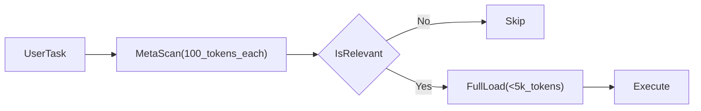
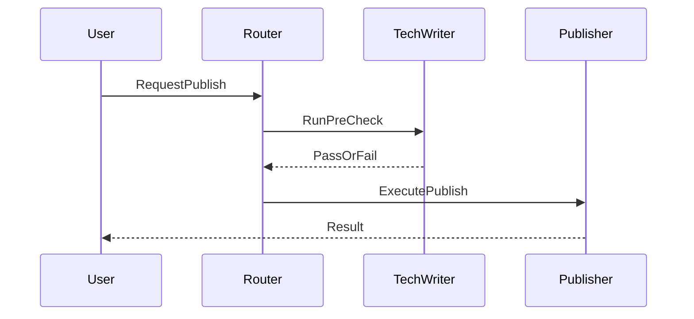

## Claude Skills 深度解析：从设计理念到 Cursor 实战（v2.0）

> **TL;DR**：Claude Skills 的本质是**把“能力/流程”做成可索引、可按需加载、可组合的资产**，从而减少上下文噪声并提升执行确定性。本文用一个“二阶段加载模型”讲透 Skills 的设计理念与工作原理，并给出一份可复制的 **Cursor Commands 模拟 Skills Playbook**（含目录结构、模板与验收标准）。

---

## 引言：命令多了不是资产，是负债

我在 Cursor 里做过一段时间“命令化工作流”，当 `.cursor/commands/` 里的文件越来越多，问题就变得明显：

```bash
.cursor/commands/
├── generate-learning-doc.md
├── publish-knowledge.md
├── brainstorm.md
├── index.md
└── ... # 还有更多
```

痛点通常不是“能力不够”，而是“能力暴露方式不对”：
- **认知成本**：命令名越来越难记，团队也很难统一使用姿势。
- **流程割裂**：生成→检查→发布需要手动串联，容易遗漏步骤。
- **上下文污染**：为了让 AI “随时知道有哪些能力”，不得不把说明堆进上下文（或到处贴链接）。

Claude Skills 给了我一个很好的启发：**与其让 AI 背下所有能力，不如给它一张目录，让它按需取用。**

---

## 一、一个模型讲透 Skills：二阶段加载（Index → Activate）

### 1.1 机制本质：上下文的延迟加载（可粗略理解为“Lazy Loading”）

Skills 的核心不是“多了几个命令”，而是**加载策略**发生了变化：

- **阶段 A：元数据扫描（Index）**  
  读取每个 Skill 的少量元数据（例如 name/description/keywords/file_patterns），用于相关性判断。

- **阶段 B：完整加载与执行（Activate）**  
  只有当任务与 Skill 相关时，才加载该 Skill 的完整指令/资源/脚本并执行。



> 给新手的解释：把 Skills 当成“工具箱”，你不需要把工具箱里的每个工具都拿在手上；你只需要一个清单（索引），用到锤子时再把锤子拿出来。

> 给专家的补充：更关键的是**注意力预算**而非 token 数字本身。减少无关上下文，会让模型在检索/对齐阶段更稳定（尤其在复杂任务或长对话中）。

### 1.2 关键收益：不是“省 token”，而是“降噪 + 可控”

下面这张表是我更愿意用来解释 Skills 的原因（注意：收益成立的前提是“技能足够多/足够复杂”）：

| 维度 | 普通 Prompt/Command | Skills 模式 | 前提/边界条件 |
|---|---|---|---|
| **加载策略** | 习惯性全量放进上下文 | 按需加载 | Skills 元数据能有效区分相关性 |
| **可组合性** | 手动串联、多次触发 | 声明式依赖 | 流程确实存在稳定依赖链 |
| **可维护性** | 复制粘贴、难以升级 | 统一入口与版本管理 | 有持续维护意愿/团队协作需求 |
| **可控性** | “看模型心情” | 前置检查+明确失败路径 | 关键步骤能做可验证检查 |

### 1.3 反直觉结论：Skill 不一定更“聪明”，但更“稳定”

Skill 的价值更像是把“经验”固化为**可重复执行的程序化流程**。它并不会让模型天生更聪明，但能让结果更稳定、可审计、可迁移。

---

## 二、Skills 的工作原理：元数据、触发条件与依赖链

### 2.1 元数据（frontmatter）负责“索引”

一个典型的 Skill 会有可机器读取的元数据（示意）：

```yaml
---
id: pub-knowledge
name: 知识发布到 GitHub
description: 检测 Mermaid -> 生成图片 -> 提交 -> 推送
triggers:
  - keywords: [发布, 提交, 推送, GitHub, Mermaid]
  - file_patterns: [knowledge/**/*.md]
---
```

这段信息的核心作用是：**让系统在低成本阶段完成“候选集合”筛选**。

### 2.2 依赖链（depends_on）负责“编排”

依赖链解决的是“流程组合”问题：发布之前必须先做质量检查、渲染 Mermaid、再提交推送。

```yaml
---
depends_on:
  - tech-writer
---
```



> 边界条件：依赖链成立的前提是“前置条件可验证”。如果前置检查只是主观判断（比如“我感觉文档写得不错”），那依赖链只会把不确定性前移，并不能提升稳定性。

---

## 三、实践案例：把“理念”落在手上

下面三个案例我刻意选择了不同类型：文件生成、思维框架、工程化发布流。

### 3.1 案例 1：`docx`（文档生成类）

**场景**：自动生成周报/方案评审 Word，避免“复制粘贴 + 格式调整”的低价值劳动。  
**本质**：把“输出格式”从人类手工对齐，改成程序对齐。

```python
from docx import Document

def export_weekly_report(title: str, items: list[str], out_path: str):
    doc = Document()
    doc.add_heading(title, level=0)
    for x in items:
        doc.add_paragraph(x, style="List Bullet")
    doc.save(out_path)
```

> 边界条件：只有当你有“固定模板/固定结构”的输出需求时，这类 Skill 才特别值回票价。一次性的随笔/临时文档，用 Markdown 可能更合适。

### 3.2 案例 2：`/brainstorm`（工作流/思维框架类）

**场景**：技术选型/架构决策。  
**本质**：不是让 AI 给答案，而是给 AI（也给你）一个“不会漏维度”的思考框架。

你在本仓库已经有对应 Command：`.cursor/commands/brainstorm.md`。这类 Skill 的收益往往体现在：
- 输出结构一致，便于对比与复盘
- 强制写清“前提/边界条件”，减少事后扯皮

> 反直觉：很多人以为这类 Skill “啰嗦”，但在团队协作里，**啰嗦是为了可追责**。

### 3.3 案例 3：`publish-knowledge`（工程化发布流）

这部分面向**第一次看到本仓库**的读者，我先用一句话解释这个能力是什么：

- **它解决的问题**：当你写 Markdown 文档（含 Mermaid 图）时，把“渲染图表 → 更新引用 → git 提交推送”这一串重复步骤变成一次可重复执行的自动化流程。

#### 3.3.1 输入/输出是什么？

- **输入**：`knowledge/**/*.md` 下你刚写/改过的 Markdown（可能包含 Mermaid 代码块）
- **输出**：
  - Mermaid 被渲染为图片文件（落到 `knowledge/images/...` 或相近目录）
  - Markdown 中的图表引用被更新为图片引用（避免平台渲染差异）
  - 自动完成 `git add/commit/push`（commit message 尽量智能生成）

#### 3.3.2 Before/After：为什么它像一个 Skill？

**Before（手工流程，容易漏步骤）**：

```bash
1) 找 Mermaid 块
2) 手动渲染成图片
3) 把图片放进 images/
4) 改 Markdown 引用
5) git add && git commit && git push
```

**After（一次触发，工具层完成编排）**：

```bash
/publish-knowledge
```

核心差异不在“有没有脚本”，而在于：它把流程固化成了**可复用、可验证、可失败回退**的执行单元，这就是 Skill 的味道。

#### 3.3.3 最小实现：薄 Command + 厚 Tool（推荐范式）

你可以把它拆成两层理解：

- **命令层（薄）**：负责入口与意图（在 Cursor 里就是一个 command 文件）
- **工具层（厚）**：负责副作用与编排（渲染、替换、Git 操作、错误提示）

命令层示例（本仓库同名文件即是这个意思）：

```bash
# .cursor/commands/publish-knowledge.md 内最终只保留“调用工具”这一句
python3 tools/knowledge_publisher.py --publish
```

工具层建议的结构（关键片段示意，不展示全部实现）：

```python
def precheck_or_raise() -> None:
    # 例：git 是否干净、目标目录是否存在、mermaid 是否可渲染
    # 失败时抛出异常，并给出“下一步怎么修”的提示
    return

def publish() -> None:
    precheck_or_raise()
    # 1) detect_mermaid_blocks()
    # 2) render_mermaid_images()
    # 3) replace_markdown_links()
    # 4) git_commit_and_push()
    return
```

> 边界条件：如果你的发布流程没有任何可验证前置条件（比如完全不关心渲染是否成功、也不关心 git 是否干净），那它更像“一段脚本”而不是 Skill。Skill 的核心是“可控的流程单元”。

#### 3.3.4 验收标准（建议你写进工具输出）

为了让它对外部读者也“可验证”，我建议每次运行至少输出下面这类结果摘要：

- **发现了多少个 Mermaid 块**、生成了哪些图片文件
- **修改了哪些 Markdown 文件**（更新了哪些引用）
- **Git 做了哪些动作**（commit message、push 分支）
- **失败时**：明确指出失败原因与修复建议（不要只打印堆栈）

---

## 四、在 Cursor 中模拟 Skills：可复制的 Playbook（推荐 v2.0 的重点）

先讲清楚现实：**Cursor Commands 目前仍需要手动触发**，所以我们无法做到“真正的静默自动激活”。但我们仍能复刻 Skills 的 70% 核心体验：索引、组合、前置检查、可维护。

### 4.1 目标与边界

- **目标**：实现“Index → 选择 → 执行”的低摩擦体验，并让关键流程具备依赖检查与可验证输出。
- **边界条件**：
  - 仍需要用户触发命令（通过 `/` 或点击）
  - 自动相关性判断只能做到“半自动”（通过索引引导 + 规则常驻）

### 4.2 目录结构（建议固定下来）

```bash
.cursor/
  commands/
    index.md
    brainstorm.md
    generate-learning-doc.md
    publish-knowledge.md
  rules/
    technical-writing-quality.mdc
tools/
  knowledge_publisher.py
knowledge/
  ...
```

> 设计原则：**命令层（MD）只描述“入口与意图”，工具层（Python）才做“副作用与编排”。**

### 4.3 Index Command：把“技能目录”做成第一入口

你已经有 `.cursor/commands/index.md`。v2.0 我建议把它升级成“可复用索引模板”，包含三部分：
- **能力列表**：按场景分组（写作/发布/思考）
- **典型工作流**：用 1-2 条链路示例
- **选择指引**：告诉读者“什么时候用哪个”

最小模板（可复制）：

```markdown
---
description: 命令索引：从这里开始选择合适的命令
---

## 按场景查找
| 场景 | 命令 | 说明 |
|---|---|---|
| 写作 | /generate-learning-doc | 生成学习文档并自检 |
| 思考 | /brainstorm | 6 维度结构化分析 |
| 发布 | /publish-knowledge | Mermaid 渲染 + git push |
```

### 4.4 组合与依赖：在 Tool 中做“前置检查”

Cursor 不一定适合做复杂的“命令级编排”，但非常适合做“工具级编排”：  
在 `tools/knowledge_publisher.py` 开头加入 pre-check，失败就给出可修复建议。

```python
def precheck_or_raise() -> None:
    # 例：检查 git 状态 / Mermaid 是否可渲染 / 必要文件是否存在
    # 失败时抛出异常或返回结构化错误
    return

def publish():
    precheck_or_raise()
    # ... render mermaid ...
    # ... git commit & push ...
```

> 边界条件：前置检查要“可验证”。例如“标题是否吸引人”不可验证，但“是否包含 TL;DR”“Mermaid 是否能渲染”“git 是否干净”可验证。

### 4.5 另一种常见落地：增强 Command 来“适配组合工作流”

上面我更推荐“工具层编排”（Tool orchestration），因为它更可控、也更接近 Skills 的工程化形态。但在 Cursor 里还有一种很常见的现实需求：**你不想改 Tool，或不想引入新的编排器，只想把现有 Command 变得“能组合”**。

这里给出 3 种从轻到重的做法，你可以按团队成熟度选择：

#### 4.5.1 软组合（最低成本）：Command 末尾写清“下一步做什么”

这类方式不追求自动化，只追求“少走弯路”。做法是在命令末尾输出明确的 next step，让模型/人照着走。

```markdown
## Next
如果你已确认内容无误，下一步运行：`/publish-knowledge`
如果需要先做结构化复盘，运行：`/brainstorm`
```

适合：个人使用、早期团队、流程还在快速变化的阶段。  
局限：依然需要人触发下一步，但能显著降低遗漏与沟通成本。

#### 4.5.2 链式约定（中等成本）：用“前置/后置”块让组合可读、可扩展

Cursor 不会原生执行这些元字段，但**它能让 AI/团队形成一致的“读法”**，从而实现可组合的工作流文档化。

```markdown
---
description: 生成学习文档（完成后建议发布）
workflow:
  after_success:
    - command: /publish-knowledge
      when: 文档通过自检且需要发布
---
```

适合：团队协作、希望把“流程约定”写进命令定义里。  
局限：仍然是“人/模型去执行”，不是系统自动编排。

#### 4.5.3 真组合（最高收益）：新增一个“组合 Command”，由它串起多个步骤

如果你确实想“一次触发跑完一条链路”，最稳的方式不是让 Command 调用另一个 Command（Cursor 层面做不到可靠自动调用），而是**新增一个组合入口**，在一个脚本/工具里串起多个子步骤：

```bash
# .cursor/commands/generate-and-publish.md（示意）
python3 tools/workflows.py --flow generate_and_publish
```

`tools/workflows.py` 里做编排（示意）：

```python
def flow_generate_and_publish():
    generate_learning_doc()   # 调用生成逻辑（或复用现有工具）
    run_quality_check()       # 可验证前置检查
    publish_knowledge()       # 复用现有发布工具
```

适合：稳定高频链路（例如“生成→检查→发布”每天都在跑）。  
局限：需要一点工程化投入，但这是最接近 Skills 的“可重复执行单元”。

> 选择建议：如果你只想“组合可读”，用 4.5.1/4.5.2；如果你要“一键跑完”，用 4.5.3（组合入口 + 工具层编排）。

### 4.6 验收标准（你可以用它来衡量“是否像 Skill”）

| 验收项 | 标准 | 可检查方式 |
|---|---|---|
| **入口轻薄** | Command 文件不包含业务复杂逻辑 | 人工 review：MD 只做调用 |
| **失败可解释** | 失败时输出“原因+下一步” | 运行一次失败场景看输出 |
| **关键步骤可验证** | pre-check 覆盖关键前置条件 | 刻意制造缺条件验证拦截 |
| **可组合** | 生成→检查→发布有明确路径 | Index 中有工作流链路 |

---

## 五、反模式与误区（v2.0 必须补齐）

### 误区 1：把 Skill 当“更长的 Prompt”

**现象**：把 200 行说明塞进一个 Skill/Command，认为就“更强”。  
**问题**：维护成本爆炸，上下文噪声变大，稳定性反而下降。  
**建议**：超过 50 行的复杂逻辑，优先迁到 Tool 层（Python），Prompt/Command 保持“入口化”。

### 误区 2：在 Cursor 里追求“全自动激活”

**现象**：试图用 `/use-skill` 做统一入口，让自然语言自动选择。  
**问题**：仍需手动触发命令，步骤变多；且匹配规则容易失真。  
**建议**：更高性价比的是 **Index Command + AlwaysApply 规则 + Tool 前置检查**。

### 误区 3：没有“验收标准”的工作流就是玄学

**现象**：流程看起来自动化了，但失败时只能“再试一次”。  
**建议**：为每个关键命令写清验收标准（上面的表格可直接复用）。

---

## 六、决策框架：何时用 Prompt / Command / Skill / MCP / Subagent？

我推荐用下面 6 问做选型（满足条件越多越偏向对应方案）：

| 决策问题 | Yes 时倾向 |
|---|---|
| 1. 任务是否高频重复（例如每周≥3次）？ | Skill / Command |
| 2. 是否有稳定输入输出格式？ | Skill |
| 3. 是否存在明确依赖链（A 产出给 B）？ | Skill / Subagent |
| 4. 是否需要外部数据/API/数据库？ | MCP |
| 5. 是否需要隔离权限、独立执行、长任务？ | Subagent |
| 6. 是否只是一次性临时需求？ | Prompt |

> 深刻认知：**Skills 解决的是“可维护的可重复”，不是“更强的推理”。** 需要更强推理时优先换模型；需要更稳定执行时优先上架构。

---

## 七、自检 Checklist（发布前 2 分钟自查）

- 是否在开头给出 TL;DR（1–3 句）并承诺读者收益？
- 是否用“二阶段加载模型”贯穿全文，并保持术语一致？
- 是否写清关键结论的前提/边界条件（至少 3 处）？
- 是否至少 2 个反例/误区（反模式）？
- 是否有可复制的 Cursor Playbook（目录结构+模板+验收标准）？
- 是否给出决策框架（Prompt/Command/Skill/MCP/Subagent）？
- 是否清理占位符链接/命令名不一致/无意义大段代码？

---

## 参考

- `awesome-claude-skills`：`https://github.com/travisvn/awesome-claude-skills`
- 本仓库 Commands：`.cursor/commands/brainstorm.md`、`.cursor/commands/index.md`、`.cursor/commands/publish-knowledge.md`


