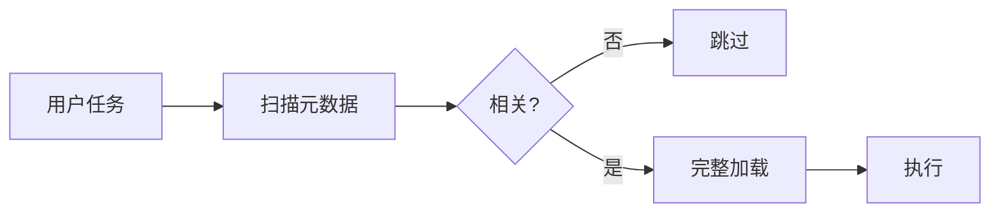
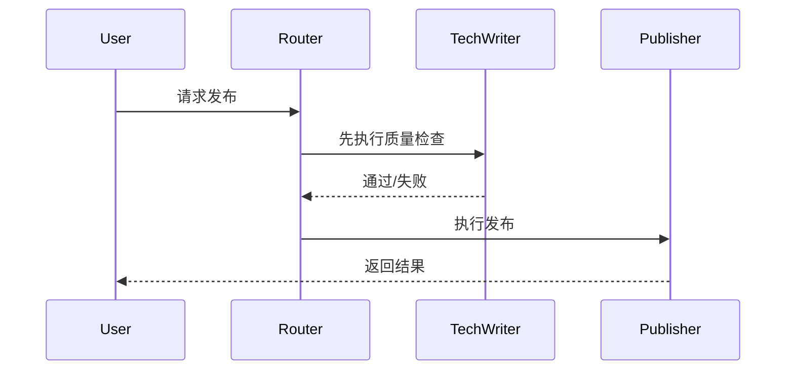

# Claude Skills 深度解析：从设计理念到 Cursor 实战

> **TL;DR**：Skills 的本质是把能力做成"可索引、可按需加载、可组合"的资产。本文用一个二阶段加载模型讲透其设计理念，给出 3 个不同类型的实践案例，并提供一份可复制的 Cursor 模拟方案。读完你能判断何时该用 Skills、何时用其他方案，以及如何在 Cursor 里落地。

---

## 一、问题：命令多了不是资产，是负债

当 `.cursor/commands/` 里的文件越来越多，问题往往不是"能力不够"，而是"能力暴露方式不对"：

- **认知成本**：命令名越来越难记，团队也很难统一使用姿势
- **流程割裂**：生成→检查→发布需要手动串联，容易遗漏步骤
- **上下文污染**：为了让 AI "随时知道有哪些能力"，不得不把说明堆进上下文

Skills 给了一个启发：与其让 AI 背下所有能力，不如给它一张目录，让它按需取用。

---

## 二、核心模型：二阶段加载（Index → Activate）

### 2.1 机制本质

Skills 的核心不是"多了几个命令"，而是加载策略发生了变化：

- **阶段 A（Index）**：读取每个 Skill 的少量元数据（name/description/keywords），用于相关性判断
- **阶段 B（Activate）**：只有当任务与 Skill 相关时，才加载完整指令并执行



这类似于编程中的"懒加载"：不是把工具箱里的工具都拿在手上，而是先看清单，用到锤子时再拿锤子。

### 2.2 为什么这样设计

| 维度 | 普通 Prompt/Command | Skills 模式 | 成立的前提 |
|---|---|---|---|
| 加载策略 | 习惯性全量放进上下文 | 按需加载 | 元数据能有效区分相关性 |
| 可组合性 | 手动串联、多次触发 | 声明式依赖 | 流程确实存在稳定依赖链 |
| 可维护性 | 复制粘贴、难以升级 | 统一入口与版本管理 | 有持续维护意愿 |
| 可控性 | "看模型心情" | 前置检查+明确失败路径 | 关键步骤能做可验证检查 |

### 2.3 与其他工具的对比

| 特性 | Skills | Prompts | Projects | MCP | Subagents |
|---|---|---|---|---|---|
| 按需加载 | 是 | 否 | 否 | 是 | 是 |
| 可组合（依赖链） | 是 | 手动 | 否 | 是 | 是 |
| 跨平台 | Web/Code/API | 对话限定 | 工作区限定 | 协议标准 | 独立服务 |
| 实施成本 | 中 | 低 | 低 | 高 | 高 |

几个容易混淆的边界：
- **Skills vs Prompts**：Prompts 适合一次性任务，Skills 适合重复性工作流
- **Skills vs MCP**：MCP 解决"对接外部数据/API"，Skills 解决"执行内部逻辑"
- **Skills vs Subagents**：Subagents 是独立进程，适合需要隔离权限或长任务的场景；Skills 更轻量，是"可复用的专业知识"而不是"另一个代理"

---

## 三、工作原理：元数据、触发条件与依赖链

### 3.1 元数据负责"索引"

一个典型的 Skill 文件开头会有可机器读取的元数据：

```yaml
---
id: pub-knowledge
name: 知识发布到 GitHub
description: 检测 Mermaid -> 生成图片 -> 提交 -> 推送
triggers:
  - keywords: [发布, 提交, 推送, GitHub, Mermaid]
  - file_patterns: [knowledge/**/*.md]
---
```

这段信息的作用是：让系统在低成本阶段完成候选集合筛选。

### 3.2 依赖链负责"编排"

依赖链解决的是流程组合问题：发布之前必须先做质量检查。

```yaml
---
depends_on:
  - tech-writer
---
```

执行流程变成：



边界条件：依赖链成立的前提是"前置条件可验证"。如果前置检查只是主观判断（比如"我感觉文档写得不错"），依赖链只会把不确定性前移，并不能提升稳定性。

### 3.3 Token 效率

假设有 20 个 Skills 待命，每个完整内容约 5000 tokens，元数据约 100 tokens：

| 方式 | 扫描阶段 | 加载阶段 | 总计 |
|---|---|---|---|
| 传统全量加载 | - | 20 × 5000 | 100,000 |
| Skills 渐进式 | 20 × 100 | 2 × 5000 | 12,000 |

节省的不只是 token，更关键的是减少了无关上下文对模型注意力的干扰。

---

## 四、实践案例

### 4.1 案例 1：docx（文档生成类）

**场景**：每周生成 Word 格式的周报，包含标题、任务列表、下周计划、数据表格。

**传统做法**：手动整理数据到 Markdown → 打开 Word → 复制粘贴 → 调整格式 → 导出。耗时 20-30 分钟。

**使用 docx Skill**：从 Git 提交记录提取任务 → 调用 Skill 生成 Word → 自动应用模板格式。耗时约 2 分钟。

核心代码（简化）：

```python
from docx import Document

def create_report(title: str, tasks: list[str], out_path: str):
    doc = Document()
    doc.add_heading(title, level=0)
    for task in tasks:
        doc.add_paragraph(task, style="List Bullet")
    doc.save(out_path)
```

**边界条件**：只有当你有"固定模板/固定结构"的输出需求时，这类 Skill 才值回票价。一次性的随笔用 Markdown 可能更合适。

### 4.2 案例 2：brainstorm（思维框架类）

**场景**：技术选型（React vs Vue vs Svelte）。

**传统做法**：搜索博客 → 在脑子里对比 → 拍脑袋决定。问题是容易遗漏维度（团队熟悉度、招聘难度）。

**使用 brainstorm Skill**：用 6 维度框架强制系统化分析。

| 维度 | React | Vue | Svelte | 权重 |
|---|---|---|---|---|
| 团队熟悉度 | ⭐⭐ | ⭐⭐⭐⭐⭐ | ⭐ | 高 |
| 生态丰富度 | ⭐⭐⭐⭐⭐ | ⭐⭐⭐⭐ | ⭐⭐ | 高 |
| 招聘难度 | ⭐⭐⭐⭐ | ⭐⭐⭐⭐⭐ | ⭐⭐ | 中 |
| 长期维护性 | ⭐⭐⭐⭐⭐ | ⭐⭐⭐⭐ | ⭐⭐⭐ | 高 |

输出结论：推荐 Vue，理由是团队熟悉度最高、生态足够、学习成本低。

**价值**：
- 输出结构一致，便于对比与复盘
- 强制写清前提/边界条件，减少事后扯皮

**边界条件**：这类 Skill 的收益体现在团队协作里。如果只是个人快速决策，直接问模型可能更快。

### 4.3 案例 3：publish-knowledge（工程化发布流）

这个案例面向第一次看到本仓库的读者。

**它解决的问题**：当你写 Markdown 文档（含 Mermaid 图）时，把"渲染图表 → 更新引用 → git 提交推送"变成一次可重复执行的自动化流程。

**输入/输出**：
- 输入：`knowledge/**/*.md`（可能包含 Mermaid 代码块）
- 输出：Mermaid 渲染为图片、Markdown 引用更新、git add/commit/push 完成

**Before（手工流程）**：
1. 找 Mermaid 块
2. 手动渲染成图片
3. 把图片放进 images/
4. 改 Markdown 引用
5. git add && git commit && git push

**After（一次触发）**：
```bash
/publish-knowledge
```

**最小实现**：

命令层（薄）：
```bash
# .cursor/commands/publish-knowledge.md
python3 tools/knowledge_publisher.py --publish
```

工具层（厚）：
```python
def precheck_or_raise() -> None:
    # 检查 git 是否干净、目标目录是否存在、mermaid 是否可渲染
    # 失败时抛出异常，给出"下一步怎么修"的提示
    pass

def publish() -> None:
    precheck_or_raise()
    detect_mermaid_blocks()
    render_mermaid_images()
    replace_markdown_links()
    git_commit_and_push()
```

**验收标准**：每次运行至少输出：
- 发现了多少个 Mermaid 块、生成了哪些图片
- 修改了哪些 Markdown 文件
- Git 做了哪些动作
- 失败时：明确指出原因与修复建议

---

## 五、在 Cursor 中模拟 Skills

### 5.1 现实与边界

Cursor Commands 目前仍需要手动触发，所以无法做到"真正的静默自动激活"。但可以复刻 70% 的核心体验：索引、组合、前置检查、可维护。

无法实现的 30%：
- 真正的按需激活（仍需手动点命令）
- 跨平台统一（限定于 Cursor）
- 自动相关性判断（需手动匹配关键词）

### 5.2 目录结构（建议固定）

```bash
.cursor/
  commands/
    index.md              # 能力索引
    brainstorm.md         # 思维框架
    generate-learning-doc.md
    publish-knowledge.md
  rules/
    technical-writing-quality.mdc  # 常驻规则
tools/
  knowledge_publisher.py  # 业务逻辑
```

设计原则：命令层（MD）只描述入口与意图，工具层（Python）才做副作用与编排。

### 5.3 Index Command：技能目录

最小模板：

```markdown
---
description: 命令索引：从这里开始选择合适的命令
---

## 按场景查找
| 场景 | 命令 | 说明 |
|---|---|---|
| 写作 | /generate-learning-doc | 生成学习文档并自检 |
| 思考 | /brainstorm | 6 维度结构化分析 |
| 发布 | /publish-knowledge | Mermaid 渲染 + git push |

## 典型工作流
/generate-learning-doc → 检查修改 → /publish-knowledge
```

### 5.4 组合工作流：三种落地方式

根据需求从轻到重选择：

**方式 1：软组合（最低成本）**

在命令末尾写清下一步做什么：

```markdown
## Next
如果内容无误，运行：`/publish-knowledge`
如果需要复盘，运行：`/brainstorm`
```

适合：个人使用、早期团队。

**方式 2：链式约定（中等成本）**

用元字段让组合可读：

```yaml
---
description: 生成学习文档
workflow:
  after_success:
    - command: /publish-knowledge
      when: 需要发布时
---
```

适合：团队协作、希望把流程约定写进命令定义。

**方式 3：组合命令（最高收益）**

新增一个入口，在工具层串起多个步骤：

```bash
# .cursor/commands/generate-and-publish.md
python3 tools/workflows.py --flow generate_and_publish
```

```python
def flow_generate_and_publish():
    generate_learning_doc()
    run_quality_check()
    publish_knowledge()
```

适合：稳定高频链路。

### 5.5 验收标准

| 验收项 | 标准 | 检查方式 |
|---|---|---|
| 入口轻薄 | Command 不包含业务复杂逻辑 | MD 只做调用 |
| 失败可解释 | 失败时输出原因+下一步 | 运行失败场景 |
| 关键步骤可验证 | pre-check 覆盖前置条件 | 刻意制造缺条件 |
| 可组合 | 有明确工作流路径 | Index 中有链路 |

---

## 六、反模式

### 误区 1：把 Skill 当"更长的 Prompt"

现象：把 200 行说明塞进一个 Skill/Command。
问题：维护成本爆炸，上下文噪声变大。
建议：超过 50 行的复杂逻辑，迁到工具层。

### 误区 2：追求"全自动激活"

现象：用 `/use-skill` 做统一入口，让自然语言自动选择。
问题：仍需手动触发，步骤变多；匹配规则容易失真。
建议：Index Command + 常驻规则 + 工具层前置检查，性价比更高。

### 误区 3：没有验收标准的工作流

现象：流程看起来自动化了，但失败时只能"再试一次"。
建议：为每个关键命令写清验收标准。

---

## 七、决策框架：何时用什么

| 决策问题 | Yes 时倾向 |
|---|---|
| 任务是否高频重复（每周≥3次）？ | Skill / Command |
| 是否有稳定输入输出格式？ | Skill |
| 是否存在明确依赖链？ | Skill / Subagent |
| 是否需要外部数据/API？ | MCP |
| 是否需要隔离权限、长任务？ | Subagent |
| 是否只是一次性临时需求？ | Prompt |

---

## 八、三个认知

### 认知 1：Skills 不是工具，是架构思想

Skills 的核心价值不在于"提供了多少个 Skill"，而在于：
- 渐进式披露：按需加载，节省上下文
- 可组合性：声明式依赖，自动串联
- 跨平台统一：相同的 Skill 在 Web/Code/API 都能用

这种思想可以迁移到任何 AI 工作流设计中。

### 认知 2：Cursor Commands 可以模拟 70% 的能力

通过合理设计，可以实现：
- 索引机制（Index Command）
- 依赖检查（在工具中实现）
- 轻量定义，重逻辑分离（Command + Tool）

剩下 30% 需要平台原生支持，但对个人/小团队已经足够。

### 认知 3：关键在于架构设计

好的工作流设计 = 清晰的架构 + 合理的工具选择。

不要盲目追求"最先进的工具"，而要先设计好架构，再选择合适的实现方式。Skills 的价值更像是把经验固化为可重复执行的程序化流程。它并不会让模型更聪明，但能让结果更稳定、可审计、可迁移。

---

## 九、自检 Checklist

- [ ] 是否在开头给出 TL;DR？
- [ ] 是否用二阶段加载模型贯穿全文？
- [ ] 是否写清关键结论的前提/边界条件（至少 3 处）？
- [ ] 是否有反模式（至少 2 个）？
- [ ] 是否有可复制的 Playbook（目录结构+模板+验收标准）？
- [ ] 是否给出决策框架？
- [ ] 是否清理占位符和术语不一致？

---

## 参考

- awesome-claude-skills：https://github.com/travisvn/awesome-claude-skills
- obra/superpowers：https://github.com/obra/superpowers-marketplace
- 本仓库 Commands：`.cursor/commands/`

---

## 边界条件与假设

- 读者熟悉基本的 AI 工具使用（Claude/Cursor）
- 读者有一定的编程经验（能看懂 Python/Bash）
- Token 效率计算基于粗略估算（实际值可能有 ±20% 误差）
- Cursor Commands 的实现基于当前版本（2025-01），未来可能变化

