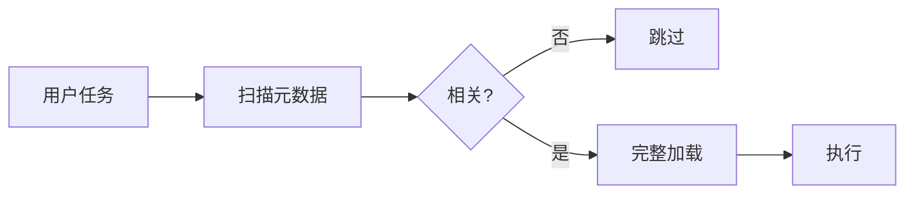

# Claude Skills 的本质是上下文管理，不是能力扩展

我花了三周时间在 Cursor 里做"命令化工作流"，结果发现自己掉进了一个坑。

---

## 一、我遇到的问题：命令越多，越难用

一开始我很兴奋。Cursor 的 Commands 让我可以把常用操作固化成命令，`/generate-doc`、`/publish`、`/brainstorm`……每加一个命令，我都觉得自己的效率又提升了。

直到有一天，我的 `.cursor/commands/` 目录变成了这样：

```bash
.cursor/commands/
├── generate-learning-doc.md
├── publish-knowledge.md
├── brainstorm.md
├── create-api-endpoint.md
├── write-test-cases.md
├── refactor-code.md
├── review-pr.md
├── optimize-sql.md
└── ...
```

十几个命令。然后我发现：

- 我记不住它们的名字了
- 我不确定"这个场景该用哪个"
- 团队里其他人根本不知道有这些命令
- 更糟的是，生成→检查→发布这种链路，我每次都要手动串联，经常漏步骤

**问题不是"能力不够"，而是"能力暴露方式不对"。**

我开始意识到：工具多了不是资产，是负债。

---

## 二、转折：接触 Skills 后的"啊哈时刻"

后来我了解到 Claude Skills。一开始我以为它只是"更高级的 Prompt"，或者"命令的升级版"。

但用了一段时间后，我发现自己之前完全理解错了。

Skills 解决的根本不是"能力扩展"问题。它解决的是**上下文管理**问题。

什么意思？

传统做法是把所有能力都塞进上下文，让 AI"随时知道自己能做什么"。这就像把整个工具箱的工具都拿在手上——工具越多，手越重，反而什么都做不好。

Skills 的做法不同：它给 AI 一张目录，用的时候再拿对应的工具。

**一句话总结：Skills = 可索引、可按需加载的能力资产。**

---

## 三、为什么是"上下文管理"？

让我用一个简单的模型来解释。

### 二阶段加载：Index → Activate

Skills 的核心机制可以拆成两个阶段：

1. **Index（索引）**：系统只读取每个 Skill 的少量元数据（名字、描述、触发关键词），判断"这个任务可能需要哪些能力"
2. **Activate（激活）**：只有相关的 Skill 才会被完整加载并执行



这就像图书馆的索引系统：你不需要把所有书都搬到桌上，只需要查目录，找到需要的书再取。

### 关键洞察：减少的不是 token，是噪声

很多人会从"省 token"的角度理解这个机制。没错，如果有 20 个 Skills，传统全量加载可能要 10 万 token，而按需加载可能只要 1 万多。

但这不是重点。

**真正的价值是：减少了无关上下文对模型注意力的干扰。**

上下文越干净，模型在特定任务上的表现就越稳定。这个道理在长对话、复杂任务里尤其明显。

---

## 四、案例：我怎么验证这个观点

理论说完了，来看我是怎么在实践中验证这个想法的。

### 案例：publish-knowledge（发布工作流）

我在 `lessoning-ai` 这个项目里写技术文档。每次发布，我需要做这些事：

1. 检查文档里有没有 Mermaid 图表
2. 如果有，渲染成图片
3. 更新 Markdown 里的图片引用
4. git add、commit、push
5. 确认推送成功

五步。看起来不多，但我经常漏步骤——特别是忘记渲染 Mermaid，直接推上去，然后发现 GitHub 上图表显示不了。

**问题不在于"我懒"，在于"流程没有被固化"。**

于是我做了一个命令：`/publish-knowledge`。

但关键不是"有一个命令"，而是这个命令的设计方式：

**薄命令 + 厚工具**

命令文件（`.cursor/commands/publish-knowledge.md`）只有一行核心内容：

```bash
python3 tools/knowledge_publisher.py --publish
```

所有复杂逻辑都在 Python 工具里：

```python
def publish():
    check_git_status()      # 前置检查
    blocks = find_mermaid() # 检测 Mermaid
    render_images(blocks)   # 渲染图片
    update_references()     # 更新引用
    git_commit_and_push()   # 提交推送
```

这样做的好处：

- 命令层保持轻薄，只负责"触发"
- 工具层可以单独测试、单独升级
- 失败时能给出明确的错误信息，而不是"玄学重试"

**我从中学到的一点：不是"自动化"值钱，是"可控"值钱。**

一个能告诉我"哪里出错了、怎么修"的流程，比一个"一键搞定但失败了不知道为什么"的流程，有用得多。

---

## 五、延伸：我在 Cursor 里的实践

现实是：Cursor Commands 不能像 Claude Skills 那样"自动激活"。你还是得手动输入 `/命令名`。

但这不妨碍我借用 Skills 的思想。

### 我的做法

**1. 做一个 Index Command**

我建了一个 `/index` 命令，里面列出所有可用命令和它们的适用场景：

```markdown
| 场景 | 命令 | 说明 |
|---|---|---|
| 写文档 | /generate-learning-doc | 生成学习文档 |
| 决策分析 | /brainstorm | 6 维度结构化思考 |
| 发布 | /publish-knowledge | 渲染图表 + git push |
```

这样我不用记命令名，看一眼索引就知道该用哪个。

**2. 薄命令 + 厚工具**

所有命令都只负责"调用"，复杂逻辑放在 Python 工具里。

**3. 组合工作流**

对于"生成→检查→发布"这种链路，我有两种处理方式：

- 简单场景：在命令末尾写清"下一步做什么"
- 高频场景：新建一个组合命令，在工具层串起多个步骤

### 关键收获

**架构思想比工具更重要。**

Skills 的"按需加载、可组合、可索引"思想，完全可以在 Cursor 里落地。工具不一样，但架构可以一样。

---

## 六、结尾

回到开头的问题：为什么工具越多，反而越难用？

因为我们习惯性地把"能力"等同于"工具数量"。但真正的问题不是能力不够，而是**能力的暴露方式不对**。

Skills 给我的启发是：与其让 AI 背下所有能力，不如给它一张目录，让它按需取用。

这不仅仅是一个技术方案，更是一种思维方式：

- 不要追求"万能"，要追求"可索引"
- 不要追求"自动"，要追求"可控"
- 不要追求"工具多"，要追求"架构清晰"

如果你也在用 Cursor 或类似工具做命令化工作流，不妨问自己一个问题：

**你的命令是资产，还是负债？**

---

## 参考

- [awesome-claude-skills](https://github.com/travisvn/awesome-claude-skills)
- 本文涉及的代码：`.cursor/commands/`、`tools/knowledge_publisher.py`

