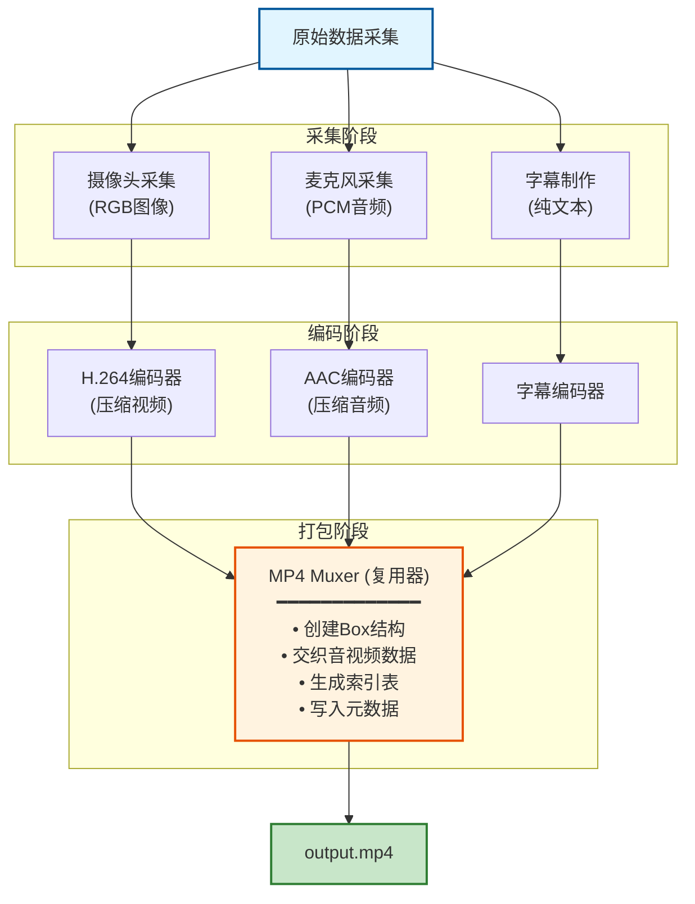
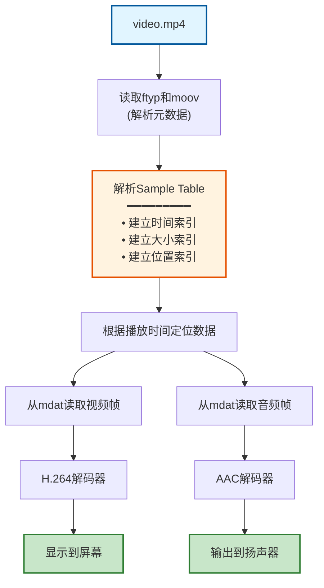

# 多媒体流数据结构详解 - 从入门到理解

## 目录
1. [基础概念](#基础概念)
2. [视频流数据结构](#视频流数据结构)
3. [音频流数据结构](#音频流数据结构)
4. [字幕流数据结构](#字幕流数据结构)
5. [MP4容器格式](#mp4容器格式)
6. [完整流程图](#完整流程图)
7. [实践示例](#实践示例)

---

## 基础概念

### 什么是"流"（Stream）？

在多媒体领域，**流**是指按时间顺序排列的一系列数据包。想象一下：
- 📹 **视频流**：就像一叠连续的照片，快速翻动就成了动画
- 🔊 **音频流**：就像连续的声波数据，播放出来就是声音
- 📝 **字幕流**：带有时间戳的文字，在特定时间显示

### 容器 vs 编码

这是初学者最容易混淆的概念：

```
┌─────────────────────────────────────┐
│        MP4 容器（Container）         │
│  ┌───────────────────────────────┐  │
│  │   视频流（H.264编码）          │  │
│  └───────────────────────────────┘  │
│  ┌───────────────────────────────┐  │
│  │   音频流（AAC编码）            │  │
│  └───────────────────────────────┘  │
│  ┌───────────────────────────────┐  │
│  │   字幕流（文本）               │  │
│  └───────────────────────────────┘  │
└─────────────────────────────────────┘
```

- **编码（Codec）**：如何压缩数据（如H.264、AAC）
- **容器（Container）**：如何把多个流打包在一起（如MP4、MKV）

---

## 视频流数据结构

### 1. 视频的基本单位：帧（Frame）

视频由一帧一帧的图像组成。每秒钟有多少帧，就称为**帧率（FPS）**。

```python
# 视频帧的基本属性
class VideoFrame:
    timestamp: float        # 时间戳（秒）
    frame_type: str        # 帧类型：I/P/B
    width: int             # 宽度（像素）
    height: int            # 高度（像素）
    data: bytes            # 实际的图像数据（压缩后）
    size: int              # 数据大小（字节）
```

### 2. 三种关键帧类型

视频压缩的核心是：**不是每一帧都存完整图像**。

```
时间线：→→→→→→→→→→→→→→→→→
帧类型：I  P  P  B  B  P  P  I  P  P  B  B

I帧（关键帧）：完整图像，可独立解码
P帧（预测帧）：记录与前一帧的差异
B帧（双向帧）：参考前后帧，压缩率最高
```

**为什么这样设计？**

想象你在拍一个人说话的视频：
- 第1帧（I帧）：存储完整的脸部图像 [100KB]
- 第2帧（P帧）：只存"嘴巴动了一点" [5KB]
- 第3帧（P帧）：只存"嘴巴又动了一点" [5KB]

这样就大大减少了文件大小！

### 3. H.264编码的NAL单元

H.264（也叫AVC）把视频数据组织成**NAL Units**（网络抽象层单元）：

```
┌──────────────────────────────────┐
│      NAL Unit 结构               │
├──────────────────────────────────┤
│ Start Code (0x00000001)  4字节   │
├──────────────────────────────────┤
│ NAL Header               1字节   │
│  ├─ forbidden_bit (1bit)        │
│  ├─ nal_ref_idc  (2bit)        │
│  └─ nal_unit_type (5bit)       │
├──────────────────────────────────┤
│ Payload Data             N字节   │
└──────────────────────────────────┘
```

**常见的NAL类型：**
- Type 1: 非IDR图像的slice
- Type 5: IDR图像的slice（关键帧）
- Type 6: SEI（补充增强信息）
- Type 7: SPS（序列参数集）- 包含视频分辨率、帧率等
- Type 8: PPS（图像参数集）- 包含编码参数

### 4. 完整的视频流结构

```
视频流 = SPS + PPS + 一系列NAL Units

示例：
[SPS][PPS][IDR Frame][P Frame][P Frame][B Frame][B Frame][P Frame]...
  ↑    ↑       ↑          ↑        ↑         ↑        ↑
 配置  配置   关键帧    依赖前帧  依赖前帧  依赖双向  依赖前帧
```

---

## 音频流数据结构

### 1. 音频的基本概念

音频是将连续的声波转换成数字信号：

```
连续声波    采样        量化        编码
  ~~~     --------   --------   --------
 /   \    |  |  |    01101010   AAC数据
/     \   |  |  |    11010101
       \  |  |  |    ...
```

**关键参数：**
- **采样率（Sample Rate）**：每秒采样多少次，如44.1kHz（CD质量）
- **位深度（Bit Depth）**：每个采样用多少位表示，如16bit
- **声道数（Channels）**：单声道(1)、立体声(2)、5.1环绕(6)

### 2. AAC音频帧结构

AAC是最常用的音频编码格式（MP4默认）：

```python
# AAC音频帧
class AudioFrame:
    timestamp: float       # 时间戳
    sample_rate: int      # 采样率：44100, 48000等
    channels: int         # 声道数：1=单声道, 2=立体声
    samples: int          # 每帧样本数：通常1024或2048
    data: bytes           # 压缩后的音频数据
    size: int             # 数据大小
```

### 3. ADTS头部格式

AAC音频通常带有**ADTS头部**（7或9字节），描述音频参数：

```
ADTS Header (7 bytes)
┌────────────────────────────────────────────┐
│ Byte 0-1: Sync Word (0xFFF)               │
│ Byte 1:   MPEG版本, Layer, 保护位         │
│ Byte 2:   Profile, 采样率索引, 声道配置   │
│ Byte 3-4: 帧长度                          │
│ Byte 5-6: 缓冲区大小, 帧数                │
└────────────────────────────────────────────┘
```

### 4. 音频时间计算

```
每帧时长 = 样本数 / 采样率

示例：
- 样本数 = 1024
- 采样率 = 44100 Hz
- 每帧时长 = 1024 / 44100 ≈ 23.22 毫秒
```

---

## 字幕流数据结构

### 1. SRT格式（最简单）

```srt
1
00:00:00,000 --> 00:00:02,500
这是第一句字幕

2
00:00:02,500 --> 00:00:05,000
这是第二句字幕
```

**结构：**
```python
class SubtitleEntry:
    index: int              # 序号
    start_time: float       # 开始时间（秒）
    end_time: float         # 结束时间（秒）
    text: str               # 字幕内容
```

### 2. ASS/SSA格式（高级样式）

```ass
[Events]
Format: Layer, Start, End, Style, Name, MarginL, MarginR, MarginV, Effect, Text
Dialogue: 0,0:00:00.00,0:00:02.50,Default,,0,0,0,,这是字幕
```

支持：
- 字体样式
- 颜色
- 位置
- 特效

### 3. WebVTT格式（Web标准）

```vtt
WEBVTT

00:00:00.000 --> 00:00:02.500
这是第一句字幕

00:00:02.500 --> 00:00:05.000 position:50% align:middle
这是居中的字幕
```

### 4. 内嵌字幕 vs 外挂字幕

```
内嵌字幕（烧录）：
  画在视频帧上，无法关闭
  ┌─────────────┐
  │   视频画面   │
  │   带字幕    │
  └─────────────┘

外挂字幕（软字幕）：
  独立的字幕流，可以开关
  ┌─────────────┐
  │   视频流    │
  ├─────────────┤
  │   音频流    │
  ├─────────────┤
  │   字幕流    │  ← 可选
  └─────────────┘
```

---

## MP4容器格式

### 1. Box/Atom架构

MP4使用**Box**（也叫Atom）结构组织数据，就像俄罗斯套娃：

```
┌────────────────────────────────────┐
│  ftyp (文件类型)                    │
├────────────────────────────────────┤
│  moov (元数据容器)                  │
│  ├─ mvhd (影片头)                   │
│  ├─ trak (视频轨道)                 │
│  │  ├─ tkhd (轨道头)                │
│  │  └─ mdia (媒体信息)              │
│  │     ├─ mdhd (媒体头)             │
│  │     ├─ hdlr (处理器)             │
│  │     └─ minf (媒体信息)           │
│  │        ├─ vmhd (视频媒体头)      │
│  │        ├─ dinf (数据信息)        │
│  │        └─ stbl (样本表)          │
│  │           ├─ stsd (样本描述)     │
│  │           ├─ stts (时间->样本)   │
│  │           ├─ stsc (样本->块)     │
│  │           ├─ stsz (样本大小)     │
│  │           └─ stco (块偏移)       │
│  └─ trak (音频轨道)                 │
│     └─ ... (类似结构)                │
├────────────────────────────────────┤
│  mdat (实际的媒体数据)              │
└────────────────────────────────────┘
```

### 2. Box的基本结构

每个Box都有统一的格式：

```
┌──────────────────────┐
│ Size    (4 bytes)    │  ← Box总大小
├──────────────────────┤
│ Type    (4 bytes)    │  ← Box类型（如'ftyp'）
├──────────────────────┤
│ Data    (N bytes)    │  ← 实际数据或子Box
└──────────────────────┘
```

### 3. 关键Box详解

#### ftyp - 文件类型Box

```python
{
    'type': 'ftyp',
    'major_brand': 'isom',      # 主要品牌
    'minor_version': 512,       # 版本号
    'compatible_brands': [      # 兼容品牌
        'isom',
        'iso2',
        'avc1',
        'mp41'
    ]
}
```

#### moov - 元数据容器

包含所有的索引信息，告诉播放器：
- 有几个轨道（视频、音频、字幕）
- 每个轨道的编码格式
- 每一帧数据在文件中的位置
- 时长、码率等信息

#### mdat - 媒体数据

真正的音视频数据都在这里，但是是**交织存储**的：

```
[视频帧1][音频帧1-10][视频帧2][音频帧11-20]...
```

为什么交织？为了播放流畅，避免频繁跳转文件位置。

### 4. 样本表（Sample Table）的作用

Sample Table是MP4的核心，它建立了索引：

```python
# stts - 时间到样本的映射
time_to_sample = [
    {'sample_count': 100, 'sample_delta': 1001},  # 前100帧，每帧间隔1001个时间单位
    {'sample_count': 50, 'sample_delta': 2002},   # 后50帧，间隔加倍
]

# stsz - 每个样本的大小
sample_sizes = [12543, 1234, 1345, 15678, ...]  # 每帧的字节数

# stco - 块偏移
chunk_offsets = [8192, 45678, 98765, ...]  # 数据在文件中的位置

# stsc - 样本到块的映射
sample_to_chunk = [
    {'first_chunk': 1, 'samples_per_chunk': 10, 'sample_desc_index': 1},
    {'first_chunk': 5, 'samples_per_chunk': 15, 'sample_desc_index': 1},
]
```

**如何定位第N帧？**

1. 通过`stsc`找到该帧属于哪个chunk
2. 通过`stco`找到chunk在文件中的偏移
3. 通过`stsz`累加前面帧的大小，得到该帧在chunk中的偏移
4. 读取对应大小的数据

### 5. 多轨道的时间同步

```
视频时间轴：   |----Frame1----|----Frame2----|----Frame3----|
              0ms          33ms          66ms          100ms

音频时间轴：   |--F1--|--F2--|--F3--|--F4--|--F5--|--F6--|--F7--|
              0ms   23ms   46ms   69ms   92ms

字幕时间轴：   |----------Sub1----------|
              0ms                     2500ms
```

**时间基准（Time Scale）：**
- 每个轨道有自己的time scale
- 视频常用：90000（90kHz）
- 音频常用：采样率（如44100）

```python
# 转换为实际时间
real_time = timestamp / time_scale  # 秒
```

---

## 完整流程图

### 1. MP4文件的创建流程



### 2. MP4文件的播放流程



### 3. 数据在内存中的表示

```python
# 完整的MP4文件在内存中的表示
class MP4File:
    # 文件级别信息
    file_type: str = "mp4"
    duration: float = 120.5  # 秒
    size: int = 10485760  # 字节
    
    # 视频轨道
    video_track = {
        'codec': 'H.264',
        'width': 1920,
        'height': 1080,
        'fps': 30,
        'bitrate': 5000000,  # 5Mbps
        'frames': [
            {'pts': 0, 'dts': 0, 'type': 'I', 'offset': 8192, 'size': 12543},
            {'pts': 33, 'dts': 33, 'type': 'P', 'offset': 20735, 'size': 1234},
            # ... 更多帧
        ]
    }
    
    # 音频轨道
    audio_track = {
        'codec': 'AAC',
        'sample_rate': 44100,
        'channels': 2,
        'bitrate': 128000,  # 128kbps
        'frames': [
            {'pts': 0, 'offset': 45678, 'size': 345},
            {'pts': 23, 'offset': 46023, 'size': 342},
            # ... 更多帧
        ]
    }
    
    # 字幕轨道（如果有）
    subtitle_track = {
        'format': 'srt',
        'language': 'zh-CN',
        'entries': [
            {'start': 0, 'end': 2.5, 'text': '第一句'},
            {'start': 2.5, 'end': 5.0, 'text': '第二句'},
            # ... 更多条目
        ]
    }
```

---

## 实践示例

### 示例1：手动解析MP4文件头

```python
import struct

def read_box(file):
    """读取一个Box"""
    size_data = file.read(4)
    if len(size_data) < 4:
        return None
    
    size = struct.unpack('>I', size_data)[0]
    box_type = file.read(4).decode('ascii')
    
    return {
        'size': size,
        'type': box_type,
        'offset': file.tell() - 8
    }

# 使用示例
with open('video.mp4', 'rb') as f:
    box = read_box(f)
    print(f"第一个Box: {box['type']}, 大小: {box['size']} 字节")
```

### 示例2：提取视频关键帧

```python
import cv2

def extract_keyframes(video_path, output_dir):
    """提取视频的所有I帧（关键帧）"""
    cap = cv2.VideoCapture(video_path)
    frame_count = 0
    keyframe_count = 0
    
    while True:
        ret, frame = cap.read()
        if not ret:
            break
        
        # OpenCV无法直接判断帧类型，
        # 这里简化为每30帧（1秒）保存一次
        if frame_count % 30 == 0:
            cv2.imwrite(f'{output_dir}/keyframe_{keyframe_count}.jpg', frame)
            keyframe_count += 1
        
        frame_count += 1
    
    cap.release()
    print(f"提取了 {keyframe_count} 个关键帧")
```

### 示例3：音频波形可视化

```python
import numpy as np
import matplotlib.pyplot as plt
from scipy.io import wavfile

def visualize_audio(audio_path):
    """可视化音频波形"""
    sample_rate, data = wavfile.read(audio_path)
    
    # 如果是立体声，只取一个声道
    if len(data.shape) > 1:
        data = data[:, 0]
    
    # 计算时间轴
    duration = len(data) / sample_rate
    time = np.linspace(0, duration, len(data))
    
    # 绘制波形
    plt.figure(figsize=(12, 4))
    plt.plot(time, data)
    plt.xlabel('时间 (秒)')
    plt.ylabel('振幅')
    plt.title('音频波形')
    plt.show()
```

---

## 常见问题解答

### Q1: 为什么MP4文件不能快进？

**A:** 这通常是因为`moov` box在文件末尾。播放器需要先读取moov才能建立索引，但如果文件很大且moov在末尾，就需要下载整个文件。

**解决方案：** 使用工具将moov移到文件开头（Fast Start）：
```bash
ffmpeg -i input.mp4 -movflags faststart -c copy output.mp4
```

### Q2: 视频和音频不同步怎么办？

**A:** 通常是由于PTS（显示时间戳）和DTS（解码时间戳）混乱。检查：
1. 时间基准是否一致
2. 是否有帧丢失
3. 编码时是否正确设置时间戳

### Q3: 如何减小视频文件大小？

**A:** 可以调整：
1. **分辨率**：1080p → 720p
2. **码率**：降低视频bitrate
3. **帧率**：60fps → 30fps
4. **编码器**：使用更高效的H.265
5. **GOP大小**：增加I帧间隔

### Q4: 什么是GOP？

**A:** GOP（Group of Pictures）是一组连续的帧，从一个I帧开始到下一个I帧之前。

```
GOP 1: [I P P B B P P P]
GOP 2: [I P P B B P P P]
```

GOP越大，压缩率越高，但寻址速度越慢。

---

## 推荐工具

### 分析工具
- **ffmpeg/ffprobe**: 命令行多媒体工具
- **MediaInfo**: GUI媒体信息查看器
- **MP4Box**: MP4文件操作工具
- **Hex Editor**: 查看二进制数据

### Python库
- **pymediainfo**: 读取媒体信息
- **opencv-python**: 视频处理
- **pydub**: 音频处理
- **ffmpeg-python**: ffmpeg的Python封装

### 实用命令

```bash
# 查看详细信息
ffprobe -show_format -show_streams video.mp4

# 查看所有帧信息
ffprobe -show_frames video.mp4

# 提取视频流
ffmpeg -i video.mp4 -c:v copy -an video_only.mp4

# 提取音频流
ffmpeg -i video.mp4 -c:a copy -vn audio_only.aac

# 提取字幕
ffmpeg -i video.mp4 -map 0:s:0 subtitle.srt
```

---

## 总结

理解多媒体流的关键点：

1. **分层理解**：
   - 应用层：播放器
   - 容器层：MP4格式
   - 编码层：H.264、AAC
   - 数据层：二进制数据

2. **时间同步**：
   - 所有流都基于时间戳对齐
   - 不同流可以有不同的时间基准

3. **压缩原理**：
   - 视频利用帧间相似性（P/B帧）
   - 音频利用人耳特性（AAC）

4. **索引机制**：
   - Sample Table提供快速定位
   - 交织存储提高播放效率

通过本文档和配套demo，你应该对多媒体流有了全面的理解。继续深入学习可以探索：
- 更高效的编码器（AV1、VP9）
- 流媒体协议（HLS、DASH）
- 实时通信（WebRTC）
- GPU加速编解码

祝学习愉快！🎉

