# 客户端嵌套H5与WebApp深度讲解

> **TL;DR**：H5嵌入Native和纯WebApp看起来都是"网页"，但它们运行在完全不同的环境里。理解这个本质差异，才能做出正确的技术选型、解决常见问题、设计出高质量的混合应用。

---

## 写在前面：为什么要学这个？

在移动互联网时代，几乎每个App都会用到"H5页面"。打开微信，你看到的公众号文章是H5；打开淘宝，很多活动页面也是H5；甚至银行App里的一些功能页面，也是H5。

但你有没有想过：

- **同样是H5页面，为什么在微信里打开和在浏览器里打开，体验不一样？**
- **为什么有些功能在浏览器里能用，嵌入App后就不行了？**
- **为什么H5页面有时候加载很慢，出现"白屏"？**

这篇文档就是要回答这些问题。读完后，你将能够：

1. 清楚地解释H5嵌入和WebApp的本质区别
2. 理解JSBridge通信是怎么一回事
3. 知道为什么会白屏，以及怎么优化
4. 能够在实际项目中做出正确的技术选型

---

## 第一章：本质差异——它们不是同一个东西

### 一句话结论

**WebApp运行在浏览器里，H5嵌入运行在WebView里。虽然都能显示网页，但它们是完全不同的运行环境。**

---

### 1.1 先理解三个基本概念

在开始之前，我们先明确几个术语：

| 术语 | 通俗解释 | 举例 |
|---|---|---|
| **原生App（Native App）** | 用手机原生语言开发的应用，需要下载安装 | 微信、支付宝、淘宝 |
| **WebApp** | 用网页技术开发，通过浏览器访问的应用 | 手机浏览器里打开的淘宝网页版 |
| **H5嵌入（Hybrid）** | 原生App里面嵌入一个"小浏览器"，用来显示网页 | 微信里打开的公众号文章 |

可以用一个比喻来理解：

- **原生App** = 你家里盖的房子，完全按照你的需求定制
- **WebApp** = 酒店房间，设施标准化，你只能使用酒店提供的服务
- **H5嵌入** = 你家里放了一台电视（WebView），电视里播放的节目（H5页面）来自外面，但电视机是你家的

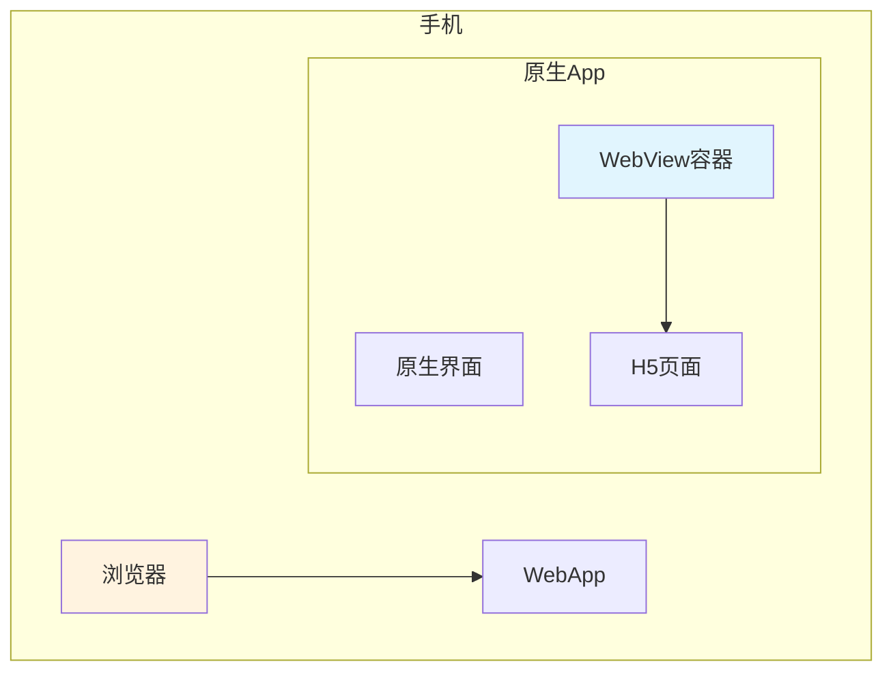
```mermaid
graph TB
    subgraph Phone [手机]
        subgraph NativeApp [原生App]
            Native[原生界面]
            WebView[WebView容器]
            H5[H5页面]
        end
        Browser[浏览器]
        WebApp[WebApp]
    end
    
    WebView --> H5
    Browser --> WebApp
    
    style WebView fill:#e1f5fe
    style Browser fill:#fff3e0
```

---

### 1.2 WebView是什么？为什么不是浏览器？

很多人以为"WebView就是一个嵌入的浏览器"，这个理解是**不准确的**。

**WebView是一个"阉割版"的浏览器内核。** 它能解析和显示网页，但：

1. **它没有地址栏、前进后退按钮** —— 这些由App自己控制
2. **它的很多功能被限制了** —— 出于安全考虑，App可以禁用某些功能
3. **它和App共享进程** —— 浏览器每个标签页是独立进程，WebView不是
4. **它的版本跟随系统** —— 浏览器可以随时更新，WebView受系统版本限制

用表格来对比：

| 维度 | 浏览器 | WebView |
|---|---|---|
| **谁控制它？** | 用户控制 | App控制 |
| **版本更新** | 随时可更新 | 跟随系统版本（尤其Android） |
| **功能完整性** | 完整 | 部分功能被限制或禁用 |
| **数据隔离** | 同一浏览器共享Cookie | 和浏览器完全隔离 |
| **网络请求** | 正常走系统网络 | 可能被App拦截或修改 |

**这意味着什么？**

假设用户在浏览器里登录了你的网站，然后在App的WebView里打开同一个网站——**他需要重新登录**。因为浏览器和WebView的登录状态是完全隔离的。

---

### 1.3 一个页面，两种命运

同一个H5页面，在浏览器和WebView里的表现可能完全不同。

#### 案例：获取用户位置

**在浏览器里：**
1. 网页调用浏览器提供的定位接口
2. 浏览器弹出"是否允许获取位置"的授权弹窗
3. 用户同意后，浏览器返回位置信息

**在WebView里（直接调用Web标准API）：**

> **澄清一个误区**：这里不是"绕过App调用浏览器"。WebView内置了浏览器内核，geolocation等API是WebView自带的。但这些API能否正常工作，取决于App的配置——App可以选择禁用它们。

1. 网页调用geolocation API（WebView内置的）
2. WebView检查：App配置里允许我用定位吗？→ 可能被禁用
3. 即使没禁用，App本身也需要有系统定位权限
4. 任何一环失败，都会导致获取失败

**通过JSBridge调用App（推荐方案）：**
1. H5通过JSBridge请求App帮忙获取位置
2. App使用**自己已经拥有的定位权限**调用系统
3. 系统返回位置给App，App再转给H5

**为什么JSBridge能成功？关键在于"权限是给谁的"：**


```mermaid
graph TB
    subgraph Permission [权限归属]
        OS[操作系统定位权限]
        AppPerm[App拥有定位权限]
        WVPerm[WebView的定位能力]
    end
    
    OS -->|用户授权| AppPerm
    AppPerm -.->|App可能不开放| WVPerm
    
    style AppPerm fill:#c8e6c9
    style WVPerm fill:#ffcdd2
```

| 问题 | 解答 |
|---|---|
| 权限是给谁的？ | 是给**App**的，不是给WebView里的网页的 |
| 为什么WebView可能没权限？ | App出于安全考虑，可能禁用WebView的敏感能力（防止恶意网页获取用户信息） |
| JSBridge为什么能成功？ | 因为是**App用自己的权限**去调用系统，然后把结果给H5 |
| 有什么区别？ | 直接调用 = 网页自己要权限；JSBridge = 求App帮忙，App决定帮不帮 |

**打个比方：**
- 直接调用浏览器接口 = 你（网页）直接去敲政府办事窗口，可能被拒绝
- 通过JSBridge = 你找App帮忙，App是"有关系的人"，可以帮你办成

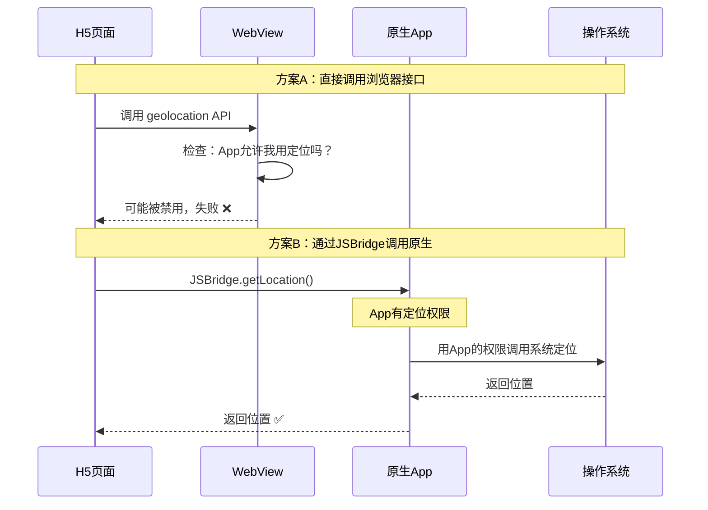
```mermaid
sequenceDiagram
    participant H5 as H5页面
    participant WV as WebView
    participant App as 原生App
    participant OS as 操作系统
    
    Note over H5,OS: 方案A：直接调用浏览器接口
    H5->>WV: 调用 geolocation API
    WV->>WV: 检查：App允许我用定位吗？
    WV-->>H5: 可能被禁用，失败 ❌
    
    Note over H5,OS: 方案B：通过JSBridge调用原生
    H5->>App: JSBridge.getLocation()
    Note over App: App有定位权限
    App->>OS: 用App的权限调用系统定位
    OS-->>App: 返回位置
    App-->>H5: 返回位置 ✅
```

---

### 1.4 能力边界：哪些功能在WebView里不能用？

以下是一些常见功能的对比：

| 功能 | 浏览器 | WebView | 怎么办？ |
|---|---|---|---|
| 摄像头/麦克风 | ✅ 支持 | ⚠️ 通常不支持 | 通过JSBridge调用App |
| 高精度定位 | ✅ 支持 | ⚠️ 需要App授权 | 通过JSBridge调用App |
| 推送通知 | ✅ 支持 | ❌ 不支持 | 用App的推送能力 |
| 支付 | ✅ 网页支付 | ⚠️ 受限 | 调用App的支付SDK |
| 分享到微信 | ❌ 不支持 | ⚠️ 需要App支持 | 通过JSBridge调用App |
| 蓝牙/NFC | ⚠️ 部分支持 | ❌ 不支持 | 通过JSBridge调用App |

**核心认知：H5页面在WebView里的能力，取决于App愿意提供多少能力给它。**

---

### 1.5 Cookie和存储的"隔离问题"

这是最容易踩坑的地方。

#### 问题一：登录态不互通

用户在手机浏览器里登录了你的网站，打开你们的App后，WebView里显示"未登录"。

**原因：** 浏览器的Cookie和WebView的Cookie是完全隔离的，互不共享。

**解决方案：**
1. App启动时，把登录信息（Token）通过URL参数或JSBridge传给H5
2. 或者让用户在App里重新登录

#### 问题二：数据可能被App清除

H5页面用localStorage存了一些数据，过几天发现数据没了。

**原因：** App可能在某些情况下清除WebView的缓存，包括localStorage。

**解决方案：**
1. 重要数据存到服务器
2. 或者通过JSBridge存到App的本地存储里

#### 问题三：跨域Cookie在WebView里可能失效

网页调用了另一个域名的接口，Cookie没有被正确携带。

**原因：** WebView对第三方Cookie的处理策略和浏览器不同，部分WebView默认禁止第三方Cookie。

---

### 1.6 如何判断"我现在运行在哪里"？

H5页面经常需要判断当前环境，以便做不同的处理。常见方法：

#### 方法一：检查User-Agent

每个浏览器/WebView都有一个"身份标识"，通过它可以大致判断环境。

```
伪代码：
如果 User-Agent 包含 "MicroMessenger" → 在微信里
如果 User-Agent 包含 "AlipayClient" → 在支付宝里
如果 User-Agent 包含 "MyApp" → 在我们自己的App里（需要App配置）
否则 → 在普通浏览器里
```

**缺点：** User-Agent可以被伪造，不是100%可靠。

#### 方法二：检查JSBridge是否存在

如果App往WebView里注入了JSBridge，那么H5页面可以检测这个对象是否存在。

```
伪代码：
如果 window.myAppBridge 存在 → 在我们的App里
否则 → 不在App里
```

**这是更推荐的方式，因为JSBridge的存在是App主动注入的，不容易被伪造。**

---

### 1.7 本章小结

| 维度 | WebApp（浏览器） | H5嵌入（WebView） |
|---|---|---|
| 运行环境 | 浏览器 | App内的WebView |
| 功能边界 | 浏览器提供什么就有什么 | 取决于App开放多少能力 |
| 数据隔离 | 同一浏览器内共享 | 和浏览器隔离，可能被App控制 |
| 更新方式 | 刷新页面 | 刷新页面（但可能有离线缓存） |
| 用户感知 | 明确知道是网页 | 可能以为是App原生页面 |

**一句话总结：H5嵌入Native不是"在App里打开网页"，而是"在一个被App控制的沙盒环境里运行网页代码"。**

---

## 第二章：JSBridge——打通两个世界的桥梁

### 一句话结论

**JSBridge的本质是一套"通信协议"：H5发消息给App，App处理后回复结果。就像打电话一样，需要双方约定好"怎么接通"和"怎么说话"。**

---

### 2.1 为什么需要JSBridge？

我们已经知道，H5页面在WebView里的能力是受限的。很多事情它做不了：

- 无法直接调用摄像头
- 无法直接调用支付
- 无法直接获取App的登录信息
- 无法直接分享到社交平台

但这些功能App都有。问题是：**H5怎么"请求"App帮它做这些事？**

答案就是：**JSBridge。**

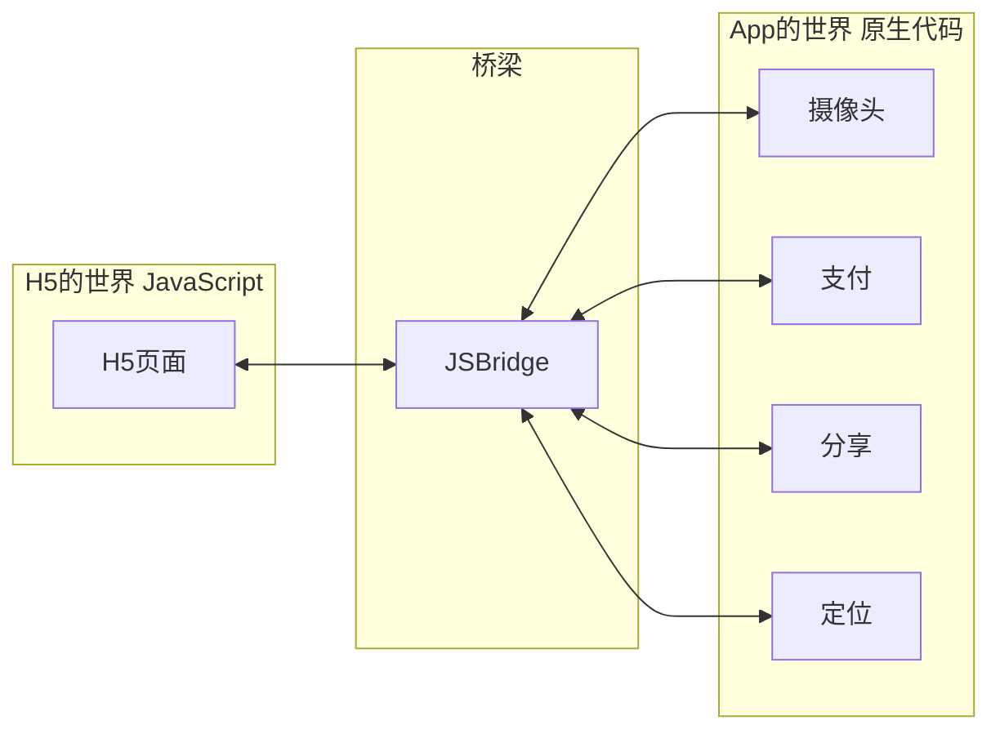
```mermaid
graph LR
    subgraph H5World [H5的世界 JavaScript]
        H5[H5页面]
    end
    
    subgraph Bridge [桥梁]
        JSB[JSBridge]
    end
    
    subgraph AppWorld [App的世界 原生代码]
        Camera[摄像头]
        Pay[支付]
        Share[分享]
        Location[定位]
    end
    
    H5 <--> JSB
    JSB <--> Camera
    JSB <--> Pay
    JSB <--> Share
    JSB <--> Location
```

**通俗理解：** 把JSBridge想象成一个"翻译官"。H5说JavaScript语言，App说原生语言（Java/Swift），JSBridge负责把双方的话翻译成对方能听懂的。

---

### 2.2 JSBridge的通信原理

JSBridge有几种实现方式，但核心思想都是一样的：**建立一个双方都能访问的"通道"。**

#### 方式一：拦截URL请求

**原理：**
1. H5页面"假装"要跳转到一个特殊的URL（比如 `myapp://openCamera`）
2. App拦截这个URL，解析出"H5想调用摄像头"
3. App执行摄像头功能，把结果返回给H5

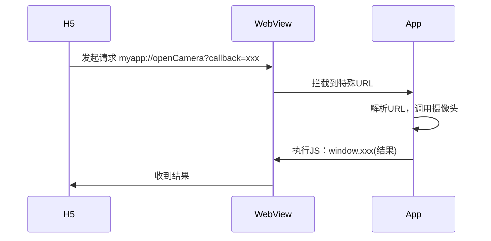
```mermaid
sequenceDiagram
    participant H5
    participant WebView
    participant App
    
    H5->>WebView: 发起请求 myapp://openCamera?callback=xxx
    WebView->>App: 拦截到特殊URL
    App->>App: 解析URL，调用摄像头
    App->>WebView: 执行JS：window.xxx(结果)
    WebView->>H5: 收到结果
```

**优点：** 兼容性最好，所有WebView都支持
**缺点：** URL有长度限制，无法传递大量数据

#### 方式二：注入JavaScript对象

**原理：**
1. App在WebView加载时，往网页里"注入"一个JavaScript对象
2. H5页面可以直接调用这个对象的方法
3. 这些方法实际上会触发App的原生代码

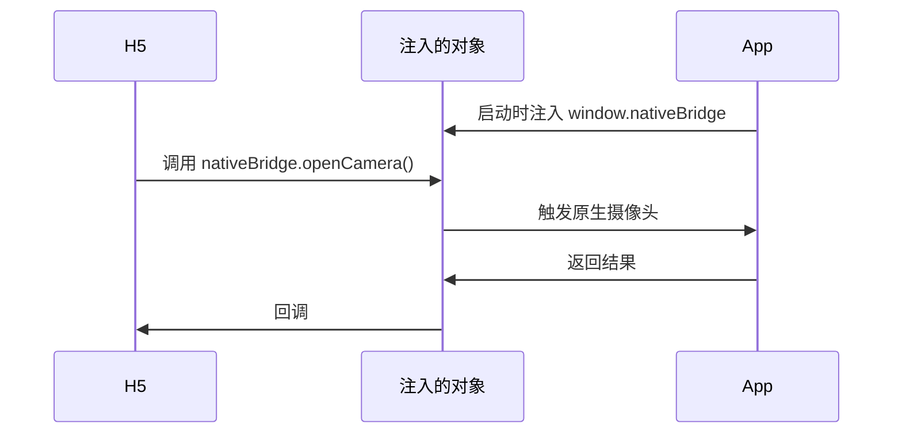
```mermaid
sequenceDiagram
    participant H5
    participant Bridge as 注入的对象
    participant App
    
    App->>Bridge: 启动时注入 window.nativeBridge
    H5->>Bridge: 调用 nativeBridge.openCamera()
    Bridge->>App: 触发原生摄像头
    App->>Bridge: 返回结果
    Bridge->>H5: 回调
```

**优点：** 调用方式直观，可以传递复杂数据
**缺点：** Android有安全漏洞（4.2以下版本），需要特别处理

#### 方式三：消息通道（iOS WKWebView推荐）

**原理：**
1. iOS提供了一个标准的消息发送机制
2. H5通过这个机制发送消息给App
3. App监听消息并处理

```
伪代码：
// H5端发送消息
webkit.messageHandlers.nativeBridge.postMessage({
    方法名: "openCamera",
    参数: {...},
    回调ID: "callback_123"
})

// App端接收并处理
func 收到消息(消息内容) {
    如果 消息内容.方法名 == "openCamera" {
        调用摄像头()
        把结果通过 回调ID 返回给H5
    }
}
```

---

### 2.3 一个完整的通信流程

假设H5页面想调用App的"获取用户信息"功能，完整流程如下：

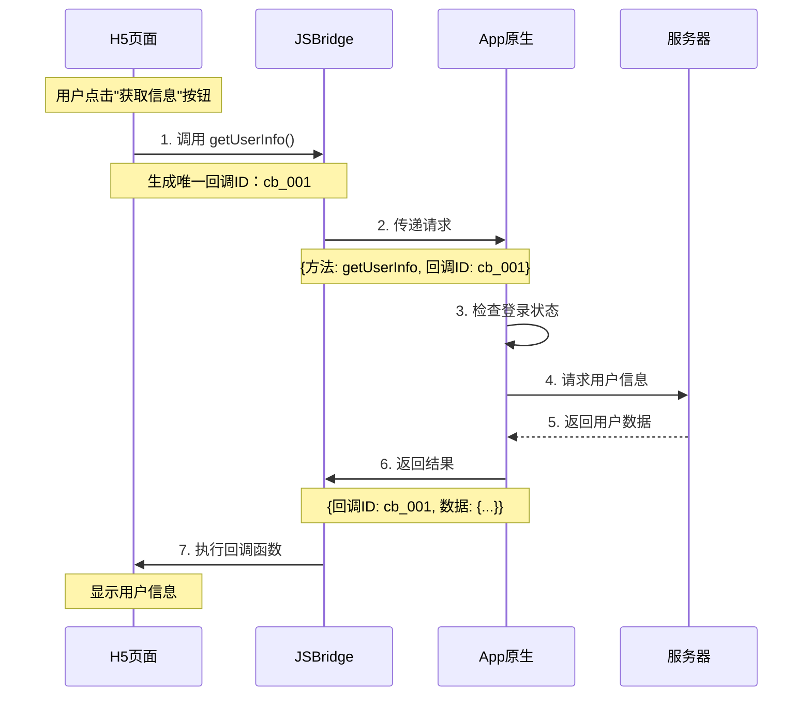
```mermaid
sequenceDiagram
    participant H5 as H5页面
    participant JSB as JSBridge
    participant App as App原生
    participant Server as 服务器
    
    Note over H5: 用户点击"获取信息"按钮
    
    H5->>JSB: 1. 调用 getUserInfo()
    Note over H5,JSB: 生成唯一回调ID：cb_001
    
    JSB->>App: 2. 传递请求
    Note over JSB,App: {方法: getUserInfo, 回调ID: cb_001}
    
    App->>App: 3. 检查登录状态
    App->>Server: 4. 请求用户信息
    Server-->>App: 5. 返回用户数据
    
    App->>JSB: 6. 返回结果
    Note over App,JSB: {回调ID: cb_001, 数据: {...}}
    
    JSB->>H5: 7. 执行回调函数
    Note over H5: 显示用户信息
```

---

### 2.4 协议设计：双方怎么"说话"

JSBridge需要定义一套"协议"，让H5和App都能理解对方在说什么。

#### 请求格式（H5 → App）

```
{
    "方法名": "getUserInfo",      // 要调用的功能
    "参数": {                     // 传递的参数
        "需要头像": true,
        "需要昵称": true
    },
    "回调ID": "cb_001",          // 用于匹配回复
    "超时时间": 5000              // 毫秒，超过就算失败
}
```

#### 响应格式（App → H5）

```
{
    "回调ID": "cb_001",          // 对应请求的回调ID
    "状态码": 0,                 // 0表示成功，其他表示失败
    "错误信息": "",              // 失败时的错误描述
    "数据": {                    // 成功时返回的数据
        "头像": "https://...",
        "昵称": "张三"
    }
}
```

#### 为什么需要"回调ID"？

因为H5可能同时发起多个请求，App处理完成的顺序不确定。通过回调ID，可以把响应和请求正确匹配起来。

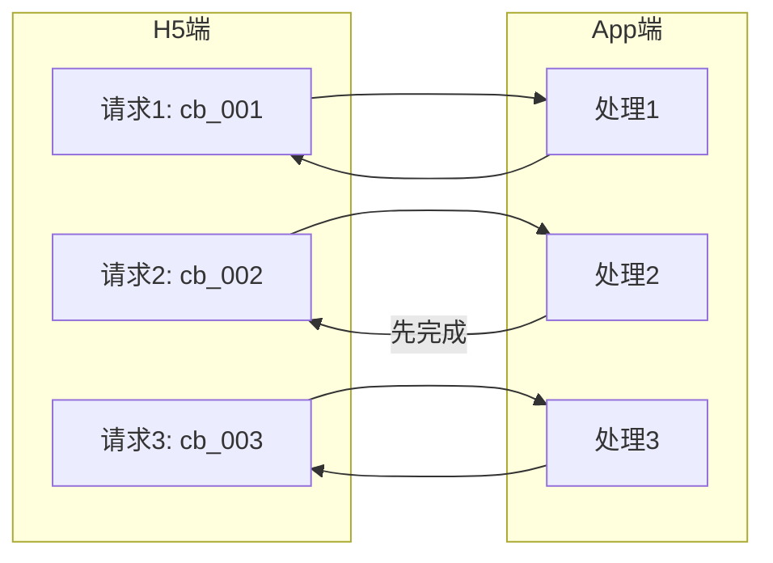
```mermaid
graph LR
    subgraph H5端
        R1[请求1: cb_001]
        R2[请求2: cb_002]
        R3[请求3: cb_003]
    end
    
    subgraph App端
        P1[处理1]
        P2[处理2]
        P3[处理3]
    end
    
    R1 --> P1
    R2 --> P2
    R3 --> P3
    
    P2 -->|先完成| R2
    P3 --> R3
    P1 --> R1
```

---

### 2.5 App主动通知H5（事件推送）

除了H5调用App，有时App也需要主动通知H5。比如：

- 网络状态变化了
- 用户切换了账号
- 收到了推送消息
- App即将进入后台

这时候App需要"反向"调用H5的代码。

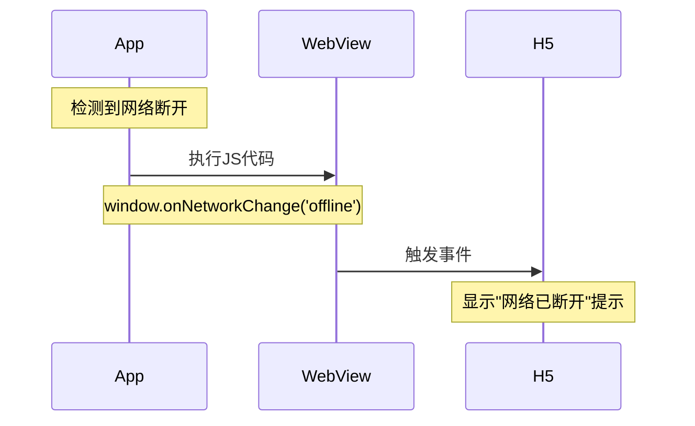
```mermaid
sequenceDiagram
    participant App
    participant WebView
    participant H5
    
    Note over App: 检测到网络断开
    
    App->>WebView: 执行JS代码
    Note over App,WebView: window.onNetworkChange('offline')
    
    WebView->>H5: 触发事件
    
    Note over H5: 显示"网络已断开"提示
```

---

### 2.6 安全问题：不能让坏人利用

如果H5页面可以调用App的任何功能，那会很危险。假设用户点了一个恶意链接，那个网页可能会：

- 偷偷读取用户信息
- 发起支付请求
- 获取用户位置
- ...

所以必须有安全控制：

#### 方法一：白名单

只有指定域名的H5页面才能调用JSBridge。

```
伪代码：
允许的域名 = ["www.myapp.com", "m.myapp.com"]

当收到JSBridge请求时：
    获取当前页面的域名
    如果 域名 不在 允许的域名列表里：
        拒绝请求
        记录安全日志
    否则：
        正常处理请求
```

#### 方法二：接口分级

不同级别的接口，权限不同。

| 级别 | 可调用的接口 | 可调用的页面 |
|---|---|---|
| 公开级 | 获取设备信息、获取网络状态 | 所有白名单页面 |
| 内部级 | 获取用户信息、定位 | 仅内部业务页面 |
| 系统级 | 支付、清除缓存 | 仅核心业务页面 |

#### 方法三：签名验证

对于高敏感接口，要求H5传递签名，App验证签名后才执行。

---

### 2.7 本章小结

| 概念 | 说明 |
|---|---|
| JSBridge是什么 | H5和App之间的通信桥梁 |
| 为什么需要 | H5在WebView里能力受限，需要调用App的能力 |
| 实现方式 | URL拦截、注入对象、消息通道 |
| 通信协议 | 请求格式 + 响应格式 + 回调ID匹配 |
| 反向通知 | App也可以主动调用H5的代码 |
| 安全控制 | 白名单、接口分级、签名验证 |

**一句话总结：JSBridge就像一个"翻译+秘书"，负责在H5和App之间传话，同时还要把好安全关。**

---

## 第三章：用户体验——细节决定成败

### 一句话结论

**H5在WebView里的体验问题，80%来自"手势冲突"和"导航混乱"。解决好这两个问题，体验就能接近原生。**

---

### 3.1 手势冲突：谁来响应用户的滑动？

当用户在屏幕上滑动时，可能有多个"角色"想要响应：

- **H5页面**：可能有轮播图、左滑删除等功能
- **WebView**：可能有滚动、缩放等默认行为
- **App**：可能有左滑返回、下拉刷新等手势

当这些手势"撞车"时，就会出现问题。

#### 案例一：下拉刷新冲突

用户在页面顶部下拉，期望刷新页面。但可能发生：

- App的下拉刷新触发了
- 同时H5页面自己的下拉刷新也触发了
- 结果：页面刷新了两次，或者动画混乱

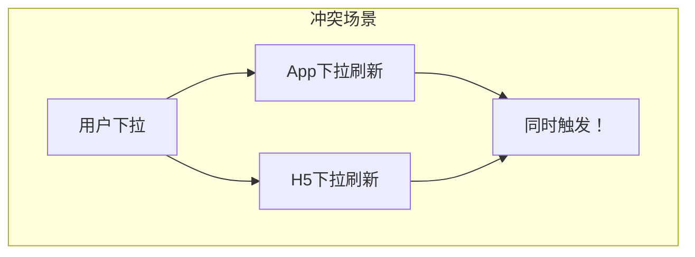
```mermaid
graph TB
    subgraph Conflict [冲突场景]
        User[用户下拉] --> AppRefresh[App下拉刷新]
        User --> H5Refresh[H5下拉刷新]
        AppRefresh --> Problem[同时触发！]
        H5Refresh --> Problem
    end
```

**解决思路：**
1. 确定"谁负责刷新"：要么App负责，要么H5负责，不能两个都做
2. 通过JSBridge通信：如果H5有自己的下拉刷新，告诉App"禁用你的刷新"

#### 案例二：左滑返回冲突（iOS）

iOS支持从屏幕左边缘向右滑动返回上一页。但如果H5页面里有轮播图，用户想滑动轮播图时，可能会触发"返回"。

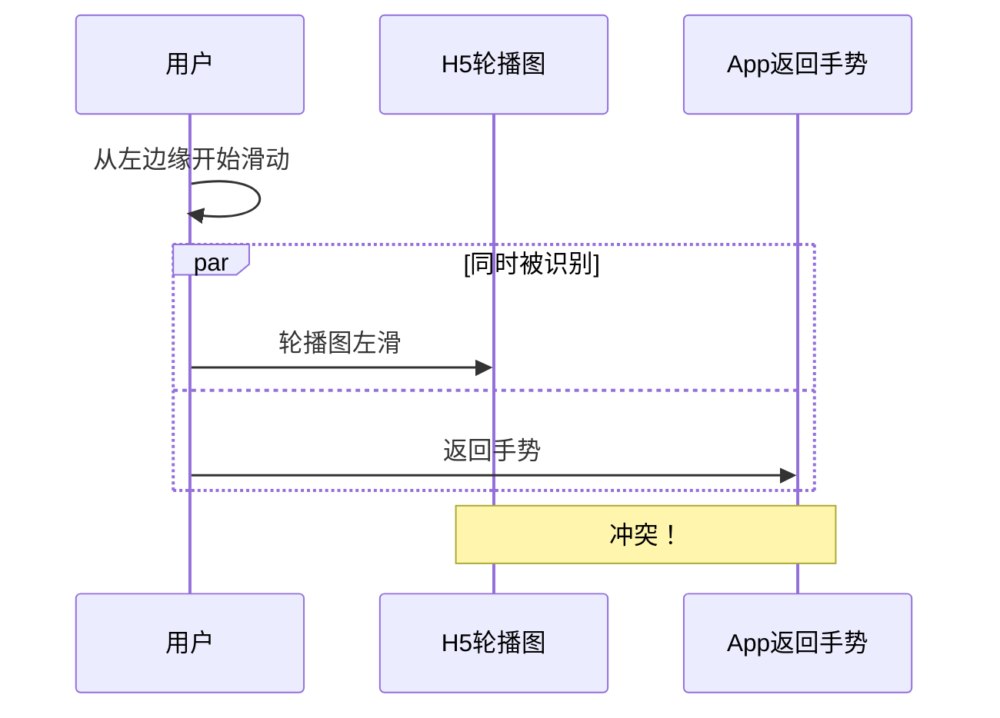
```mermaid
sequenceDiagram
    participant User as 用户
    participant H5 as H5轮播图
    participant App as App返回手势
    
    User->>User: 从左边缘开始滑动
    
    par 同时被识别
        User->>H5: 轮播图左滑
    and
        User->>App: 返回手势
    end
    
    Note over H5,App: 冲突！
```

**解决思路：**
1. 检测手势的起始位置：如果从屏幕边缘开始，优先让App处理
2. 或者在特定页面禁用App的边缘手势

#### 案例三：滚动穿透

弹窗出现时，用户滑动弹窗，结果底下的页面也跟着滚动了。

**解决思路：**
1. 弹窗出现时，锁定底层页面的滚动
2. 弹窗关闭时，恢复底层页面的滚动

---

### 3.2 导航混乱：按返回键应该回到哪里？

在App里打开H5页面后，用户在H5里又点了几个链接，然后按返回键：

- 期望：回到H5的上一个页面
- 可能发生：直接回到App的上一个原生页面，H5的历史记录全丢了

**为什么会这样？**

因为App的"返回"和H5的"返回"是两套独立的系统，需要协调。

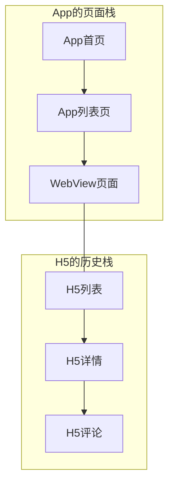
```mermaid
graph TB
    subgraph AppStack [App的页面栈]
        A1[App首页] --> A2[App列表页] --> A3[WebView页面]
    end
    
    subgraph H5Stack [H5的历史栈]
        H1[H5列表] --> H2[H5详情] --> H3[H5评论]
    end
    
    A3 --- H1
```

> 用户在H5评论页按返回键时，应该回到H5详情页，而不是直接回到App列表页。

**解决思路：**

1. **App拦截返回事件**：先问H5"你还能往回退吗？"
2. **H5回复**：
   - 如果H5历史栈里还有页面，H5自己处理返回
   - 如果H5已经是第一页了，告诉App"我处理不了，你来"
3. **App根据回复决定**：是让H5返回，还是关闭WebView

```
伪代码：
App收到返回事件：
    询问H5 "你能处理返回吗？"
    
    如果 H5回复 "能"：
        H5自己后退一页
    否则：
        App关闭WebView页面
```

---

### 3.3 安全区域适配：刘海屏、底部横条

现在的手机很多有"刘海"或"药丸"造型，底部也有一条横条（Home指示器）。如果H5页面没有适配，内容可能被遮挡。

```
+-----------------------+
|   ●●●                |  ← 刘海区域
|-----------------------|
|                       |
|     H5页面内容        |
|                       |
|                       |
|-----------------------|
|  ——————              |  ← Home指示器区域
+-----------------------+
```

**解决思路：**

1. 使用CSS的"安全区域"变量：
   - 顶部留出 `safe-area-inset-top` 的距离
   - 底部留出 `safe-area-inset-bottom` 的距离

2. 或者通过JSBridge获取App告知的安全区域数值

---

### 3.4 键盘问题：输入框被挡住了

用户点击输入框时，键盘弹起。但H5页面里的输入框可能被键盘挡住了。

**不同平台表现不同：**

| 平台 | 键盘弹起时的行为 |
|---|---|
| iOS | WebView整体上移，但可能不够 |
| Android | 取决于App配置，可能上移也可能不变 |

**解决思路：**

1. 监听键盘弹起事件（通过JSBridge）
2. 计算输入框位置和键盘高度
3. 如果输入框被挡住，滚动页面使输入框可见

---

### 3.5 加载态和错误态

用户体验不只是"功能能用"，还包括"出问题时怎么处理"。

#### 加载中：使用骨架屏

页面加载时，不要显示空白，而是显示一个"骨架"，让用户知道内容正在加载。

```
+---------------------------+
|  ████████████████         |  ← 标题骨架
|                           |
|  ████████████████████████ |
|  ████████████████████████ |  ← 内容骨架
|  ████████████████         |
|                           |
|  ████████  ████████       |  ← 按钮骨架
+---------------------------+
```

#### 加载失败：提供重试

如果页面加载失败，显示错误信息和"重试"按钮，而不是让用户自己刷新。

```
+---------------------------+
|                           |
|         😅                |
|                           |
|    加载失败，请重试        |
|                           |
|      [ 点击重试 ]          |
|                           |
+---------------------------+
```

---

### 3.6 本章小结

| 问题类型 | 常见表现 | 解决思路 |
|---|---|---|
| 手势冲突 | 下拉刷新重复、左滑返回误触 | 明确"谁负责"，通过JSBridge协调 |
| 导航混乱 | 返回键行为不符合预期 | App拦截返回，先让H5处理 |
| 安全区域 | 内容被刘海/底部条遮挡 | 使用安全区域CSS变量 |
| 键盘遮挡 | 输入框看不见 | 监听键盘，滚动页面 |
| 加载/错误 | 白屏、无反馈 | 骨架屏、重试按钮 |

**一句话总结：H5和App是"两个人"在合作，体验问题往往是因为"配合不默契"。解决方法就是"提前约定好谁干什么"。**

---

## 第四章：性能优化——消灭白屏

### 一句话结论

**白屏的本质是"用户在等待"。优化的核心思路是：能提前做的提前做，能并行做的并行做，能缓存的就缓存。**

---

### 4.1 理解白屏：用户在等什么？

当用户点击打开一个H5页面，到看到内容，中间发生了很多事情：

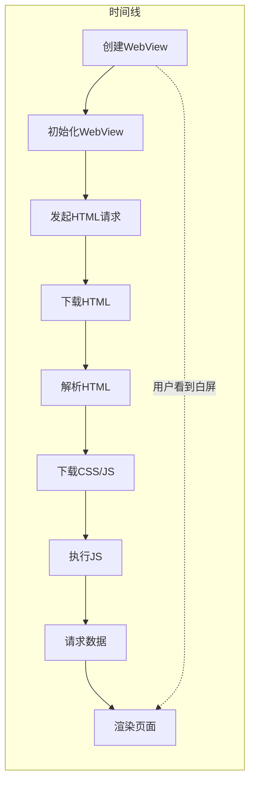
```mermaid
graph LR
    subgraph Timeline [时间线]
        A[创建WebView] --> B[初始化WebView]
        B --> C[发起HTML请求]
        C --> D[下载HTML]
        D --> E[解析HTML]
        E --> F[下载CSS/JS]
        F --> G[执行JS]
        G --> H[请求数据]
        H --> I[渲染页面]
    end
    
    A -.-> |用户看到白屏| I
```

每个环节都需要时间：

| 环节 | 典型耗时 | 用户感知 |
|---|---|---|
| 创建WebView | 100-300ms | 白屏 |
| 初始化WebView | 100-200ms | 白屏 |
| 网络请求HTML | 100-500ms | 白屏 |
| 下载CSS/JS | 200-1000ms | 白屏 |
| 执行JS | 100-500ms | 白屏 |
| 请求数据 | 200-1000ms | 白屏或骨架屏 |
| 渲染 | 50-200ms | 显示内容 |

**加起来可能有2-4秒！** 这就是用户看到的"白屏时间"。

---

### 4.2 优化策略总览

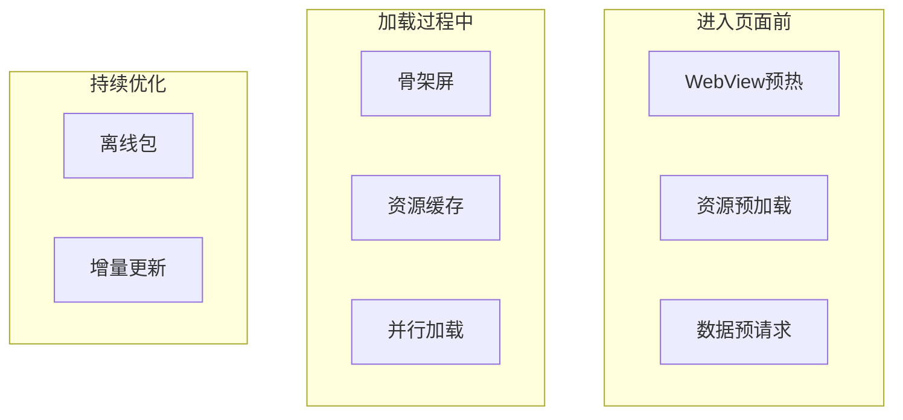
```mermaid
graph TB
    subgraph Before [进入页面前]
        P1[WebView预热]
        P2[资源预加载]
        P3[数据预请求]
    end
    
    subgraph During [加载过程中]
        D1[骨架屏]
        D2[资源缓存]
        D3[并行加载]
    end
    
    subgraph After [持续优化]
        A1[离线包]
        A2[增量更新]
    end    
```

---

### 4.3 策略一：WebView预热

**问题：** 每次打开H5页面都要创建新的WebView，耗时100-300ms

**解决：** App启动时就预先创建好一个WebView，需要用时直接拿来用

```
伪代码：
App启动时：
    在后台创建一个WebView
    加载一个空白页面（完成初始化）
    把这个WebView存起来

用户要打开H5页面时：
    如果有预创建的WebView：
        直接使用它
        开始创建下一个预备WebView（后台）
    否则：
        正常创建新的WebView

用户关闭H5页面时：
    如果WebView还能复用：
        清理它的历史记录
        放回"预备池"
    否则：
        销毁它
```

**效果：** 节省100-300ms的WebView创建时间

---

### 4.4 策略二：资源预加载

**问题：** 打开页面时才开始加载HTML、CSS、JS，用户要等网络

**解决：** 提前就把这些资源下载好

#### 场景一：DNS预解析

用户还没点击，就提前解析要访问的域名

```
用户在App首页时：
    悄悄解析 h5.myapp.com 的IP地址
    
用户点击打开H5时：
    DNS解析已经完成了
    直接发起请求
```

**效果：** 节省50-100ms的DNS解析时间

#### 场景二：页面预加载

预判用户可能打开某个H5页面，提前加载它

```
用户在列表页浏览时：
    预测用户可能点击第一个商品
    后台悄悄加载该商品的H5详情页
    
用户点击该商品时：
    页面已经加载好了，直接显示
```

**效果：** 如果预测准确，几乎零等待

**风险：** 预测不准会浪费流量和性能

---

### 4.5 策略三：缓存体系

**核心思想：** 同样的资源，第二次打开时不用再下载

#### 缓存层级

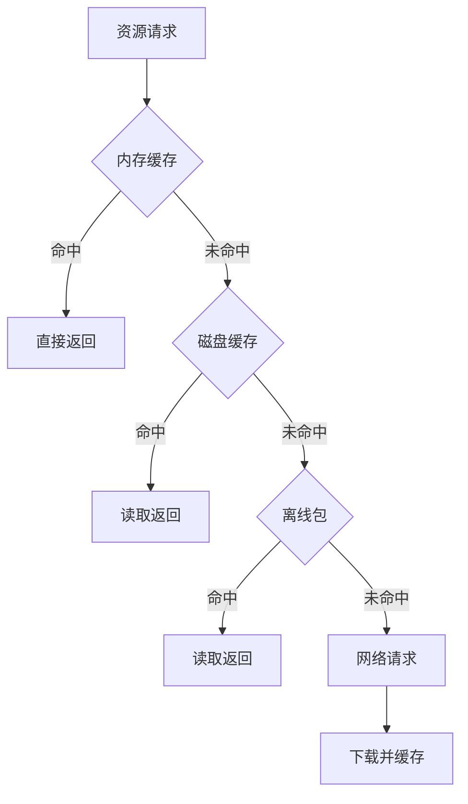
```mermaid
graph TB
    Request[资源请求] --> L1{内存缓存}
    L1 -->|命中| R1[直接返回]
    L1 -->|未命中| L2{磁盘缓存}
    L2 -->|命中| R2[读取返回]
    L2 -->|未命中| L3{离线包}
    L3 -->|命中| R3[读取返回]
    L3 -->|未命中| L4[网络请求]
    L4 --> R4[下载并缓存]
```

#### 不同资源的缓存策略

| 资源类型 | 缓存策略 | 理由 |
|---|---|---|
| HTML | 不缓存或短期缓存 | 需要保证内容是最新的 |
| CSS/JS（带版本号） | 长期缓存（一年） | 内容不变，文件名带版本号 |
| 图片 | 长期缓存 | 通常不会变 |
| API数据 | 短期缓存或不缓存 | 数据时效性要求高 |

---

### 4.6 策略四：离线包

**问题：** 即使有缓存，第一次访问还是要下载

**解决：** 把H5页面的资源打包，内置到App里或提前下载

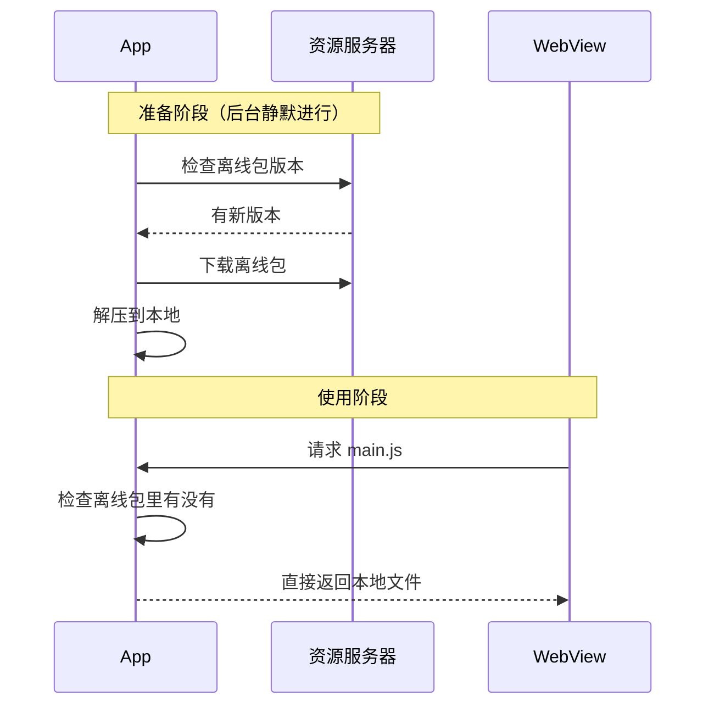
```mermaid
sequenceDiagram
    participant App
    participant Server as 资源服务器
    participant WebView
    
    Note over App,Server: 准备阶段（后台静默进行）
    App->>Server: 检查离线包版本
    Server-->>App: 有新版本
    App->>Server: 下载离线包
    App->>App: 解压到本地
    
    Note over App,WebView: 使用阶段
    WebView->>App: 请求 main.js
    App->>App: 检查离线包里有没有
    App-->>WebView: 直接返回本地文件
```

**效果：** 资源加载速度从"网络速度"变成"本地读取速度"，提升10-100倍

#### 增量更新

不用每次都下载完整的离线包，只下载变化的部分。

```
当前版本：1.0，大小10MB
新版本：1.1，大小11MB

全量更新：下载11MB
增量更新：只下载变化的500KB
```

---

### 4.7 策略五：骨架屏

**问题：** 即使优化了，仍有一定的加载时间，用户看到白屏会焦虑

**解决：** 在内容加载完成前，先显示一个"骨架"，让用户知道"正在加载"

```
加载中：                    加载完成：
+------------------+        +------------------+
|  ████████        |        |  商品名称        |
|                  |   →    |                  |
|  █████████████   |        |  这是商品描述... |
|  █████████       |        |  价格：¥99       |
|                  |        |                  |
|  ████████        |        |  [立即购买]      |
+------------------+        +------------------+
```

**为什么骨架屏有效？**

心理学研究表明，用户对"有反馈的等待"比"没反馈的等待"更有耐心。骨架屏传达了"内容正在加载"的信息，减少用户焦虑。

---

### 4.8 本章小结

| 优化策略 | 原理 | 效果 | 实现难度 |
|---|---|---|---|
| WebView预热 | 提前创建，用时即用 | 节省100-300ms | 中 |
| DNS预解析 | 提前解析域名 | 节省50-100ms | 低 |
| 资源预加载 | 预判并提前加载 | 理想情况零等待 | 中 |
| 缓存体系 | 第二次不用下载 | 大幅减少网络耗时 | 低 |
| 离线包 | 资源本地化 | 加载速度提升10-100倍 | 高 |
| 骨架屏 | 给用户反馈 | 降低感知等待时间 | 低 |

**一句话总结：白屏优化不是"一招制敌"，而是"全链路挤时间"——每个环节省一点，加起来就是质变。**

---

## 第五章：离线能力——让H5也能离线用

### 一句话结论

**离线能力的本质是"把网络请求变成本地读取"。实现方式有两种：浏览器标准的Service Worker，和App控制的离线包。**

---

### 5.1 为什么需要离线能力？

几个场景：

1. **弱网环境**：电梯里、地铁里、偏远地区，网络很慢或断断续续
2. **节省流量**：同样的资源不用重复下载
3. **首次加载**：即使是第一次打开，也能用本地资源加快速度

---

### 5.2 方案一：Service Worker（浏览器标准）

Service Worker是浏览器提供的一个标准功能，可以拦截网页的网络请求，决定是走网络还是用缓存。

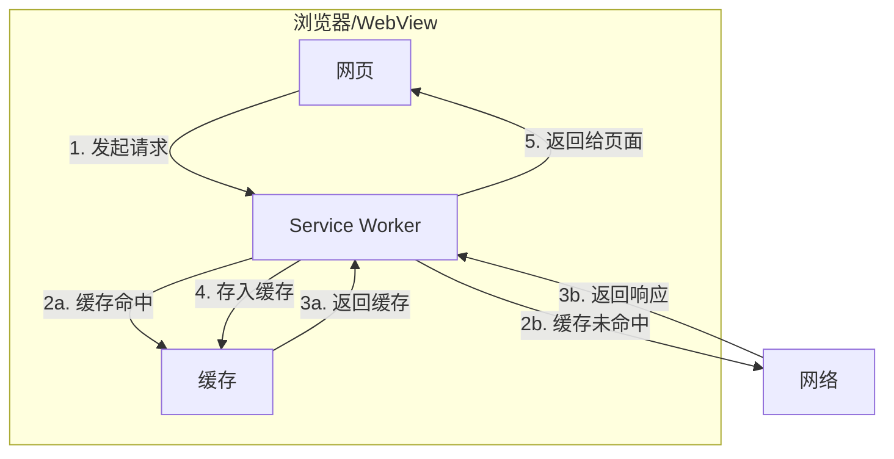
```mermaid
graph TB
    subgraph Browser [浏览器/WebView]
        Page[网页]
        SW[Service Worker]
        Cache[缓存]
    end
    Network[网络]
    
    Page -->|1. 发起请求| SW
    SW -->|2a. 缓存命中| Cache
    Cache -->|3a. 返回缓存| SW
    SW -->|2b. 缓存未命中| Network
    Network -->|3b. 返回响应| SW
    SW -->|4. 存入缓存| Cache
    SW -->|5. 返回给页面| Page
```

#### Service Worker的生命周期

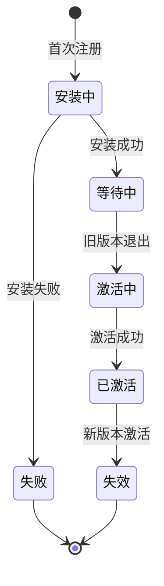
```mermaid
stateDiagram-v2
    [*] --> 安装中: 首次注册
    安装中 --> 等待中: 安装成功
    安装中 --> 失败: 安装失败
    等待中 --> 激活中: 旧版本退出
    激活中 --> 已激活: 激活成功
    已激活 --> 失效: 新版本激活
    失败 --> [*]
    失效 --> [*]
```

**通俗理解：**
1. 首次访问网页时，浏览器下载并安装Service Worker
2. 安装成功后，Service Worker进入"等待"状态
3. 当没有其他页面使用旧版Service Worker时，新的Service Worker"激活"
4. 激活后，Service Worker开始拦截该网页的所有网络请求

#### 常用缓存策略

| 策略 | 说明 | 适用场景 |
|---|---|---|
| 缓存优先 | 先找缓存，没有再请求网络 | 静态资源（CSS、JS、图片） |
| 网络优先 | 先请求网络，失败再用缓存 | API数据 |
| 边用边更新 | 先返回缓存，同时后台更新 | 不那么实时的内容 |
| 仅缓存 | 只用缓存，不请求网络 | 完全离线场景 |
| 仅网络 | 只用网络，不用缓存 | 实时性要求高的数据 |

**局限性：** 部分WebView对Service Worker支持不好，尤其是老版本Android。

---

### 5.3 方案二：Native离线包（App控制）

因为Service Worker在WebView里可能有兼容性问题，很多App选择自己实现离线包方案。

#### 工作原理

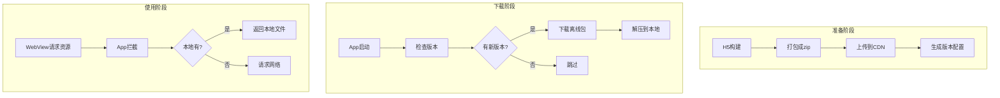
```mermaid
graph TB
    subgraph Prepare [准备阶段]
        Build[H5构建] --> Pack[打包成zip]
        Pack --> Upload[上传到CDN]
        Upload --> Config[生成版本配置]
    end
    
    subgraph Download [下载阶段]
        App[App启动] --> Check[检查版本]
        Check --> Diff{有新版本?}
        Diff -->|是| Down[下载离线包]
        Down --> Unzip[解压到本地]
        Diff -->|否| Skip[跳过]
    end
    
    subgraph Use [使用阶段]
        WebView[WebView请求资源] --> Intercept[App拦截]
        Intercept --> Local{本地有?}
        Local -->|是| Return[返回本地文件]
        Local -->|否| Network[请求网络]
    end
```

#### 增量更新

每次全量下载离线包太浪费流量，可以只下载变化的部分。

```
假设：
- 旧版本：1.0.0（10MB）
- 新版本：1.1.0（10.5MB）
- 实际变化：只有3个文件变了（共500KB）

全量更新：下载10.5MB
增量更新：只下载500KB的差异包

节省流量：95%
```

**增量更新的原理：**
1. 服务端对比新旧版本，生成"差异包"
2. App下载差异包，与本地旧版本合并
3. 验证合并后的版本是否正确

---

### 5.4 两种方案对比

| 维度 | Service Worker | Native离线包 |
|---|---|---|
| 实现方 | 浏览器/WebView | App原生代码 |
| 兼容性 | 部分WebView不支持 | 完全可控 |
| 更新控制 | 受浏览器策略限制 | App完全控制 |
| 预装能力 | 不能预装 | 可随App安装包预装 |
| 开发成本 | 低（纯前端） | 高（需要客户端开发） |
| 推荐场景 | PWA、现代浏览器 | App内H5 |

**最佳实践：** 两者结合使用。Native离线包作为主要方案，Service Worker作为补充和降级。

---

### 5.5 降级策略

离线包或缓存可能失效（损坏、版本不对等），需要有"兜底"方案。

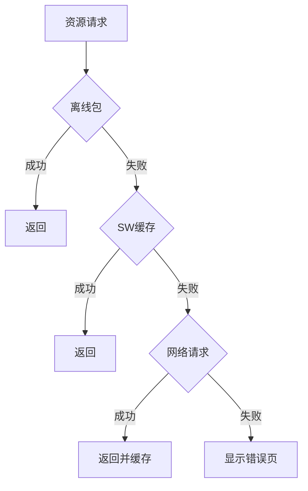
```mermaid
graph TB
    Request[资源请求] --> L1{离线包}
    L1 -->|成功| Return1[返回]
    L1 -->|失败| L2{SW缓存}
    L2 -->|成功| Return2[返回]
    L2 -->|失败| L3{网络请求}
    L3 -->|成功| Return3[返回并缓存]
    L3 -->|失败| L4[显示错误页]
```

**关键点：** 每一层失败都不能让整个流程卡住，要有后续方案。

---

### 5.6 本章小结

| 概念 | 说明 |
|---|---|
| 离线能力的目的 | 网络不好或没网时也能用，同时提升加载速度 |
| Service Worker | 浏览器标准方案，纯前端实现，但兼容性有问题 |
| Native离线包 | App控制的方案，兼容性好，但开发成本高 |
| 增量更新 | 只下载变化的部分，节省流量 |
| 降级策略 | 离线包 → SW缓存 → 网络 → 错误页 |

**一句话总结：离线能力让H5可以像原生App一样，不依赖网络也能工作。**

---

## 第六章：方案选型——什么时候用什么

### 一句话结论

**没有最好的方案，只有最适合的方案。选型的核心是明确"我要什么"和"我愿意付出什么代价"。**

---

### 6.1 三种方案的对比

| 维度 | 纯WebApp | H5嵌入 | 原生 |
|---|---|---|---|
| **开发成本** | 低（一套代码） | 中（H5 + 部分原生） | 高（双平台开发） |
| **迭代速度** | 最快（发布即生效） | 快（H5可热更新） | 慢（需发版审核） |
| **性能体验** | 一般 | 较好 | 最好 |
| **原生能力** | 受限 | 可扩展 | 完整 |
| **离线能力** | 依赖SW | 可用离线包 | 完整 |
| **安装包大小** | 无 | 增加少量 | 增加较多 |

---

### 6.2 决策流程

```mermaid
graph TB
    Start[新功能需求] --> Q1{需要原生能力?}
    
    Q1 -->|是| Q2{JSBridge能覆盖?}
    Q1 -->|否| Q3{需要频繁更新?}
    
    Q2 -->|是| Hybrid[H5嵌入]
    Q2 -->|否| Native[原生]
    
    Q3 -->|是| Q4{性能要求高?}
    Q3 -->|否| Q5{需要SEO?}
    
    Q4 -->|是| Hybrid
    Q4 -->|否| WebApp[纯WebApp]
    
    Q5 -->|是| WebApp
    Q5 -->|否| Hybrid
```

> **原生能力**：摄像头、支付、蓝牙等  
> **频繁更新**：活动页、运营内容等

---

### 6.3 典型场景对应的方案

| 场景 | 推荐方案 | 理由 |
|---|---|---|
| App首页、核心交易流程 | 原生 | 用户每天用，体验必须最好 |
| 商品详情页 | H5嵌入 | 内容多变，需要快速迭代 |
| 运营活动页（双11、春节） | H5嵌入 | 生命周期短，上线快下线快 |
| 帮助中心、协议条款 | H5嵌入或WebApp | 纯内容展示，不需要复杂交互 |
| 复杂动画、游戏 | 原生 | H5性能不够 |
| 需要快速验证的新功能 | H5嵌入 | 快速上线，根据数据决定是否改成原生 |

---

### 6.4 一个App的典型架构

大多数App会混合使用多种方案：

```mermaid
graph TB
    subgraph App [App整体架构]
        TabBar[底部导航 - 原生]
        Nav[顶部导航栏 - 原生]
        
        subgraph Pages [页面]
            Home[首页 - 原生]
            Search[搜索 - 原生]
            Cart[购物车 - 原生]
            Mine[我的 - 原生]
            
            Detail[商品详情 - H5]
            Activity[活动页 - H5]
            Help[帮助中心 - H5]
            Article[文章内容 - H5]
        end
    end
    
    TabBar --> Home
    TabBar --> Search
    TabBar --> Cart
    TabBar --> Mine
    
    Home --> Detail
    Home --> Activity
    Mine --> Help
```

**边界原则：**
1. **"骨架"用原生**：底部Tab、导航栏这些"框架级"UI用原生
2. **高频页面用原生**：用户天天用的核心功能，体验优先
3. **内容页用H5**：详情、文章这类"展示型"页面，H5就够了
4. **活动页用H5**：生命周期短，随时上下线

---

### 6.5 常见误区

#### 误区一："H5性能太差了"

**事实：** 很多H5性能问题是"没优化好"，不是"技术本身做不到"。通过预热、缓存、离线包，H5可以接近原生体验。

#### 误区二："全用原生最好"

**事实：** 原生开发成本高、迭代慢。对于变化频繁的业务，H5的灵活性是巨大优势。

#### 误区三："React Native/Flutter可以替代Hybrid"

**事实：** 它们解决的是不同的问题：
- RN/Flutter：用一套代码开发双平台的"类原生"界面
- Hybrid：动态更新 + 复用Web资源

两者可以共存，不是非此即彼。

---

### 6.6 本章小结

| 问题 | 思考角度 |
|---|---|
| 选原生还是H5？ | 性能要求、迭代频率、开发成本 |
| H5嵌入还是纯WebApp？ | 是否需要原生能力、是否需要离线 |
| 哪些功能用H5？ | 内容展示类、运营活动类、变化频繁类 |
| 哪些功能必须原生？ | 核心流程、复杂交互、性能敏感 |

**一句话总结：技术选型没有"银弹"，关键是理解每种方案的优缺点，根据具体场景做出权衡。**

---

## 结语

到这里，我们完整地走过了客户端嵌套H5的核心知识：

1. **本质差异**：WebView ≠ 浏览器，理解沙盒环境是一切的基础
2. **JSBridge**：H5和App的"翻译官"，协议设计和安全控制是关键
3. **用户体验**：手势冲突、导航混乱，本质是"两个系统在抢控制权"
4. **性能优化**：预热、预加载、缓存、离线包，全链路挤时间
5. **离线能力**：Service Worker和离线包，让H5不依赖网络
6. **方案选型**：没有最好，只有最适合

**精通Hybrid开发的标志是什么？**

不是记住所有API，而是理解"H5和App是两个世界，如何让它们协作"这个核心问题。掌握了这个心智模型，遇到任何具体问题，你都能找到解决方向。

---

## 参考资源

- [WebView最佳实践](https://nicokant.io/blog/2021-06-11-webview-cheat-sheet)
- [Service Worker使用指南](https://developer.mozilla.org/zh-CN/docs/Web/API/Service_Worker_API)
- [Web Vitals性能指标](https://web.dev/vitals/)
- [Hybrid App开发最佳实践](https://juejin.cn/post/6844903585268891662)
