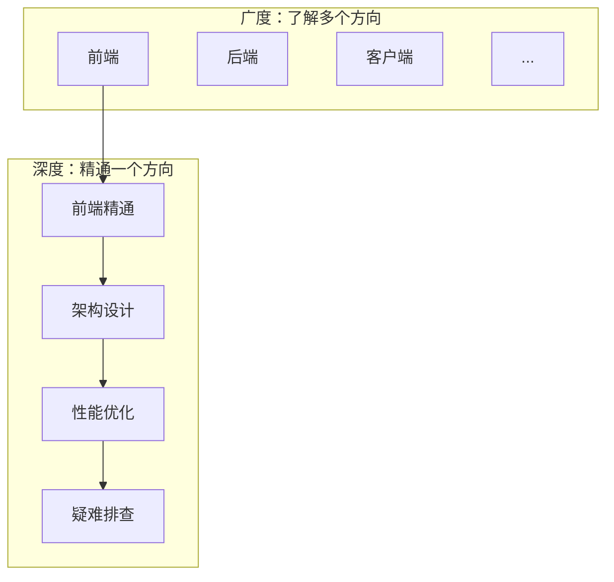
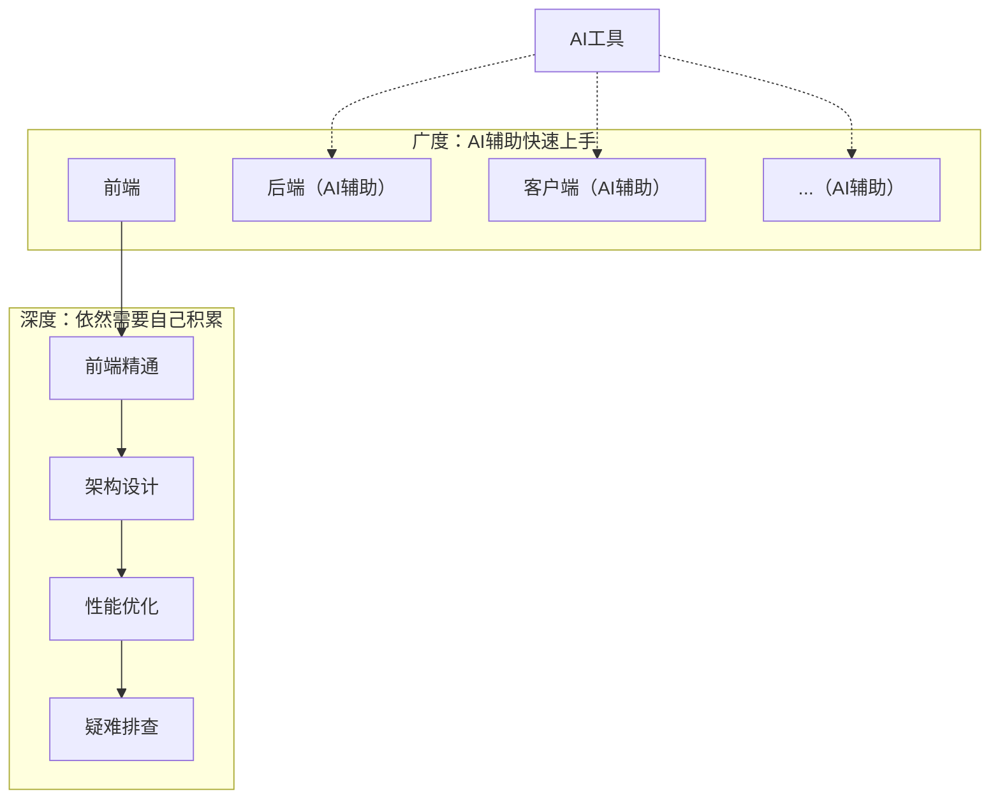
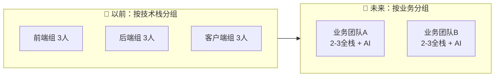

# 我对AI时代技术人才的预测

> **TL;DR**：AI降低了"写代码"的门槛，但没降低"懂系统"的门槛。我预测：未来需要的不是"什么都会"的全栈，而是"一个方向精通 + 用AI扩展边界"的T型人才。本文从个人发展和团队配置两个角度，分享我的几个判断。

---

## 一、一个焦虑的问题

"AI会不会取代程序员？"

这个问题我被问过很多次。每次有新的AI工具发布，这个焦虑就会浮上来一次。

但我觉得这个问题问错了。更有建设性的问法是：

> **AI改变了什么，没改变什么？基于这个变化，我们应该怎么调整？**

---

## 二、AI改变了什么

### 2.1 写代码的门槛降低了

以前：
- 学一门新语言要几周
- 写一个陌生框架的代码很慢
- 记住各种API和语法细节

现在：
- Cursor/Copilot可以边写边学
- AI生成80%的样板代码
- 不用记，问AI就行

**直接影响**：一个前端开发者，可以"凑合"写一个简单的iOS页面了。以前这是不可能的。

### 2.2 跨界的成本降低了

| 以前 | 现在 |
|---|---|
| 前端想写后端，要系统学Node/Java | 告诉AI需求，它帮你生成 |
| iOS开发想写Android，要重新学Kotlin | AI可以帮你翻译逻辑 |
| 不会SQL，就是不会 | AI帮你写，你只需要验证 |

**直接影响**：一个人能覆盖的范围变大了。

### 2.3 学习新技术的速度变快了

以前学一个新框架：
```
看文档 → 找教程 → 写Demo → 踩坑 → 再看文档 → 慢慢熟悉
```

现在学一个新框架：
```
告诉AI你要做什么 → AI生成代码 → 你读代码理解 → 问AI不懂的地方 → 快速上手
```

**直接影响**：技术更新换代对个人的冲击变小了。

### 2.4 核心认知：执行层的能力在贬值

把上面三点综合起来，一个重要的结论是：

> **"能写出来"这件事，价值在下降。**

因为AI也能写出来。而且写得不比你差。

---

## 三、AI没改变什么

### 3.1 理解系统的能力

AI能帮你写一个函数，但它不懂：
- 这个函数在整个系统里扮演什么角色
- 改了这里，会影响哪些地方
- 这个设计为什么是这样，历史背景是什么

**系统性理解，依然需要人。**

### 3.2 技术决策的能力

"用React还是Vue？"
"用MySQL还是MongoDB？"
"这个功能用H5还是原生？"

AI可以给你列出各自的优缺点，但最终的决策，需要结合：
- 团队现有技术栈
- 业务发展方向
- 维护成本
- 招聘难度

**这些权衡，AI做不了。**

### 3.3 调试复杂问题的能力

简单的报错，AI能帮你查。

但真正复杂的问题：
- 线上偶发的性能问题
- 多个系统交互产生的边界Case
- "只有特定用户在特定时间才会出现"的Bug

这些问题的排查，需要：
- 对系统的深度理解
- 丰富的踩坑经验
- 逻辑推理能力

**AI只是你的助手，不能替你排查。**

### 3.4 对业务的理解

代码是为业务服务的。

AI可以写代码，但它不懂：
- 用户为什么需要这个功能
- 这个需求背后的业务逻辑是什么
- 什么是真正重要的，什么可以妥协

**业务理解，是AI无法替代的核心能力。**

### 3.5 核心认知：判断力和深度认知在升值

把上面几点综合起来：

> **"知道该做什么、为什么这样做"这件事，价值在上升。**

因为AI不会替你做判断。

---

## 四、新的人才模型：T型 + AI

### 4.1 以前的T型人才

"T型人才"不是新概念。它指的是：
- 横向：广泛了解多个领域
- 纵向：至少一个领域有深度



T型的"横"是广度，"竖"是深度。

### 4.2 AI时代的T型人才

AI改变的是：**广度的获取成本大幅降低**。

以前，想"广"，你得花时间学。
现在，想"广"，AI可以帮你快速上手。



**核心变化**：广度方向有AI辅助（虚线），但深度方向依然需要自己积累（实线）。

**但深度依然需要你自己积累。** AI可以帮你写代码，但不能帮你"真正懂"一个领域。

### 4.3 "一深多浅"比"样样会"更有价值

| 类型 | 描述 | AI时代的处境 |
|---|---|---|
| **样样会，样样松** | 什么都会一点，但都不精 | 危险。AI也会一点，而且更快 |
| **只精一个，其他不碰** | 只做自己擅长的 | 还行，但天花板明显 |
| **一深多浅** | 一个方向精通，其他方向了解 + AI辅助 | 最优。深度保证判断力，AI扩展边界 |

### 4.4 核心观点

> **不是让你成为"全栈"，而是让你成为"有主场的人 + 会用AI"。**

---

## 五、个人发展：不同阶段怎么办

### 5.1 初级开发者（0-3年）

**核心任务**：先精通一个方向。

| 建议 | 原因 |
|---|---|
| 选一个方向深耕 | 先有"主场"，才有后续扩展的基础 |
| 用AI加速学习 | 但要理解AI生成的代码，不是无脑复制 |
| 刻意练习调试 | 这是AI帮不了你的，必须自己积累 |
| 理解业务 | 从现在开始关注"为什么做"，不只是"怎么做" |

**警惕的陷阱**：
- 过度依赖AI，不理解底层原理
- 觉得"AI会写，我不用学了"

### 5.2 中级开发者（3-5年）

**核心任务**：用AI扩展边界，同时加深主场的深度。

| 建议 | 原因 |
|---|---|
| 用AI探索其他领域 | 比如前端可以用AI辅助写简单的后端 |
| 主场继续深挖 | 性能优化、架构设计、疑难问题排查 |
| 培养技术判断力 | 开始参与技术选型讨论 |
| 理解系统全貌 | 不只是自己负责的模块 |

**警惕的陷阱**：
- 广度扩展了，但深度停滞了
- 变成"什么都会一点"的人

### 5.3 高级开发者/架构师（5年+）

**核心任务**：做AI做不了的事。

| 建议 | 原因 |
|---|---|
| 专注技术决策 | 选型、架构、取舍——这些AI替代不了 |
| 解决复杂问题 | 跨系统、跨团队的问题 |
| 培养他人 | 帮助团队成员成长 |
| 建立技术影响力 | 分享、写作、开源 |

**核心竞争力**：
- 判断力
- 系统性思考
- 技术视野

---

## 六、团队配置：管理者怎么想

### 6.1 团队规模可能会变小

AI提升了个人产能，意味着：

| 以前 | 现在 |
|---|---|
| 一个功能需要前端+后端+客户端各1人 | 1个人 + AI可能就够了 |
| 10人团队做的事 | 5-7人团队 + AI可以完成 |

**但这不是"裁员"，而是"提效"。** 同样的人可以做更多的事。

### 6.2 团队结构可能会变化



每个人有自己的"主场"（比如擅长前端），但可以用AI辅助完成其他端的工作。

### 6.3 招聘标准可能会变化

| 以前看重 | 现在更看重 |
|---|---|
| 会多少技术栈 | 一个方向的深度 + 学习能力 |
| 写代码的速度 | 解决问题的能力 |
| 技术广度 | 技术判断力 |
| 单兵作战能力 | 会用AI + 协作能力 |

### 6.4 管理方式可能会变化

| 以前 | 现在 |
|---|---|
| 按技术栈分工 | 按业务/功能分工 |
| 任务拆得很细 | 给更大的自主权 |
| 关注代码产出 | 关注问题解决 |

**核心变化**：从"分配任务"到"定义目标"。让AI + 人自己决定怎么完成。

---

## 七、什么能力不会被AI取代

聊了这么多，最后总结一下：什么能力是真正有价值、不会被AI取代的？

### 7.1 业务理解

代码是手段，业务是目的。

AI可以写代码，但不懂：
- 用户真正需要什么
- 业务的核心逻辑
- 什么是重要的，什么可以妥协

### 7.2 系统性思考

AI可以解决点状的问题，但：
- 不会帮你做架构设计
- 不会帮你权衡长短期利益
- 不会帮你看到系统的全貌

### 7.3 沟通协作

技术工作从来不是一个人的事。

- 和产品讨论需求
- 和设计对齐方案
- 和其他团队协调接口
- 向上汇报、向下传达

这些，AI替代不了。

### 7.4 审美和判断

"这个设计好不好？"
"这个方案合不合理？"
"这个代码优不优雅？"

这些问题没有标准答案，需要人的判断。

### 7.5 核心总结

| 会贬值的能力 | 会升值的能力 |
|---|---|
| 记住API和语法 | 理解系统和业务 |
| 写样板代码 | 做技术决策 |
| 掌握多少技术栈 | 解决复杂问题 |
| 执行 | 判断 |

---

## 八、结语

回到开头的问题："AI会不会取代程序员？"

我的答案是：

> **AI不会取代程序员，但会重新定义"程序员"这个职业。**

以前，程序员的核心工作是"写代码"。
未来，程序员的核心工作是"用AI解决问题"。

"会写代码"变成了基础能力，就像"会用电脑"一样普遍。真正稀缺的是：
- 知道该解决什么问题
- 知道该怎么解决
- 能解决AI解决不了的问题

### 对个人的建议

1. **先精通一个方向**——这是你的"主场"，是判断力的来源
2. **学会用AI**——它是你的"外挂"，能帮你扩展边界
3. **培养判断力**——多问"为什么"，不只是"怎么做"
4. **理解业务**——代码只是手段，解决问题才是目的

### 对团队的建议

1. **招"一深多浅"的人**——比"样样都会"更可靠
2. **给更大的自主权**——让人 + AI自己决定怎么完成
3. **关注问题解决，不只是代码产出**——结果导向
4. **投资AI工具和培训**——提升整个团队的效率

### 最后一句话

> **AI时代，最有价值的技术人才不是"什么都会"的人，而是"知道该做什么、能做好一件事、会用AI搞定其他事"的人。**

---

*如果这篇文章对你有启发，欢迎分享给正在思考职业发展的朋友。*

