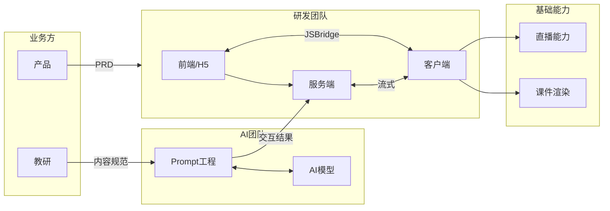
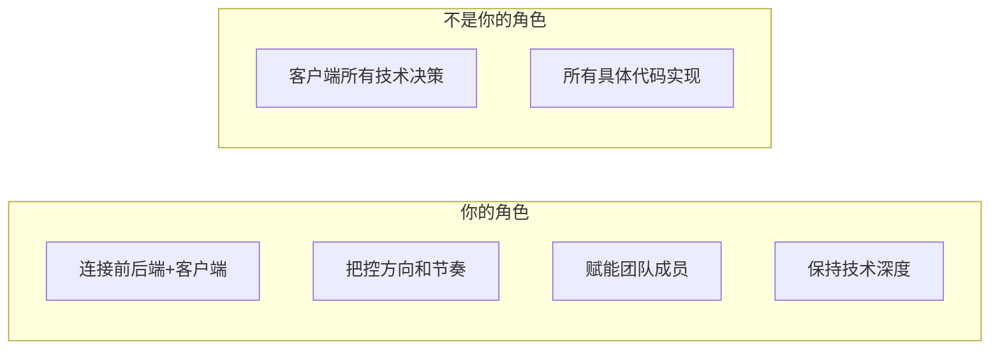

# 口语课上手计划

> **背景**：从电商+供应链团队（服务端+前端）扩展到口语课团队（服务端+前端+客户端）。作为偏技术的 leader，需要快速建立对新业务和新技术栈的掌控力。

---

## 一、业务全景

### 1.1 口语课业务链路



### 1.2 各角色职责边界

| 角色 | 产出 | 你需要关注的 |
|---|---|---|
| **产品** | PRD、需求优先级 | 需求合理性、技术可行性评估 |
| **教研** | 课件、上课内容规范 | 不直接对接，通过 AI 团队转化 |
| **AI 团队** | Prompt 工程、模型调用 | 接口协议、响应延迟、容错机制 |
| **你的团队** | 服务端/前端/客户端 | 全链路交付 |

### 1.3 核心技术挑战

| 挑战 | 说明 |
|---|---|
| **直播稳定性** | 上课过程中不能卡顿、掉线 |
| **AI 响应延迟** | 用户等待时间直接影响体验 |
| **流式交互** | 服务端 ↔ 客户端的实时通信 |
| **课件渲染** | 客户端加载和展示课件内容 |
| **多端一致性** | iOS/Android 表现一致 |

---

## 二、90 天接手计划

### 2.1 第一阶段：摸底（Day 1-30）

**目标**：搞清楚"现状是什么"

| 事项 | 具体动作 | 产出 |
|---|---|---|
| **人** | 1v1 每个团队成员 | 人员能力地图、核心骨干识别 |
| **事** | 梳理在做的需求、技术债、历史问题 | 问题清单 |
| **系统** | 过一遍核心链路代码 | 系统架构图、数据流图 |
| **流程** | 了解需求流转、发布流程、值班机制 | 流程现状文档 |
| **业务方** | 分别和产品、AI 团队负责人聊 | 协作边界共识 |

**1v1 核心问题**：

1. 你负责哪块？日常工作内容？
2. 目前最大的痛点是什么？
3. 你觉得团队有什么问题？
4. 如果你是负责人，你会先改什么？
5. 和产品/AI 团队协作顺畅吗？卡点在哪？

### 2.2 第二阶段：稳定（Day 30-60）

**目标**：确保"不出问题"，建立信任

| 事项 | 具体动作 |
|---|---|
| **守住底线** | 确保线上稳定，重点盯直播链路 |
| **小胜一场** | 找一个痛点问题快速解决 |
| **理顺流程** | 轻量优化，不要大动 |
| **建立周会** | 和产品、AI 团队的周同步会 |

### 2.3 第三阶段：规划（Day 60-90）

**目标**：明确"接下来往哪走"

| 事项 | 具体动作 |
|---|---|
| **技术规划** | 输出技术演进路线图 |
| **全栈推进** | 评估可行性，找人试点 |
| **团队梯队** | 识别骨干，明确分工 |
| **向上汇报** | 给老板"现状+问题+计划"报告 |

---

## 三、客户端技术补充计划

### 3.1 为什么要能写

```
完全不能写 → 无法判断方案合理性 → 只能听别人说 → 容易被牵着走
```

**目标**：能写简单需求，能看懂代码，能判断方案是否合理。

### 3.2 选择 Android

| 对比 | Android | iOS |
|---|---|---|
| **语言** | Kotlin/Java，服务端更熟 | Swift/ObjC，差异大 |
| **环境** | 全平台可开发 | 必须 Mac |
| **生态** | 和服务端工具链更近 | 封闭 |

### 3.3 学习目标

| 程度 | 描述 | 是否需要 |
|---|---|---|
| 能跑通 | 编译、运行、改文案 | ✅ 必须 |
| 能写简单需求 | 列表页、表单、网络请求 | ✅ 目标 |
| 能做复杂功能 | 自定义 View、性能优化 | ❌ 不需要 |
| 能解决疑难杂症 | 内存泄漏、ANR | ❌ 交给专业的人 |

### 3.4 学习路径（4-6 周）

| 周 | 内容 | 产出 |
|---|---|---|
| **第1周** | 环境搭建 + Hello World + Activity/Fragment 生命周期 | 能跑起来 |
| **第2周** | 布局系统 + 列表（RecyclerView） | 能写列表页 |
| **第3周** | 网络请求（Retrofit/OkHttp）+ JSON 解析 | 能调接口 |
| **第4周** | 在项目里改一个真实的小需求 | 实战验证 |
| **第5-6周** | 参与技术评审、review 代码 | 积累判断力 |

### 3.5 学习方法

1. **找客户端同学带**："我想快速上手，你能带我写一个简单需求吗？"
2. **用 AI 辅助**：遇到问题直接问，快速迭代
3. **从项目入手**：直接改口语课的代码，不要从零学

### 3.6 客户端核心认知

| 维度 | 服务端 | 客户端 |
|---|---|---|
| **发布** | 随时发，秒级生效 | 需要发版审核，用户还得更新 |
| **环境** | 服务器统一可控 | 设备碎片化 |
| **容错** | 出问题可以回滚 | 发出去收不回来 |
| **调试** | 日志随时查 | 用户手机问题难复现 |
| **性能** | 加机器 | 只能优化代码 |

---

## 四、业务方协作策略

### 4.1 与产品协作

**核心转变**：从"专家告诉你怎么做"变成"一起探索怎么做"

| 以前 | 现在应该做的 |
|---|---|
| "这个需求应该这样做" | "这个需求是解决 XX 问题，对吗？" |
| "技术上只能这样" | "技术上有 A/B 方案，各有优劣，你选" |
| "这个做不了" | "这个做的话成本是 XX，你看值不值" |

**边界意识**：

| 你的边界 | 产品的边界 |
|---|---|
| 技术可行性、方案选择 | 用户需求判断、业务优先级 |
| 研发资源评估 | 产品定义和规划 |
| 系统稳定性 | 运营策略 |

**在你的边界内坚持，在产品的边界内尊重。**

### 4.2 与 AI 团队协作

**这是最重要的协作方**，技术链路上深度耦合。

**需要对齐的事项**：

| 事项 | 内容 |
|---|---|
| 接口协议 | 请求/响应格式、流式协议、错误码 |
| 延迟要求 | 模型响应时间、服务端处理时间 |
| 容错机制 | 超时怎么办？异常怎么办？ |
| 监控告警 | 谁负责监控 AI 调用链路？ |
| 联调流程 | 怎么联调？有没有 Mock 环境？ |

**第一周就和 AI 团队 leader 约一次，过一遍接口文档和调用链路。**

### 4.3 与教研的关系

不直接对接。教研的产出通过 AI 团队转化后再和你的服务端对接。

但需要理解：

- 教研的内容规范长什么样？
- 课件的格式和结构？
- 教研的迭代节奏？

**建议**：让 AI 团队拉你参加一次教研的需求评审，纯旁听。

---

## 五、AI 能力内化计划

### 5.1 现状

AI 能力在外部 AI 团队，链路是：教研 → AI 团队（Prompt）→ 服务端

### 5.2 长期目标

让自己团队具备 AI 能力，降低对外部的依赖。

### 5.3 分阶段渗透

| 阶段 | 目标 | 做法 | 周期 |
|---|---|---|---|
| **第一阶段** | 理解 | 让团队理解 AI 链路怎么工作 | 1-2 月 |
| **第二阶段** | 参与 | 联调、排障时深度参与 | 2-4 月 |
| **第三阶段** | 边缘尝试 | 找小场景自己做 Prompt | 4-6 月 |
| **第四阶段** | 能力沉淀 | 形成团队 AI 能力 | 6-12 月 |

### 5.4 策略

**不要**一上来说"我们要把 AI 团队的活接过来"。

**而是**：

> "这个小需求比较简单，我们自己试试，不用麻烦 AI 团队了"

逐步渗透，不引发政治问题。

---

## 六、团队管理策略

### 6.1 你的定位



### 6.2 发挥你的优势

| 你的优势 | 如何发挥 |
|---|---|
| **服务端架构经验** | 帮客户端理解后端逻辑，优化端到端交互 |
| **全栈推动经验** | 打破端的壁垒，推动协作效率 |
| **业务全局视角** | 比纯客户端更懂"为什么做" |
| **技术管理经验** | 团队建设、流程优化 |
| **能写代码** | 有判断力，不被忽悠 |

### 6.3 核心骨干策略

1. **识别**：谁是技术最强的？谁是大家服气的？
2. **深聊**：了解他的想法、诉求、痛点
3. **给空间**：技术决策让他来，你负责资源和方向
4. **给 credit**：有成绩时让他出头

**话术**：

> "客户端这块你比我专业，技术上的事情我希望你多担当。我负责帮你争取资源、协调跨团队的事情。咱们配合好，一起把事情做成。"

### 6.4 被替换的 leader

如果他还在团队：

1. **第一次 1v1 开诚布公**

   > "这个变动我理解对你来说可能不太舒服。我不是来否定你的。我希望咱们能配合好。"

2. **给他明确定位**
   - 能力强：技术 owner
   - 能力一般：普通成员，但不打压

3. **观察 1-2 个月**
   - 配合：重用
   - 消极/搞事：找机会调整

4. **不要急着立威**
   - 不要上来就推翻他之前的决定
   - 不要在公开场合否定他

---

## 七、全栈推进策略

### 7.1 节奏控制

| 阶段 | 动作 |
|---|---|
| **1-2 月** | 先观察，识别谁对全栈有意愿、有能力 |
| **2-3 月** | 找 1-2 个人在低风险需求上试点 |
| **3-6 月** | 总结经验，逐步推广 |

### 7.2 口语课的特殊性

有客户端。客户端全栈化比服务端+前端更难。

| 方向 | 可行性 | 建议 |
|---|---|---|
| 服务端 ↔ 前端 | ✅ 可推 | 复用电商经验 |
| 服务端/前端 → 客户端 | ⚠️ 难度大 | 先观望，除非有人主动想学 |
| 客户端 → 服务端/前端 | ⚠️ 看情况 | 找有意愿的人试点 |

---

## 八、风险识别与应对

| 风险 | 表现 | 应对 |
|---|---|---|
| **直播链路不稳** | 上课卡顿、掉线 | 第一个月重点盯监控和告警 |
| **AI 调用延迟高** | 用户等待时间长 | 和 AI 团队定 SLA，做好 loading 体验 |
| **教研频繁改内容** | 需求变更多 | 通过 AI 团队缓冲 |
| **老代码质量差** | 改一处崩一片 | 先写测试，再重构 |
| **团队对你不信任** | 阳奉阴违 | 先帮解决痛点，再推变革 |
| **客户端技术判断失误** | 被忽悠 | 自己学 Android，有判断力 |

---

## 九、优先级总览

| 优先级 | 事项 | 周期 |
|---|---|---|
| **P0** | 稳定接手，不出问题 | 1-2 月 |
| **P1** | 理顺协作，建立信任 | 1-3 月 |
| **P2** | 补齐客户端技术能力 | 1-2 月 |
| **P3** | 推进全栈 | 3-6 月 |
| **P4** | AI 能力内化 | 6-12 月 |

---

## 十、第一周 Checklist

- [ ] 和直属老板对齐：期望、边界、资源
- [ ] 和团队全员开会：自我介绍 + 听大家说
- [ ] 1v1 核心成员（3-5 人）
- [ ] 和产品负责人聊一次
- [ ] 和 AI 团队负责人聊一次
- [ ] 过一遍线上监控大盘
- [ ] 拿到/画出系统架构图
- [ ] 搭建 Android 开发环境，跑通 Demo
- [ ] 在口语课项目里找一个简单页面，改一个小东西

---

## 总结

> **作为偏技术的 leader，核心策略是：**
> 
> 1. **技术上保持深度**：客户端要能写，AI 链路要理解，不做"只会管理的人"
> 2. **管理上做连接者**：全局视角、跨端协作、资源协调
> 3. **协作上边界清晰**：在技术边界内坚持，在业务边界内尊重
> 4. **节奏上稳扎稳打**：先稳定、再优化、最后变革

